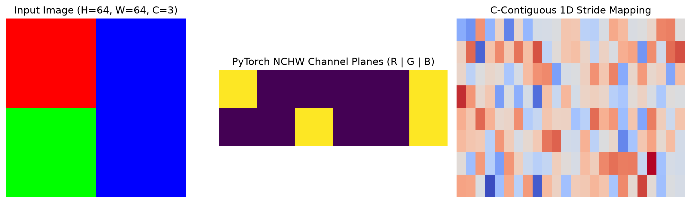
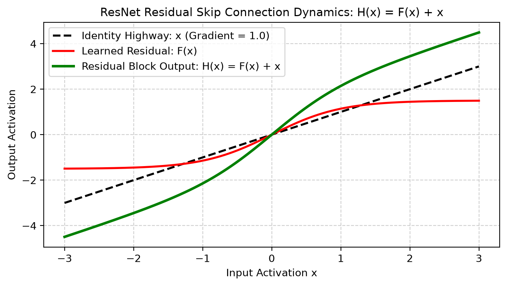
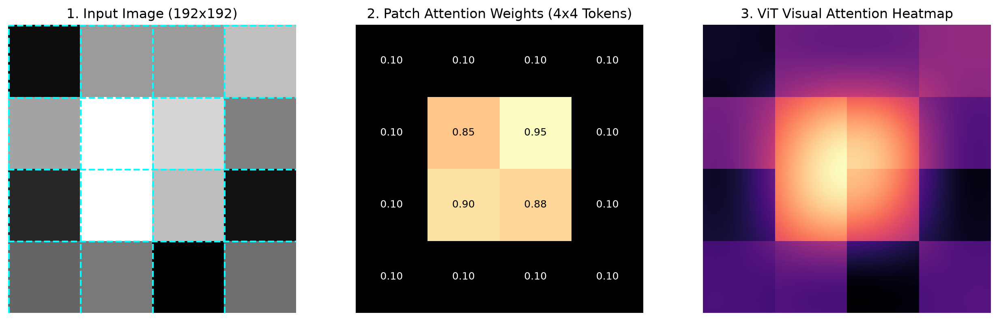
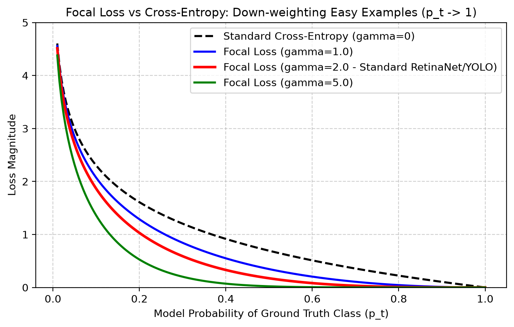
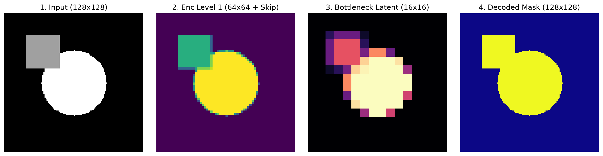
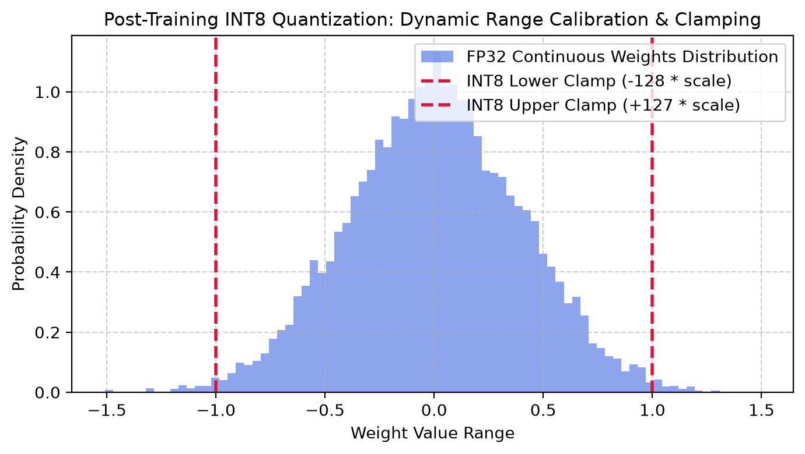

# PyTorch & Deep Learning for Computer Vision — Practical Study Notes
### A Hands-on, Intuitive Guide with Clear Code Examples, Visuals, and Real-World Perception Workflows

---

## 📌 How to Use These Notes
These notes are designed as a **practical, step-by-step student notebook**. Every module includes:
1. **Simple Intuition & Analogy**: Plain-English explanation of *what* is happening and *why* we do it.
2. **Copy-Paste Ready Code**: Clean, fully runnable Python + PyTorch examples with inline line-by-line comments.
3. **Visual & Output Breakdowns**: What the code actually prints and produces.
4. **Common Beginner Pitfalls**: The exact errors everyone encounters (shape mismatches, memory leaks, wrong modes) and how to avoid them.

---

## Table of Contents
1. [Module 01: PyTorch Tensors & GPU Basics (NumPy to PyTorch)](#module-01-pytorch-tensors--gpu-basics-numpy-to-pytorch)
2. [Module 02: How Neural Networks Learn (Autograd & The 5-Step Training Loop)](#module-02-how-neural-networks-learn-autograd--the-5-step-training-loop)
3. [Module 03: Loading Real Image Datasets (Dataset, DataLoader & Augmentations)](#module-03-loading-real-image-datasets-dataset-dataloader--augmentations)
4. [Module 04: Building CNNs from Scratch (Convolutions, Pooling & Receptive Fields)](#module-04-building-cnns-from-scratch-convolutions-pooling--receptive-fields)
5. [Module 05: Modern Backbones & Transfer Learning (ResNet, MobileNet, Fine-Tuning)](#module-05-modern-backbones--transfer-learning-resnet-mobilenet-fine-tuning)
6. [Module 06: Vision Transformers (ViT) Made Simple](#module-06-vision-transformers-vit-made-simple)
7. [Module 07: Practical Loss Functions & Metrics for Vision](#module-07-practical-loss-functions--metrics-for-vision)
8. [Module 08: Object Detection in Practice (Bounding Boxes, NMS & YOLO/Faster R-CNN)](#module-08-object-detection-in-practice-bounding-boxes-nms--yolofaster-r-cnn)
9. [Module 09: Image Segmentation with U-Net (Pixel-Level Classification)](#module-09-image-segmentation-with-u-net-pixel-level-classification)
10. [Module 10: Vision Foundation Models (CLIP, DINOv2 & Segment Anything / SAM)](#module-10-vision-foundation-models-clip-dinov2--segment-anything--sam)
11. [Module 11: Exporting Models for Production (ONNX & Real-Time Inference)](#module-11-exporting-models-for-production-onnx--real-time-inference)
12. [Module 12: Real-Time Live Webcam Deep Learning Pipeline](#module-12-real-time-live-webcam-deep-learning-pipeline)
13. [Module 13: Top 10 PyTorch Gotchas & Practical Interview Cheatsheet](#module-13-top-10-pytorch-gotchas--practical-interview-cheatsheet)

---

## Module 01: PyTorch Tensors & GPU Basics (NumPy to PyTorch)

### 1.1 What is a Tensor?
Think of a **Tensor** as a NumPy array with two superpowers:
1. **GPU Acceleration**: Can run computations hundreds of times faster on graphics cards (NVIDIA CUDA or Apple Silicon MPS).
2. **Automatic Differentiation (Autograd)**: Tracks every operation so PyTorch can calculate derivatives automatically for training.



### 1.2 Tensor Basics & Image Shapes
In computer vision, images in PyTorch are organized as **`[Batch, Channels, Height, Width]`** (often abbreviated as **`[B, C, H, W]`**):
- `B`: Batch size (e.g., 16 images at once)
- `C`: Color channels (3 for RGB, 1 for Grayscale)
- `H`: Height in pixels
- `W`: Width in pixels

> ⚠️ **OpenCV vs PyTorch Difference**:
> - OpenCV uses: `[Height, Width, Channels]` (HWC, BGR format, uint8 `0-255`)
> - PyTorch uses: `[Batch, Channels, Height, Width]` (BCHW, RGB format, float32 `0.0 - 1.0`)

```python
import torch
import numpy as np
import cv2

# 1. Creating Tensors
x = torch.tensor([1.0, 2.0, 3.0])                # From python list
zeros = torch.zeros((1, 3, 224, 224))             # Blank batch of 1 RGB image
random_img = torch.rand((4, 3, 224, 224))         # Batch of 4 random RGB images [0.0, 1.0]

print("Shape:", random_img.shape)                 # torch.Size([4, 3, 224, 224])
print("Data type:", random_img.dtype)             # torch.float32

# 2. Converting OpenCV Image (NumPy HWC) <--> PyTorch Tensor (CHW)
cv2_img = np.zeros((480, 640, 3), dtype=np.uint8) # 480x640 BGR image from webcam/file

# Step A: BGR to RGB
rgb_img = cv2.cvtColor(cv2_img, cv2.COLOR_BGR2RGB)

# Step B: NumPy [H, W, C] -> PyTorch [C, H, W] and scale to 0.0 - 1.0 float
tensor_img = torch.from_numpy(rgb_img).permute(2, 0, 1).float() / 255.0
print("PyTorch Image Tensor Shape:", tensor_img.shape)  # torch.Size([3, 480, 640])

# Step C: Convert back from PyTorch [C, H, W] -> OpenCV [H, W, C] (0-255 uint8)
back_to_np = (tensor_img.permute(1, 2, 0).numpy() * 255.0).astype(np.uint8)
back_to_bgr = cv2.cvtColor(back_to_np, cv2.COLOR_RGB2BGR)
print("Back to OpenCV shape:", back_to_bgr.shape)       # (480, 640, 3)
```

### 1.3 Running Code on GPU (NVIDIA CUDA / Apple Silicon MPS / CPU)
Never hardcode `.cuda()` in your code! Use this universal device-agnostic pattern:

```python
# Universal Device Selector
def get_device():
    if torch.cuda.is_available():
        return torch.device("cuda")       # NVIDIA GPU
    elif hasattr(torch.backends, "mps") and torch.backends.mps.is_available():
        return torch.device("mps")        # Apple Silicon (M1/M2/M3/M4 Mac)
    else:
        return torch.device("cpu")        # Standard CPU

device = get_device()
print(f"Running on: {device}")

# Move your tensor or model to the active device
data = torch.randn(8, 3, 128, 128)
data = data.to(device)
print("Tensor is on device:", data.device)
```

---

## Module 02: How Neural Networks Learn (Autograd & The 5-Step Training Loop)

### 2.1 The Intuition Behind Backpropagation
A neural network is just a mathematical function with millions of adjustable knobs (called **Weights** $W$ and **Biases** $b$).
1. **Forward Pass**: We pass an image in $\to$ network makes a guess $\hat{y}$.
2. **Loss Calculation**: We compare the guess $\hat{y}$ with the true label $y$ to compute an error score (**Loss**).
3. **Backward Pass (Autograd)**: PyTorch computes how much each knob (weight) contributed to the error.
4. **Optimizer Step**: We tweak each weight in the direction that reduces the error.

```python
import torch

# x is an input, w is a weight we want to learn (requires_grad=True)
x = torch.tensor(2.0)
w = torch.tensor(3.0, requires_grad=True)
b = torch.tensor(1.0, requires_grad=True)

# 1. Forward Pass: y = w * x + b = 3*2 + 1 = 7.0
y = w * x + b

# Let's say true target is 10.0, calculate loss = (y - target)^2 = (7 - 10)^2 = 9.0
target = torch.tensor(10.0)
loss = (y - target) ** 2

# 2. Backward Pass: Calculate gradients automatically
loss.backward()

# Inspect gradients: d(Loss)/dw = 2 * (y - target) * x = 2 * (-3) * 2 = -12.0
print("Gradient on weight w:", w.grad)  # tensor(-12.)
```

### 2.2 The Universal 5-Step PyTorch Training Loop
Every single deep learning vision model in PyTorch follows these exact 5 steps inside each iteration:

```python
import torch
import torch.nn as nn
import torch.optim as optim

# Simple dummy linear model: y = x * W + b
model = nn.Linear(in_features=1, out_features=1)
criterion = nn.MSELoss()                           # Mean Squared Error Loss
optimizer = optim.SGD(model.parameters(), lr=0.01) # Stochastic Gradient Descent optimizer

# Training data: y = 2x
x_train = torch.tensor([[1.0], [2.0], [3.0], [4.0]])
y_train = torch.tensor([[2.0], [4.0], [6.0], [8.0]])

# The Training Loop
epochs = 100
for epoch in range(epochs):
    # -------------------------------------------------------------
    # Step 1: Clear old gradients from previous step
    # -------------------------------------------------------------
    optimizer.zero_grad()
    
    # -------------------------------------------------------------
    # Step 2: Forward pass (make prediction)
    # -------------------------------------------------------------
    predictions = model(x_train)
    
    # -------------------------------------------------------------
    # Step 3: Compute the loss (error)
    # -------------------------------------------------------------
    loss = criterion(predictions, y_train)
    
    # -------------------------------------------------------------
    # Step 4: Backward pass (compute gradients)
    # -------------------------------------------------------------
    loss.backward()
    
    # -------------------------------------------------------------
    # Step 5: Update model weights
    # -------------------------------------------------------------
    optimizer.step()

    if (epoch + 1) % 25 == 0:
        print(f"Epoch [{epoch+1}/{epochs}], Loss: {loss.item():.4f}")

# Test the trained model with a new number (e.g. x = 5.0 -> should predict ~10.0)
model.eval()
with torch.no_grad():
    test_val = torch.tensor([[5.0]])
    pred = model(test_val)
    print(f"Prediction for x=5.0: {pred.item():.2f} (Expected: 10.00)")
```

### 2.3 `model.train()` vs `model.eval()` and `torch.no_grad()`
> 🚨 **Critical Rule**:
> - Before training: always call `model.train()` (enables Dropout and updates BatchNorm).
> - Before testing/validation: always call `model.eval()` and wrap inference in `with torch.no_grad():` (disables Dropout, freezes BatchNorm, and saves huge amounts of GPU memory by not storing gradients).

---

## Module 03: Loading Real Image Datasets (Dataset, DataLoader & Augmentations)

### 3.1 Creating a Custom Vision Dataset
To feed images into PyTorch, you create a class inheriting from `torch.utils.data.Dataset` and implement just 3 methods:
1. `__init__`: Set up image file paths and transformations.
2. `__len__`: Return the total number of images.
3. `__getitem__`: Load 1 image, apply transforms, and return `(image_tensor, label)`.

```python
import os
import torch
from torch.utils.data import Dataset, DataLoader
import numpy as np

class CustomImageFolderDataset(Dataset):
    """Simple, practical Dataset for image classification."""
    def __init__(self, image_list, labels, transform=None):
        self.image_list = image_list
        self.labels = labels
        self.transform = transform

    def __len__(self):
        return len(self.image_list)

    def __getitem__(self, idx):
        # In real life: image = cv2.imread(self.image_list[idx])
        # Here: create a synthetic 64x64 RGB image for demonstration
        fake_img = np.random.randint(0, 256, (64, 64, 3), dtype=np.uint8)
        label = self.labels[idx]

        # Convert to float tensor [C, H, W] in range [0, 1]
        img_tensor = torch.from_numpy(fake_img).permute(2, 0, 1).float() / 255.0

        if self.transform:
            img_tensor = self.transform(img_tensor)

        return img_tensor, label

# Create dataset with 100 samples
sample_files = [f"img_{i}.jpg" for i in range(100)]
sample_labels = [i % 2 for i in range(100)]  # Binary classes: 0 or 1
dataset = CustomImageFolderDataset(sample_files, sample_labels)

print("Dataset size:", len(dataset))
sample_img, sample_lbl = dataset[0]
print("Sample image shape:", sample_img.shape, "Label:", sample_lbl)
```

### 3.2 Using `DataLoader` for High-Speed Batching
The `DataLoader` takes your dataset and automatically:
- Groups samples into batches (e.g. 16 or 32 at a time).
- Shuffles the data every epoch so the model doesn't memorize order.
- Uses multi-processing (`num_workers`) to load images in parallel while the GPU is training.

```python
loader = DataLoader(
    dataset=dataset,
    batch_size=16,          # 16 images per batch
    shuffle=True,           # Randomly shuffle data each epoch
    num_workers=2,          # 2 background CPU processes loading images
    pin_memory=True         # Speeds up tensor transfer from CPU RAM to GPU VRAM
)

# Iterating through one batch
for batch_imgs, batch_labels in loader:
    print("Batch images shape:", batch_imgs.shape)    # torch.Size([16, 3, 64, 64])
    print("Batch labels shape:", batch_labels.shape)  # torch.Size([16])
    break
```

---

## Module 04: Building CNNs from Scratch (Convolutions, Pooling & Receptive Fields)

### 4.1 How Convolutions Work in Simple Terms
- **`nn.Conv2d`**: Slides small filters (e.g. 3x3 pixels) across the image to detect edges, corners, and textures.
- **`nn.ReLU`**: Turns all negative values to 0 (adds non-linearity so the network can learn complex patterns).
- **`nn.MaxPool2d(2)`**: Shrinks the height and width by half (e.g. 64x64 $\to$ 32x32), keeping only the strongest features.
- **`nn.Linear`**: Final fully-connected layer that outputs scores for each class (e.g., Cat vs Dog).

### 4.2 Complete Image Classifier Model
Here is a complete, modular CNN you can use for any image classification problem:

```python
import torch
import torch.nn as nn

class SimpleVisionCNN(nn.Module):
    def __init__(self, num_classes=2):
        super(SimpleVisionCNN, self).__init__()
        
        # Feature Extractor (Convolutions + Pooling)
        self.features = nn.Sequential(
            # Block 1: Input 3 channels -> Output 16 filters. Output size: [B, 16, 64, 64]
            nn.Conv2d(in_channels=3, out_channels=16, kernel_size=3, padding=1),
            nn.BatchNorm2d(16),
            nn.ReLU(inplace=True),
            nn.MaxPool2d(kernel_size=2, stride=2),  # Downsample to [B, 16, 32, 32]
            
            # Block 2: 16 -> 32 filters. Output size: [B, 32, 32, 32]
            nn.Conv2d(in_channels=16, out_channels=32, kernel_size=3, padding=1),
            nn.BatchNorm2d(32),
            nn.ReLU(inplace=True),
            nn.MaxPool2d(kernel_size=2, stride=2),  # Downsample to [B, 32, 16, 16]
        )
        
        # Classifier Head (Fully Connected Layers)
        # Flattened size = 32 channels * 16 height * 16 width = 8192
        self.classifier = nn.Sequential(
            nn.Flatten(),
            nn.Linear(32 * 16 * 16, 128),
            nn.ReLU(inplace=True),
            nn.Dropout(p=0.5),                      # Prevents overfitting
            nn.Linear(128, num_classes)             # Final class logits
        )

    def forward(self, x):
        x = self.features(x)
        logits = self.classifier(x)
        return logits

# Test with dummy batch of 4 images (4, 3, 64, 64)
model = SimpleVisionCNN(num_classes=2)
dummy_batch = torch.randn(4, 3, 64, 64)
output = model(dummy_batch)
print("Model Output Logits Shape:", output.shape)  # torch.Size([4, 2])
```

---

## Module 05: Modern Backbones & Transfer Learning (ResNet, MobileNet, Fine-Tuning)

### 5.1 Why ResNet? The Skip Connection
In very deep networks (e.g. 50 or 100 layers), gradients vanish as they travel backward through dozens of multiplications, making early layers stop learning.

**ResNet's Solution**: Add a **Skip Connection (Residual Shortcut)**:

$$\text{Output} = F(x) + x$$

The input $x$ is added directly to the output of the convolutional block. This creates a "gradient highway" where gradients can flow backward without fading!



### 5.2 Practical Transfer Learning: Fine-Tuning a Pretrained ResNet in 20 Lines
Instead of training a model from scratch for weeks, take a pre-trained model (trained on 1.4 million ImageNet images) and customize it for your own task in minutes!

```python
import torch
import torch.nn as nn
from torchvision import models

# Step 1: Load a pretrained ResNet-50 model
model = models.resnet50(weights=models.ResNet50_Weights.DEFAULT)

# Step 2: Freeze the backbone weights (so we don't destroy learned features)
for param in model.parameters():
    param.requires_grad = False

# Step 3: Replace the final classification head for our custom number of classes (e.g. 5 defect types)
in_features = model.fc.in_features
model.fc = nn.Sequential(
    nn.Linear(in_features, 256),
    nn.ReLU(),
    nn.Dropout(0.3),
    nn.Linear(256, 5)  # 5 custom classes
)

# Step 4: Train ONLY the new head (fast & accurate!)
optimizer = torch.optim.Adam(model.fc.parameters(), lr=1e-3)
criterion = nn.CrossEntropyLoss()

print("Custom ResNet-50 initialized successfully!")
```

---

## Module 06: Vision Transformers (ViT) Made Simple

### 6.1 How Vision Transformers Work
While CNNs look at images through small local windows (3x3 filters), **Vision Transformers (ViT)** process an image like a sentence of words:
1. **Patch Slicing**: Split a 224x224 image into a grid of 16x16 pixel patches (yielding $14 \times 14 = 196$ patches).
2. **Linear Projection**: Flatten each patch into a vector (token).
3. **Self-Attention**: Every patch looks at every other patch simultaneously to understand global context (e.g., relating a car wheel in the corner to the car roof across the image).



```python
import torch
from torchvision import models

# Load pretrained Vision Transformer (ViT-Base with 16x16 patch size)
vit = models.vit_b_16(weights=models.ViT_B_16_Weights.DEFAULT)
vit.eval()

# Pass a dummy image (1 image, 3 channels, 224x224)
dummy_img = torch.randn(1, 3, 224, 224)
with torch.no_grad():
    predictions = vit(dummy_img)
    predicted_class = predictions.argmax(dim=1).item()

print("ViT Prediction Class ID:", predicted_class)
```

---

## Module 07: Practical Loss Functions & Metrics for Vision

| Task | Loss Function | Metric to Track | When to Use |
|---|---|---|---|
| **Multi-class Classification** | `nn.CrossEntropyLoss()` | Accuracy / Top-5 Acc | Each image belongs to 1 class |
| **Multi-label Classification** | `nn.BCEWithLogitsLoss()` | Precision, Recall, F1 | Image can have multiple tags |
| **Imbalanced Classes** | **Focal Loss** | Mean F1 / PR-AUC | 95% background, 5% rare objects |
| **Semantic Segmentation** | **Dice Loss** + CrossEntropy | IoU (Intersection over Union) | Boundary & shape overlap |
| **Bounding Box Regression** | **CIoU / GIoU Loss** | mAP@0.50, mAP@0.50:0.95 | Object Detection box accuracy |

### 7.1 Focal Loss Explained (For Imbalanced Data)
When training an object detector or defect classifier, 99% of your data might be "normal/background" and only 1% "defect". Standard Cross-Entropy wastes all gradient updates on the easy background.

**Focal Loss** automatically scales down the loss for easy examples, forcing the model to focus on the hard, rare defect examples!



```python
import torch
import torch.nn as nn
import torch.nn.functional as F

class PracticalFocalLoss(nn.Module):
    """Easy-to-use Focal Loss for imbalanced binary or multi-class vision problems."""
    def __init__(self, alpha=0.25, gamma=2.0):
        super().__init__()
        self.alpha = alpha
        self.gamma = gamma

    def forward(self, logits, targets):
        bce_loss = F.binary_cross_entropy_with_logits(logits, targets, reduction='none')
        prob = torch.sigmoid(logits)
        prob_t = prob * targets + (1.0 - prob) * (1.0 - targets)
        modulating_factor = (1.0 - prob_t) ** self.gamma
        focal = self.alpha * modulating_factor * bce_loss
        return focal.mean()
```

---

## Module 08: Object Detection in Practice (Bounding Boxes, NMS & YOLO/Faster R-CNN)

### 8.1 Bounding Box Formats & Conversions
In Computer Vision, bounding boxes are represented in two main formats:
1. **XYXY Format**: `[xmin, ymin, xmax, ymax]` (Used by OpenCV and Pascal VOC)
2. **XYWH Format**: `[x_center, y_center, width, height]` (Used by YOLO)

```python
def xyxy_to_xywh(boxes: torch.Tensor) -> torch.Tensor:
    """Converts [xmin, ymin, xmax, ymax] -> [x_center, y_center, width, height]."""
    x1, y1, x2, y2 = boxes[:, 0], boxes[:, 1], boxes[:, 2], boxes[:, 3]
    w = x2 - x1
    h = y2 - y1
    xc = x1 + w / 2.0
    yc = y1 + h / 2.0
    return torch.stack([xc, yc, w, h], dim=-1)
```

### 8.2 What is Non-Maximum Suppression (NMS)?
Object detection models predict dozens of overlapping boxes for the same object. **NMS** filters out duplicate overlapping boxes by:
1. Sorting boxes by confidence score.
2. Picking the highest-confidence box.
3. Suppressing all other boxes that have an IoU overlap $> 0.5$ with it.

```python
from torchvision.ops import nms

boxes = torch.tensor([
    [50.0, 50.0, 100.0, 100.0],
    [52.0, 51.0, 101.0, 99.0],   # Duplicate box covering same object
    [200.0, 200.0, 250.0, 250.0] # Different object
])
scores = torch.tensor([0.95, 0.85, 0.90])

# Keep boxes with IoU threshold 0.5
keep_indices = nms(boxes, scores, iou_threshold=0.5)
filtered_boxes = boxes[keep_indices]
print(f"Kept {len(filtered_boxes)} out of {len(boxes)} boxes after NMS.")
```

### 8.3 Running a Pre-trained Object Detector in Python
```python
from torchvision.models.detection import fasterrcnn_resnet50_fpn, FasterRCNN_ResNet50_FPN_Weights

# 1. Load pretrained detector
detector = fasterrcnn_resnet50_fpn(weights=FasterRCNN_ResNet50_FPN_Weights.DEFAULT)
detector.eval()

# 2. Run inference on a dummy RGB image tensor [1, 3, 480, 640]
dummy_image = [torch.rand(3, 480, 640)]
with torch.no_grad():
    predictions = detector(dummy_image)

pred_boxes = predictions[0]['boxes']
pred_labels = predictions[0]['labels']
pred_scores = predictions[0]['scores']

# Filter predictions with confidence > 80%
high_conf = pred_scores > 0.80
print(f"Detected {high_conf.sum().item()} objects with >80% confidence.")
```

---

## Module 09: Image Segmentation with U-Net (Pixel-Level Classification)

### 9.1 How U-Net Works
Semantic segmentation assigns a class to **every single pixel** in an image.
- **Encoder (Left Side)**: Progressively downsizes the image to extract high-level semantic meaning ("what is in the image").
- **Decoder (Right Side)**: Upsamples features back to original image resolution.
- **Skip Connections (Across)**: Copies fine-grained spatial details directly from encoder to decoder so boundaries and edges remain sharp!



### 9.2 Complete U-Net Implementation from Scratch
```python
import torch
import torch.nn as nn

class UNetBlock(nn.Module):
    def __init__(self, in_ch, out_ch):
        super().__init__()
        self.conv = nn.Sequential(
            nn.Conv2d(in_ch, out_ch, 3, padding=1, bias=False),
            nn.BatchNorm2d(out_ch),
            nn.ReLU(inplace=True),
            nn.Conv2d(out_ch, out_ch, 3, padding=1, bias=False),
            nn.BatchNorm2d(out_ch),
            nn.ReLU(inplace=True)
        )
    def forward(self, x):
        return self.conv(x)

class CleanUNet(nn.Module):
    def __init__(self, in_channels=3, num_classes=1):
        super().__init__()
        # Encoder
        self.enc1 = UNetBlock(in_channels, 32)
        self.pool1 = nn.MaxPool2d(2)
        self.enc2 = UNetBlock(32, 64)
        self.pool2 = nn.MaxPool2d(2)
        
        # Bottleneck
        self.bottleneck = UNetBlock(64, 128)
        
        # Decoder
        self.up2 = nn.ConvTranspose2d(128, 64, 2, stride=2)
        self.dec2 = UNetBlock(128, 64)  # 64 upsampled + 64 skip connection = 128
        
        self.up1 = nn.ConvTranspose2d(64, 32, 2, stride=2)
        self.dec1 = UNetBlock(64, 32)   # 32 upsampled + 32 skip connection = 64
        
        self.final_conv = nn.Conv2d(32, num_classes, 1)

    def forward(self, x):
        # Encoder path
        s1 = self.enc1(x)
        s2 = self.enc2(self.pool1(s1))
        
        # Bottleneck
        b = self.bottleneck(self.pool2(s2))
        
        # Decoder path with skip connections
        d2 = self.up2(b)
        d2 = self.dec2(torch.cat([d2, s2], dim=1))
        
        d1 = self.up1(d2)
        d1 = self.dec1(torch.cat([d1, s1], dim=1))
        
        return self.final_conv(d1)

# Test U-Net with dummy image
unet = CleanUNet(in_channels=3, num_classes=1)
sample_input = torch.randn(2, 3, 128, 128)
mask_output = unet(sample_input)
print("U-Net Predicted Mask Shape:", mask_output.shape) # [2, 1, 128, 128]
```

---

## Module 10: Vision Foundation Models (CLIP, DINOv2 & Segment Anything / SAM)

### 10.1 Zero-Shot Classification with CLIP
**CLIP (Contrastive Language-Image Pretraining)** maps text and images into the same embedding space. You can classify images into any category without training a single weight, just by typing text prompts!

```python
import torch

def compute_clip_zero_shot(image_embedding, class_prompts_embeddings):
    """
    image_embedding: [1, 512] normalized vector from CLIP image encoder
    class_prompts_embeddings: [K, 512] normalized vectors for classes like ["a dog", "a car", "a plane"]
    """
    # 1. Compute cosine similarity matrix
    similarity = (image_embedding @ class_prompts_embeddings.T) * 100.0
    
    # 2. Convert to probabilities
    probabilities = similarity.softmax(dim=-1)
    return probabilities
```

### 10.2 Extracting Features with DINOv2 (Meta AI)
DINOv2 extracts general-purpose visual features that work out-of-the-box for depth estimation, segmentation, and nearest-neighbor search:

```python
# Load official DINOv2 model from PyTorch Hub
dinov2 = torch.hub.load('facebookresearch/dinov2', 'dinov2_vits14')
dinov2.eval()

img = torch.randn(1, 3, 224, 224)
with torch.no_grad():
    feature_vector = dinov2(img)
    print("DINOv2 Global Image Embedding Shape:", feature_vector.shape) # [1, 384]
```

---

## Module 11: Exporting Models for Production (ONNX & Real-Time Inference)

### 11.1 Why Export to ONNX?
Python and PyTorch have overhead that can slow down inference in production. **ONNX (Open Neural Network Exchange)** turns your PyTorch model into an optimized static graph that runs up to 5x faster on C++, TensorRT, OpenVINO, or ONNX Runtime.



### 11.2 Exporting a PyTorch Model to ONNX
```python
import torch
import torchvision.models as models

# 1. Prepare model in eval mode
model = models.mobilenet_v3_small(weights=models.MobileNet_V3_Small_Weights.DEFAULT)
model.eval()

dummy_input = torch.randn(1, 3, 224, 224)

# 2. Export to ONNX file
torch.onnx.export(
    model,
    dummy_input,
    "mobilenet_v3_optimized.onnx",
    export_params=True,
    opset_version=17,
    do_constant_folding=True,           # Optimizes constant expressions
    input_names=['input_image'],
    output_names=['class_logits'],
    dynamic_axes={                      # Allows variable batch sizes at runtime
        'input_image': {0: 'batch_size'},
        'class_logits': {0: 'batch_size'}
    }
)
print("Saved optimized model to mobilenet_v3_optimized.onnx!")
```

---

## Module 12: Real-Time Live Webcam Deep Learning Pipeline

This complete script demonstrates how to capture live webcam frames with OpenCV, convert them to PyTorch tensors, run deep learning inference, and draw predictions in real time:

```python
import cv2
import torch
import torchvision.transforms as T
from torchvision.models import mobilenet_v3_small, MobileNet_V3_Small_Weights
import time

def run_realtime_vision_pipeline():
    # 1. Device and Model setup
    device = torch.device("cuda" if torch.cuda.is_available() else "cpu")
    weights = MobileNet_V3_Small_Weights.DEFAULT
    model = mobilenet_v3_small(weights=weights).to(device).eval()
    categories = weights.meta["categories"]

    # 2. Standard preprocessing transform
    transform = T.Compose([
        T.ToPILImage(),
        T.Resize((224, 224)),
        T.ToTensor(),
        T.Normalize(mean=[0.485, 0.456, 0.406], std=[0.229, 0.224, 0.225])
    ])

    cap = cv2.VideoCapture(0)
    print("Starting webcam stream... Press 'q' to exit.")

    fps_start_time = time.time()
    frame_count = 0
    fps = 0.0

    while cap.isOpened():
        ret, frame = cap.read()
        if not ret:
            break

        frame_count += 1
        if frame_count % 10 == 0:
            fps = 10.0 / (time.time() - fps_start_time)
            fps_start_time = time.time()

        # Preprocess OpenCV BGR frame -> RGB PyTorch Tensor
        rgb_frame = cv2.cvtColor(frame, cv2.COLOR_BGR2RGB)
        input_tensor = transform(rgb_frame).unsqueeze(0).to(device)

        # Run fast inference
        with torch.no_grad():
            logits = model(input_tensor)
            probs = torch.softmax(logits, dim=1)
            top_prob, top_idx = probs.max(1)

        label = categories[top_idx.item()]
        conf = top_prob.item() * 100.0

        # Draw overlays on screen
        cv2.putText(frame, f"FPS: {fps:.1f}", (20, 40), cv2.FONT_HERSHEY_SIMPLEX, 0.8, (0, 255, 0), 2)
        cv2.putText(frame, f"Pred: {label} ({conf:.1f}%)", (20, 80), cv2.FONT_HERSHEY_SIMPLEX, 0.8, (0, 255, 255), 2)

        cv2.imshow("PyTorch Real-Time Vision Pipeline", frame)
        if cv2.waitKey(1) & 0xFF == ord('q'):
            break

    cap.release()
    cv2.destroyAllWindows()

# Run the pipeline (uncomment when running locally with webcam attached)
# run_realtime_vision_pipeline()
```

---

## Module 13: Top 10 PyTorch Gotchas & Practical Interview Cheatsheet

### Top 10 Most Common Bugs & How to Fix Them

1. **Bug: `RuntimeError: Expected 4D tensor, got 3D tensor`**
   - *Fix*: PyTorch models expect a batch dimension `[B, C, H, W]`. If you have a single image `[C, H, W]`, add a batch dimension with `tensor.unsqueeze(0)`.

2. **Bug: `RuntimeError: Tensor on cuda:0 is not on cpu`**
   - *Fix*: Both your model and your input tensors must be on the **same device**. Always do: `inputs = inputs.to(device)` and `model = model.to(device)`.

3. **Bug: `RuntimeError: CUDA out of memory`**
   - *Fix*: Reduce your `batch_size` (e.g. from 32 to 16 or 8), or call `torch.cuda.empty_cache()`, or use gradient accumulation.

4. **Bug: `Loss does not decrease during training`**
   - *Fix*: Check if you forgot `optimizer.zero_grad()`. Without it, gradients from every batch keep accumulating indefinitely!

5. **Bug: `Accuracy is terrible during validation/testing`**
   - *Fix*: You forgot `model.eval()`. Dropout is still randomly turning off neurons, and BatchNorm is corrupting running statistics.

6. **Bug: Adding `nn.Softmax()` at the end of a classification model**
   - *Fix*: `nn.CrossEntropyLoss()` in PyTorch already computes Softmax internally! Adding an extra Softmax causes numerical instability and wrong loss values.

7. **Bug: Memory keeps growing every epoch until crash**
   - *Fix*: Storing the loss tensor directly in a tracking list: `history.append(loss)`. This keeps the entire computational graph in memory! Instead, use `history.append(loss.item())`.

8. **Bug: Data loading is bottlenecking the GPU**
   - *Fix*: Set `num_workers=4` and `pin_memory=True` in your `DataLoader`.

9. **Bug: `RuntimeError: shape mismatch in Linear layer`**
   - *Fix*: Add a print statement before your linear layer `print(x.shape)` to see exact output spatial dimensions, or use `nn.AdaptiveAvgPool2d((1, 1))` before the linear layer.

10. **Bug: Slow tensor conversion from NumPy**
    - *Fix*: Use `torch.from_numpy(arr)` instead of `torch.tensor(arr)`. `from_numpy` shares memory without unnecessary copying.

---

### Practical Interview Q&A

#### Q1: What is the difference between `torch.Tensor` and `torch.tensor`?
> **Answer**: `torch.tensor(data)` is a factory function that infers the data type and always copies data. `torch.Tensor()` is an alias for the default float tensor constructor (`torch.FloatTensor()`) and creates uninitialized memory if given a shape. Always use `torch.tensor()` or `torch.from_numpy()` in clean code.

#### Q2: What does `nn.BatchNorm2d` do, and why is it problematic with very small batch sizes?
> **Answer**: `BatchNorm2d` normalizes the activations of each channel across all images in the mini-batch to mean 0 and variance 1. If the batch size is very small (e.g. 2 images), the batch mean and variance become noisy estimates of the dataset, causing training instability. In such cases, **LayerNorm** or **GroupNorm** is preferred.

#### Q3: How does Transfer Learning save compute and data?
> **Answer**: Early layers of CNNs and Transformers learn universal visual primitives (edges, textures, color blobs). Pre-training on ImageNet teaches these foundational filters. Fine-tuning freezes or adapts these filters with a low learning rate and only trains the final task-specific classification head, requiring far less data and training time.

---
*Created for Computer Vision Engineers, Perception Developers, and AI Practitioners.*
