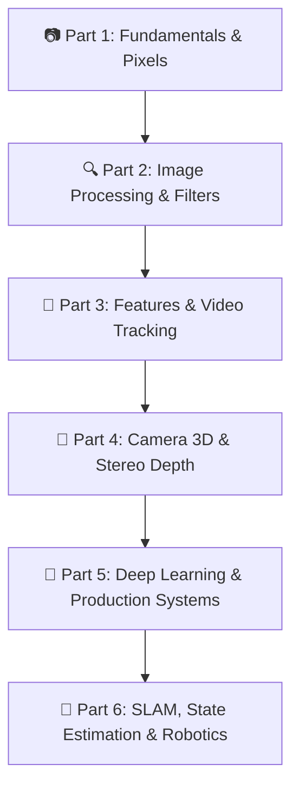

# Computer Vision & Robotics Perception Engineering Handbook

> **A Complete Practical Guide: From Absolute Beginner to Advanced Production Engineer**

Welcome to the **Computer Vision & Robotics Perception Engineering Master Handbook**. This curriculum is designed with a **3-Level Progressive Learning System** so you can master complex computer vision concepts step-by-step:

- 🟢 **Level 1 (Beginner)**: Simple plain-English intuition, everyday real-world analogies, and zero math jargon.
- 🟡 **Level 2 (Intermediate)**: Step-by-step arithmetic breakdowns with real numbers, demystified formulas, and copy-paste Python code.
- 🔴 **Level 3 (Advanced)**: Production architecture, hardware SIMD (AVX2/NEON) vectorization, memory stride optimization, and real-time robotics deployment.

---

## 🗺️ Visual Learning Pathway

---

## 📚 Curriculum Modules

-   ### 📷 Part 1: OpenCV & Image Fundamentals
    ---
    **Chapters 1–6** • Light physics, photodiode sensors, ADC quantization, NumPy memory strides, color spaces (BGR, HSV, LAB), stencils & affine/perspective transforms.
    
    [👉 Explore Part 1 (Fundamentals)](opencv/part1_fundamentals.md){ .md-button .md-button--primary }

-   ### 🔍 Part 2: Core Image Processing & Geometry
    ---
    **Chapters 7–13** • 2D spatial convolution, Gaussian/Bilateral filters, CLAHE, Otsu & adaptive thresholding, Canny edge detection, morphology & Hough transforms.
    
    [👉 Explore Part 2 (Processing)](opencv/part2_processing.md){ .md-button .md-button--primary }

-   ### 🎯 Part 3: Features, Matching & Video Tracking
    ---
    **Chapters 14–19** • FAST & ORB keypoints, FLANN & Lowe's ratio test, Homography RANSAC, VideoCapture zero-latency threading, CSRT/KCF tracking & Optical Flow.
    
    [👉 Explore Part 3 (Features & Video)](opencv/part3_features_video.md){ .md-button .md-button--primary }

-   ### 🧊 Part 4: Camera Calibration, 3D Geometry & Stereo
    ---
    **Chapters 20–25** • Pinhole camera matrix, radial/tangential distortion, solvePnP 6DoF pose, Epipolar stereo depth, ArUco fiducials & Watershed marker segmentation.
    
    [👉 Explore Part 4 (3D Vision)](opencv/part4_3d_geometry.md){ .md-button .md-button--primary }

-   ### 🧠 Part 5: Deep Learning, Production & Systems
    ---
    **Chapters 26–32** • OCR pre-processing pipelines, YOLO & NMS vectorization, `cv2.dnn` ONNX runtime inference, multi-threaded pipelines, SIMD vectorization & Docker deployment.
    
    [👉 Explore Part 5 (DNN & Systems)](opencv/part5_dnn_systems.md){ .md-button .md-button--primary }

-   ### 🤖 Part 6: Robotics Perception & Interview Prep
    ---
    **Chapters 33–39** • Visual SLAM triangulation, Kalman filter sensor fusion, Bird's Eye View (BEV/IPM), Exposure fusion & Top 15 FAANG computer vision interview breakdowns.
    
    [👉 Explore Part 6 (Robotics)](opencv/part6_robotics.md){ .md-button .md-button--primary }

---

## ⚡ Additional Comprehensive Resources

- 📖 **[Complete Monolithic OpenCV Guide (All 39 Chapters)](opencv/full_guide.md)** — The full single-page scrollable handbook with all chapters, diagrams, and code.
- 🧪 **[PyTorch Deep Learning for Vision Notes](pytorch/deep_learning_guide.md)** — PyTorch tensors, autograd, CNN backbones, ViTs, U-Net segmentation, and foundation models.
- 💻 **[GitHub Repository](https://github.com/jashu-16/cv_learning)** — Clean source code, standalone runnable scripts, and diagram generators.
