# Comprehensive OpenCV & Computer Vision Engineering Master Handbook

> **Target Audience:** Computer Vision Engineers, Robotics Perception Engineers, and Autonomous Systems Developers  
> **Stack:** Python 3.10+, OpenCV (`cv2` 4.x+), NumPy (`>=1.23`), Matplotlib  
> **Philosophy:** Understand physical light & mathematical representations first, algorithmic internals & hardware memory models second, and OpenCV implementation patterns third.

---

## Table of Contents

1. [OpenCV Fundamentals](#1-opencv-fundamentals)
2. [Images & NumPy Fundamentals](#2-images--numpy-fundamentals)
3. [Image Input & Output](#3-image-input--output)
4. [Color Spaces](#4-color-spaces)
5. [Image Manipulation](#5-image-manipulation)
6. [Geometric Transformations](#6-geometric-transformations)
7. [Image Filtering & Smoothing](#7-image-filtering--smoothing)
8. [Image Enhancement](#8-image-enhancement)
9. [Image Thresholding](#9-image-thresholding)
10. [Image Gradients & Edge Detection](#10-image-gradients--edge-detection)
11. [Morphological Image Processing](#11-morphological-image-processing)
12. [Contours & Shape Analysis](#12-contours--shape-analysis)
13. [Hough Transform & Geometric Detection](#13-hough-transform--geometric-detection)
14. [Feature Detection & Description](#14-feature-detection--description)
15. [Feature Matching](#15-feature-matching)
16. [Homography & Image Registration](#16-homography--image-registration)
17. [Video Processing](#17-video-processing)
18. [Object Tracking](#18-object-tracking)
19. [Optical Flow](#19-optical-flow)
20. [Camera Calibration](#20-camera-calibration)
21. [Camera Pose & 3D Geometry](#21-camera-pose--3d-geometry)
22. [Stereo Vision & Depth](#22-stereo-vision--depth)
23. [ArUco & Fiducial Markers](#23-aruco--fiducial-markers)
24. [Image Segmentation](#24-image-segmentation)
25. [Connected Components & Blob Analysis](#25-connected-components--blob-analysis)
26. [OCR & Text Processing](#26-ocr--text-processing)
27. [Object Detection Integration](#27-object-detection-integration)
28. [Deep Learning + OpenCV](#28-deep-learning--opencv-cv2dnn)
29. [OpenCV for Computer Vision Systems](#29-opencv-for-computer-vision-systems)
30. [OpenCV for Robotics Perception](#30-opencv-for-robotics-perception)
31. [Performance Optimization](#31-performance-optimization)
32. [Production & Deployment](#32-production--deployment)
33. [Visual SLAM & 3D Triangulation](#33-visual-slam--3d-triangulation)
34. [Kalman Filter & Motion Tracking](#34-kalman-filter--motion-tracking)
35. [Inverse Perspective Mapping & BEV](#35-inverse-perspective-mapping--bev)
36. [Exposure Fusion & HDR Imaging](#36-exposure-fusion--hdr-imaging)
37. [Barcode & QR Code Pose Localization](#37-barcode--qr-code-pose-localization)
38. [Practical Robotics & Perception Projects](#38-practical-robotics--perception-projects)
39. [OpenCV Interview Preparation & Formulas](#39-opencv-interview-preparation--formulas)

---

## 1. OpenCV Fundamentals

### Definition & Intuitive Analogy
**OpenCV** (Open Source Computer Vision Library) is the world's most widely used open-source software library for computer vision, image processing, and machine learning.

> **Intuitive Analogy:** Think of an image as a giant mosaic made of millions of colored tiles (pixels). A camera sensor is like an array of tiny buckets (photodiodes) collecting raindrops (photons of light). OpenCV is the master toolkit containing thousands of high-speed mathematical tools designed to analyze, measure, modify, and understand these pixel mosaics in real-time.


### 💡 The Big Picture in Plain English (Beginner Friendly)

- **What is it in 1 simple sentence?** OpenCV is a gigantic, super-fast digital toolbox that takes pictures from cameras and turns them into tables of numbers so computers can "see," detect shapes, and track objects in real time.
- **Why do we need this? (The Problem):** Python is easy to write, but if you try to process a 1080p camera feed (over 2 million pixels) 30 times a second using standard Python `for` loops, your computer will freeze—it is over 100 times too slow. OpenCV solves this by letting you write simple Python commands while running ultra-optimized C++ code on your computer's fastest CPU and GPU circuits underneath.
- **How to picture it in your head (Mental Model):** Imagine you are the director of a Hollywood movie. You sit in a chair giving high-level commands: *"Zoom in!"*, *"Blur the background!"*, *"Find that face!"*. You don't build the camera lenses yourself. Python is you speaking into a walkie-talkie, and OpenCV is an army of Olympic-level athletes running around at light speed executing every command instantly.
- **Step-by-Step Walkthrough with Easy Numbers (Light to Pixels):**
  1. Light bounces off a red apple and hits your camera's photodiode sensor.
  2. The sensor accumulates electrons during the shutter exposure time (like rain filling a bucket).
  3. The bucket voltage is measured: say $0.5$ Volts out of a maximum $1.0$ Volt scale.
  4. The Analog-to-Digital Converter (ADC) maps this voltage to an 8-bit integer between $0$ (darkness) and $255$ (maximum brightness). Since $0.5$ is halfway, it records the integer **128**.
  5. That single number **128** is stored in computer memory as a pixel!
- **Beginner Trap & Rule of Thumb:** In OpenCV geometry functions, points are given as $(x, y) = (	ext{column}, 	ext{row})$. But in NumPy array indexing, you MUST index as `image[y, x] = image[row, col]`. If you mix them up, your program crashes or draws annotations sideways!

### Why It Is Important
In production systems—from self-driving cars and warehouse robots to medical scanners and smartphones—visual data must be processed within strict time limits (often under 10 to 30 milliseconds per frame). Python's standard loops are far too slow for processing millions of numbers per frame. OpenCV solves this by running highly optimized C++ code under the hood with hardware acceleration (SIMD CPU instructions and GPU acceleration), while giving developers a clean, easy-to-use Python interface.

### Core Concept & Mathematical Intuition: How Light Becomes Digital Pixels

In the physical universe, light is a continuous wave of electromagnetic radiation emitted by light sources (the Sun, light bulbs) and reflected off physical objects in the world. 

```
+---------------------------------------------------------------------------------------------------+
|                            THE PHYSICAL-TO-DIGITAL CAMERA PIPELINE                                |
+---------------------------------------------------------------------------------------------------+
| 1. CONTINUOUS LIGHT   |  2. SPATIAL SAMPLING   |  3. EXPOSURE INTEGRATION  |  4. ADC QUANTIZATION |
|   Radiant Light Flux  |    Microlens Array     |     Photodiode Array      |   Analog-to-Digital  |
|                       |                        |                           |                      |
|      ~ ~ ~ ~ ~ ~      |     [ ] [ ] [ ] [ ]    |     |_| |_| |_| |_|       |     01101100 (108)   |
|     Photons (Waves)   |     Discrete 2D Grid   |   Accumulate Electrons    |   Discrete Integer   |
|   Phi(x, y, lambda, t)|   W x H Pixel Sensors  |   Charge proportional to  |   [0, 255] in RAM    |
|                       |                        |   photon count in dt      |                      |
+---------------------------------------------------------------------------------------------------+
```

#### Step 1: Continuous Radiant Light Flux $\Phi(x, y, \lambda, t)$
Light entering a camera lens is a continuous mathematical function containing 4 variables:
- **$(x, y)$ (Space):** Continuous physical coordinates on the camera sensor plane (measured in millimeters or micrometers).
- **$\lambda$ (Wavelength / Color):** The spectral wavelength of the photons. Visible light ranges from $\approx 380\text{ nm}$ (violet/blue) to $\approx 740\text{ nm}$ (red). Infrared is $>750\text{ nm}$.
- **$t$ (Time):** Continuous physical time (in seconds).
- **$\Phi$ (Radiant Flux / Intensity):** The power of incoming electromagnetic energy (measured in Watts/$\text{m}^2$).

#### Step 2: Spatial Sampling (The Photodiode Grid)
The continuous spatial image must be cut into discrete pieces. A camera sensor (CMOS or CCD) consists of a silicon wafer etched with a rectangular grid of millions of tiny microscopic light collectors called **photodiodes** (pixels):
- A $1920 \times 1080$ Full HD sensor contains exactly $2,073,600$ individual photodiode buckets.
- **Spatial Sampling** means the sensor averages all light hitting each tiny square area into a single point:
  $$I_{\text{continuous}}(r, c) = \iint_{\text{Pixel Area}(r,c)} \Phi(x, y) \, dx \, dy$$

#### Step 3: Exposure Integration (Rain into Buckets Analogy)
> **Bucket Analogy:** Think of photons like raindrops falling from the sky. Each photodiode is an empty bucket. When the camera shutter opens for exposure time $\Delta t$ (e.g., $1/100$th of a second), raindrops collect in the bucket. A bright spot in the scene pours thousands of photons into its bucket, generating a large electrical charge. A dark shadow only drips a few photons, generating a tiny electrical charge.

The accumulated electric charge $Q$ in pixel bucket $(r, c)$ is:
$$Q(r, c) = \int_{t_{\text{start}}}^{t_{\text{start}} + \Delta t} \int_{\lambda_{\min}}^{\lambda_{\max}} \Phi(r, c, \lambda, t) \cdot S(\lambda) \, d\lambda \, dt$$
Where $S(\lambda)$ is the spectral sensitivity of the silicon sensor.

#### Step 4: Quantization via ADC (Analog-to-Digital Converter)
The accumulated electrical charge is an analog voltage (e.g., $0.00\text{V}$ to $1.25\text{V}$). A computer processor cannot store continuous voltages—it only understands digital numbers. The **Analog-to-Digital Converter (ADC)** slices the continuous voltage range into discrete integer steps:

```
Voltage (Analog)                 Digital Integer (8-bit)
1.25 V  ---------------------->  255 (Pure White / Saturated)
1.00 V  ---------------------->  204
0.625V  ---------------------->  128 (Medium Gray)
0.25 V  ---------------------->  51
0.00 V  ---------------------->  0   (Pitch Black / Darkness)
```

#### Bit Depth Comparison
- **8-bit Unsigned Integer (`uint8`):** $2^8 = 256$ intensity levels ($[0, 255]$). This is standard for consumer cameras, webcams, and display monitors.
- **16-bit Unsigned Integer (`uint16`):** $2^{16} = 65,536$ intensity levels ($[0, 65535]$). Commonly used in:
  - Depth sensors (LiDAR, Time-of-Flight, Intel RealSense), where each integer represents metric distance in millimeters ($1500 = 1.5\text{ meters}$).
  - Medical imaging (CT scans, X-rays, MRI) to capture subtle bone and soft-tissue density variations.
- **32-bit Floating Point (`float32`):** Stores continuous real numbers $[0.0, 1.0]$ or $[-\infty, +\infty]$. Essential for gradient maps, machine learning feature tensors, and HDR radiance fields.

---

### Coordinate System in Computer Vision: Why Top-Left $(0, 0)$?

In standard Cartesian school mathematics, the origin $(0, 0)$ is at the **bottom-left**, and $+Y$ points **upward**. 

In Computer Vision, digital image matrices place $(0, 0)$ at the **TOP-LEFT** corner, $+X$ extends to the **RIGHT**, and $+Y$ extends **DOWNWARD**:

```
(0, 0) [Top-Left Origin]  ----------------------->  +X (Width / Columns)
   |
   |       Pixel (x=3, y=1) or Array[row=1, col=3]
   |                 |
   |                 v
   |       +---+---+---+---+---+
   |  row0 | . | . | . | . | . |
   |       +---+---+---+---+---+
   |  row1 | . | . | . | X | . |
   |       +---+---+---+---+---+
   |  row2 | . | . | . | . | . |
   |       +---+---+---+---+---+
   v
  +Y (Height / Rows)
```

#### Why did this convention develop?
1. **Cathode Ray Tube (CRT) Raster Scanning:** Early television sets and computer monitors scanned an electron beam across the phosphor screen starting from the top-left corner, sweeping horizontally across the row from left-to-right, then jumping down to the next row (raster scan).
2. **Western Reading Order:** In Western languages, text is read from left-to-right and top-to-bottom. Memory addresses in computer RAM follow this exact linear sequence.

#### The Fundamental Indexing Rule: $(x, y)$ vs $[y, x]$
This is the single most common source of bugs in computer vision engineering:
- **OpenCV Geometry Functions (`cv2.circle`, `cv2.line`, `cv2.rectangle`):** Expect spatial coordinates $(x, y) = (\text{column}, \text{row})$.
- **NumPy Matrix Indexing (`img[row, col]`):** Expects matrix coordinates $[y, x] = [\text{row}, \text{column}]$.

```
         OpenCV Call:  cv2.circle(image, (x=200, y=100), radius=10, color)
         NumPy Index:  pixel_val = image[y=100, x=200]
```

---

### How It Works Internally: Memory Layout & Hardware Acceleration

```
+------------------------------------------------------------------------------------+
|                         OPENCV cv::Mat / NUMPY MEMORY MODEL                        |
+------------------------------------------------------------------------------------+
|   HEADER (Small fixed metadata in C++)         DATA BUFFER (Heap Allocation)       |
|   - Dimensions: Height=480, Width=640          [B0][G0][R0] [B1][G1][R1] ...       |
|   - Channels: 3 (BGR)                          Continuous 1D array of raw bytes    |
|   - Data Type: CV_8UC3 (uint8)                 Total bytes = H * W * C             |
|   - Step / Strides: (1920, 3, 1) bytes         Shared by NumPy via Zero-Copy!      |
|   - Reference Counter: RefCount = 1                                                |
|   - Data Pointer: 0x7ffee4b20000 -----------> [ 120, 45, 230, 118, 44, 229, ... ] |
+------------------------------------------------------------------------------------+
```

#### 1. C++ `cv::Mat` Internal Architecture
A `cv::Mat` object is lightweight because it separates the metadata from the raw image data:
1. **The Header (Fixed-size $\approx 32-64$ bytes):** Contains matrix dimensions ($H, W$), number of channels ($C$), bit depth (`CV_8U`, `CV_32F`), memory strides (step size in bytes), and an atomic thread-safe reference counter.
2. **The Data Buffer (Variable size, e.g., 6 MB for 1080p):** A heap-allocated contiguous 1D block of memory holding the raw pixel bytes.
3. **Reference Counting (Copy-on-Write semantics):** Copying a `cv::Mat` (or passing it between functions) only copies the small header and increments `RefCount++`. No expensive pixel memory copying takes place until an explicit `.clone()` or `.copy()` is requested.

#### 2. Zero-Copy Python $\leftrightarrow$ C++ Bridge
When you pass a NumPy array to `cv2` in Python:
- Python's C-API / PyBind11 wrapper reads the memory address of NumPy's internal `data` pointer.
- It instantly instantiates a `cv::Mat` header pointing directly to NumPy's memory buffer.
- **Zero data duplication occurs.** The C++ OpenCV algorithm computes directly inside the NumPy array memory buffer.

#### 3. Hardware SIMD Vectorization (AVX2, AVX-512, ARM NEON)
Standard CPU code runs in **Scalar Mode**: it adds or multiplies one number at a time:
```
Scalar Loop (1 pixel per clock cycle):
Cycle 1: Pixel[0] + 50
Cycle 2: Pixel[1] + 50
Cycle 3: Pixel[2] + 50
... (Takes 32 clock cycles for 32 pixels)
```

With **SIMD (Single Instruction, Multiple Data)**, the CPU loads a wide 256-bit vector register (Intel AVX2) or 512-bit register (AVX-512) and executes arithmetic on **32 separate pixels simultaneously in a single clock cycle**:

```
AVX2 SIMD Register (256-bit wide) - 1 Clock Cycle:
[P0][P1][P2][P3][P4][P5][P6][P7] ... [P31]  +  [50][50][50] ... [50]
====================================================================
[R0][R1][R2][R3][R4][R5][R6][R7] ... [R31]  (32 pixels processed at once!)
```
OpenCV automatically detects CPU support at runtime and dispatches compiled SIMD assembly kernels.

#### 4. Multithreaded Row Chunking (Intel TBB / OpenMP)
For large images, OpenCV divides the image into horizontal row bands and dispatches them across multiple CPU cores:
- Core 0 processes Rows $0 \to 249$
- Core 1 processes Rows $250 \to 499$
- Core 2 processes Rows $500 \to 749$
- Core 3 processes Rows $750 \to 999$

Controlled via `cv2.setNumThreads(N)`.

### Important OpenCV Functions & Syntax
```python
import cv2

# Check OpenCV version string
version = cv2.getVersionString()

# Check if hardware SIMD acceleration is currently active
is_opt = cv2.useOptimized() # Returns True if SIMD vectorization is active

# Enable or disable SIMD acceleration
cv2.setUseOptimized(True)

# Set the number of worker CPU threads for parallel loops
cv2.setNumThreads(4)

# High-precision performance timing
t1 = cv2.getTickCount()
# ... perform image operations ...
t2 = cv2.getTickCount()
elapsed_sec = (t2 - t1) / cv2.getTickFrequency()
```

### System Architecture & Pipeline Flowchart

```mermaid
flowchart LR
    A["Physical Scene Light\nPhi(x, y, lambda, t)"] --> B["Microlens Array\nSpatial Sampling"]
    B --> C["Photodiode Array\nCharge Integration"]
    C --> D["ADC Converter\nVoltage to Integer"]
    D --> E["C++ cv::Mat\nContiguous Buffer"]
    E --> F["NumPy Array\nZero-Copy Python View"]
```

### Visual Demonstration & Coordinate Alignment
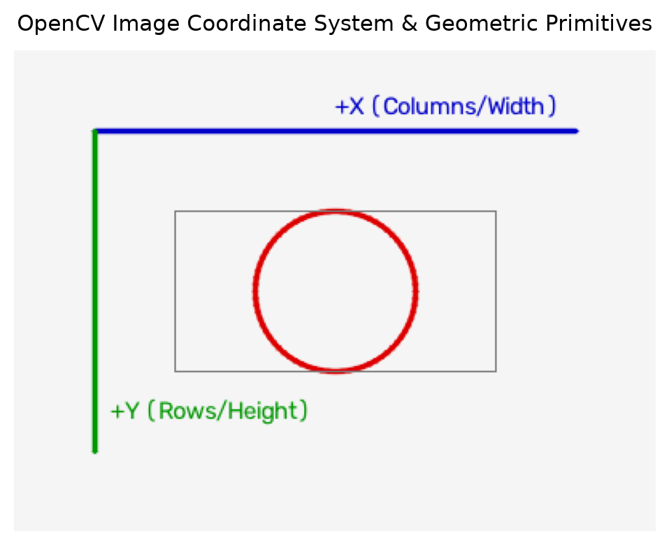

### Executable Python Example
```python
import cv2
import numpy as np
import matplotlib.pyplot as plt

# 1. Verify optimization flags and hardware dispatch
print(f"OpenCV Version: {{cv2.__version__}}")
print(f"Hardware Vectorization Enabled: {{cv2.useOptimized()}}")
cv2.setUseOptimized(True)
cv2.setNumThreads(4)

# 2. Build a synthetic calibration canvas (Height=300, Width=400, Channels=3)
# np.full initializes an array filled with 245 (light gray)
canvas = np.full((300, 400, 3), 245, dtype=np.uint8)

# 3. Draw coordinate axes and geometric primitives
# NOTE: OpenCV points are specified as (x, y) = (col, row)
cv2.line(canvas, (50, 50), (350, 50), (200, 0, 0), thickness=2, lineType=cv2.LINE_AA) # X-axis (Blue in BGR)
cv2.line(canvas, (50, 50), (50, 250), (0, 150, 0), thickness=2, lineType=cv2.LINE_AA) # Y-axis (Green in BGR)
cv2.putText(canvas, "+X (Columns/Width)", (200, 40), cv2.FONT_HERSHEY_SIMPLEX, 0.5, (200, 0, 0), 1, cv2.LINE_AA)
cv2.putText(canvas, "+Y (Rows/Height)", (60, 230), cv2.FONT_HERSHEY_SIMPLEX, 0.5, (0, 150, 0), 1, cv2.LINE_AA)

# Draw geometric shapes: circle at center (200, 150) with radius 50 (Red in BGR: 0, 0, 220)
cv2.circle(canvas, (200, 150), 50, (0, 0, 220), thickness=2, lineType=cv2.LINE_AA)
cv2.rectangle(canvas, (100, 100), (300, 200), (120, 120, 120), thickness=1)

# 4. Display with Matplotlib (Convert BGR -> RGB for correct display)
plt.figure(figsize=(6, 4))
plt.imshow(cv2.cvtColor(canvas, cv2.COLOR_BGR2RGB))
plt.title("OpenCV Image Coordinate System & Geometric Primitives")
plt.axis("off")
plt.show()

print(f"Canvas shape: {{canvas.shape}} (Height=300, Width=400, Channels=3), Data type: {{canvas.dtype}}")
```

### Line-by-Line Explanation
1. `cv2.setUseOptimized(True)`: Forces OpenCV to use compiled CPU vector instructions (AVX2/NEON) for maximum processing speed.
2. `np.full((300, 400, 3), 245, dtype=np.uint8)`: Allocates a $300 \times 400$ 3-channel matrix in memory where each byte is initialized to value $245$.
3. `cv2.line(canvas, (50, 50), (350, 50), (200, 0, 0), ...)`: Draws an anti-aliased line from point $(x_1, y_1) = (50, 50)$ to $(x_2, y_2) = (350, 50)$. Notice the color is a tuple `(B, G, R)` so `(200, 0, 0)` is blue.
4. `cv2.LINE_AA`: Anti-aliased line drawing flag. Calculates sub-pixel Gaussian weights along the boundary to prevent jagged "staircase" pixel edges.
5. `cv2.cvtColor(canvas, cv2.COLOR_BGR2RGB)`: Swaps the first and third channels so Matplotlib (which expects RGB) displays colors accurately.

### Common Mistakes & Important Tips
- **The BGR Trap:** OpenCV stores color channels in **Blue-Green-Red (BGR)** order, while almost every other library (Matplotlib, PIL, PyTorch, TensorFlow) expects **Red-Green-Blue (RGB)**. Forgetting to convert BGR to RGB when displaying with Matplotlib makes red objects appear blue and blue objects appear red.
- **Coordinate Order Confusion:** When calling OpenCV drawing functions (e.g., `cv2.circle(img, (x, y), ...)`), coordinates are given as `(x, y)` which is `(column, row)`. But when indexing the NumPy array directly, you must write `img[y, x]` which is `img[row, column]`. Mixing these up leads to "index out of bounds" errors or flipped geometries!
- **Memory Contiguity:** OpenCV functions expect C-contiguous memory arrays (`array.flags['C_CONTIGUOUS'] == True`). If you take non-contiguous slices or transposed views, always use `np.ascontiguousarray()` before passing them to OpenCV.

### Real-World & Robotics Perception Relevance
- **Visual Odometry (VO) & SLAM:** Autonomous drones and mobile robots track high-speed feature points across frames. Real-time CPU optimizations (`cv2.useOptimized()`) ensure that the tracking loop runs at $>60$ FPS, preventing tracking drift.
- **Deterministic Latency Budgeting:** In autonomous driving, visual perception pipelines have a strict latency budget (e.g., $<15$ ms per frame). Knowing how OpenCV manages threads and memory prevents unpredictable garbage collection pauses.

### Interview Questions & Detailed Answers
1. **Q: Why does OpenCV represent images in BGR format instead of RGB by default?**
   - *Answer:* When OpenCV was originally created at Intel Research in 1999, the dominant camera frame grabbers and Windows graphic hardware manufacturers (DirectShow and Video for Windows) stored pixel buffers in BGR byte order. To avoid the runtime overhead of converting every single camera frame in memory on 1999-era CPUs, OpenCV adopted BGR natively. It remains BGR today to maintain backwards compatibility.
2. **Q: What is the memory ownership model when passing NumPy arrays into OpenCV Python functions?**
   - *Answer:* OpenCV's Python bindings use a zero-copy mechanism. The C++ wrapper creates a `cv::Mat` header whose data pointer points directly to the existing NumPy memory buffer without copying data. Deep copies only occur if the array data is not contiguous in memory or if an explicit `.copy()` is invoked.

### Mini Exercise with Solution
**Task:** Write a Python function that generates a $400 \times 400$ blank image, draws 5 concentric circles spaced 30 pixels apart centered at $(200, 200)$, and accurately measures the execution time over 1,000 iterations using `cv2.getTickCount()`.

```python
import cv2
import numpy as np

def benchmark_concentric_circles(iterations=1000):
    t_start = cv2.getTickCount()
    for _ in range(iterations):
        img = np.zeros((400, 400, 3), dtype=np.uint8)
        for r in range(30, 180, 30):
            cv2.circle(img, (200, 200), r, (0, 255, 0), thickness=2, lineType=cv2.LINE_AA)
    t_end = cv2.getTickCount()
    
    total_time_sec = (t_end - t_start) / cv2.getTickFrequency()
    avg_fps = iterations / total_time_sec
    print(f"Total time for {{iterations}} iterations: {{total_time_sec:.4f}}s | Average Speed: {{avg_fps:.1f}} FPS")

benchmark_concentric_circles()
```

---

## 2. Images & NumPy Fundamentals

### Definition & Intuitive Analogy
In Python OpenCV, every image is simply a standard NumPy $N$-dimensional numerical array (`np.ndarray`). A single grayscale image is a 2D matrix (rows $\times$ columns), while a color image is a 3D volume (rows $\times$ columns $\times$ channels).

> **Intuitive Analogy:** Imagine an image as a spreadsheet. For a grayscale image, each cell holds a single number representing how bright that spot is. For a color image, imagine a stack of three spreadsheets taped together: the top sheet contains the Blue brightness values, the middle sheet contains Green, and the bottom sheet contains Red.


### 💡 The Big Picture in Plain English (Beginner Friendly)

- **What is it in 1 simple sentence?** An image is nothing more than a giant spreadsheet or 3D grid of numbers where each cell holds a brightness level from 0 (pitch black) to 255 (blinding white).
- **Why do we need this? (The Problem):** If you try to brighten an image in regular Python using `pixel + 20`, an 8-bit number at 250 wraps around like a car odometer and becomes `14`! Your bright sunny sky suddenly gets bizarre black spots. OpenCV's saturated arithmetic prevents this by clamping values at 255.
- **How to picture it in your head (Mental Model):**
  - **Grayscale image:** A single spreadsheet. Row 5, Column 10 has the number `45` (a dark gray pixel).
  - **Color image:** Three spreadsheets stacked on top of each other like pancakes. The top sheet holds the Blue brightness, the middle holds Green, and the bottom holds Red.
  - **Modulo vs Saturated Arithmetic:** Modulo arithmetic is like a clock ($11	ext{ o'clock} + 2	ext{ hours} = 1	ext{ o'clock}$). Saturated arithmetic is like filling a water cup: once the cup is 100% full, adding more water doesn't make it empty—it stays 100% full ($255$).
- **Step-by-Step Walkthrough with Easy Numbers:**
  - Let pixel $A = 240$ and you add brightness $+30$.
  - In pure NumPy (modulo 8-bit): $(240 + 30) = 270 \implies 270 - 256 = \mathbf{14}$ (Turns nearly black!).
  - In OpenCV `cv2.add`: $\min(240 + 30, 255) = \mathbf{255}$ (Stays pure white, as human eyes expect).
- **Beginner Trap & Rule of Thumb:** Slicing an image in NumPy (`crop = img[0:100, 0:100]`) creates a **view**, not a copy. If you modify `crop`, you accidentally modify the original image! Always call `.copy()` if you want an independent image.

### Why It Is Important
Understanding how NumPy stores and indexes image matrices allows you to perform fast, vectorized image arithmetic, crop regions of interest (ROI), and mask out objects without writing slow `for` loops in Python.

### Core Concept & Mathematical Intuition
Mathematically, an image is a 2D spatial function mapping discrete pixel coordinates to intensity values:
$$I: \Omega \subset \mathbb{Z}^2 \to \mathcal{V}$$

Where $(r, c)$ denotes row $r \in [0, H-1]$ and column $c \in [0, W-1]$:
- **8-bit Unsigned Integer (`np.uint8`):** $\mathcal{V} = \{0, 1, 2, \dots, 255\}$. This is standard for normal display images.
- **16-bit Unsigned Integer (`np.uint16`):** $\mathcal{V} = \{0, 1, 2, \dots, 65535\}$. Standard for depth maps (where pixel values represent distance in millimeters).
- **32-bit Floating Point (`np.float32`):** $\mathcal{V} = [0.0, 1.0]$ or $[-\infty, +\infty]$. Standard for gradient calculations, machine learning feature maps, and optical flow vectors.

#### Indexing Rules: Spatial vs Matrix Convention
| Framework | Coordinate Notation | Order | Example |
| :--- | :--- | :--- | :--- |
| **OpenCV Geometry** | $(x, y)$ | $(\text{Column}, \text{Row})$ | `cv2.circle(img, (x, y), r, color)` |
| **NumPy Matrix Indexing** | `[y, x]` or `[row, col]` | $(\text{Height}, \text{Width})$ | `pixel = img[y, x]` |
| **Shape Attribute** | `img.shape` | $(H, W, C)$ | `(480, 640, 3)` $\to$ 480 rows, 640 cols |

### Saturated Arithmetic vs Modulo Arithmetic
A critical difference between OpenCV and standard NumPy math is how they handle numerical overflow and underflow:

1. **NumPy Uses Modulo (Wrap-around) Arithmetic:**
   - When an 8-bit number exceeds $255$, it wraps around: $250 + 20 = 270 \pmod{{256}} = 14$.
   - **Danger in Vision:** If you brighten an image with NumPy `img + 50`, bright highlights ($>205$) will instantly wrap around to near-zero, creating bizarre dark/black spots in the brightest parts of the image!
2. **OpenCV Uses Saturated Arithmetic:**
   - Values are clamped strictly to $[0, 255]$:
     $$\text{{cv2.add}}(a, b) = \min(a + b, 255)$$
     $$\text{{cv2.subtract}}(a, b) = \max(a - b, 0)$$
   - With OpenCV `cv2.add(250, 20)`, the result is correctly clamped to $255$ (pure white).

### How It Works Internally: NumPy Memory Strides
NumPy arrays use a **strided memory layout**. A 3D image array is stored in RAM as a flat 1D sequence of bytes. To find the memory address of pixel at row $r$, column $c$, channel $k$, the CPU computes:

$$\text{{Memory Address}}(r, c, k) = \text{{DataPointer}} + r \cdot S_0 + c \cdot S_1 + k \cdot S_2$$

Where $S_0, S_1, S_2$ are the **strides** (the number of bytes to step in memory to advance by 1 row, 1 column, or 1 channel).
- **Views vs Copies:** When you slice an image using `roi = img[50:150, 50:150]`, NumPy creates a new array header with adjusted strides pointing to the **same underlying memory buffer** (Zero-Copy). Modifying `roi` directly alters `img`! To create an independent copy, you must explicitly call `.copy()`.

### Important OpenCV & NumPy Syntax
```python
# Array properties
height, width, channels = img.shape
data_type = img.dtype # e.g., dtype('uint8')

# Slicing a Region of Interest (ROI) - Zero Copy View
roi = img[y_min:y_max, x_min:x_max]

# Creating an independent deep copy
roi_copy = img[y_min:y_max, x_min:x_max].copy()

# Saturated arithmetic
bright_img = cv2.add(img, np.array([50.0])) # Clamped to 255
dark_img = cv2.subtract(img, np.array([50.0])) # Clamped to 0

# Channel splitting and merging
b, g, r = cv2.split(img) # Splits into three 2D arrays
merged = cv2.merge([b, g, r]) # Combines three 2D arrays back to 3D
```

### Memory Architecture & Strides Diagram
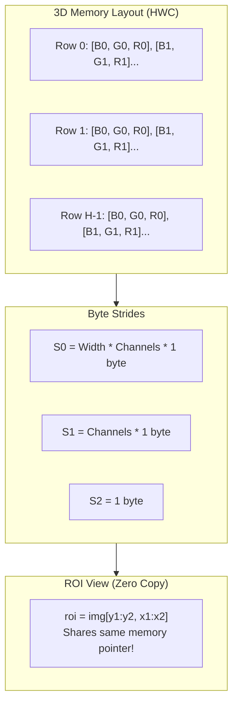
```mermaid
flowchart TD
    subgraph MemoryBuffer ["3D Memory Layout (HWC)"]
        P0["Row 0: [B0, G0, R0], [B1, G1, R1]..."]
        P1["Row 1: [B0, G0, R0], [B1, G1, R1]..."]
        P2["Row H-1: [B0, G0, R0], [B1, G1, R1]..."]
    end
    subgraph Strides ["Byte Strides"]
        S0["S0 = Width * Channels * 1 byte"]
        S1["S1 = Channels * 1 byte"]
        S2["S2 = 1 byte"]
    end
    subgraph Slicing ["ROI View (Zero Copy)"]
        ROI["roi = img[y1:y2, x1:x2]\nShares same memory pointer!"]
    end
    MemoryBuffer --> Strides --> Slicing
```

### Visual Demonstration & Channel Architecture
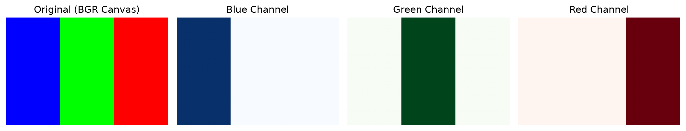

### Executable Python Example
```python
import numpy as np
import cv2
import matplotlib.pyplot as plt

# 1. Create a synthetic 3-channel BGR test image (Height=200, Width=300)
img_bgr = np.zeros((200, 300, 3), dtype=np.uint8)
img_bgr[:, :100] = (255, 0, 0)    # Left stripe: Pure Blue (BGR: 255, 0, 0)
img_bgr[:, 100:200] = (0, 255, 0)  # Middle stripe: Pure Green (BGR: 0, 255, 0)
img_bgr[:, 200:] = (0, 0, 255)    # Right stripe: Pure Red (BGR: 0, 0, 255)

# 2. Extract a Region of Interest (ROI) via NumPy strided slicing (Zero-Copy view)
roi = img_bgr[50:150, 50:250]

# Modify the ROI in-place: turn on full Green intensity across the ROI
roi[:, :, 1] = 255

# 3. Channel separation using cv2.split
b_plane, g_plane, r_plane = cv2.split(img_bgr)
reconstructed = cv2.merge([b_plane, g_plane, r_plane])

# 4. Demonstrate Saturated vs Modulo Arithmetic
val_np = np.uint8(250) + np.uint8(20) # NumPy wrap-around: 270 % 256 = 14
val_cv = cv2.add(np.uint8(250), np.uint8(20)) # OpenCV saturated: min(270, 255) = 255
print(f"NumPy Modulo Addition (250+20): {{val_np}} | OpenCV Saturated Addition (250+20): {{val_cv[0][0]}}")

# 5. Visual Multi-Panel Comparison
fig, axs = plt.subplots(1, 4, figsize=(14, 3.5))
axs[0].imshow(cv2.cvtColor(img_bgr, cv2.COLOR_BGR2RGB))
axs[0].set_title("Modified Image (ROI edited)")
axs[1].imshow(b_plane, cmap="Blues")
axs[1].set_title("Blue Channel Plane")
axs[2].imshow(g_plane, cmap="Greens")
axs[2].set_title("Green Channel Plane")
axs[3].imshow(r_plane, cmap="Reds")
axs[3].set_title("Red Channel Plane")
for ax in axs: ax.axis("off")
plt.tight_layout()
plt.show()

print(f"Memory identity verified: {{np.array_equal(img_bgr, reconstructed)}}")
```

### Line-by-Line Explanation
1. `img_bgr[:, :100] = (255, 0, 0)`: Slices all rows and the first 100 columns across all 3 channels, assigning Blue=255, Green=0, Red=0.
2. `roi = img_bgr[50:150, 50:250]`: Creates a view into the central $100 \times 200$ rectangular region of `img_bgr`. No new memory is allocated.
3. `roi[:, :, 1] = 255`: Updates channel index 1 (Green) inside that slice. Because `roi` shares memory with `img_bgr`, the original image is instantly modified.
4. `cv2.split(img_bgr)`: Deconstructs the interleaved BGR array into three separate 2D single-channel matrices.
5. `cv2.merge([b_plane, g_plane, r_plane])`: Interleaves the three individual single-channel arrays back into a single 3D BGR image.

### Common Mistakes & Important Tips
- **NumPy Direct Addition Bug:** Never use `img + 50` to adjust brightness. Always use `cv2.add(img, 50)` or `np.clip(img.astype(np.int16) + 50, 0, 255).astype(np.uint8)`.
- **Unexpected In-Place Modification:** Modifying a sliced sub-array modifies the original frame. If you want to crop a patch to process without altering the original camera frame, always use `patch = img[y1:y2, x1:x2].copy()`.
- **Direct Channel Indexing is Faster:** `cv2.split()` creates three new arrays and incurs memory allocation. If you only need one channel (e.g., Red), indexing `r = img[:, :, 2]` is significantly faster because it returns a zero-copy 2D view.

### Real-World & Robotics Perception Relevance
- **RGB-D Sensor Data Processing:** In mobile robots equipped with RGB-D cameras (like Intel RealSense or Microsoft Azure Kinect), depth information is provided as a 2D `uint16` array where each number represents distance in millimeters. Spatial slicing (`depth[y, x]`) gives the exact metric distance to an obstacle for collision avoidance.
- **Bounding Box Crop for Deep Learning:** When an object detector (e.g., YOLO) predicts a bounding box `[x1, y1, x2, y2]`, the vision system crops `chip = frame[y1:y2, x1:x2]` and passes it to a secondary classifier (such as a license plate reader or facial recognition model).

### Interview Questions & Detailed Answers
1. **Q: Explain the difference between saturated arithmetic in OpenCV and modulo arithmetic in NumPy.**
   - *Answer:* NumPy performs standard C-style modulo arithmetic on fixed-width types: adding numbers to an 8-bit unsigned integer wraps around upon reaching $256$ ($250 + 20 = 14$). OpenCV uses saturated arithmetic implemented via specialized CPU instructions: addition is capped at the maximum representable value ($255$) and subtraction is floored at $0$. In vision applications, saturated arithmetic prevents catastrophic visual corruption like black patches appearing in bright regions.
2. **Q: How does memory stride affect the performance of OpenCV operations on sliced sub-images?**
   - *Answer:* When an image is sliced horizontally (`img[y1:y2, x1:x2]`), rows are no longer contiguous in physical RAM—there is a stride jump between the end of one cropped row and the start of the next. Some OpenCV SIMD routines require contiguous buffers for vector loads. When non-contiguous arrays are passed, OpenCV may allocate an internal contiguous temporary buffer, run the operation, and copy back, incurring performance overhead.

### Mini Exercise with Solution
**Task:** Generate an $8 \times 8$ chessboard pattern of size $512 \times 512$ pixels (each square is $64 \times 64$ pixels) using pure NumPy broadcasting and vectorization without any `for` loops.

```python
import numpy as np
import matplotlib.pyplot as plt

def generate_chessboard(board_size=8, square_size=64):
    # 1. Create an 8x8 index grid using broadcasting
    r = np.arange(board_size)[:, None] # Column vector (8, 1)
    c = np.arange(board_size)[None, :] # Row vector (1, 8)
    
    # 2. Check parity of (row + col): Even is 255 (white), Odd is 0 (black)
    board_8x8 = ((r + c) % 2 * 255).astype(np.uint8)
    
    # 3. Scale up each cell to square_size x square_size using Kronecker product
    chessboard = np.kron(board_8x8, np.ones((square_size, square_size), dtype=np.uint8))
    return chessboard

cb = generate_chessboard()
print(f"Chessboard generated with shape: {{cb.shape}}, min val: {{cb.min()}}, max val: {{cb.max()}}")
```

---

## 3. Image Input & Output

### Definition & Intuitive Analogy
Image I/O is the process of reading encoded, compressed visual files (like JPEG, PNG, TIFF) from storage into uncompressed, editable NumPy memory arrays, and saving NumPy arrays back into compressed file formats.

> **Intuitive Analogy:** Think of an image file on disk like a tightly folded, vacuum-packed tent in a camping bag. You cannot sleep in a folded tent. Reading an image (`cv2.imread`) is like unzipping the bag and pitching the tent so you can use every inch of space (raw uncompressed pixels in RAM). Writing an image (`cv2.imwrite`) is folding the tent back up and compressing it into the bag.


### 💡 The Big Picture in Plain English (Beginner Friendly)

- **What is it in 1 simple sentence?** Image I/O is unpacking a compressed image file (like a `.jpg` or `.png` on your hard drive) into an open table of numbers in your computer's RAM, and packing it back up into a compressed file when you want to save it.
- **Why do we need this? (The Problem):** An uncompressed 1080p color photo takes about 6 Megabytes of memory. A 1-minute video at 30 frames per second would take over **10 Gigabytes** of storage! Compression shrinks these files by $10	imes$ to $50	imes$ so they fit on your disk and fly across the internet.
- **How to picture it in your head (Mental Model):** Imagine a huge camping tent. When you want to sleep in it, you have to unfold it and pitch it—that's `cv2.imread()`. It takes up a lot of space in your room (RAM), but you can actually use it. When you're ready to pack your backpack, you fold the tent tightly and squeeze it into a tiny carry bag—that's `cv2.imwrite()`.
- **Step-by-Step Walkthrough with Easy Numbers:**
  - Uncompressed 1080p: $1920 	imes 1080 	imes 3	ext{ bytes} = 6,220,800	ext{ bytes} pprox \mathbf{6.22	ext{ MB}}$.
  - Saved as JPEG (quality 90): Frequency coefficients are quantized, shrinking the file to $pprox \mathbf{350	ext{ KB}}$ (a $17.7	imes$ size reduction with near-zero noticeable loss to the human eye).
- **Beginner Trap & Rule of Thumb:** If the file path is incorrect or the image is corrupt, `cv2.imread()` does NOT crash or raise an error—it silently returns `None`! Always write `if img is None: raise FileNotFoundError(...)`.

### Why It Is Important
Autonomous perception pipelines constantly stream, record, and transmit visual data. Knowing how to efficiently compress and decompress images—especially in memory without hitting slow SSD/flash storage—is essential for building high-bandwidth, low-latency vision servers.

### Core Concept & Mathematical Intuition
Raw uncompressed 1080p RGB video produces huge data rates:
$$1920 \times 1080 \text{{ pixels}} \times 3 \text{{ bytes/pixel}} \times 30 \text{{ FPS}} \approx 186.6 \text{{ Megabytes per second}}$$

Compression formats solve this by reducing file sizes:

1. **Lossy Compression (JPEG):**
   - Breaks the image into $8 \times 8$ pixel blocks.
   - Applies the **2D Discrete Cosine Transform (DCT)** to convert spatial pixel values into frequency components.
   - High-frequency details (which human eyes barely notice) are aggressively quantized (divided and rounded), and the rest is compressed using Huffman encoding.
   - **Trade-off:** Very small file size, but introduces compression artifacts along sharp edges.
2. **Lossless Compression (PNG):**
   - Uses predictive filters on image scanlines followed by the **DEFLATE** algorithm (a combination of LZ77 dictionary matching and Huffman entropy coding).
   - **Trade-off:** Exactly reproduces the original pixel values bit-for-bit, but file sizes are larger than JPEG.
3. **High Dynamic Range / Metric Formats (TIFF, OpenEXR):**
   - Supports 16-bit integers and 32-bit floating-point radiance values without lossy truncation. Essential for medical imaging, satellite imagery, and depth sensors.

### Image I/O Processing Flowchart
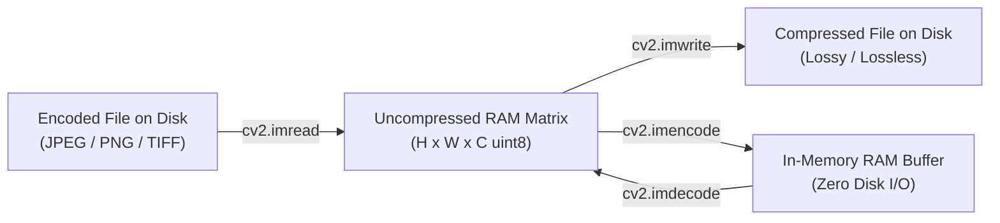
```mermaid
flowchart LR
    A["Encoded File on Disk\n(JPEG / PNG / TIFF)"] -->|cv2.imread| B["Uncompressed RAM Matrix\n(H x W x C uint8)"]
    B -->|cv2.imwrite| C["Compressed File on Disk\n(Lossy / Lossless)"]
    B -->|cv2.imencode| D["In-Memory RAM Buffer\n(Zero Disk I/O)"]
    D -->|cv2.imdecode| B
```

### Important OpenCV Functions & Syntax
```python
# Reading an image from disk
img = cv2.imread(filename: str, flags: int = cv2.IMREAD_COLOR)

# Writing an image to disk
success = cv2.imwrite(filename: str, img: np.ndarray, params: list = None)

# In-Memory Encoding (compress directly to RAM byte buffer)
success, encoded_buf = cv2.imencode(ext: str, img: np.ndarray, params: list = None)

# In-Memory Decoding (decompress raw byte buffer directly into NumPy array)
decoded_img = cv2.imdecode(buf: np.ndarray, flags: int)
```

#### Read Flags Deep Dive:
- `cv2.IMREAD_COLOR` (Default, value `1`): Loads the image in 8-bit BGR 3-channel format, stripping any alpha/transparency channel.
- `cv2.IMREAD_GRAYSCALE` (Value `0`): Converts the image directly to a 1-channel grayscale matrix during decoding.
- `cv2.IMREAD_UNCHANGED` (Value `-1`): Loads the image exactly as stored in the file, preserving 4-channel BGRA transparency or 16-bit depth.
- `cv2.IMREAD_ANYDEPTH` (Value `2`): Retains 16-bit or 32-bit precision instead of downscaling to 8-bit.

#### Write Parameters:
- `[cv2.IMWRITE_JPEG_QUALITY, quality_val]`: JPEG quality from `0` (lowest, smallest file) to `100` (highest, largest file). Default is `95`.
- `[cv2.IMWRITE_PNG_COMPRESSION, compression_level]`: PNG compression level from `0` (no compression, fastest) to `9` (maximum compression, slowest). Default is `3`.

### Executable Python Example
```python
import cv2
import numpy as np

# 1. Create a synthetic 16-bit depth map (simulating LiDAR / ToF sensor values in mm)
depth_sim = np.random.randint(500, 5000, (480, 640), dtype=np.uint16)
print(f"Original simulated depth: shape={{depth_sim.shape}}, dtype={{depth_sim.dtype}}")

# 2. In-Memory Lossless PNG Compression (Zero disk I/O)
# Useful for transmitting sensor frames over ROS networks or WebSockets
encode_params = [cv2.IMWRITE_PNG_COMPRESSION, 4]
success, encoded_buffer = cv2.imencode(".png", depth_sim, encode_params)
assert success, "Encoding failed!"

raw_bytes_size = depth_sim.nbytes # 480 * 640 * 2 = 614,400 bytes
compressed_size = len(encoded_buffer)
print(f"Raw RAM size: {{raw_bytes_size:,}} bytes | Compressed size: {{compressed_size:,}} bytes")
print(f"Compression ratio: {{raw_bytes_size / compressed_size:.2f}}x")

# 3. In-Memory Decoding back to 16-bit array
# NOTE: Must use cv2.IMREAD_UNCHANGED to preserve uint16 bit-depth!
decoded_depth = cv2.imdecode(encoded_buffer, cv2.IMREAD_UNCHANGED)

# 4. Mathematical Verification
assert decoded_depth.dtype == np.uint16
assert np.array_equal(depth_sim, decoded_depth)
print("SUCCESS: 16-bit depth reconstructed with 100% mathematical fidelity!")
```

### Line-by-Line Explanation
1. `depth_sim = np.random.randint(500, 5000, (480, 640), dtype=np.uint16)`: Simulates a $640 \times 480$ depth frame where pixel values range from $500$ mm to $5000$ mm.
2. `cv2.imencode(".png", depth_sim, encode_params)`: Compresses the uncompressed matrix into a PNG byte stream held entirely in RAM.
3. `cv2.imdecode(encoded_buffer, cv2.IMREAD_UNCHANGED)`: Decompresses the in-memory byte buffer back into a NumPy array. Specifying `cv2.IMREAD_UNCHANGED` ensures the 16-bit depth values are not truncated down to 8-bit.
4. `np.array_equal(depth_sim, decoded_depth)`: Verifies that every single pixel in the decoded image matches the original image bit-for-bit.

### Common Mistakes & Important Tips
- **The Silent `None` Failure:** If you pass a wrong or nonexistent file path to `cv2.imread("wrong_path.jpg")`, OpenCV **does not throw a Python exception**. Instead, it silently returns `None`. Any subsequent call like `img.shape` will crash with `AttributeError: 'NoneType' object has no attribute 'shape'`. Always verify:
  ```python
  img = cv2.imread("image.jpg")
  if img is None:
      raise FileNotFoundError("Could not load image file.")
  ```
- **Accidental Bit-Depth Downsampling:** If you read a 16-bit sensor image using default `cv2.imread("depth.png")`, OpenCV will automatically scale and truncate it to 8-bit `uint8`, destroying your depth accuracy! Always use `cv2.imread("depth.png", cv2.IMREAD_UNCHANGED)`.

### Real-World & Robotics Perception Relevance
- **Network Streaming in Robotics (ROS2):** Autonomous robots stream live camera feeds to ground control stations over Wi-Fi/5G. Instead of saving frames to disk, frames are encoded in RAM using `cv2.imencode('.jpg', frame, [cv2.IMWRITE_JPEG_QUALITY, 70])` and sent over UDP/WebRTC sockets with minimal latency.
- **Dataset Sharding:** Training vision models on millions of images is bottlenecked by disk file handles. High-performance pipelines pack images as encoded byte strings inside binary database containers (LMDB, WebDataset, TFRecords).

### Interview Questions & Detailed Answers
1. **Q: What happens under the hood if you pass a 16-bit grayscale PNG to `cv2.imread(path, cv2.IMREAD_COLOR)`?**
   - *Answer:* OpenCV's underlying image decoder detects the 16-bit single-channel data, downsamples the bit-depth from 16-bit $[0, 65535]$ down to 8-bit $[0, 255]$ via linear quantization (dividing by 256), and then duplicates that single 8-bit channel across all three B, G, and R channels to return an 8-bit 3-channel array. All fine 16-bit depth precision is irreversibly lost.
2. **Q: How do you stream live camera frames over HTTP/WebSockets without disk I/O bottlenecks?**
   - *Answer:* Capture the raw frame using `cv2.VideoCapture()`, compress it in memory to a JPEG byte buffer using `cv2.imencode('.jpg', frame, [cv2.IMWRITE_JPEG_QUALITY, q])`, extract the underlying byte sequence with `.tobytes()`, and yield it wrapped in a multipart MIME stream (`multipart/x-mixed-replace; boundary=frame`).

### Mini Exercise with Solution
**Task:** Build an adaptive image compression function that encodes an image to JPEG in memory, checks if the encoded payload exceeds 50 KB, and dynamically reduces the JPEG quality in steps of 10 until the file size is under 50 KB.

```python
import cv2
import numpy as np

def compress_under_limit(img: np.ndarray, max_bytes: int = 50 * 1024) -> bytes:
    quality = 95
    while quality >= 10:
        success, buf = cv2.imencode(".jpg", img, [cv2.IMWRITE_JPEG_QUALITY, quality])
        if success and len(buf) <= max_bytes:
            print(f"Achieved payload size: {{len(buf)}} bytes at JPEG Quality={{quality}}")
            return buf.tobytes()
        quality -= 10
    print(f"Warning: Minimum quality reached. Payload size: {{len(buf)}} bytes")
    return buf.tobytes()

# Test with random synthetic image
test_img = np.random.randint(0, 256, (800, 800, 3), dtype=np.uint8)
compressed_bytes = compress_under_limit(test_img)
```

---

## 4. Color Spaces

### Definition & Intuitive Analogy
A **color space** is a mathematical coordinate system used to describe and represent colors as numerical tuples (such as BGR, HSV, HLS, CIE $L^*a^*b^*$, and YCrCb).

> **Intuitive Analogy:** Think of color spaces like different languages describing the same object. BGR describes a color by how an electronic monitor produces it (mixing Red, Green, and Blue light beams). HSV describes a color the way an artist thinks (What color is it? How pure is it? How bright is it?). CIE $L^*a^*b^*$ describes a color the way the human brain experiences it.


### 💡 The Big Picture in Plain English (Beginner Friendly)

- **What is it in 1 simple sentence?** A color space is just a different coordinate system to describe colors—like describing your location using GPS coordinates versus street names.
- **Why do we need this? (The Problem):** In standard BGR, color and brightness are tangled together in all three numbers. If a cloud passes over the sun, the shadow drops the Blue, Green, and Red values of a yellow traffic sign by 50%. A simple BGR color detector thinks the sign vanished! In the **HSV color space**, the Hue (the actual color) stays around $30^\circ$ (Yellow) regardless of whether it's in bright sunlight or deep shade.
- **How to picture it in your head (Mental Model):**
  - **BGR:** Mixing three colored flashlights (Blue, Green, Red) against a dark wall.
  - **HSV (Hue, Saturation, Value):** Think of a painter's color wheel:
    - **Hue:** Which angle on the wheel are you pointing to? (Red, Yellow, Green, or Blue).
    - **Saturation:** How pure or pastel is the paint? (0 is dull muddy gray; 255 is neon vibrant color).
    - **Value:** The dimmer switch in the room (0 is pitch black darkness; 255 is maximum light).
  - **CIE $L^*a^*b^*$:** Designed to match the human brain. A distance of 5 units in $L^*a^*b^*$ looks equally different to human eyes everywhere in the color spectrum.
- **Step-by-Step Walkthrough with Easy Numbers:**
  - A bright yellow sign in sunlight: $[B=20, G=220, R=240] \implies 	ext{Hue} pprox 27$.
  - The same sign in a dark shadow: $[B=10, G=110, R=120] \implies 	ext{Hue} pprox 27$.
  - An HSV color detector filtering `20 <= Hue <= 35` tracks the sign perfectly in both sun and shadow!
- **Beginner Trap & Rule of Thumb:** In OpenCV, Hue values range from **0 to 179** (not 0 to 360) so the angle fits into an 8-bit integer (`uint8 < 256`). Always divide standard 360-degree angles by 2!

### Why It Is Important
In real-world computer vision (e.g., self-driving cars, outdoor robotics), lighting conditions change constantly. In BGR, a shadow changes all three channel values $(B, G, R)$ simultaneously, making simple color thresholding fail. Specialized color spaces (like HSV and $L^*a^*b^*$) separate **luminance (brightness)** from **chrominance (color information)**, allowing robust computer vision algorithms that are invariant to shadows and sunlight changes.

### Core Concept & Mathematical Intuition

#### 1. RGB $\to$ Grayscale Conversion (ITU-R BT.601 Standard)
Converting a color image to a single luminance channel is computed as a weighted sum:
$$Y = 0.299 \cdot R + 0.587 \cdot G + 0.114 \cdot B$$

**Why are the weights unequal?**
Human eyes contain three types of cone photoreceptors, with the highest sensitivity concentrated in green wavelengths ($\approx 555\text{{ nm}}$). Green contributes $58.7\%$ of perceived brightness, Red contributes $29.9\%$, and Blue contributes only $11.4\%$.

#### 2. HSV Color Space (Hue, Saturation, Value)
HSV separates color into intuitive geometric components:
- **Hue ($H$):** The base color angle on a color circle ($0^\circ = \text{{Red}}$, $60^\circ = \text{{Yellow}}$, $120^\circ = \text{{Green}}$, $240^\circ = \text{{Blue}}$).
  - *OpenCV Special Rule:* To store Hue in a standard 8-bit unsigned integer (`uint8` max 255), OpenCV divides the $0^\circ - 360^\circ$ angle by 2:
    $$H_{{\text{{OpenCV}}}} \in [0, 179]$$
- **Saturation ($S \in [0, 255]$):** Purity/vibrancy of the color ($0 = \text{{pure gray/faded}}$, $255 = \text{{pure vibrant color}}$).
- **Value ($V \in [0, 255]$):** Brightness/intensity of the light ($0 = \text{{pitch black}}$, $255 = \text{{maximum brightness}}$).

Mathematical derivation from RGB:
$$V = \max(R, G, B), \quad S = \begin{{cases}} 0 & \text{{if }} V = 0 \\ \frac{{V - \min(R, G, B)}}{{V}} \times 255 & \text{{otherwise}} \end{{cases}}$$

#### 3. CIE $L^*a^*b^*$ (Perceptually Uniform Color Space)
In RGB or HSV, the geometric distance between two color vectors does not match how different they look to human eyes. The CIE $L^*a^*b^*$ standard is designed to be **perceptually uniform**:
- **$L^*$ (Lightness):** Ranges from $0$ (black) to $100$ (or $0-255$ in `uint8`).
- **$a^*$ (Green $\leftrightarrow$ Red axis):** Negative values are green; positive values are red/magenta.
- **$b^*$ (Blue $\leftrightarrow$ Yellow axis):** Negative values are blue; positive values are yellow.

The perceptual color difference between two colors is simply the Euclidean distance:
$$\Delta E^* = \sqrt{{(\Delta L^*)^2 + (\Delta a^*)^2 + (\Delta b^*)^2}}$$
If $\Delta E^* < 1.0$, the difference is imperceptible to the human eye.

#### 4. YCrCb Color Space
Widely used in video compression (H.264, MPEG) and human skin color detection:
- **$Y$:** Luma (brightness).
- **$Cr$:** Red-difference chroma ($R - Y$).
- **$Cb$:** Blue-difference chroma ($B - Y$).

### Color Space Transformation Graph
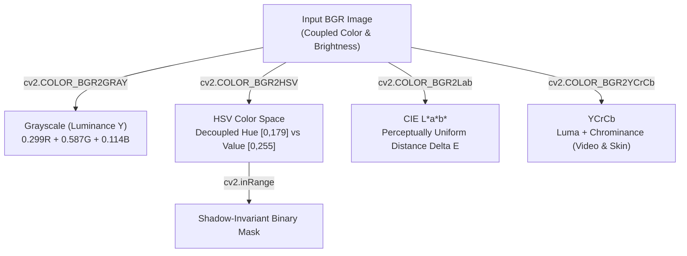
```mermaid
flowchart TD
    BGR["Input BGR Image\n(Coupled Color & Brightness)"] -->|cv2.COLOR_BGR2GRAY| GRAY["Grayscale (Luminance Y)\n0.299R + 0.587G + 0.114B"]
    BGR -->|cv2.COLOR_BGR2HSV| HSV["HSV Color Space\nDecoupled Hue [0,179] vs Value [0,255]"]
    BGR -->|cv2.COLOR_BGR2Lab| LAB["CIE L*a*b*\nPerceptually Uniform Distance Delta E"]
    BGR -->|cv2.COLOR_BGR2YCrCb| YCRCB["YCrCb\nLuma + Chrominance (Video & Skin)"]
    HSV -->|cv2.inRange| MASK["Shadow-Invariant Binary Mask"]
```

### Important OpenCV Functions & Syntax
```python
# Convert between color spaces
gray = cv2.cvtColor(img_bgr, cv2.COLOR_BGR2GRAY)
hsv  = cv2.cvtColor(img_bgr, cv2.COLOR_BGR2HSV)
lab  = cv2.cvtColor(img_bgr, cv2.COLOR_BGR2Lab)
ycrcb = cv2.cvtColor(img_bgr, cv2.COLOR_BGR2YCrCb)

# Range-based thresholding (binary segmentation)
# Output mask has 255 where lower_bound <= pixel <= upper_bound, 0 elsewhere
mask = cv2.inRange(hsv, lower_bound, upper_bound)
```

### Visual Demonstration & Color Decomposition
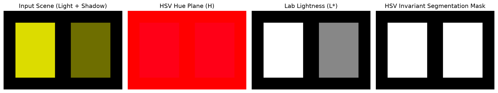

### Executable Python Example
```python
import cv2
import numpy as np
import matplotlib.pyplot as plt

# 1. Create synthetic scene: A yellow hazard object partially covered in shadow
scene = np.zeros((200, 300, 3), dtype=np.uint8)
# Sunlight region: Bright yellow (BGR: 0, 220, 220)
scene[30:170, 30:130] = (0, 220, 220)
# Shadow region: Dark yellow with half intensity (BGR: 0, 110, 110)
scene[30:170, 170:270] = (0, 110, 110)

# 2. Convert to HSV and Lab color spaces
hsv = cv2.cvtColor(scene, cv2.COLOR_BGR2HSV)
lab = cv2.cvtColor(scene, cv2.COLOR_BGR2Lab)

# 3. Robust HSV Segmentation: Isolate Yellow based on Hue (20 to 35 in OpenCV)
# Even though intensity (V) drops in the shadow, Hue remains ~30!
lower_yellow = np.array([20, 100, 50], dtype=np.uint8)
upper_yellow = np.array([35, 255, 255], dtype=np.uint8)
hsv_mask = cv2.inRange(hsv, lower_yellow, upper_yellow)

# 4. Display all planes side-by-side
fig, axs = plt.subplots(1, 4, figsize=(14, 3.5))
axs[0].imshow(cv2.cvtColor(scene, cv2.COLOR_BGR2RGB))
axs[0].set_title("Input (Bright + Shadow)")
axs[1].imshow(hsv[:, :, 0], cmap="hsv")
axs[1].set_title("HSV Hue (Constant!)")
axs[2].imshow(lab[:, :, 0], cmap="gray")
axs[2].set_title("Lab Lightness L*")
axs[3].imshow(hsv_mask, cmap="gray")
axs[3].set_title("Shadow-Invariant Mask")
for ax in axs: ax.axis("off")
plt.tight_layout()
plt.show()

print(f"Segmented pixel count: {{cv2.countNonZero(hsv_mask)}} (Both regions captured perfectly!)")
```

### Line-by-Line Explanation
1. `scene[30:170, 30:130] = (0, 220, 220)` creates a bright yellow square, and `scene[30:170, 170:270] = (0, 110, 110)` creates a shadowed version with identical chromaticity but lower intensity.
2. `cv2.cvtColor(scene, cv2.COLOR_BGR2HSV)` transforms the image into Hue, Saturation, and Value channels.
3. `lower_yellow = np.array([20, 100, 50])`: We define a lower bound where Hue is at least 20 (yellow range) and Value is as low as 50 (allowing shadowed pixels).
4. `cv2.inRange(hsv, lower_yellow, upper_yellow)` tests every pixel. If all three HSV channels fall within bounds, the output pixel is set to $255$; otherwise $0$.

### Common Mistakes & Important Tips
- **The Red Hue Singularity:** Red light lies at $0^\circ$ on the color circle. Because the spectrum wraps around from $360^\circ$ back to $0^\circ$, red in OpenCV spans **two separate ranges**: $[0, 10]$ and $[170, 180]$. To segment red objects cleanly, you must create two masks and combine them using `cv2.bitwise_or()`:
  ```python
  mask1 = cv2.inRange(hsv, np.array([0, 120, 70]), np.array([10, 255, 255]))
  mask2 = cv2.inRange(hsv, np.array([170, 120, 70]), np.array([180, 255, 255]))
  red_mask = cv2.bitwise_or(mask1, mask2)
  ```
- **Ignoring Low-Saturation Noise:** When an image is nearly grayscale or white/black (Saturation $S \approx 0$ or Value $V \approx 0$), Hue values become mathematically undefined and noisy. Always set a minimum Saturation ($S > 50$) and Value ($V > 50$) threshold when filtering by Hue.

### Real-World & Robotics Perception Relevance
- **Autonomous Road Lane Detection:** Road perception systems convert forward camera frames into $L^*a^*b^*$ and $HLS$. White lane markings are detected using the $L^*$ channel (Lightness), while yellow center-lines are detected using the $b^*$ channel (Blue-Yellow axis).
- **Warehouse Robot Guidance:** AGVs (Automated Guided Vehicles) track colored tape paths (yellow, green, cyan) painted on factory floors regardless of changing shadows from overhead skylights.

### Interview Questions & Detailed Answers
1. **Q: Why is CIE $L^*a^*b^*$ preferred over BGR for automated industrial quality inspection?**
   - *Answer:* BGR is not perceptually uniform: moving a Euclidean distance of 10 units in BGR space in the green direction creates a much larger visible difference to human inspectors than 10 units in the blue direction. CIE $L^*a^*b^*$ is specifically normalized such that Euclidean distance $\Delta E^*$ correlates linearly with human perceptual difference, making thresholding thresholds uniform across all colors.
2. **Q: Why does standard BGR thresholding fail under shadows, and how does HSV solve it?**
   - *Answer:* In BGR, a shadow scales all three color components $(R, G, B)$ down simultaneously, shifting the pixel outside a static BGR bounding box. In HSV, shadow primarily affects the Value ($V$) channel, while the Hue ($H$) channel (the fundamental chromatic wavelength) remains nearly constant.

### Mini Exercise with Solution
**Task:** Write a Python function that isolates pure red traffic cones from an image by computing the union of the two red hue boundary bands.

```python
import cv2
import numpy as np

def segment_red_cones(bgr_image: np.ndarray) -> np.ndarray:
    hsv = cv2.cvtColor(bgr_image, cv2.COLOR_BGR2HSV)
    
    # Lower red band: 0 to 10
    lower_red1 = np.array([0, 100, 100], dtype=np.uint8)
    upper_red1 = np.array([10, 255, 255], dtype=np.uint8)
    mask1 = cv2.inRange(hsv, lower_red1, upper_red1)
    
    # Upper red band: 170 to 180
    lower_red2 = np.array([170, 100, 100], dtype=np.uint8)
    upper_red2 = np.array([180, 255, 255], dtype=np.uint8)
    mask2 = cv2.inRange(hsv, lower_red2, upper_red2)
    
    # Combine both masks
    complete_red_mask = cv2.bitwise_or(mask1, mask2)
    return complete_red_mask
```

---

## 5. Image Manipulation

### Definition & Intuitive Analogy
Image manipulation refers to low-level spatial and logical operations performed on image matrices: extracting Regions of Interest (ROI), bitwise masking, alpha blending, padding, and resizing.

> **Intuitive Analogy:** Think of bitwise masking like using painter's tape or a stencil. When painting a wall, you stick tape over the areas you want to protect. In computer vision, a binary mask acts as digital stencil tape: it allows you to copy, replace, or blend specific shapes into a background without affecting the rest of the picture.


### 💡 The Big Picture in Plain English (Beginner Friendly)

- **What is it in 1 simple sentence?** Image manipulation is digital arts and crafts: cropping regions of interest (ROI), cutting out shapes with digital stencils (masks), and pasting logos seamlessly without leaving ugly borders.
- **Why do we need this? (The Problem):** If you take a red circular logo with a black background and simply paste it onto a photo using standard addition, the black background might bleed or the colors will blend into an ugly ghosted semi-transparent blur.
- **How to picture it in your head (Mental Model):** Think of **Bitwise Masking** like painter's blue masking tape:
  1. You create a black-and-white stencil of the logo (White where the logo is, Black everywhere else).
  2. You flip the stencil (Inverted Mask) and lay it on your background picture.
  3. You punch out a black hole in the background matching the exact shape of your logo.
  4. You drop your logo into that custom black hole. Since $0 + 	ext{Color} = 	ext{Color}$, the logo fits like a laser-cut jigsaw puzzle piece with zero halo fringes!
- **Step-by-Step Walkthrough with Easy Numbers:**
  - Background pixel = $200$ (bright gray). Logo pixel = $150$ (blue).
  - Stencil mask = $0$ (hole). Inverted mask = $255$.
  - Step 1: Punch background: $200 	ext{ AND } 0 = \mathbf{0}$ (black cavity).
  - Step 2: Combine: $0 + 150 = \mathbf{150}$ (clean logo color, zero bleed!).
- **Beginner Trap & Rule of Thumb:** Pasting an ROI outside image boundaries throws a shape mismatch error. Always check that `y + h <= img.shape[0]` and `x + w <= img.shape[1]`.

### Why It Is Important
Every perception pipeline manipulates images: cropping faces from video frames, overlaying HUD telemetry on pilot displays, inserting synthetic data augmentations, and padding rectangular camera frames into square aspect ratios for deep learning models (like YOLO).

### Core Concept & Mathematical Intuition

#### 1. Alpha Blending (Linear Interpolation)
To blend a foreground image $I_1$ smoothly onto a background $I_2$, we compute a weighted sum:
$$I_{{\text{{out}}}}(x, y) = \alpha \cdot I_1(x, y) + \beta \cdot I_2(x, y) + \gamma$$

Where $\alpha \in [0.0, 1.0]$ is the foreground opacity, $\beta = 1.0 - \alpha$ is the background transparency, and $\gamma$ is an optional scalar brightness offset.

#### 2. Bitwise Boolean Matrix Operations
Bitwise operations evaluate binary logic on each bit of each pixel byte ($0$ to $255$):
- **Bitwise AND (`cv2.bitwise_and`):** $A \land B$. Pixel is retained only where both inputs are non-zero. Used to extract an object using a binary mask ($I \land M$).
- **Bitwise OR (`cv2.bitwise_or`):** $A \lor B$. Combines features from two images.
- **Bitwise NOT (`cv2.bitwise_not`):** $\neg A = 255 - A$. Inverts a binary mask ($0 \leftrightarrow 255$).
- **Bitwise XOR (`cv2.bitwise_xor`):** $A \oplus B$. Highlights differences between two images (returns 0 where pixels match).

### Bitwise Masking Pipeline Flowchart
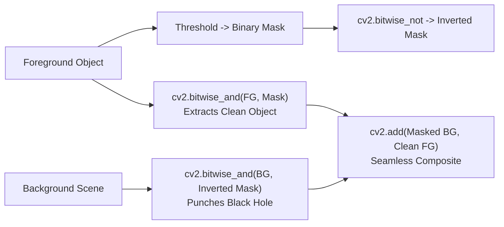
```mermaid
flowchart LR
    FG["Foreground Object"] --> M1["Threshold -> Binary Mask"]
    M1 --> M2["cv2.bitwise_not -> Inverted Mask"]
    BG["Background Scene"] --> P1["cv2.bitwise_and(BG, Inverted Mask)\nPunches Black Hole"]
    FG --> P2["cv2.bitwise_and(FG, Mask)\nExtracts Clean Object"]
    P1 --> ADD["cv2.add(Masked BG, Clean FG)\nSeamless Composite"]
    P2 --> ADD
```

### Important OpenCV Functions & Syntax
```python
# Alpha Blending / Weighted Addition
blended = cv2.addWeighted(src1, alpha, src2, beta, gamma)

# Bitwise Masking Operations
masked_fg = cv2.bitwise_and(src1, src2, mask=binary_mask)
inv_mask  = cv2.bitwise_not(binary_mask)

# Adding borders / padding
padded = cv2.copyMakeBorder(
    src, top, bottom, left, right,
    borderType=cv2.BORDER_CONSTANT, value=[114, 114, 114]
)

# Spatial Resizing
resized = cv2.resize(src, dsize=(new_width, new_height), interpolation=cv2.INTER_LINEAR)
```

### Visual Demonstration & Bitwise Logic Pipeline
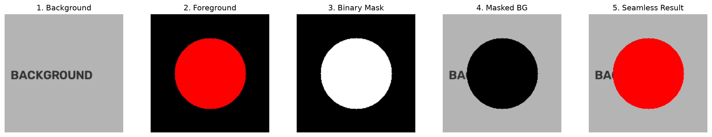

### Executable Python Example
```python
import cv2
import numpy as np
import matplotlib.pyplot as plt

# 1. Background scene: Light gray canvas with text
bg = np.full((200, 200, 3), 180, dtype=np.uint8)
cv2.putText(bg, "BACKGROUND", (15, 110), cv2.FONT_HERSHEY_SIMPLEX, 0.7, (40, 40, 40), 2)

# 2. Foreground object: Solid Red circular logo on black canvas
fg = np.zeros((200, 200, 3), dtype=np.uint8)
cv2.circle(fg, (100, 100), 55, (0, 0, 255), thickness=-1)

# 3. Create a clean binary mask of the logo (Threshold the grayscale image)
fg_gray = cv2.cvtColor(fg, cv2.COLOR_BGR2GRAY)
_, mask = cv2.threshold(fg_gray, 10, 255, cv2.THRESH_BINARY)
mask_inv = cv2.bitwise_not(mask) # Inverted mask for the background hole

# 4. Step-by-Step Seamless Integration Pipeline
# a. Punch a black hole in the background matching the logo shape
bg_hole = cv2.bitwise_and(bg, bg, mask=mask_inv)
# b. Extract only the red logo pixels (ensuring black background is 0)
fg_clean = cv2.bitwise_and(fg, fg, mask=mask)
# c. Add the two together (0 + pixel = pixel)
seamless_result = cv2.add(bg_hole, fg_clean)

# 5. Display the 5-step visual pipeline
fig, axs = plt.subplots(1, 5, figsize=(16, 3.2))
axs[0].imshow(cv2.cvtColor(bg, cv2.COLOR_BGR2RGB)); axs[0].set_title("1. Background")
axs[1].imshow(cv2.cvtColor(fg, cv2.COLOR_BGR2RGB)); axs[1].set_title("2. Foreground")
axs[2].imshow(mask, cmap="gray"); axs[2].set_title("3. Mask")
axs[3].imshow(cv2.cvtColor(bg_hole, cv2.COLOR_BGR2RGB)); axs[3].set_title("4. Masked BG")
axs[4].imshow(cv2.cvtColor(seamless_result, cv2.COLOR_BGR2RGB)); axs[4].set_title("5. Composite")
for ax in axs: ax.axis("off")
plt.tight_layout()
plt.show()

print("Overlay composition completed without color bleed artifacts.")
```

### Line-by-Line Explanation
1. `fg_gray = cv2.cvtColor(fg, cv2.COLOR_BGR2GRAY)`: Converts the foreground image to grayscale so we can create a single-channel threshold mask.
2. `_, mask = cv2.threshold(fg_gray, 10, 255, cv2.THRESH_BINARY)`: Any pixel with intensity $>10$ becomes $255$ (white); background pixels remain $0$ (black).
3. `mask_inv = cv2.bitwise_not(mask)`: Inverts the mask so the circular area is $0$ and everything outside is $255$.
4. `bg_hole = cv2.bitwise_and(bg, bg, mask=mask_inv)`: Punches out a black circular hole in the background where the logo will be placed.
5. `seamless_result = cv2.add(bg_hole, fg_clean)`: Adds the black hole ($0$) to the red circle ($255$), producing a perfect composite without color fringes.

### Common Mistakes & Important Tips
- **Shape Mismatch Crashes:** `cv2.addWeighted(img1, 0.5, img2, 0.5, 0)` will crash with an assertion error if `img1` and `img2` differ by even 1 single pixel in height or width, or if their data types differ (`uint8` vs `float32`).
- **Resizing Dimension Ordering:** When calling `cv2.resize(img, (width, height))`, remember the tuple order is `(width, height)` $(W, H)$, which is the **reverse** of `img.shape[:2]` which gives $(H, W)$.

### Real-World & Robotics Perception Relevance
- **HUD & Augmented Reality Teleoperation:** Drone operators and surgical robots use `cv2.addWeighted` to overlay semi-transparent telemetry data, artificial horizon lines, and danger zones onto real-time camera feeds.
- **Letterbox Preprocessing for Neural Networks:** Object detection networks (YOLO, SSD) require fixed-size square inputs (e.g., $640 \times 640$). Rather than squishing rectangular camera frames (which distorts object aspect ratios), pipelines resize the longest edge to 640 and pad the borders using `cv2.copyMakeBorder()`.

### Interview Questions & Detailed Answers
1. **Q: Why is aspect-ratio preserving letterboxing preferred over direct resizing when feeding images to deep learning object detectors?**
   - *Answer:* Direct resizing squashes or stretches objects non-uniformly (e.g., turning a tall pedestrian into a wide box or a circular traffic sign into an ellipse). Convolutional neural network filters learn spatial aspect ratio features; severe geometric distortion reduces detection confidence. Letterboxing scales the image uniformly and pads the empty edges with a neutral color (typically gray $114$), preserving true physical proportions.
2. **Q: Why use bitwise masking instead of simple alpha blending to paste an icon with transparent regions?**
   - *Answer:* Simple alpha addition without masking blends the background of the icon into the scene, creating dark halo fringes or ghosting artifacts. Bitwise masking punches an exact silhouette hole in the background first, so that the foreground pixels are placed over pure zeros ($0$), resulting in crisp, artifact-free edges.

### Mini Exercise with Solution
**Task:** Write an automated letterbox padding function that takes any arbitrary rectangular image $(H, W)$, scales it uniformly so its longest dimension fits inside a target square size (e.g., $640 \times 640$), and centers it with constant gray padding $(114, 114, 114)$.

```python
import cv2
import numpy as np

def letterbox_image(image: np.ndarray, target_size: int = 640) -> tuple[np.ndarray, float, tuple[int, int]]:
    h, w = image.shape[:2]
    # Compute scale factor
    scale = min(target_size / h, target_size / w)
    new_w, new_h = int(w * scale), int(h * scale)
    
    # Resize image preserving aspect ratio
    resized = cv2.resize(image, (new_w, new_h), interpolation=cv2.INTER_LINEAR)
    
    # Compute padding offsets to center the image
    pad_w = (target_size - new_w) // 2
    pad_h = (target_size - new_h) // 2
    
    # Pad borders with neutral gray (114, 114, 114)
    letterboxed = cv2.copyMakeBorder(
        resized,
        top=pad_h,
        bottom=target_size - new_h - pad_h,
        left=pad_w,
        right=target_size - new_w - pad_w,
        borderType=cv2.BORDER_CONSTANT,
        value=(114, 114, 114)
    )
    return letterboxed, scale, (pad_w, pad_h)

# Test with a wide rectangular image (300 x 600)
sample = np.full((300, 600, 3), 200, dtype=np.uint8)
out_img, scale, (pw, ph) = letterbox_image(sample, target_size=640)
print(f"Letterbox output shape: {{out_img.shape}}, Scale factor: {{scale:.3f}}, Padding: ({{pw}}, {{ph}})")
```

---

## 6. Geometric Transformations

### Definition & Intuitive Analogy
A **geometric transformation** is a mathematical operation that changes the spatial positions of pixels in an image—such as scaling, translation, rotation, shearing, affine warping, or perspective projection.

> **Intuitive Analogy:** Imagine an image printed on a sheet of stretchable rubber. 
> - An **Affine transformation** is like stretching, rotating, or sliding the sheet while keeping it completely flat (parallel lines remain parallel).
> - A **Perspective transformation (Homography)** is like tilting the rubber sheet in 3D space and looking at it from an angle: objects closer to you look larger, and parallel lines (like train tracks) appear to converge toward a vanishing point on the horizon.


### 💡 The Big Picture in Plain English (Beginner Friendly)

- **What is it in 1 simple sentence?** Geometric transformations are ways of stretching, turning, sliding, or un-tilting an image so it looks flat and centered.
- **Why do we need this? (The Problem):** When you take a photo of a receipt or a document sitting on a desk from an angle, the paper looks like an angled trapezoid instead of a clean rectangle. You can't read it easily or feed it into OCR text readers until you "un-tilt" it back to a flat view.
- **How to picture it in your head (Mental Model):**
  - Imagine your picture is printed on a stretchy sheet of rubber lying on a table.
  - **Affine Transformation (3 Points):** You slide the sheet, rotate it, or stretch it across the table, but you **keep it completely flat**. Parallel lines (like railroad tracks) stay parallel.
  - **Perspective Transformation / Homography (4 Points):** You grab one edge of the rubber sheet and **tilt it into 3D space** toward your face. The edge close to you looks huge, and the far edge looks tiny. Parallel lines converge toward a vanishing point on the horizon!
  - **Backward Warping:** Why doesn't OpenCV move pixels from the old image to the new image? Because rounding numbers leaves gaps (ugly black holes!). Instead, OpenCV looks at every blank spot on the new canvas, looks backwards to find where it came from in the old image, and blends neighboring pixels cleanly.
- **Step-by-Step Walkthrough with Easy Numbers:**
  - In a 90-degree counter-clockwise rotation, new coordinate $(x', y') = (y, W - 1 - x)$.
  - Pixel at top-left $(x=0, y=0)$ moves to bottom-left $(x'=0, y'=W-1)$.
- **Beginner Trap & Rule of Thumb:** Standard `cv2.getRotationMatrix2D` rotates around the center but clips corners outside the original canvas width and height. To prevent clipping, calculate the expanded bounding box width: $W_{	ext{new}} = W|\cos	heta| + H|\sin	heta|$.

### Why It Is Important
Cameras in the real world rarely look at planar objects head-on. Geometric transformations allow vision systems to:
1. Rectify skewed images (e.g., flattening a document photographed at an angle).
2. Generate **Bird's-Eye-View (BEV)** ground-plane maps in autonomous driving.
3. Stabilize shaky video streams.
4. Correct optical lens distortion.

### Core Concept & Mathematical Intuition

#### 1. Affine Transformation (6 Degrees of Freedom)
An affine transformation preserves points, straight lines, and parallelism. It is defined as a $2 \times 3$ matrix:

$$\begin{{bmatrix}} x' \\ y' \end{{bmatrix}} = \mathbf{{A}} \begin{{bmatrix}} x \\ y \end{{bmatrix}} + \mathbf{{b}} = \begin{{bmatrix}} a_{{11}} & a_{{12}} \\ a_{{21}} & a_{{22}} \end{{bmatrix}} \begin{{bmatrix}} x \\ y \end{{bmatrix}} + \begin{{bmatrix}} t_x \\ t_y \end{{bmatrix}} = \begin{{bmatrix}} a_{{11}} & a_{{12}} & t_x \\ a_{{21}} & a_{{22}} & t_y \end{{bmatrix}} \begin{{bmatrix}} x \\ y \\ 1 \end{{bmatrix}}$$

- **Degrees of Freedom (DOF):** 6 unknowns ($a_{{11}}, a_{{12}}, a_{{21}}, a_{{22}}, t_x, t_y$).
- **Points Needed:** Exactly **3 non-collinear point correspondences** $(x_i, y_i) \leftrightarrow (x'_i, y'_i)$ are required to uniquely solve the system of linear equations.

#### 2. Projective Transformation / Homography (8 Degrees of Freedom)
A perspective transformation models how a planar 3D surface projects onto a 2D camera sensor under perspective view. Straight lines remain straight, but parallel lines converge:

$$\begin{{bmatrix}} x' \\ y' \\ w' \end{{bmatrix}} = \mathbf{{H}}_{{3 \times 3}} \begin{{bmatrix}} x \\ y \\ 1 \end{{bmatrix}} = \begin{{bmatrix}} h_{{11}} & h_{{12}} & h_{{13}} \\ h_{{21}} & h_{{22}} & h_{{23}} \\ h_{{31}} & h_{{32}} & h_{{33}} \end{{bmatrix}} \begin{{bmatrix}} x \\ y \\ 1 \end{{bmatrix}}$$

To convert from homogeneous coordinates back to physical pixel coordinates:
$$x_{{\text{{dest}}}} = \frac{{x'}}{{w'}} = \frac{{h_{{11}} x + h_{{12}} y + h_{{13}}}}{{h_{{31}} x + h_{{32}} y + h_{{33}}}}, \quad y_{{\text{{dest}}}} = \frac{{y'}}{{w'}} = \frac{{h_{{21}} x + h_{{22}} y + h_{{23}}}}{{h_{{31}} x + h_{{32}} y + h_{{33}}}}$$

- **Degrees of Freedom (DOF):** 8 unknowns (since the matrix $\mathbf{{H}}$ is defined up to an arbitrary scale factor, we set $h_{{33}} = 1$).
- **Points Needed:** Exactly **4 non-collinear point correspondences** are required.

### Forward Warping vs Backward Warping (Inverse Mapping)
- **Forward Warping Problem:** If you take each source pixel $(x, y)$ and compute where it lands $(x', y')$, rounding errors will cause several destination pixels to be missed completely, creating ugly black "holes" and jagged gaps.
- **Backward Warping (OpenCV Standard):** OpenCV iterates through every destination pixel $(x', y')$, computes its inverse source coordinate $(x, y) = \mathbf{{M}}^{{-1}}(x', y')$, and samples the color value using **interpolation**.

#### Interpolation Methods:
- `cv2.INTER_NEAREST`: Picks the closest pixel. Very fast, but produces jagged/blocky edges.
- `cv2.INTER_LINEAR`: Bilinear interpolation (averages the $2 \times 2$ surrounding pixels). Fast and smooth; standard default for upscaling.
- `cv2.INTER_CUBIC`: Bicubic interpolation (fits a cubic spline over $4 \times 4$ pixels). Sharper results, but slower.
- `cv2.INTER_AREA`: Resamples based on pixel area relations. **Mandatory method for downsampling** to avoid moiré aliasing.

### Geometric Transformation Architecture
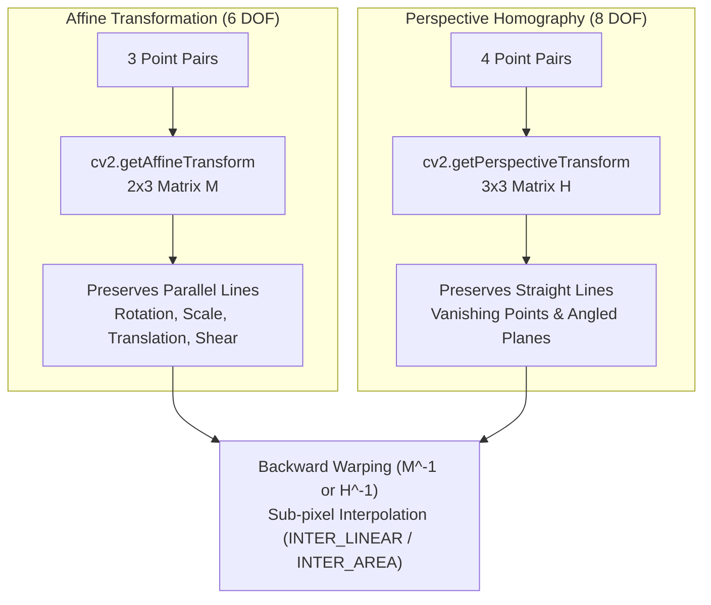
```mermaid
flowchart TD
    subgraph Affine ["Affine Transformation (6 DOF)"]
        A1["3 Point Pairs"] --> A2["cv2.getAffineTransform\n2x3 Matrix M"]
        A2 --> A3["Preserves Parallel Lines\nRotation, Scale, Translation, Shear"]
    end
    subgraph Perspective ["Perspective Homography (8 DOF)"]
        P1["4 Point Pairs"] --> P2["cv2.getPerspectiveTransform\n3x3 Matrix H"]
        P2 --> P3["Preserves Straight Lines\nVanishing Points & Angled Planes"]
    end
    A3 --> WARP["Backward Warping (M^-1 or H^-1)\nSub-pixel Interpolation (INTER_LINEAR / INTER_AREA)"]
    P3 --> WARP
```

### Important OpenCV Functions & Syntax
```python
# Compute 2x3 rotation & scaling matrix around arbitrary center
M_rot = cv2.getRotationMatrix2D(center=(cx, cy), angle=deg, scale=s)

# Compute 2x3 affine matrix from 3 point pairs
M_aff = cv2.getAffineTransform(src_pts_3x2, dst_pts_3x2)

# Compute 3x3 homography matrix from 4 point pairs
H = cv2.getPerspectiveTransform(src_pts_4x2, dst_pts_4x2)

# Execute warping (dsize must be (width, height)!)
warped_aff = cv2.warpAffine(src, M_rot, dsize=(width, height), flags=cv2.INTER_LINEAR)
warped_per = cv2.warpPerspective(src, H, dsize=(width, height), flags=cv2.INTER_LINEAR)
```

### Visual Demonstration & Warp Comparison
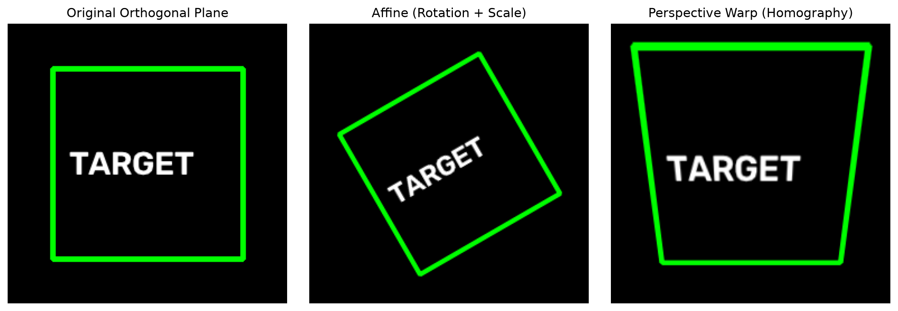

### Executable Python Example
```python
import cv2
import numpy as np
import matplotlib.pyplot as plt

# 1. Create a synthetic test target with geometry and text
grid = np.zeros((250, 250, 3), dtype=np.uint8)
cv2.rectangle(grid, (40, 40), (210, 210), (0, 255, 0), thickness=3)
cv2.putText(grid, "TARGET", (55, 135), cv2.FONT_HERSHEY_SIMPLEX, 0.9, (255, 255, 255), 2)

# 2. Affine Transformation: Rotate 30 degrees around center and scale by 0.85
center_pt = (125, 125)
M_rot = cv2.getRotationMatrix2D(center=center_pt, angle=30.0, scale=0.85)
affine_result = cv2.warpAffine(grid, M_rot, (250, 250), flags=cv2.INTER_LINEAR)

# 3. Perspective Homography: Simulate viewing the square from an angled perspective
# Define 4 source corners and 4 trapezoidal destination corners
src_pts = np.float32([[40, 40], [210, 40], [210, 210], [40, 210]])
dst_pts = np.float32([[60, 60], [190, 40], [240, 230], [20, 220]])

H = cv2.getPerspectiveTransform(src_pts, dst_pts)
perspective_result = cv2.warpPerspective(grid, H, (250, 250), flags=cv2.INTER_LINEAR)

# 4. Display comparisons
fig, axs = plt.subplots(1, 3, figsize=(12, 4))
axs[0].imshow(cv2.cvtColor(grid, cv2.COLOR_BGR2RGB)); axs[0].set_title("1. Original Square")
axs[1].imshow(cv2.cvtColor(affine_result, cv2.COLOR_BGR2RGB)); axs[1].set_title("2. Affine (Rotate + Scale)")
axs[2].imshow(cv2.cvtColor(perspective_result, cv2.COLOR_BGR2RGB)); axs[2].set_title("3. Perspective (Homography)")
for ax in axs: ax.axis("off")
plt.tight_layout()
plt.show()

print("Computed 3x3 Homography Matrix H:\n", np.round(H, 3))
```

### Line-by-Line Explanation
1. `M_rot = cv2.getRotationMatrix2D((125, 125), 30, 0.85)` builds the $2 \times 3$ affine matrix:
   $$\mathbf{{M}} = \begin{{bmatrix}} \alpha & \beta & (1-\alpha)c_x - \beta c_y \\ -\beta & \alpha & \beta c_x + (1-\alpha)c_y \end{{bmatrix}}$$
   Where $\alpha = \text{{scale}} \cdot \cos(\theta)$ and $\beta = \text{{scale}} \cdot \sin(\theta)$.
2. `src_pts` and `dst_pts`: We provide 4 matching corner coordinates as `float32` arrays.
3. `H = cv2.getPerspectiveTransform(src_pts, dst_pts)`: Solves the 8-DOF linear system using Gaussian elimination to find the unique $3 \times 3$ matrix $\mathbf{{H}}$.
4. `cv2.warpPerspective(...)`: Resamples the canvas using backward warping and bilinear interpolation.

### Common Mistakes & Important Tips
- **The `dsize` (Width, Height) Parameter Trap:** The destination size parameter in `warpAffine` and `warpPerspective` expects `(width, height)`. Passing `img.shape[:2]` (which is `(height, width)`) will squish or crop non-square images. Always write:
  ```python
  dsize = (img.shape[1], img.shape[0]) # (Width, Height)
  ```
- **Float32 Required for Point Arrays:** `cv2.getPerspectiveTransform` will throw a runtime type error if points are passed as integers. Always cast with `.astype(np.float32)` or `np.float32([...])`.

### Real-World & Robotics Perception Relevance
- **Inverse Perspective Mapping (IPM) in Self-Driving Cars:** Forward-facing dash cameras see lane lines converging into the distance. By computing a homography from the camera plane to the road plane, the image is warped into a top-down **Bird's-Eye-View (BEV)**. In BEV, lane lines are parallel and distances map linearly to meters, allowing path planners to navigate safely.
- **Mobile Document Scanning:** Apps like CamScanner detect the 4 corners of a piece of paper on a desk, compute the homography matrix $\mathbf{{H}}$, and warp the angled trapezoid into a crisp, flat rectangle.

### Interview Questions & Detailed Answers
1. **Q: Why does an Affine transformation require 3 point pairs while a Perspective transformation requires 4 point pairs?**
   - *Answer:* An affine transformation has 6 degrees of freedom (2 for translation, 1 for rotation, 2 for non-uniform scaling, 1 for shear). Each 2D point correspondence provides 2 independent linear equations ($x'$ and $y'$). Therefore, $6 / 2 = 3$ point pairs are necessary and sufficient. A perspective transformation (homography) has 8 degrees of freedom (represented by a $3 \times 3$ matrix with 9 elements, normalized by scale $h_{{33}} = 1$). Solving for 8 unknowns requires $8 / 2 = 4$ independent point pairs.
2. **Q: Why does OpenCV use backward warping (inverse mapping) instead of forward warping when executing `cv2.warpPerspective`?**
   - *Answer:* Forward mapping maps integer source coordinates $(x, y)$ to floating-point destination coordinates $(x', y')$. Rounding these coordinates creates quantization gaps (unfilled black pixels/holes) where no source pixels land, and overlaps where multiple source pixels collide. Backward mapping iterates through every valid integer pixel in the output image and uses the inverse matrix $\mathbf{{H}}^{{-1}}$ to sample the source image via sub-pixel interpolation, guaranteeing a dense, hole-free output.

### Mini Exercise with Solution
**Task:** Write a function that rotates an image around its exact center by an arbitrary angle $\theta$ while dynamically expanding the output canvas size so that **no corners are clipped or cut off**.

```python
import cv2
import numpy as np

def rotate_without_cropping(image: np.ndarray, angle_deg: float) -> np.ndarray:
    h, w = image.shape[:2]
    cx, cy = w / 2.0, h / 2.0
    
    # 1. Compute basic rotation matrix
    M = cv2.getRotationMatrix2D((cx, cy), angle_deg, scale=1.0)
    
    # 2. Extract cosine and sine absolute values
    cos = np.abs(M[0, 0])
    sin = np.abs(M[0, 1])
    
    # 3. Compute new bounding dimensions
    new_w = int((h * sin) + (w * cos))
    new_h = int((h * cos) + (w * sin))
    
    # 4. Adjust the translation components of the matrix
    M[0, 2] += (new_w / 2.0) - cx
    M[1, 2] += (new_h / 2.0) - cy
    
    # 5. Execute warp with expanded canvas
    rotated = cv2.warpAffine(image, M, (new_w, new_h), flags=cv2.INTER_LINEAR)
    return rotated

# Test rotation
test_img = np.full((100, 200, 3), 180, dtype=np.uint8)
cv2.putText(test_img, "WIDE", (30, 60), cv2.FONT_HERSHEY_SIMPLEX, 1.2, (0, 0, 255), 2)
result = rotate_without_cropping(test_img, angle_deg=45.0)
print(f"Original shape: {test_img.shape} -> Uncropped rotated shape: {result.shape}")
```

---

## 7. Image Filtering & Smoothing

### Definition & Intuitive Analogy
Image filtering is a spatial mathematical operation where a small matrix of numbers (called a **kernel** or **filter mask**) slides across an image, calculating a weighted combination of neighboring pixels to produce an output pixel.

> **Intuitive Analogy:** Think of an image filter like looking at a noisy, grainy wall through a small magnifying stencil (e.g., $3 \times 3$ pixels). At each position, you look at the 9 numbers showing through the holes, calculate their average (or a weighted score), write down that single result on a fresh canvas, and slide the stencil by one pixel.


### 💡 The Big Picture in Plain English (Beginner Friendly)

- **What is it in 1 simple sentence?** Filtering is sliding a tiny mathematical stencil (kernel) across every pixel of an image to average out noisy camera grain or sharpen blurry edges.
- **Why do we need this? (The Problem):** Real camera sensors in low light produce "snow" or static noise (salt-and-pepper pixels). If you try to find edges or track objects on a raw noisy image, your algorithms will detect thousands of fake edges caused by random noisy dots.
- **How to picture it in your head (Mental Model):**
  - **Averaging / Box Blur:** Imagine rubbing a wet paintbrush across a chalk drawing. Everything gets smoothed out, but crisp object boundaries get fuzzy and blurry.
  - **Gaussian Blur:** Instead of treating all neighbors equally, you give the center pixel the biggest vote, and nearby neighbors smaller votes according to a bell curve. It smooths natural sensor grain much more naturally than a simple average.
  - **Median Blur (The Outlier Killer):** Imagine 9 numbers in a $3 	imes 3$ grid: eight pixels are around `100`, but one dead pixel is `255` (bright white noise). An average filter would get dragged up to `117`. A **median filter** sorts the 9 numbers in a line and picks the middle one (`100`). The extreme noise outlier `255` is completely erased!
  - **Bilateral Filter (The Magic Filter):** How do you blur a person's skin to make it smooth while keeping their eyelashes and glasses razor sharp? The Bilateral filter checks two things: Are pixels close in space? AND Are they close in color? If two pixels have totally different colors (like dark hair against pale skin), the filter **refuses to blend them**, keeping edges crisp while smoothing flat surfaces!
- **Step-by-Step Walkthrough with Easy Numbers (Median vs Box):**
  - A $3 	imes 3$ neighborhood has values: $[10, 12, 10, 11, \mathbf{250}, 12, 10, 9, 11]$ (where $250$ is a noise spike).
  - Box Blur Average: $(10+12+10+11+250+12+10+9+11)/9 = 335/9 = \mathbf{37.2}$ (The noise spreads and pollutes the whole patch!).
  - Median Blur: Sort all 9 numbers: $[9, 10, 10, 10, \mathbf{11}, 12, 12, 12, 250]$. The 5th (middle) value is $\mathbf{11}$! The noise spike 250 is completely destroyed!
- **Beginner Trap & Rule of Thumb:** Filter kernel sizes MUST always be odd positive integers ($3, 5, 7, 9\dots$). An even kernel (like $4 	imes 4$) has no center pixel and causes mathematical ambiguity.

### Why It Is Important
Raw camera sensors naturally produce sensor noise (thermal noise, shot noise, and low-light grain). If you run edge detection or feature tracking on noisy raw images, the algorithms will detect hundreds of false edges caused by random noisy pixels. Filtering and smoothing is the **mandatory pre-processing step** before almost all higher-level vision algorithms.

### Core Concept & Mathematical Intuition

#### 1. 2D Discrete Spatial Convolution
Given an image $I(x, y)$ and a kernel $K$ of size $(2k+1) \times (2k+1)$, the 2D discrete convolution is:
$$(I * K)(x, y) = \sum_{i=-k}^{k} \sum_{j=-k}^{k} I(x - i, y - j) \cdot K(i, j)$$

#### 2. Key Filtering Algorithms Compared

| Filter Type | Kernel / Algorithm Concept | Best Used For | Edge Preservation |
| :--- | :--- | :--- | :--- |
| **Averaging / Box Blur** | Uniform weights: $K(i, j) = \frac{1}{N^2}$ | Fast uniform blurring | ❌ Blurs all edges |
| **Gaussian Blur** | Bell-curve weights: $G(x, y) = \frac{1}{2\pi\sigma^2} e^{-\frac{x^2+y^2}{2\sigma^2}}$ | Removing natural Gaussian noise | ❌ Softens edges |
| **Median Filter** | Replaces central pixel with statistical median of neighbors | Removing Salt-and-Pepper noise | ⚠️ Moderately preserves |
| **Bilateral Filter** | Combines spatial distance Gaussian + pixel value intensity Gaussian | Beautification & denoising | ✅ **Sharp edges preserved!** |

#### 3. Deep Dive: Bilateral Filter (Edge-Preserving Smoothing)
Standard Gaussian blur only considers geometric distance: pixels that are close together are averaged, even if one pixel is black (background) and the neighbor is white (object), causing edges to blur.

The **Bilateral Filter** adds a radiometric (color intensity) weight:
$$I_{\text{bilateral}}(x) = \frac{1}{W_p} \sum_{x_i \in \Omega} I(x_i) \cdot \underbrace{\exp\left(-\frac{\|x - x_i\|^2}{2\sigma_s^2}\right)}_{\text{Spatial Closeness Weight}} \cdot \underbrace{\exp\left(-\frac{\|I(x) - I(x_i)\|^2}{2\sigma_r^2}\right)}_{\text{Color Similarity Weight}}$$

- If two neighboring pixels have very different colors (an edge), the color similarity weight drops to zero. The filter **refuses to average across the edge**, keeping object boundaries razor-sharp while smoothing flat surfaces!

### How It Works Internally: Separable Kernels
A 2D Gaussian kernel of size $N \times N$ requires $N^2$ multiplications per pixel. However, a 2D Gaussian function is **mathematically separable**:
$$G_{2D}(x, y) = G_{1D}(x) \cdot G_{1D}(y)$$
OpenCV optimizes Gaussian blur by applying a 1D horizontal pass ($N$ operations) followed by a 1D vertical pass ($N$ operations). This reduces computational complexity from $\mathcal{O}(N^2)$ to $\mathcal{O}(2N)$ per pixel, making it massively faster!

### Important OpenCV Functions & Syntax
```python
# Box / Averaging blur (kernel size must be positive integers)
blur = cv2.blur(src, ksize=(5, 5))

# Gaussian blur (sigmaX=0 calculates sigma automatically from ksize)
gauss = cv2.GaussianBlur(src, ksize=(5, 5), sigmaX=1.5, sigmaY=1.5)

# Median blur (ksize must be an ODD integer: 3, 5, 7, etc.)
median = cv2.medianBlur(src, ksize=5)

# Bilateral filter (d = diameter, sigmaColor, sigmaSpace)
bilat = cv2.bilateralFilter(src, d=9, sigmaColor=75, sigmaSpace=75)

# Custom 2D convolution with arbitrary kernel
filtered = cv2.filter2D(src, ddepth=-1, kernel=custom_kernel)
```

### Image Filtering Architecture
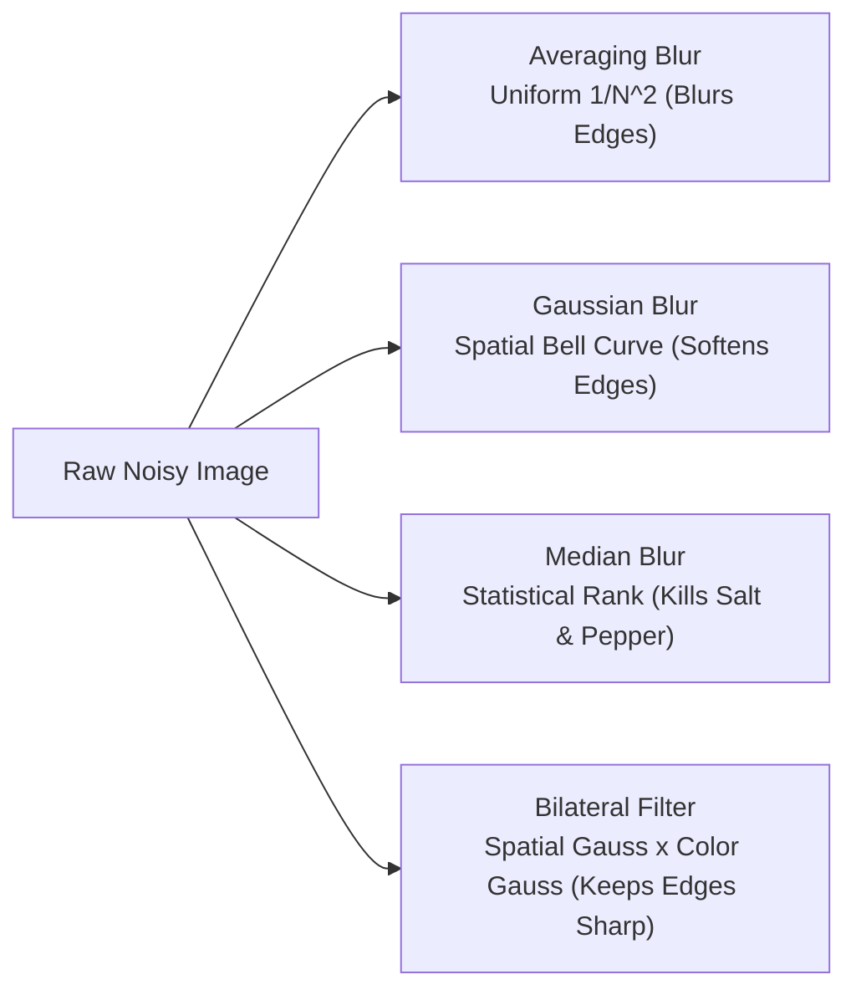
```mermaid
flowchart LR
    A["Raw Noisy Image"] --> B["Averaging Blur
Uniform 1/N^2 (Blurs Edges)"]
    A --> C["Gaussian Blur
Spatial Bell Curve (Softens Edges)"]
    A --> D["Median Blur
Statistical Rank (Kills Salt & Pepper)"]
    A --> E["Bilateral Filter
Spatial Gauss x Color Gauss (Keeps Edges Sharp)"]
```

### Visual Demonstration & Filter Comparison
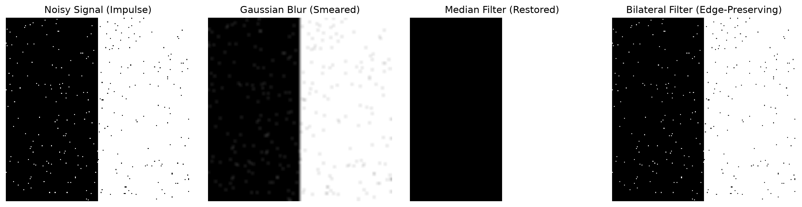

### Executable Python Example
```python
import cv2
import numpy as np
import matplotlib.pyplot as plt

# 1. Create a clean synthetic image with a sharp edge
clean = np.full((150, 150), 50, dtype=np.uint8)
clean[:, 75:] = 200 # Bright right half

# 2. Add synthetic "Salt and Pepper" noise (dead pixels)
noisy = clean.copy()
salt_coords = np.random.rand(*clean.shape) < 0.05
pepper_coords = np.random.rand(*clean.shape) < 0.05
noisy[salt_coords] = 255
noisy[pepper_coords] = 0

# 3. Apply different filters
gaussian_filtered = cv2.GaussianBlur(noisy, (5, 5), sigmaX=1.2)
median_filtered = cv2.medianBlur(noisy, 5)
bilateral_filtered = cv2.bilateralFilter(noisy, d=9, sigmaColor=150, sigmaSpace=75)

# 4. Multi-Panel Visual Comparison
fig, axs = plt.subplots(1, 4, figsize=(14, 3.5))
axs[0].imshow(noisy, cmap="gray"); axs[0].set_title("Noisy Input (Salt & Pepper)")
axs[1].imshow(gaussian_filtered, cmap="gray"); axs[1].set_title("Gaussian (Blurs Noise)")
axs[2].imshow(median_filtered, cmap="gray"); axs[2].set_title("Median (Noise Eliminated!)")
axs[3].imshow(bilateral_filtered, cmap="gray"); axs[3].set_title("Bilateral (Edge Sharp)")
for ax in axs: ax.axis("off")
plt.tight_layout()
plt.show()

print("Median filter successfully eliminated salt-and-pepper noise without blurring edge boundaries.")
```

### Line-by-Line Explanation
1. `clean[:, 75:] = 200` creates a sharp vertical step edge dividing dark gray ($50$) and bright white ($200$).
2. `noisy[salt_coords] = 255` injects $5\%$ random white pixels (salt) and $5\%$ black pixels (pepper).
3. `cv2.GaussianBlur` calculates a weighted average. Because the extreme $0$ and $255$ values are averaged into the neighbors, the noise spots become blurred smudges rather than disappearing.
4. `cv2.medianBlur(noisy, 5)` sorts all 25 pixels in the $5 \times 5$ window. Because the extreme noise values ($0$ or $255$) end up at the extreme ends of the sorted list, the central median value is clean, removing the noise completely.

### Common Mistakes & Important Tips
- **Even Kernel Sizes:** Kernel dimensions in `cv2.GaussianBlur` and `cv2.medianBlur` must be **odd positive integers** (e.g., $3, 5, 7$). An even kernel size has no central pixel and will cause an OpenCV runtime error.
- **Bilateral Filter Performance:** `cv2.bilateralFilter` is computationally expensive because it cannot be decomposed into separable 1D passes. For real-time applications ($>30$ FPS), keep $d \le 5$ or use domain transform filters.

### Real-World & Robotics Perception Relevance
- **LiDAR Depth Map Inpainting:** Raw LiDAR and time-of-flight depth cameras have missing pixels (dropouts due to dark or reflective surfaces). Median filtering cleanly fills single-pixel depth dropouts without corrupting nearby surface geometry.
- **Preprocessing for Feature Detection (ORB/SIFT):** Gaussian filtering suppresses sensor grain that would otherwise trigger thousands of unstable, noisy keypoints.

### Interview Questions & Detailed Answers
1. **Q: Why is a Median Filter dramatically more effective at removing Salt-and-Pepper noise than a Gaussian Filter?**
   - *Answer:* Salt-and-pepper noise introduces extreme outlier values ($0$ or $255$). A Gaussian filter is a linear weighted sum; extreme outliers heavily pull the average, spreading the noise into a larger blurry patch. A median filter is a non-linear rank filter: it sorts the window values and picks the middle element. Since outliers sit at the top or bottom of the sorted array, they are completely discarded from the output.
2. **Q: What is a separable filter and why does it matter for real-time vision algorithms?**
   - *Answer:* A 2D filter kernel $K$ is separable if it can be factored into the outer product of two 1D vectors: $K = \mathbf{v}_1 \mathbf{v}_2^T$. Convolving an $M 	imes N$ image with a non-separable $K 	imes K$ kernel requires $M \cdot N \cdot K^2$ multiplications. A separable filter splits this into two 1D passes requiring only $2 \cdot M \cdot N \cdot K$ operations. For a $15 	imes 15$ kernel, separable filtering is over $7.5	imes$ faster.

### Mini Exercise with Solution
**Task:** Implement a custom $3 \times 3$ Sharpening Filter using `cv2.filter2D`. (Hint: A sharpening filter subtracts the Laplacian/blur from the original image: center weight $5$, orthogonal neighbors $-1$).

```python
import cv2
import numpy as np

def sharpen_image(img: np.ndarray) -> np.ndarray:
    # Define 3x3 sharpening kernel
    sharpen_kernel = np.array([
        [ 0, -1,  0],
        [-1,  5, -1],
        [ 0, -1,  0]
    ], dtype=np.float32)
    
    # Apply 2D convolution
    sharpened = cv2.filter2D(img, ddepth=-1, kernel=sharpen_kernel)
    return sharpened

test = np.full((100, 100, 3), 128, dtype=np.uint8)
cv2.putText(test, "TEXT", (10, 60), cv2.FONT_HERSHEY_SIMPLEX, 1.0, (255, 255, 255), 2)
sharp_out = sharpen_image(test)
print(f"Image sharpened successfully. Shape: {sharp_out.shape}")
```

---

## 8. Image Enhancement

### Definition & Intuitive Analogy
Image enhancement is the collection of techniques used to adjust pixel contrast, dynamic range, and brightness to make visual details clearer to human observers and computer vision feature extractors.

> **Intuitive Analogy:** Imagine taking a photo in foggy weather or inside a dim parking garage. All pixel values are clustered together in a narrow band of dark gray numbers (e.g., between 40 and 90). Image enhancement (like Histogram Equalization) is like taking that narrow clump of numbers and stretching it out across the entire available dynamic range from 0 (pure black) to 255 (pure white).


### 💡 The Big Picture in Plain English (Beginner Friendly)

- **What is it in 1 simple sentence?** Image enhancement stretches and balances the dark and bright parts of a photo so hidden details in shadows or fog become crystal clear.
- **Why do we need this? (The Problem):** A self-driving car driving through thick fog or entering a dark tunnel captures images where all pixel numbers are squished into a narrow range (say, between 70 and 110). To the computer, everything looks like muddy gray soup.
- **How to picture it in your head (Mental Model):**
  - Think of an accordion squeezed shut: all the notes are compressed into a tiny space. Enhancement is grabbing both ends of the accordion and pulling them wide apart so every note from the lowest bass (0 pure black) to the highest treble (255 pure white) has room to breathe.
  - **Global Equalization:** Looks at the whole picture at once. If you have a dark road and a bright sky, it over-brightens the sky until it looks like a nuclear explosion while turning the road into harsh static.
  - **CLAHE (Contrast Limited Adaptive Histogram Equalization):** Cuts the image into an $8 	imes 8$ checkerboard of small tiles. It enhances the dark shadows inside each tile individually, but sets a speed limit (Clip Limit) so it never amplifies grain or noise. Then it stitches the tiles together seamlessly.
- **Step-by-Step Walkthrough with Easy Numbers:**
  - Suppose a foggy image has min pixel value $70$ and max $120$ (contrast range = $50$).
  - Linear contrast stretch: $I_{	ext{new}} = (I - 70) 	imes rac{255}{120 - 70} = (I - 70) 	imes 5.1$.
  - A pixel at $70$ becomes $0$ (deep black). A pixel at $120$ becomes $255$ (pure white). The muddy gray image instantly pops with sharp detail!
- **Beginner Trap & Rule of Thumb:** Never apply histogram equalization directly across all 3 BGR channels independently. Doing so distorts colors and turns skin green or purple! Always convert to LAB or HSV, equalize ONLY the luminance channel ($L$ or $V$), and convert back.

### Why It Is Important
Autonomous systems encounter harsh lighting: driving out of a dark tunnel into blinding noon sunlight, underwater robotic inspection, or nighttime security cameras. Without dynamic range enhancement, cameras capture underexposed or overexposed regions where vision models fail to detect objects.

### Core Concept & Mathematical Intuition

#### 1. Image Histogram
A histogram $h(k)$ counts the number of pixels in an image that have intensity value $k \in [0, 255]$:
$$h(k) = \sum_{x} \sum_{y} \mathbb{I}(I(x, y) == k)$$

#### 2. Global Histogram Equalization (HE)
Histogram equalization computes the **Cumulative Distribution Function (CDF)** of pixel intensities and uses it as a monotonic transfer function to flatten the histogram:
$$s_k = T(r_k) = (L - 1) \sum_{j=0}^{k} p_r(r_j) = \frac{255}{M \cdot N} \sum_{j=0}^{k} h(j)$$

- **Limitation:** Global HE looks at the entire image. If an image has a bright sky and a dark ground, global HE over-amplifies the sky noise and washes out subtle details.

#### 3. Contrast Limited Adaptive Histogram Equalization (CLAHE)
CLAHE is the production industry standard for contrast enhancement:
1. Divides the image into small contextual tiles (typically $8 \times 8$ grid blocks).
2. Computes the histogram for each tile.
3. **Contrast Limiting:** Clips histogram bins that exceed a clip limit (e.g., $2.0$ or $4.0$) and redistributes the clipped pixels uniformly across all bins to prevent noise amplification.
4. Equalizes each tile independently using its clipped CDF.
5. Merges tile boundaries using **bilinear interpolation** to eliminate artificial grid seams.

#### 4. Gamma Correction (Power-Law Transform)
Non-linear brightness adjustment:
$$I_{\text{out}} = 255 \cdot \left( \frac{I_{\text{in}}}{255} \right)^{\gamma}$$
- $\gamma < 1.0$: Brightens dark shadow regions while preserving highlights.
- $\gamma > 1.0$: Darkens bright regions.

### Important OpenCV Functions & Syntax
```python
# Compute 1D Histogram
hist = cv2.calcHist(images=[img], channels=[0], mask=None, histSize=[256], ranges=[0, 256])

# Global Histogram Equalization (Grayscale only!)
equalized = cv2.equalizeHist(src_gray)

# Create CLAHE object
clahe = cv2.createCLAHE(clipLimit=2.0, tileGridSize=(8, 8))
enhanced_clahe = clahe.apply(src_gray)
```

### CLAHE Enhancement Flowchart
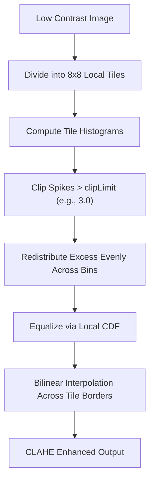
```mermaid
flowchart TD
    IMG["Low Contrast Image"] --> TILES["Divide into 8x8 Local Tiles"]
    TILES --> HIST["Compute Tile Histograms"]
    HIST --> CLIP["Clip Spikes > clipLimit (e.g., 3.0)"]
    CLIP --> REDIST["Redistribute Excess Evenly Across Bins"]
    REDIST --> CDF["Equalize via Local CDF"]
    CDF --> MERGE["Bilinear Interpolation Across Tile Borders"]
    MERGE --> OUT["CLAHE Enhanced Output"]
```

### Visual Demonstration & Contrast Comparison
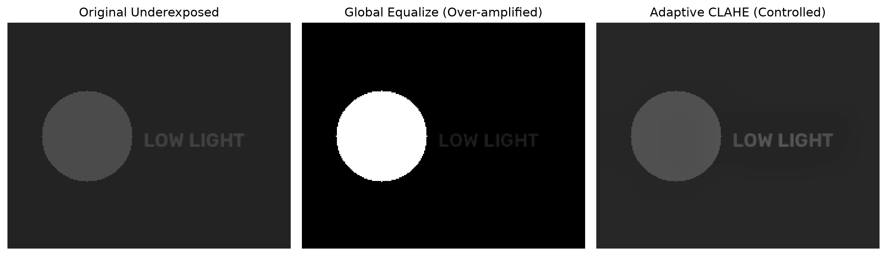

### Executable Python Example
```python
import cv2
import numpy as np
import matplotlib.pyplot as plt

# 1. Create a low-contrast synthetic image (simulating foggy, dim conditions)
# Raw pixels are squeezed into a narrow range between 60 and 120
low_contrast = np.clip(np.random.normal(90, 15, (200, 200)), 60, 120).astype(np.uint8)
cv2.circle(low_contrast, (100, 100), 40, 115, thickness=-1) # Faint circular object

# 2. Global Histogram Equalization
global_he = cv2.equalizeHist(low_contrast)

# 3. CLAHE (Contrast Limited Adaptive Histogram Equalization)
clahe_obj = cv2.createCLAHE(clipLimit=3.0, tileGridSize=(8, 8))
clahe_result = clahe_obj.apply(low_contrast)

# 4. Visual Comparison
fig, axs = plt.subplots(1, 3, figsize=(12, 4))
axs[0].imshow(low_contrast, cmap="gray", vmin=0, vmax=255); axs[0].set_title("1. Dim Low-Contrast Input")
axs[1].imshow(global_he, cmap="gray", vmin=0, vmax=255); axs[1].set_title("2. Global Equalization")
axs[2].imshow(clahe_result, cmap="gray", vmin=0, vmax=255); axs[2].set_title("3. CLAHE Enhanced")
for ax in axs: ax.axis("off")
plt.tight_layout()
plt.show()

print("CLAHE successfully enhanced local contrast while preventing noise blowout.")
```

### Line-by-Line Explanation
1. `low_contrast = ...` generates a synthetic low-contrast image where all intensities are squashed between 60 and 120.
2. `cv2.equalizeHist(low_contrast)` applies global histogram stretching. Notice how background noise is amplified because of the steep CDF slope.
3. `clahe_obj = cv2.createCLAHE(clipLimit=3.0, tileGridSize=(8, 8))` limits histogram peaks to 3.0 times the mean bin count, capping local noise amplification.
4. `clahe_obj.apply(low_contrast)` performs local tile equalization with bilinear boundary interpolation.

### Common Mistakes & Important Tips
- **Applying Equalization to BGR Directly:** Never call `cv2.equalizeHist` on individual B, G, and R channels independently! Doing so destroys the color balance and causes severe, unnatural color tint shifts.
  - **Correct Method for Color Images:** Convert BGR $\to$ $L^*a^*b^*$ or YCrCb, apply CLAHE **only to the luminance channel ($L^*$ or $Y$)**, and convert back to BGR:
    ```python
    lab = cv2.cvtColor(color_img, cv2.COLOR_BGR2Lab)
    lab[:, :, 0] = clahe.apply(lab[:, :, 0])
    enhanced_bgr = cv2.cvtColor(lab, cv2.COLOR_BGR2Lab)
    ```

### Real-World & Robotics Perception Relevance
- **Nighttime Autonomous Driving:** CLAHE applied to thermal or low-light CMOS sensors uncovers pedestrians obscured in deep shadows without blowing out oncoming headlights.
- **Medical Imaging (X-Ray & MRI):** Radiologists and automated diagnosis models use CLAHE to enhance bone micro-fractures and soft-tissue boundaries.

### Interview Questions & Detailed Answers
1. **Q: Why does applying histogram equalization directly to each channel of an RGB image cause color distortion?**
   - *Answer:* RGB channels are highly correlated. Equalizing each channel independently alters the relative ratio between Red, Green, and Blue at each pixel. Since color hue and saturation depend strictly on the ratio between channels, independent equalization shifts the hue, turning skin tones green or sky purple. Converting to $L^*a^*b^*$ and equalizing only the $L^*$ channel modifies perceived brightness while preserving true chromatic color.
2. **Q: What is the purpose of the `clipLimit` parameter in CLAHE?**
   - *Answer:* In flat, uniform regions of an image (e.g., clear sky or dark shadow), all pixels have nearly identical intensity, creating a massive spike in the local histogram. Equalizing this spike creates an extremely steep CDF slope, resulting in severe noise amplification. The `clipLimit` caps the maximum bin height, redistributes excess pixels evenly, and prevents noise amplification.

### Mini Exercise with Solution
**Task:** Write a complete color enhancement function that takes a dark BGR photograph, applies CLAHE to the $L^*$ luminance channel, and applies gamma correction ($\gamma = 0.8$) to brighten shadows.

```python
import cv2
import numpy as np

def enhance_color_image(bgr_img: np.ndarray, clip_limit: float = 2.0, gamma: float = 0.8) -> np.ndarray:
    # 1. Convert BGR to Lab color space
    lab = cv2.cvtColor(bgr_img, cv2.COLOR_BGR2Lab)
    
    # 2. Apply CLAHE to L* channel
    clahe = cv2.createCLAHE(clipLimit=clip_limit, tileGridSize=(8, 8))
    lab[:, :, 0] = clahe.apply(lab[:, :, 0])
    
    # 3. Convert back to BGR
    enhanced_bgr = cv2.cvtColor(lab, cv2.COLOR_Lab2BGR)
    
    # 4. Apply Gamma correction lookup table
    inv_gamma = 1.0 / gamma
    table = np.array([((i / 255.0) ** inv_gamma) * 255 for i in np.arange(0, 256)]).astype(np.uint8)
    final_output = cv2.LUT(enhanced_bgr, table)
    return final_output
```

---

## 9. Image Thresholding

### Definition & Intuitive Analogy
**Thresholding** is the fundamental segmentation method that converts a grayscale image into a binary image (black and white, $0$ and $255$) by comparing pixel intensities against a cutoff threshold value $T$.

> **Intuitive Analogy:** Imagine sorting objects into two boxes based on height. If an object is taller than a line drawn on the wall ($T$), it goes into the White Box ($255$). If it is shorter, it goes into the Black Box ($0$). 


### 💡 The Big Picture in Plain English (Beginner Friendly)

- **What is it in 1 simple sentence?** Thresholding is drawing a strict cutoff line: any pixel brighter than the line turns pure white (255), and anything darker turns pure black (0).
- **Why do we need this? (The Problem):** Computers don't want to analyze 256 different shades of gray when trying to read text or count black screws on a conveyor belt. They just want a clean 1-bit silhouette: Is this pixel the object (White) or the background (Black)?
- **How to picture it in your head (Mental Model):**
  - A nightclub bouncer with a strict height requirement: If you are $\ge 127	ext{ cm}$, you get inside (255 White). If $< 127	ext{ cm}$, you are turned away (0 Black).
  - **Otsu's Thresholding (The Smart Bouncer):** What if you don't know where to set the cutoff? Otsu looks at the image histogram (which looks like two mountain peaks: dark object and bright background) and automatically finds the deepest valley between them.
  - **Adaptive Thresholding (The Local Bouncer):** What if someone takes a photo of a document with a shadow falling across the bottom-right corner? A global cutoff will turn the whole shadowed corner pure black. Adaptive thresholding calculates a custom cutoff for every single pixel based on its immediate neighbors!
- **Step-by-Step Walkthrough with Easy Numbers:**
  - Pixel $P = 130$.
  - Global Threshold $T = 127$: Since $130 \ge 127$, $P_{	ext{out}} = \mathbf{255}$.
  - In a shadowed corner, local neighbors average $90$. Adaptive threshold sets local $T_{	ext{local}} = 90 - 5 = 85$. A pixel at $88$ is brighter than its dark surroundings, so it turns $\mathbf{255}$ (text is saved instead of being swallowed by shadow!).
- **Beginner Trap & Rule of Thumb:** Otsu's thresholding assumes a bimodal histogram (two distinct peaks). If the lighting is completely uneven or gradient across the frame, Otsu fails. Use Adaptive Thresholding instead.

### Why It Is Important
Thresholding separates **foreground objects of interest** (e.g., text on a page, laser spots, road lane markings, industrial defects) from background noise, creating clean binary masks needed for contour analysis and object counting.

### Core Concept & Mathematical Intuition

#### 1. Standard Global Thresholding Types
Given a threshold $T$:
- **`THRESH_BINARY`:** $\quad I_{\text{out}}(x, y) = \begin{cases} \text{maxVal} & \text{if } I(x, y) > T \\ 0 & \text{otherwise} \end{cases}$
- **`THRESH_BINARY_INV`:** $\quad I_{\text{out}}(x, y) = \begin{cases} 0 & \text{if } I(x, y) > T \\ \text{maxVal} & \text{otherwise} \end{cases}$
- **`THRESH_TRUNC`:** $\quad I_{\text{out}}(x, y) = \begin{cases} T & \text{if } I(x, y) > T \\ I(x, y) & \text{otherwise} \end{cases}$
- **`THRESH_TOZERO`:** $\quad I_{\text{out}}(x, y) = \begin{cases} I(x, y) & \text{if } I(x, y) > T \\ 0 & \text{otherwise} \end{cases}$

#### 2. Otsu's Bimodal Thresholding (Automatic Global Threshold)
Instead of guessing $T$, Otsu's algorithm automatically computes the optimal threshold by minimizing the **intra-class variance** $\sigma_w^2(T)$ (or maximizing inter-class variance $\sigma_b^2(T)$) across the bimodal intensity histogram:

$$\sigma_b^2(T) = \omega_0(T) \cdot \omega_1(T) \cdot \left[ \mu_0(T) - \mu_1(T) \right]^2$$

Where $\omega_0, \omega_1$ are probabilities of the two classes and $\mu_0, \mu_1$ are their mean intensity levels.

#### 3. Adaptive Thresholding (Handling Uneven Lighting & Shadows)
When an image has shadows or non-uniform illumination, a single global threshold $T$ fails. Adaptive thresholding calculates an individual threshold $T(x, y)$ for **every single pixel** based on its local $B \times B$ neighborhood:

$$T(x, y) = \mu_{\text{local}}(x, y) - C$$

- **`ADAPTIVE_THRESH_MEAN_C`:** $T(x, y)$ is the arithmetic mean of the $B \times B$ neighborhood minus constant $C$.
- **`ADAPTIVE_THRESH_GAUSSIAN_C`:** $T(x, y)$ is the Gaussian-weighted sum of the neighborhood minus constant $C$.

### Important OpenCV Functions & Syntax
```python
# Fixed threshold or Otsu's thresholding
ret_val, binary_img = cv2.threshold(
    src_gray, thresh=127, maxval=255, type=cv2.THRESH_BINARY
)

# Otsu's automatic thresholding (combine flag with cv2.THRESH_OTSU)
ret_val, otsu_img = cv2.threshold(
    src_gray, thresh=0, maxval=255, type=cv2.THRESH_BINARY + cv2.THRESH_OTSU
)

# Adaptive Thresholding (blockSize must be odd: 3, 5, 11, etc.)
adaptive_img = cv2.adaptiveThreshold(
    src_gray, maxValue=255,
    adaptiveMethod=cv2.ADAPTIVE_THRESH_GAUSSIAN_C,
    thresholdType=cv2.THRESH_BINARY,
    blockSize=11, C=2
)
```

### Thresholding Selection Pipeline
```mermaid
flowchart TD
    INPUT["Grayscale Image"] --> DECISION{"Illumination Uniform?"}
    DECISION -->|Yes| OTSU["cv2.THRESH_OTSU
Maximizes Between-Class Variance"]
    DECISION -->|No (Shadows/Gradients)| ADAPTIVE["cv2.adaptiveThreshold
Dynamic Threshold per Pixel = Local Mean - C"]
    OTSU --> BINARY["Clean Binary Mask (0 or 255)"]
    ADAPTIVE --> BINARY
```

### Visual Demonstration & Thresholding Comparison
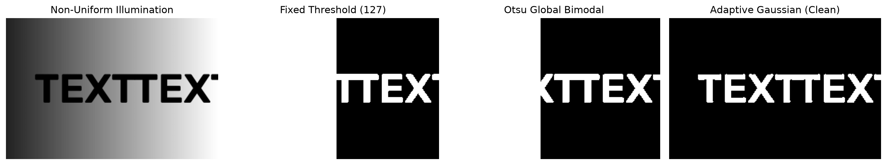

### Executable Python Example
```python
import cv2
import numpy as np
import matplotlib.pyplot as plt

# 1. Create a synthetic document image with a severe lighting gradient (shadow)
doc = np.full((200, 300), 230, dtype=np.uint8)
# Add a diagonal shadow gradient from top-left (dark=50) to bottom-right (bright=230)
gradient = np.linspace(50, 230, 300, dtype=np.uint8)
doc = np.tile(gradient, (200, 1))

# Draw black text on the document
cv2.putText(doc, "PERCEPTION", (30, 110), cv2.FONT_HERSHEY_SIMPLEX, 1.2, 0, 3)

# 2. Global Fixed Thresholding (Fails due to shadow)
_, global_thresh = cv2.threshold(doc, 127, 255, cv2.THRESH_BINARY)

# 3. Otsu's Automatic Thresholding (Still fails globally)
_, otsu_thresh = cv2.threshold(doc, 0, 255, cv2.THRESH_BINARY + cv2.THRESH_OTSU)

# 4. Adaptive Gaussian Thresholding (Handles shadow perfectly!)
adaptive_thresh = cv2.adaptiveThreshold(
    doc, 255, cv2.ADAPTIVE_THRESH_GAUSSIAN_C, cv2.THRESH_BINARY, blockSize=15, C=4
)

# 5. Visual Comparison
fig, axs = plt.subplots(1, 4, figsize=(15, 3.5))
axs[0].imshow(doc, cmap="gray"); axs[0].set_title("1. Shadowed Document")
axs[1].imshow(global_thresh, cmap="gray"); axs[1].set_title("2. Fixed (Cutoff=127)")
axs[2].imshow(otsu_thresh, cmap="gray"); axs[2].set_title("3. Otsu Threshold")
axs[3].imshow(adaptive_thresh, cmap="gray"); axs[3].set_title("4. Adaptive Gaussian")
for ax in axs: ax.axis("off")
plt.tight_layout()
plt.show()

print("Adaptive thresholding successfully extracted text across all lighting zones.")
```

### Line-by-Line Explanation
1. `doc = np.tile(gradient, (200, 1))` simulates non-uniform illumination where the left side of the paper is in dark shadow ($50$) and the right side is bright ($230$).
2. `cv2.threshold(doc, 127, 255, ...)` applies a static cutoff at 127. Everything on the left is $<127$ so the entire left half turns completely black, wiping out the text.
3. `cv2.adaptiveThreshold(..., blockSize=15, C=4)` calculates the threshold dynamically within a $15 \times 15$ local window around each pixel. On the dark left side, the local threshold automatically drops to $\approx 46$; on the bright right side, it automatically rises to $\approx 226$. Text is extracted cleanly everywhere.

### Common Mistakes & Important Tips
- **Pre-Filtering Before Otsu:** Otsu's thresholding assumes a clean bimodal histogram (two distinct peaks). High-frequency noise creates random intermediate values that degrade Otsu's accuracy. **Always apply a light Gaussian blur (`cv2.GaussianBlur(img, (5, 5), 0)`) before calling Otsu.**
- **`blockSize` Must Be Odd:** In `cv2.adaptiveThreshold`, `blockSize` defines the square neighborhood dimension and must be an **odd integer $>1$** ($3, 5, 7, 11, 21$).

### Real-World & Robotics Perception Relevance
- **Barcode & QR Code Scanning:** Mobile robots and warehouse barcode scanners use adaptive thresholding to decode barcodes printed on crumpled, unevenly lit cardboard boxes.
- **Automated Optical Inspection (AOI):** Semiconductor chip inspection uses Otsu thresholding to segment solder joints and detect bridging defects.

### Interview Questions & Detailed Answers
1. **Q: How does Otsu's method mathematically determine the optimal threshold value?**
   - *Answer:* Otsu's algorithm iterates through all 256 possible threshold candidates $T \in [0, 255]$. For each candidate $T$, it splits the histogram into two classes: background $C_0$ and foreground $C_1$. It calculates the between-class variance $\sigma_b^2(T) = \omega_0(T)\omega_1(T)[\mu_0(T) - \mu_1(T)]^2$. The optimal threshold $T^*$ is the exact intensity that maximizes $\sigma_b^2(T)$, maximizing the statistical separation between the two clusters.
2. **Q: When would Adaptive Thresholding fail or produce undesirable results compared to Global Thresholding?**
   - *Answer:* In completely uniform, blank regions of an image (e.g., an empty white page with no text), adaptive thresholding will still compute local averages and subtract $C$. This forces subtle sensor noise fluctuations in the blank paper to be thresholded into noisy black speckles.

### Mini Exercise with Solution
**Task:** Write a function that takes a grayscale image with uneven lighting, applies Gaussian filtering, computes Otsu's threshold value, prints the calculated threshold $T$, and returns the segmented binary mask.

```python
import cv2
import numpy as np

def clean_otsu_pipeline(gray_img: np.ndarray) -> tuple[int, np.ndarray]:
    # 1. Smooth high-frequency noise
    blurred = cv2.GaussianBlur(gray_img, (5, 5), 0)
    
    # 2. Compute Otsu threshold
    optimal_t, binary_mask = cv2.threshold(
        blurred, 0, 255, cv2.THRESH_BINARY + cv2.THRESH_OTSU
    )
    return int(optimal_t), binary_mask
```

---

## 10. Image Gradients & Edge Detection

### Definition & Intuitive Analogy
An **image gradient** measures the directional change in pixel intensity at a given location. **Edge detection** is the process of identifying boundary pixels where image brightness jumps sharply.

> **Intuitive Analogy:** Imagine an image as a 3D topographic terrain map where height represents pixel brightness. A flat plateau has a gradient of zero. A steep mountain cliff has a massive gradient. Edge detectors are mathematical hikers looking for the steepest cliffs in the landscape.


### 💡 The Big Picture in Plain English (Beginner Friendly)

- **What is it in 1 simple sentence?** An edge is a place in a picture where brightness changes suddenly; edge detection turns a rich photograph into a clean line drawing of object outlines.
- **Why do we need this? (The Problem):** Colors and textures can change when the sun moves, but the physical boundaries of an object (like the edge of a road or the outline of a pedestrian) remain in the exact same place. Edge detection throws away 95% of useless color data and keeps only the structural shapes.
- **How to picture it in your head (Mental Model):**
  - Imagine walking on a flat field. Your altitude gradient is zero. Suddenly, you reach a steep cliff—in one step, the ground drops 100 feet! That sudden jump is a **gradient**. Edge detection measures how steep the cliff is.
  - **The 4 Steps of Canny Edge Detection:**
    1. **Gaussian Blur:** Smooth out tiny pebbles so you don't trip on sensor noise.
    2. **Sobel Slopes:** Measure the gradient slope in both $X$ (horizontal) and $Y$ (vertical) directions.
    3. **Non-Maximum Suppression (The Edge Thinner):** A blurred edge might be 5 pixels wide. Canny checks along the slope direction: *"Am I the tallest pixel on this ridge?"*. If yes, keep it; if no, set it to 0. This thins wide ridges into razor-sharp 1-pixel lines!
    4. **Hysteresis Thresholding (Strong Rescues Weak):** Uses two cutoffs (High and Low). Pixels above High are definitely edges. Pixels between Low and High are kept ONLY IF they connect to a strong edge.
- **Step-by-Step Walkthrough with Easy Numbers:**
  - Let pixel on left $= 20$, pixel on right $= 220$.
  - Sobel horizontal gradient $G_x = 220 - 20 = \mathbf{200}$ (Huge slope = Strong edge!).
  - Gradient magnitude $= \sqrt{G_x^2 + G_y^2} = \sqrt{200^2 + 0^2} = \mathbf{200}$.
- **Beginner Trap & Rule of Thumb:** Canny threshold ratio rule of thumb: Set `high_threshold` to $2	imes$ or $3	imes$ `low_threshold` (e.g. `low=50, high=150`).

### Why It Is Important
Edges define physical object boundaries, surface creases, and material transitions. Edge maps drastically reduce redundant pixel data while preserving essential structural geometry for object recognition, lane tracking, and 3D pose estimation.

### Core Concept & Mathematical Intuition

#### 1. Spatial Image Derivatives
For a continuous function $I(x, y)$, the gradient vector $\nabla I$ points in the direction of greatest intensity increase:

$$\nabla I = \begin{bmatrix} G_x \\ G_y \end{bmatrix} = \begin{bmatrix} \frac{\partial I}{\partial x} \\ \frac{\partial I}{\partial y} \end{bmatrix}$$

- **Gradient Magnitude:** $G = \|\nabla I\| = \sqrt{G_x^2 + G_y^2} \approx |G_x| + |G_y|$
- **Gradient Orientation Angle:** $\theta = \operatorname{atan2}(G_y, G_x)$

#### 2. Discrete Derivative Kernels
Because digital images are discrete grids, derivatives are computed using convolution kernels:

- **Sobel Operator ($3 \times 3$):** Combines Gaussian smoothing with central finite differences:
  $$K_x = \begin{bmatrix} -1 & 0 & 1 \\ -2 & 0 & 2 \\ -1 & 0 & 1 \end{bmatrix}, \quad K_y = \begin{bmatrix} -1 & -2 & -1 \\ 0 & 0 & 0 \\ 1 & 2 & 1 \end{bmatrix}$$

- **Scharr Operator ($3 \times 3$):** Provides superior rotational symmetry and more accurate gradient angles than Sobel:
  $$K_x = \begin{bmatrix} -3 & 0 & 3 \\ -10 & 0 & 10 \\ -3 & 0 & 3 \end{bmatrix}, \quad K_y = \begin{bmatrix} -3 & -10 & -3 \\ 0 & 0 & 0 \\ 3 & 10 & 3 \end{bmatrix}$$

- **Laplacian (2nd Order Derivative):** Detects zero-crossings:
  $$\nabla^2 I = \frac{\partial^2 I}{\partial x^2} + \frac{\partial^2 I}{\partial y^2}, \quad K = \begin{bmatrix} 0 & 1 & 0 \\ 1 & -4 & 1 \\ 0 & 1 & 0 \end{bmatrix}$$

#### 3. The 5-Step Canny Edge Detection Algorithm
The Canny edge detector is the gold standard multi-stage edge detection pipeline:
1. **Gaussian Smoothing:** Filters out high-frequency sensor noise ($5 \times 5$ Gaussian kernel).
2. **Gradient Intensity & Direction:** Computes $G_x, G_y$, magnitude $G$, and angle $\theta$ via Sobel.
3. **Non-Maximum Suppression (NMS):** Thins thick edge ridges into 1-pixel-wide lines. For each pixel, it checks if its magnitude is the local maximum along the gradient direction $\theta$ (rounded to $0^\circ, 45^\circ, 90^\circ, 135^\circ$). If not, it is suppressed to zero.
4. **Double Thresholding:** Classifies surviving pixels using two thresholds ($T_{\text{low}}, T_{\text{high}}$):
   - **Strong Edges ($G > T_{\text{high}}$):** Definitely an edge ($255$).
   - **Weak Edges ($T_{\text{low}} \le G \le T_{\text{high}}$):** Potential edge.
   - **Non-Edges ($G < T_{\text{low}}$):** Suppressed to $0$.
5. **Edge Tracking by Hysteresis:** A weak edge pixel is retained **only if it is spatially connected to a strong edge pixel**. Isolated weak edge speckles from noise are eliminated.

### Important OpenCV Functions & Syntax
```python
# Sobel 1st derivatives (ddepth=cv2.CV_64F prevents negative underflow!)
sobel_x = cv2.Sobel(src_gray, ddepth=cv2.CV_64F, dx=1, dy=0, ksize=3)
sobel_y = cv2.Sobel(src_gray, ddepth=cv2.CV_64F, dx=0, dy=1, ksize=3)

# Laplacian 2nd derivative
laplacian = cv2.Laplacian(src_gray, ddepth=cv2.CV_64F)

# Canny Edge Detector (Recommended ratio Thresh_high : Thresh_low = 2:1 or 3:1)
edges = cv2.Canny(src_gray, threshold1=50, threshold2=150, apertureSize=3, L2gradient=True)
```

### Canny 5-Stage Edge Detection Pipeline
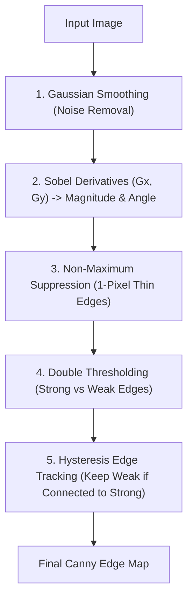
```mermaid
flowchart TD
    A["Input Image"] --> B["1. Gaussian Smoothing (Noise Removal)"]
    B --> C["2. Sobel Derivatives (Gx, Gy) -> Magnitude & Angle"]
    C --> D["3. Non-Maximum Suppression (1-Pixel Thin Edges)"]
    D --> E["4. Double Thresholding (Strong vs Weak Edges)"]
    E --> F["5. Hysteresis Edge Tracking (Keep Weak if Connected to Strong)"]
    F --> G["Final Canny Edge Map"]
```

### Visual Demonstration & Gradient Stages
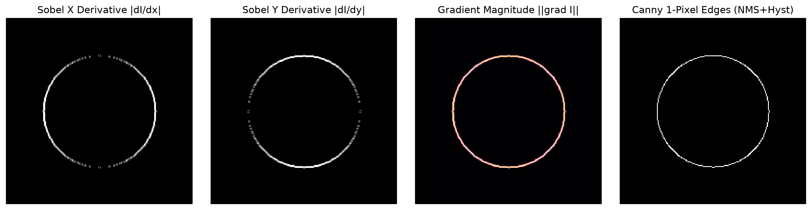

### Executable Python Example
```python
import cv2
import numpy as np
import matplotlib.pyplot as plt

# 1. Create a synthetic image with geometric shapes
canvas = np.zeros((200, 200), dtype=np.uint8)
cv2.circle(canvas, (100, 100), 50, 200, thickness=-1)
cv2.rectangle(canvas, (40, 40), (160, 160), 120, thickness=2)

# 2. Compute Sobel Gradients in float64 to preserve negative directional slopes
gx = cv2.Sobel(canvas, cv2.CV_64F, 1, 0, ksize=3)
gy = cv2.Sobel(canvas, cv2.CV_64F, 0, 1, ksize=3)
magnitude = cv2.magnitude(gx, gy)

# 3. Canny Edge Detection (Gaussian + NMS + Hysteresis)
canny_edges = cv2.Canny(canvas, 50, 150, L2gradient=True)

# 4. Multi-Panel Display
fig, axs = plt.subplots(1, 4, figsize=(14, 3.5))
axs[0].imshow(canvas, cmap="gray"); axs[0].set_title("Input Geometry")
axs[1].imshow(np.abs(gx), cmap="gray"); axs[1].set_title("Sobel |Gx| (Vertical)")
axs[2].imshow(np.abs(gy), cmap="gray"); axs[2].set_title("Sobel |Gy| (Horizontal)")
axs[3].imshow(canny_edges, cmap="gray"); axs[3].set_title("Canny (1px Thin Edges)")
for ax in axs: ax.axis("off")
plt.tight_layout()
plt.show()

print("Canny edge detector generated 1-pixel-thin continuous boundary contours.")
```

### Line-by-Line Explanation
1. `cv2.Sobel(canvas, cv2.CV_64F, 1, 0, ksize=3)`: Computes the horizontal derivative $\frac{\partial I}{\partial x}$. We use `cv2.CV_64F` (64-bit float) because transitions from white to black produce negative numbers. If we used standard `uint8`, negative numbers would be clipped to 0!
2. `cv2.magnitude(gx, gy)`: Computes the true Euclidean norm $\sqrt{G_x^2 + G_y^2}$.
3. `cv2.Canny(canvas, 50, 150, L2gradient=True)`: Executes the full Canny pipeline. `L2gradient=True` uses precise Euclidean norm instead of fast $L_1$ approximation.

### Common Mistakes & Important Tips
- **The `uint8` Sobel Truncation Bug:** If you write `sobel = cv2.Sobel(img, cv2.CV_8U, 1, 0)`, any transition from light-to-dark has a negative derivative (e.g., $-200$). Since `uint8` cannot store negative numbers, all negative slope edges are silently clamped to $0$ and vanish! Always compute in `cv2.CV_64F` and take the absolute value with `cv2.convertScaleAbs()`.
- **Canny Threshold Ratio Rule:** Set $T_{\text{high}} \approx 2 \times T_{\text{low}}$ or $3 \times T_{\text{low}}$ to achieve stable hysteresis edge tracking.

### Real-World & Robotics Perception Relevance
- **Autonomous Lane Boundary Tracking:** Lane detection algorithms run Canny edge detection on road regions of interest to extract clean linear boundaries for curve fitting.
- **Visual SLAM Feature Tracking:** Edge-based direct SLAM systems track high-gradient edge contours in textureless environments where traditional corner detectors fail.

### Interview Questions & Detailed Answers
1. **Q: Why does Canny edge detection use Non-Maximum Suppression (NMS)?**
   - *Answer:* Raw gradient operators (like Sobel) produce thick, fuzzy edge bands that span multiple pixels across a transition. Non-maximum suppression analyzes the gradient magnitude along the perpendicular gradient direction vector and retains only the single peak pixel, thinning thick edge blobs into sharp, 1-pixel-wide contours necessary for geometric modeling.
2. **Q: Explain how Hysteresis Thresholding resolves the trade-off between edge connectivity and noise rejection.**
   - *Answer:* Using a single high threshold rejects noise but creates fragmented, broken edges. Using a single low threshold keeps edges connected but introduces false noise edges. Hysteresis thresholding uses two thresholds: it starts edges only at pixels exceeding $T_{\text{high}}$ (guaranteed true edges) and traces connected paths through weak pixels exceeding $T_{\text{low}}$, ensuring continuous contours while rejecting isolated noise speckles.

### Mini Exercise with Solution
**Task:** Write an automated, parameter-free Canny edge detector function that calculates $T_{\text{low}}$ and $T_{\text{high}}$ automatically based on the statistical median of the image intensity.

```python
import cv2
import numpy as np

def auto_canny(image_gray: np.ndarray, sigma: float = 0.33) -> np.ndarray:
    # 1. Compute median pixel intensity
    v = np.median(image_gray)
    
    # 2. Derive thresholds based on median statistics
    lower = int(max(0, (1.0 - sigma) * v))
    upper = int(min(255, (1.0 + sigma) * v))
    
    # 3. Apply Canny
    edges = cv2.Canny(image_gray, lower, upper)
    return edges
```

---

## 11. Morphological Image Processing

### Definition & Intuitive Analogy
**Morphological operations** are non-linear mathematical operations that process binary (or grayscale) images based on their geometric shapes using a small probe called a **Structuring Element (Kernel)**.

> **Intuitive Analogy:** Imagine holding a small rubber stamp (the structuring element). 


### 💡 The Big Picture in Plain English (Beginner Friendly)

- **What is it in 1 simple sentence?** Morphological operations are digital sandpaper and putty: shrinking shapes to erase tiny noise specks, and expanding shapes to fill in cracks and holes.
- **Why do we need this? (The Problem):** After thresholding an image, white objects often have tiny black holes inside them, or are surrounded by isolated white "salt" noise pixels. Morphological math cleans these imperfections.
- **How to picture it in your head (Mental Model):**
  - **Erosion (Peeling an Onion):** Eats away the outer boundary of white shapes. Tiny white noise dots smaller than the kernel are completely eaten and disappear!
  - **Dilation (Inflating a Balloon):** Expands white boundaries outward. Tiny black cracks and holes inside the object get squeezed shut.
  - **Opening (Erode then Dilate):** Like sifting flour. Small dust particles vanish, while larger shapes return to their original size.
  - **Closing (Dilate then Erode):** Fills in small cracks and bridges narrow gaps between broken lines without permanently expanding the object.
  - **Morphological Gradient (Dilation minus Erosion):** Subtracting the shrunken shape from the expanded shape leaves a perfect hollow outline!
- **Step-by-Step Walkthrough with Easy Numbers:**
  - A binary $3 	imes 3$ patch: $[[1, 1, 1], [1, 0, 1], [1, 1, 1]]$ (center pixel is a black hole $0$).
  - Dilation: Since at least one neighbor under the kernel is $1$, the center pixel becomes $\mathbf{1}$ (hole is filled!).
- **Beginner Trap & Rule of Thumb:** Remember: **Opening** opens up spaces (removes white dots); **Closing** closes up holes (fills black cracks).

### Why It Is Important
After binary thresholding, masks often contain tiny noise dots, pinhole gaps, broken lines, or overlapping blobs. Morphological operations clean up binary masks, disconnect touching objects, and isolate structural features prior to contour extraction.

### Core Concept & Mathematical Intuition

#### 1. Structuring Element (SE / Kernel $B$)
A binary matrix defining the neighborhood shape:
- **`MORPH_RECT`:** Solid square/rectangle.
- **`MORPH_ELLIPSE`:** Disc/circle.
- **`MORPH_CROSS`:** Plus sign (`+`).

#### 2. Fundamental Operations: Erosion & Dilation

- **Erosion ($A \ominus B$):** Shinks the foreground object:
  $$(A \ominus B)(x, y) = \min_{(i, j) \in B} A(x + i, y + j)$$
  The output pixel is $1$ **only if the structuring element fits completely inside the object**.

- **Dilation ($A \oplus B$):** Expands the foreground object:
  $$(A \oplus B)(x, y) = \max_{(i, j) \in B} A(x - i, y - j)$$
  The output pixel is $1$ **if at least one pixel of the structuring element touches the object**.

#### 3. Advanced Compound Morphological Operations

| Operation | Mathematical Formula | Visual Action & Primary Use Case |
| :--- | :--- | :--- |
| **Opening** | $(A \ominus B) \oplus B$ (Erosion followed by Dilation) | Removes small white noise dots without altering object size |
| **Closing** | $(A \oplus B) \ominus B$ (Dilation followed by Erosion) | Bridges small black holes and cracks inside foreground objects |
| **Morphological Gradient** | $(A \oplus B) - (A \ominus B)$ | Extracts the outer boundary outline of objects |
| **Top-Hat (White Top-Hat)** | $A - (A \circ B)$ (Original minus Opening) | Isolates elements that are brighter than their surroundings |
| **Black-Hat (Black Top-Hat)** | $(A \bullet B) - A$ (Closing minus Original) | Isolates elements that are darker than their surroundings |

### Important OpenCV Functions & Syntax
```python
# Create structuring element
kernel = cv2.getStructuringElement(shape=cv2.MORPH_RECT, ksize=(5, 5))

# Basic operations
eroded  = cv2.erode(src, kernel, iterations=1)
dilated = cv2.dilate(src, kernel, iterations=1)

# Advanced morphological transformations
opened   = cv2.morphologyEx(src, cv2.MORPH_OPEN, kernel)
closed   = cv2.morphologyEx(src, cv2.MORPH_CLOSE, kernel)
gradient = cv2.morphologyEx(src, cv2.MORPH_GRADIENT, kernel)
tophat   = cv2.morphologyEx(src, cv2.MORPH_TOPHAT, kernel)
blackhat = cv2.morphologyEx(src, cv2.MORPH_BLACKHAT, kernel)
```

### Morphological Processing Flowchart
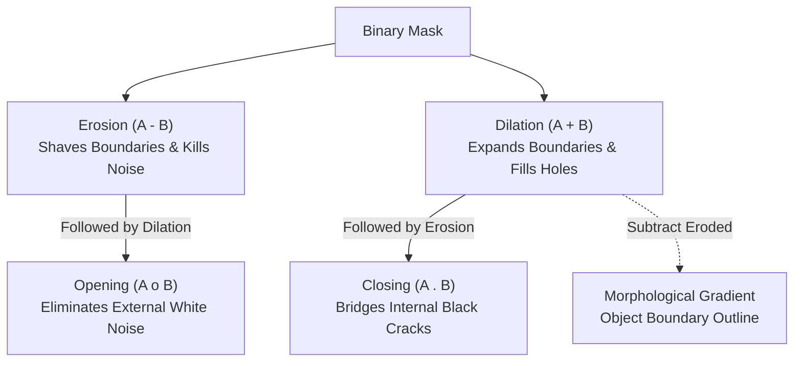
```mermaid
flowchart TD
    BIN["Binary Mask"] --> ERODE["Erosion (A - B)
Shaves Boundaries & Kills Noise"]
    BIN --> DILATE["Dilation (A + B)
Expands Boundaries & Fills Holes"]
    ERODE -->|Followed by Dilation| OPEN["Opening (A o B)
Eliminates External White Noise"]
    DILATE -->|Followed by Erosion| CLOSE["Closing (A . B)
Bridges Internal Black Cracks"]
    DILATE -.->|Subtract Eroded| GRAD["Morphological Gradient
Object Boundary Outline"]
```

### Visual Demonstration & Morphological Workflow
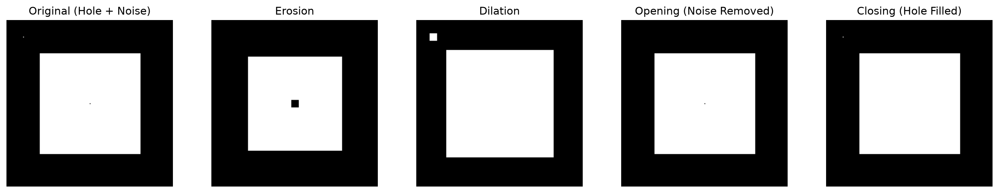

### Executable Python Example
```python
import cv2
import numpy as np
import matplotlib.pyplot as plt

# 1. Create a binary test image: A solid square corrupted with noise dots and an internal hole
binary = np.zeros((160, 160), dtype=np.uint8)
binary[30:130, 30:130] = 255
binary[70:90, 70:90] = 0 # Internal hole (crack)

# Add salt noise (spurious white dots) outside the square
binary[10, 10] = 255; binary[140, 20] = 255; binary[20, 140] = 255

# 2. Define structuring element
k = cv2.getStructuringElement(cv2.MORPH_RECT, (5, 5))

# 3. Apply Morphological Opening (removes external noise dots)
opened = cv2.morphologyEx(binary, cv2.MORPH_OPEN, k)

# 4. Apply Morphological Closing on opened result (fills internal crack)
cleaned = cv2.morphologyEx(opened, cv2.MORPH_CLOSE, k)

# 5. Extract boundary using Morphological Gradient
boundary = cv2.morphologyEx(cleaned, cv2.MORPH_GRADIENT, k)

# 6. Display visual progression
fig, axs = plt.subplots(1, 4, figsize=(14, 3.5))
axs[0].imshow(binary, cmap="gray"); axs[0].set_title("1. Noisy Input Mask")
axs[1].imshow(opened, cmap="gray"); axs[1].set_title("2. Opened (Noise Gone)")
axs[2].imshow(cleaned, cmap="gray"); axs[2].set_title("3. Closed (Hole Filled)")
axs[3].imshow(boundary, cmap="gray"); axs[3].set_title("4. Morph Gradient Outline")
for ax in axs: ax.axis("off")
plt.tight_layout()
plt.show()

print("Morphological pipeline successfully sanitized mask and extracted structural boundary.")
```

### Line-by-Line Explanation
1. `cv2.getStructuringElement(cv2.MORPH_RECT, (5, 5))` generates a $5 \times 5$ square matrix of ones.
2. `cv2.morphologyEx(binary, cv2.MORPH_OPEN, k)` runs Erosion then Dilation. Because the noise dots are smaller than $5 \times 5$, erosion wipes them out completely; dilation then restores the large central square to its original size.
3. `cv2.morphologyEx(opened, cv2.MORPH_CLOSE, k)` runs Dilation then Erosion. Dilation closes the $20 \times 20$ internal hole; erosion restores the outer boundaries.
4. `cv2.morphologyEx(cleaned, cv2.MORPH_GRADIENT, k)` subtracts the eroded mask from the dilated mask, leaving only a crisp border outline.

### Common Mistakes & Important Tips
- **Confusing Open vs Close:** Remember: **Open** removes small white objects in the background (opening a door to let noise out). **Close** fills small black holes inside objects (closing gaps in walls).
- **Choosing Kernel Shapes:** Use `cv2.MORPH_ELLIPSE` when working with biological cells, round fiducials, or organic shapes to prevent square corner distortion.

### Real-World & Robotics Perception Relevance
- **License Plate Localization:** Top-Hat morphological filtering isolates high-contrast alphanumeric characters from background vehicle bumpers under harsh lighting.
- **Robot Arm Bin Picking:** Connected component segmentation uses morphological opening to separate overlapping mechanical screws and bolts in a supply bin before calculating grasp poses.

### Interview Questions & Detailed Answers
1. **Q: Why does Morphological Opening remove small foreground noise speckles without shrinking the main object?**
   - *Answer:* Opening is defined as Erosion followed by Dilation ($A \circ B = (A \ominus B) \oplus B$). The first step (Erosion) completely erases any foreground object smaller than the structuring element. For larger objects, it only shaves off boundary pixels. The second step (Dilation) expands surviving objects by the exact same radius, restoring the primary object to its original dimensions while the erased speckles remain permanently gone.
2. **Q: How does a Morphological Gradient differ from a Sobel Gradient?**
   - *Answer:* Sobel computes linear directional spatial derivatives ($rac{\partial I}{\partial x}, rac{\partial I}{\partial y}$) and is sensitive to fine texture and intensity scale. A Morphological Gradient is a set-theoretic non-linear operator ($(I \oplus B) - (I \ominus B)$) that measures the maximum geometric span of intensity within a local neighborhood, creating uniform, non-directional boundary ridges around binary and grayscale shapes.

### Mini Exercise with Solution
**Task:** Write a function that separates two touching circular coins in a binary mask by performing iterative erosion until the bridge disconnects, followed by dilation of the separated centers.

```python
import cv2
import numpy as np

def separate_touching_objects(binary_mask: np.ndarray, kernel_size: int = 5, iterations: int = 4) -> np.ndarray:
    kernel = cv2.getStructuringElement(cv2.MORPH_ELLIPSE, (kernel_size, kernel_size))
    # Erode to disconnect bridge
    eroded = cv2.erode(binary_mask, kernel, iterations=iterations)
    # Dilate slightly to restore size while maintaining separation
    separated = cv2.dilate(eroded, kernel, iterations=iterations - 1)
    return separated
```

---

## 12. Contours & Shape Analysis

### Definition & Intuitive Analogy
A **contour** is a continuous curve joining all contiguous boundary points along an object boundary having the same color or intensity.

> **Intuitive Analogy:** Imagine tracing the silhouette of an object onto tracing paper with a pencil. Contours are those pencil outlines stored as ordered lists of $(x, y)$ coordinate points. Once you have the outline, you can calculate the object's area, perimeter, center of mass, and orientation.


### 💡 The Big Picture in Plain English (Beginner Friendly)

- **What is it in 1 simple sentence?** Contours are the continuous boundary curves outlining the shapes of white objects against a black background.
- **Why do we need this? (The Problem):** Once an object is thresholded into a white blob, you need its exact coordinates, boundary perimeter, area, center of gravity (centroid), and orientation so a robot can pick it up.
- **How to picture it in your head (Mental Model):**
  - Imagine an island in the ocean. A contour is the path a hiker walks along the exact water-to-sand coastline.
  - **Hierarchy (Parents and Children):** If the island has a donut hole (a lake inside), the outer shoreline is the "Parent" contour, and the inner lake boundary is the "Child" hole.
  - **Centroid (Center of Mass):** Image moments calculate the exact balance point where you could balance that white cutout shape on the tip of your pencil.
- **Step-by-Step Walkthrough with Easy Numbers:**
  - Area $M_{00} = 500	ext{ pixels}$.
  - First-order spatial moments: $M_{10} = 50,000$, $M_{01} = 25,000$.
  - Centroid coordinates: $C_x = rac{M_{10}}{M_{00}} = rac{50000}{500} = \mathbf{100}$, $C_y = rac{M_{01}}{M_{00}} = rac{25000}{500} = \mathbf{50}$. The center of the object is at $(100, 50)$!
- **Beginner Trap & Rule of Thumb:** `cv2.findContours` expects the object to be **White** on a **Black** background. If your target is black on white paper, you MUST invert the image (`cv2.bitwise_not`) first!

### Why It Is Important
Contour analysis is the primary method for classic geometric 2D shape classification, defect measurement, blob tracking, and computing spatial centroids for robot grasping.

### Core Concept & Mathematical Intuition

#### 1. Border Following Algorithm (Suzuki & Abe, 1985)
OpenCV's `cv2.findContours` uses Suzuki's topological border-following algorithm. It scans the binary image row-by-row, detects 1-to-0 transitions, and traces boundaries to construct a hierarchical tree of outer boundaries and inner hole boundaries.

#### 2. Contour Hierarchies Explained
Contours are returned alongside a hierarchy array of shape `(1, N, 4)` where each entry is `[Next, Previous, First_Child, Parent]`:
- **`RETR_EXTERNAL`:** Retrieves only outermost contours (ignores all internal holes).
- **`RETR_LIST`:** Retrieves all contours without establishing hierarchy relationships.
- **`RETR_CCOMP`:** Organizes contours into a 2-level hierarchy (outer boundaries and hole boundaries).
- **`RETR_TREE`:** Full nested tree hierarchy of parent-child relationships.

#### 3. Image Moments & Geometric Descriptors
Spatial moments $m_{pq}$ of a 2D contour:
$$m_{pq} = \sum_{(x, y) \in C} x^p y^q$$

- **Area:** $A = m_{00}$ (or via Green's Theorem: `cv2.contourArea(c)`)
- **Centroid (Center of Mass):**
  $$\bar{x} = \frac{m_{10}}{m_{00}}, \quad \bar{y} = \frac{m_{01}}{m_{00}}$$
- **Perimeter / Arc Length:** `cv2.arcLength(c, closed=True)`
- **Douglas-Peucker Polygon Approximation (`cv2.approxPolyDP`):**
  Reduces vertices while maintaining shape within tolerance $\epsilon = k \cdot \text{Perimeter}$.
- **Convex Hull & Defects:** Minimal convex bounding polygon enclosing all points.

### Important OpenCV Functions & Syntax
```python
# Find contours (Input image must be 8-bit single-channel binary!)
contours, hierarchy = cv2.findContours(
    binary_img, mode=cv2.RETR_TREE, method=cv2.CHAIN_APPROX_SIMPLE
)

# Draw contours (-1 draws all contours)
cv2.drawContours(canvas, contours, contourIdx=-1, color=(0, 255, 0), thickness=2)

# Geometric properties
area = cv2.contourArea(cnt)
perimeter = cv2.arcLength(cnt, closed=True)
M = cv2.moments(cnt)
cx = int(M['m10'] / M['m00']) if M['m00'] != 0 else 0
cy = int(M['m01'] / M['m00']) if M['m00'] != 0 else 0

# Bounding geometries
x, y, w, h = cv2.boundingRect(cnt) # Upright bounding box
rect = cv2.minAreaRect(cnt)        # Rotated minimum area bounding box
hull = cv2.convexHull(cnt)         # Convex Hull
approx = cv2.approxPolyDP(cnt, epsilon=0.02 * perimeter, closed=True) # Polygon
```

### Contour Extraction & Geometric Analysis
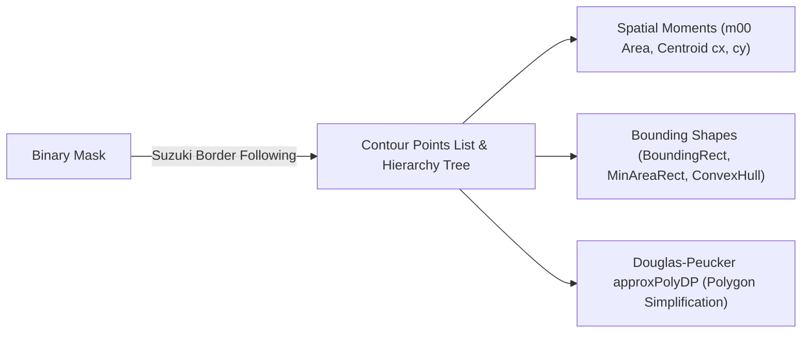
```mermaid
flowchart LR
    A["Binary Mask"] -->|Suzuki Border Following| B["Contour Points List & Hierarchy Tree"]
    B --> C["Spatial Moments (m00 Area, Centroid cx, cy)"]
    B --> D["Bounding Shapes (BoundingRect, MinAreaRect, ConvexHull)"]
    B --> E["Douglas-Peucker approxPolyDP (Polygon Simplification)"]
```

### Visual Demonstration & Contour Decomposition
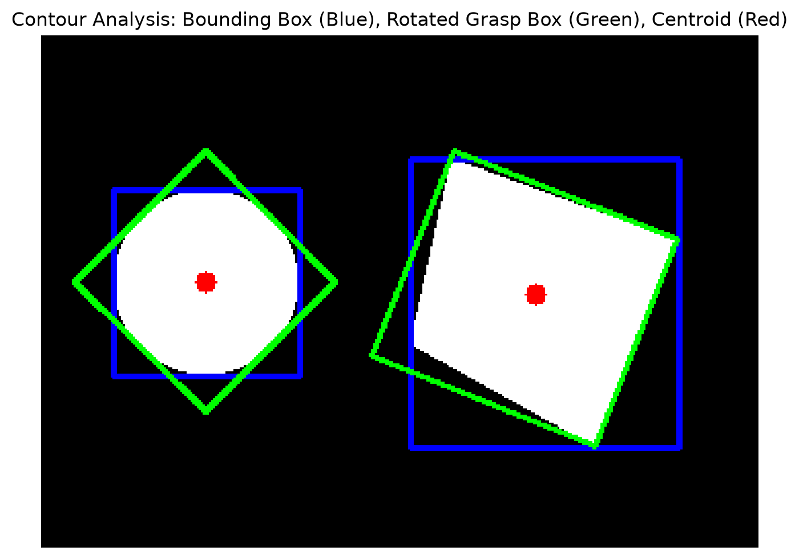

### Executable Python Example
```python
import cv2
import numpy as np
import matplotlib.pyplot as plt

# 1. Create a synthetic canvas containing a polygon shape
canvas = np.zeros((200, 200), dtype=np.uint8)
pts = np.array([[50, 40], [150, 60], [170, 160], [30, 140]], np.int32)
cv2.fillPoly(canvas, [pts], 255)

# 2. Extract Contours
contours, hierarchy = cv2.findContours(canvas, cv2.RETR_EXTERNAL, cv2.CHAIN_APPROX_SIMPLE)
cnt = max(contours, key=cv2.contourArea)

# 3. Compute Metrics
area = cv2.contourArea(cnt)
perimeter = cv2.arcLength(cnt, True)
M = cv2.moments(cnt)
cx, cy = int(M['m10'] / M['m00']), int(M['m01'] / M['m00'])

# 4. Fit Approximations and Bounding Boxes
approx_poly = cv2.approxPolyDP(cnt, epsilon=0.03 * perimeter, closed=True)
hull = cv2.convexHull(cnt)
x, y, w, h = cv2.boundingRect(cnt)

# 5. Render results
vis = cv2.cvtColor(canvas, cv2.COLOR_GRAY2BGR)
cv2.drawContours(vis, [cnt], -1, (0, 255, 0), 2) # Green Contour
cv2.circle(vis, (cx, cy), 4, (0, 0, 255), -1)    # Red Centroid
cv2.rectangle(vis, (x, y), (x + w, y + h), (255, 0, 0), 1) # Blue Bounding Box

# 6. Display Output
plt.figure(figsize=(5, 5))
plt.imshow(cv2.cvtColor(vis, cv2.COLOR_BGR2RGB))
plt.title(f"Contour | Area: {area:.0f}px | Centroid: ({cx}, {cy}) | Vertices: {len(approx_poly)}")
plt.axis("off")
plt.show()

print(f"Polygon successfully identified as {len(approx_poly)}-sided quadrilateral.")
```

### Line-by-Line Explanation
1. `cv2.findContours(..., cv2.RETR_EXTERNAL, cv2.CHAIN_APPROX_SIMPLE)`: Extracts only outermost contours. `CHAIN_APPROX_SIMPLE` compresses horizontal, vertical, and diagonal segments into end-points only, saving memory.
2. `M = cv2.moments(cnt)` computes spatial moments. The centroid coordinates are calculated as $(cx, cy) = (m_{10}/m_{00}, m_{01}/m_{00})$.
3. `cv2.approxPolyDP(cnt, 0.03 * perimeter, True)` simplifies the noisy contour down to 4 primary vertices.

### Common Mistakes & Important Tips
- **In-Place Modification in Older OpenCV:** In older OpenCV 3.x, `findContours` modified the input image in-place. Always pass `binary_img.copy()` if you need to reuse the original binary image.
- **Division by Zero in Moments:** If a contour consists of a single pixel or a straight line, $m_{00} = 0$. Always guard centroid calculation with `if M['m00'] != 0:`.

### Real-World & Robotics Perception Relevance
- **Robotic Grasp Centroid Estimation:** Industrial delta robots use contour moments to find the center of mass $(cx, cy)$ and orientation angle $	heta$ of parts on a conveyor belt to position vacuum suction grippers.
- **Traffic Sign Classification:** Polygon approximation counts vertices to classify octagonal Stop signs, triangular Yield signs, and diamond warning signs.

### Interview Questions & Detailed Answers
1. **Q: What is the difference between `cv2.CHAIN_APPROX_NONE` and `cv2.CHAIN_APPROX_SIMPLE`?**
   - *Answer:* `cv2.CHAIN_APPROX_NONE` stores every single border pixel coordinate along the contour (e.g., a $100$-pixel straight line produces $100$ point tuples). `cv2.CHAIN_APPROX_SIMPLE` compresses straight horizontal, vertical, and diagonal segments, storing only the 2 endpoints. This reduces memory storage by over $90\%$ and accelerates downstream processing.
2. **Q: How does the Douglas-Peucker algorithm (`approxPolyDP`) approximate complex contours into simplified polygons?**
   - *Answer:* It recursively finds the point on the curve that has the maximum perpendicular distance $d_{\max}$ to the line segment connecting the curve's endpoints. If $d_{\max} > \epsilon$, that point is retained as a vertex and the algorithm subdivides the curve into two halves; otherwise, all intermediate points are discarded.

### Mini Exercise with Solution
**Task:** Write a shape classification function that analyzes a binary contour and identifies whether it is a Triangle (3 vertices), Quadrilateral (4 vertices), Circle (circularity $> 0.85$), or Complex Polygon.

```python
import cv2
import numpy as np

def classify_shape(cnt: np.ndarray) -> str:
    peri = cv2.arcLength(cnt, True)
    approx = cv2.approxPolyDP(cnt, 0.04 * peri, True)
    vertices = len(approx)
    
    # Calculate circularity: 4 * pi * Area / (Perimeter^2)
    area = cv2.contourArea(cnt)
    circularity = 4 * np.pi * (area / (peri ** 2)) if peri > 0 else 0
    
    if circularity > 0.82:
        return "Circle"
    elif vertices == 3:
        return "Triangle"
    elif vertices == 4:
        return "Quadrilateral"
    else:
        return f"Polygon ({vertices}-gon)"
```

---

## 13. Hough Transform & Geometric Detection

### Definition & Intuitive Analogy
The **Hough Transform** is a feature extraction technique used to detect regular geometric shapes (lines, circles, ellipses) in images by converting image edge pixels into mathematical votes in an **Accumulator Parameter Space**.

> **Intuitive Analogy:** Imagine holding an election for the best line in an image. Every single edge pixel casts a ballot for every possible line that could pass through it. The line that receives the highest number of votes in the ballot box (the accumulator array) wins and is declared a true line.


### 💡 The Big Picture in Plain English (Beginner Friendly)

- **What is it in 1 simple sentence?** The Hough Transform is a voting system that collects edge pixels and groups them together to find mathematical straight lines and circles.
- **Why do we need this? (The Problem):** Edge detection gives you a bunch of scattered white dots. A self-driving car needs an actual mathematical line equation for the road lane to steer the wheel.
- **How to picture it in your head (Mental Model):**
  - Imagine a town election. Every edge pixel in the image looks at all possible lines that could pass through it and casts a vote for each one in an accumulator grid (the ballot box).
  - If 500 edge pixels all lie along the same road stripe, they all vote for the exact same line angle $	heta$ and distance $
ho$. The ballot box cell with the most votes wins!
  - **Probabilistic Hough (`HoughLinesP`):** Instead of checking every single pixel (slow), it tests a random sample of pixels and gives you direct line segment endpoints $[x_1, y_1, x_2, y_2]$ ready for steering math.
- **Step-by-Step Walkthrough with Easy Numbers:**
  - Polar line formula: $
ho = x\cos	heta + y\sin	heta$.
  - Points $(10, 10)$ and $(20, 20)$ lie on a $45^\circ$ diagonal line ($y = x$).
  - For angle $	heta = 135^\circ$, both points calculate $
ho = 0$. That accumulator cell gets 2 votes. When 100 pixels vote for $(0, 135^\circ)$, that peak is detected as a line!
- **Beginner Trap & Rule of Thumb:** Standard `HoughLines` returns infinite lines $(
ho, 	heta)$ in polar space. For practical robotics and vision, always use `HoughLinesP` because it returns finite line segments with start and end coordinates!

### Why It Is Important
Edge detectors (like Canny) produce individual disconnected edge pixels. The Hough Transform connects those fragmented pixels into continuous, parameterized mathematical lines ($r, \theta$) and circles ($(x_c, y_c), r$). This is essential for road lane detection, dial meter reading, and architectural alignment.

### Core Concept & Mathematical Intuition

#### 1. Polar Line Representation: The Normal Form
In Cartesian coordinates $y = mx + b$, vertical lines have infinite slope ($m = \infty$). To avoid numerical singularities, lines are represented in normal polar form:

$$r = x \cdot \cos(\theta) + y \cdot \sin(\theta)$$

Where:
- $r$: Perpendicular distance from the coordinate origin $(0, 0)$ to the line.
- $\theta$: Angle between the $+X$ axis and the normal vector ($	heta \in [-90^\circ, 90^\circ]$ or $[0, 180^\circ]$).

Every single edge pixel $(x_i, y_i)$ maps to a sinusoidal curve in $(r, \theta)$ accumulator space. Where multiple sinusoidal curves intersect at a single cell $(r^*, \theta^*)$, that cell accumulates high votes, indicating a strong collinear line!

#### 2. Probabilistic Hough Line Transform (`HoughLinesP`)
Standard `HoughLines` computes votes across all edge pixels and returns infinite lines. `HoughLinesP` uses random subset sampling to return discrete, bounded **line segments** with start and end coordinates $(x_1, y_1, x_2, y_2)$.

#### 3. Hough Circle Transform (2-1 Hough Gradient Method)
A 3D circle parameter space $(x_0, y_0, r)$ requires huge memory and time ($\mathcal{O}(N^3)$). OpenCV implements the **2-1 Hough Gradient Method**:
1. Uses local gradient direction $
abla I$ to trace rays toward circle centers (2D accumulator).
2. Computes the best radius $r$ in a secondary 1D pass.

### Important OpenCV Functions & Syntax
```python
# Standard Hough Lines (returns list of (r, theta))
lines = cv2.HoughLines(edges, rho=1.0, theta=np.pi/180, threshold=100)

# Probabilistic Hough Lines (returns list of [x1, y1, x2, y2] segments)
lines_p = cv2.HoughLinesP(
    edges, rho=1.0, theta=np.pi/180, threshold=50,
    minLineLength=30, maxLineGap=10
)

# Hough Circles (2-1 Gradient method)
circles = cv2.HoughCircles(
    gray_blurred, method=cv2.HOUGH_GRADIENT, dp=1.2, minDist=30,
    param1=100, param2=30, minRadius=10, maxRadius=100
)
```

### Hough Space Accumulator Voting Flowchart
```mermaid
flowchart LR
    EDGE["Canny Edge Pixels (x, y)"] -->|r = x*cos(theta) + y*sin(theta)| ACCUM["2D Accumulator Space (r, theta)"]
    ACCUM -->|Sinusoidal Curves Intersect| PEAK["Local Peak Votes > Threshold"]
    PEAK --> LINES["Detected Parametric Lines & Segments"]
```

### Visual Demonstration & Accumulator Voting
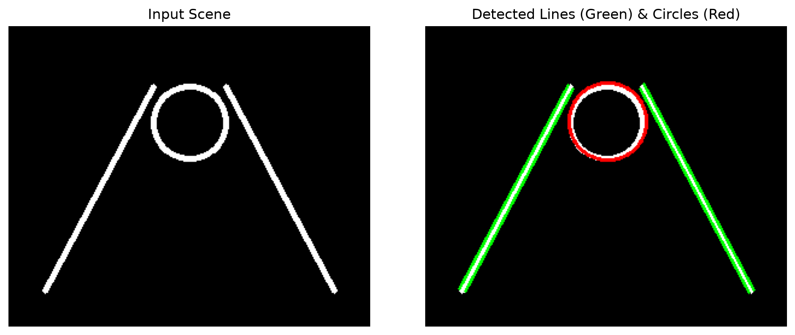

### Executable Python Example
```python
import cv2
import numpy as np
import matplotlib.pyplot as plt

# 1. Create a synthetic test image with clean lines and circles
scene = np.zeros((200, 200), dtype=np.uint8)
cv2.line(scene, (20, 20), (180, 180), 255, 2) # Diagonal line
cv2.line(scene, (20, 180), (180, 20), 255, 2) # Cross line
cv2.circle(scene, (100, 100), 45, 255, 2)     # Center circle

# 2. Extract edge pixels
edges = cv2.Canny(scene, 50, 150)

# 3. Detect line segments with Probabilistic Hough Lines
lines = cv2.HoughLinesP(edges, rho=1, theta=np.pi/180, threshold=30, minLineLength=40, maxLineGap=5)

# 4. Detect Circles
circles = cv2.HoughCircles(
    scene, cv2.HOUGH_GRADIENT, dp=1.0, minDist=40, param1=100, param2=15, minRadius=20, maxRadius=60
)

# 5. Render detections
vis = cv2.cvtColor(scene, cv2.COLOR_GRAY2BGR)
if lines is not None:
    for line in lines:
        x1, y1, x2, y2 = line[0]
        cv2.line(vis, (x1, y1), (x2, y2), (0, 255, 0), 2)

if circles is not None:
    circles = np.uint16(np.around(circles))
    for c in circles[0, :]:
        cv2.circle(vis, (c[0], c[1]), c[2], (0, 0, 255), 2) # Red circle
        cv2.circle(vis, (c[0], c[1]), 2, (255, 0, 0), -1)   # Blue center

# 6. Display Output
plt.figure(figsize=(5, 5))
plt.imshow(cv2.cvtColor(vis, cv2.COLOR_BGR2RGB))
plt.title(f"Hough Detection: {len(lines)} Lines (Green) | {len(circles[0])} Circle (Red)")
plt.axis("off")
plt.show()

print(f"Hough transform detected {len(lines)} line segments and {len(circles[0])} circle.")
```

### Line-by-Line Explanation
1. `cv2.HoughLinesP(edges, rho=1, theta=np.pi/180, threshold=30, minLineLength=40, maxLineGap=5)`:
   - `rho=1`: Distance resolution in pixels.
   - `theta=np.pi/180`: Angular resolution ($1^\circ$).
   - `threshold=30`: Minimum accumulator votes needed to declare a line.
   - `minLineLength=40`: Discards segments shorter than 40 pixels.
   - `maxLineGap=5`: Automatically bridges broken line segments if gaps are $\le 5$ pixels.
2. `cv2.HoughCircles(..., dp=1.0, minDist=40, param1=100, param2=15)`:
   - `dp=1.0`: Inverse ratio of accumulator resolution to image resolution.
   - `minDist=40`: Minimum physical distance between detected circle centers.
   - `param1=100`: High threshold for internal Canny edge detector.
   - `param2=15`: Accumulator threshold for circle centers.

### Common Mistakes & Important Tips
- **Noise Sensitivity:** Hough transforms are sensitive to background edge clutter. **Always apply Gaussian blur before edge detection** to prevent thousands of spurious votes in the accumulator array.
- **Tuning `param2` for Circles:** In `cv2.HoughCircles`, `param2` controls center voting. If it is too low, you get hundreds of false circles. If it is too high, true circles are missed.

### Real-World & Robotics Perception Relevance
- **Autonomous Lane Keeping:** Hough line detection extracts road lane boundaries and calculates vehicle lateral offset and heading angle relative to the center of the lane.
- **Analog Dial Gauge Reading:** Industrial inspection robots detect circular pressure dials and gauge needles using Hough circle and line algorithms to read equipment measurements automatically.

### Interview Questions & Detailed Answers
1. **Q: Why is the normal polar parameterization ($r = x\cos	heta + y\sin	heta$) used instead of the slope-intercept form ($y = mx + b$) in Hough Line Transform?**
   - *Answer:* In slope-intercept form, vertical lines have an infinite slope ($m 	o \infty$) and undefined intercept ($b 	o \infty$). This requires an unbounded, infinite 2D accumulator grid. Polar parameterization maps any possible 2D line to a compact, bounded parameter space ($r \in [-\sqrt{W^2+H^2}, +\sqrt{W^2+H^2}]$, $	heta \in [0, \pi]$), which fits into a fixed-size 2D matrix.
2. **Q: What is the computational advantage of `cv2.HoughLinesP` over standard `cv2.HoughLines`?**
   - *Answer:* Standard Hough Line Transform processes every single edge pixel in the image and returns infinite mathematical lines. Probabilistic Hough Transform (`HoughLinesP`) randomly samples a subset of edge pixels, checks for accumulator peaks, traces the connected line segment, and removes those pixels from further consideration, cutting computation time drastically while returning exact start and end coordinates $(x_1, y_1, x_2, y_2)$.

### Mini Exercise with Solution
**Task:** Write a function that filters a list of Hough line segments to extract only near-vertical lines (slope within $75^\circ$ to $105^\circ$), useful for detecting vertical wall edges or building columns.

```python
import cv2
import numpy as np

def filter_vertical_lines(lines: np.ndarray, min_angle_deg: float = 75.0, max_angle_deg: float = 105.0) -> list:
    vertical_segments = []
    if lines is None:
        return vertical_segments
    
    for line in lines:
        x1, y1, x2, y2 = line[0]
        dx = x2 - x1
        dy = y2 - y1
        angle = np.abs(np.arctan2(dy, dx) * 180.0 / np.pi)
        if min_angle_deg <= angle <= max_angle_deg:
            vertical_segments.append((x1, y1, x2, y2))
    return vertical_segments
```

---

## 14. Feature Detection & Description

### Definition & Intuitive Analogy
A **local visual feature** is a distinctive, repeatable image pattern (such as a sharp corner, star pattern, or unique texture patch) that can be uniquely detected and recognized even if the image is rotated, scaled, blurred, or viewed from a different angle.

> **Intuitive Analogy:** Imagine recognizing a jigsaw puzzle piece. A piece of pure blue sky is almost impossible to place because every spot looks identical. A straight cloud edge is better, but can slide along the line. But a piece showing the sharp tip of a church steeple is unique: you can instantly identify where it belongs regardless of how the piece is rotated. In computer vision, that tip is a **corner feature**.


### 💡 The Big Picture in Plain English (Beginner Friendly)

- **What is it in 1 simple sentence?** Feature detection is finding unique, recognizable landmarks in an image (like sharp building corners or distinctive texture points) that can be identified even if the camera moves, rotates, or zooms.
- **Why do we need this? (The Problem):** How does your phone create a panoramic photo? It needs to match landmarks between photo 1 and photo 2. A patch of blue sky looks identical everywhere (useless). A straight cloud line can slide anywhere along the edge (ambiguous). But a sharp mountain peak or building corner is unique in 2D space!
- **How to picture it in your head (Mental Model):**
  - **Flat surface:** Moving a small magnifying glass in any direction sees no change.
  - **Edge:** Moving along the edge looks identical (the "Aperture Problem"). You only know you moved if you travel across the edge.
  - **Corner:** Moving the magnifying glass in ANY direction causes a dramatic change in pixel brightness!
  - **ORB (Oriented FAST and Rotated BRIEF):** FAST finds the corners in milliseconds by checking a ring of 16 pixels. BRIEF describes what the corner looks like as a compact 256-bit binary string (like a barcode).
- **Step-by-Step Walkthrough with Easy Numbers (FAST 16-Pixel Test):**
  - Look at a candidate pixel $P$ with brightness $100$ and threshold $20$.
  - Look at 16 pixels arranged in a circle around $P$.
  - If at least 12 consecutive pixels are either brighter than $120$ ($100+20$) or darker than $80$ ($100-20$), $P$ is immediately certified as a corner!
- **Beginner Trap & Rule of Thumb:** SIFT produces the most accurate descriptors but is slower. For real-time robotics on embedded boards (Raspberry Pi, Jetson), ORB is $10	imes$ to $50	imes$ faster because it uses binary Hamming distance instead of floating-point math.

### Why It Is Important
Feature detection and matching is the foundation of:
1. **Visual SLAM (Simultaneous Localization and Mapping)** in autonomous robots and AR glasses (Meta Quest, Apple Vision Pro).
2. **Image Stitching & Panoramas** in smartphone cameras.
3. **Structure from Motion (SfM)** for 3D reconstruction from drone photos.

### Core Concept & Mathematical Intuition

#### 1. Harris Corner Detector (Intensity Variation in Windows)
Consider shifting a small local window $W$ by $(\Delta u, \Delta v)$. The Sum of Squared Differences (SSD) change is:
$$E(u, v) = \sum_{(x, y) \in W} w(x, y) \left[ I(x + u, y + v) - I(x, y) \right]^2 \approx \begin{bmatrix} u & v \end{bmatrix} \mathbf{M} \begin{bmatrix} u \\ v \end{bmatrix}$$

Where $\mathbf{M}$ is the $2 \times 2$ **Structure Tensor (Second Moment Matrix)**:
$$\mathbf{M} = \sum_{(x, y) \in W} w(x, y) \begin{bmatrix} I_x^2 & I_x I_y \\ I_x I_y & I_y^2 \end{bmatrix}$$

Let $\lambda_1, \lambda_2$ be the eigenvalues of $\mathbf{M}$:
- **Flat Region:** Both $\lambda_1, \lambda_2 \approx 0$ (no intensity change in any direction).
- **Edge:** One eigenvalue is large, the other is near zero (change only perpendicular to the edge).
- **Corner:** Both $\lambda_1$ and $\lambda_2$ are **large positive numbers** (intensity changes sharply in all directions).

Harris Corner Response Function (avoids computing explicit eigenvalues):
$$R = \det(\mathbf{M}) - k \cdot (\operatorname{trace}(\mathbf{M}))^2 = (\lambda_1 \lambda_2) - k (\lambda_1 + \lambda_2)^2$$
- $R > 0$: Corner region.
- $R < 0$: Edge region.
- $|R| \approx 0$: Flat region. ($k$ is typically $0.04 - 0.06$).

#### 2. Shi-Tomasi Detector (`cv2.goodFeaturesToTrack`)
Shi and Tomasi discovered that the minimum eigenvalue is a superior score:
$$R = \min(\lambda_1, \lambda_2) > \lambda_{\text{min}}$$

#### 3. SIFT (Scale-Invariant Feature Transform)
SIFT creates features that are **invariant to scale, rotation, and illumination changes**:
1. **Scale Space & Difference of Gaussians (DoG):** Convolves image with Gaussians at multiple scales $\sigma$ and computes $D(x, y, \sigma) = (G(x, y, k\sigma) - G(x, y, \sigma)) * I(x, y)$. Extreme values in a $3 \times 3 \times 3$ scale-space cube identify scale-invariant keypoints.
2. **Orientation Assignment:** Computes gradient magnitude and direction in a neighborhood to assign a canonical rotation angle $\theta$.
3. **Descriptor Vector:** Divides an oriented $16 \times 16$ patch into $4 \times 4$ sub-regions, builds an 8-bin histogram of gradient directions for each sub-region, producing a **128-dimensional floating-point descriptor vector**.

#### 4. ORB (Oriented FAST and Rotated BRIEF) - Fast, Free & Real-Time
ORB was created by OpenCV researchers as an ultra-fast, open-source alternative to patented SIFT:
- **FAST Detector:** Tests a ring of 16 pixels around candidate pixel $p$. If $\ge 9$ contiguous pixels are all brighter (or darker) than $I(p) + t$, $p$ is a corner.
- **Intensity Centroid:** Computes patch moments to find orientation angle $\theta = \operatorname{atan2}(m_{01}, m_{10})$.
- **rBRIEF Descriptor:** Tests 256 pre-selected pixel pairs $(p_i, q_i)$ rotated by $\theta$. If $I(p_i) < I(q_i)$, output bit is $1$, else $0$. Produces a compact **256-bit (32-byte) binary descriptor**.

### Comparison: SIFT vs ORB

| Feature Algorithm | Detector | Descriptor Type | Distance Metric | Speed | Patent / Licensing |
| :--- | :--- | :--- | :--- | :--- | :--- |
| **SIFT** | DoG Scale-Space | 128-dimensional `float32` | Euclidean ($L_2$ norm) | Moderate ($pprox 20$ FPS) | Expired (Free now) |
| **ORB** | FAST + Pyramids | 256-bit binary (`uint8[32]`) | **Hamming Distance** | **Ultra-Fast ($>100$ FPS)** | **Free & Open Source** |

### Important OpenCV Functions & Syntax
```python
# Shi-Tomasi Corner Detector
corners = cv2.goodFeaturesToTrack(
    src_gray, maxCorners=100, qualityLevel=0.01, minDistance=10
)

# SIFT Detector & Descriptor Extractor
sift = cv2.SIFT_create(nfeatures=1000)
keypoints, descriptors = sift.detectAndCompute(src_gray, mask=None)

# ORB Detector & Descriptor Extractor
orb = cv2.ORB_create(nfeatures=1000, scaleFactor=1.2, nlevels=8)
keypoints, descriptors = orb.detectAndCompute(src_gray, mask=None)

# Drawing Keypoints
vis = cv2.drawKeypoints(src, keypoints, None, flags=cv2.DRAW_MATCHES_FLAGS_DRAW_RICH_KEYPOINTS)
```

### Feature Detection Architecture
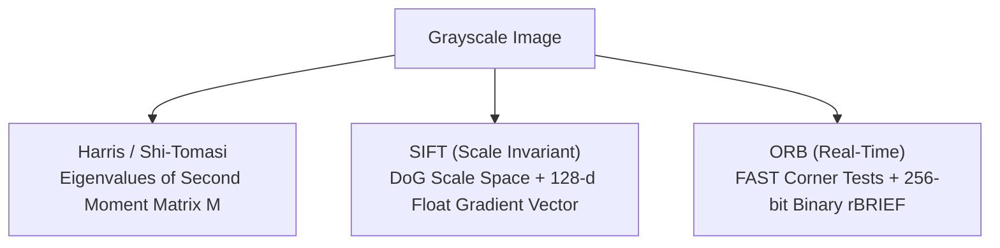
```mermaid
flowchart TD
    IMG["Grayscale Image"] --> HARRIS["Harris / Shi-Tomasi
Eigenvalues of Second Moment Matrix M"]
    IMG --> SIFT["SIFT (Scale Invariant)
DoG Scale Space + 128-d Float Gradient Vector"]
    IMG --> ORB["ORB (Real-Time)
FAST Corner Tests + 256-bit Binary rBRIEF"]
```

### Visual Demonstration & Feature Extraction
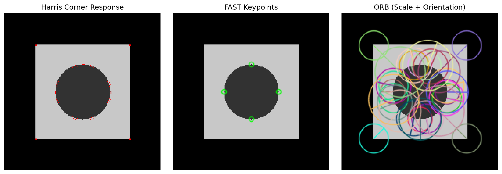

### Executable Python Example
```python
import cv2
import numpy as np
import matplotlib.pyplot as plt

# 1. Create a synthetic image with geometric patterns and texture
img = np.zeros((200, 200), dtype=np.uint8)
cv2.rectangle(img, (30, 30), (170, 170), 200, thickness=-1)
cv2.circle(img, (100, 100), 40, 50, thickness=-1)
cv2.line(img, (30, 100), (170, 100), 255, 2)

# 2. Extract Shi-Tomasi corners
corners = cv2.goodFeaturesToTrack(img, maxCorners=50, qualityLevel=0.01, minDistance=10)

# 3. Extract ORB Keypoints and Binary Descriptors
orb = cv2.ORB_create(nfeatures=100)
kps_orb, descs_orb = orb.detectAndCompute(img, None)

# 4. Extract SIFT Keypoints and 128-d Descriptors
sift = cv2.SIFT_create(nfeatures=100)
kps_sift, descs_sift = sift.detectAndCompute(img, None)

# 5. Render Comparison
vis_orb = cv2.drawKeypoints(img, kps_orb, None, color=(0, 255, 0), flags=cv2.DRAW_MATCHES_FLAGS_DRAW_RICH_KEYPOINTS)
vis_sift = cv2.drawKeypoints(img, kps_sift, None, color=(255, 0, 0), flags=cv2.DRAW_MATCHES_FLAGS_DRAW_RICH_KEYPOINTS)

fig, axs = plt.subplots(1, 2, figsize=(10, 5))
axs[0].imshow(vis_orb); axs[0].set_title(f"ORB: {len(kps_orb)} Binary Features (32-byte)")
axs[1].imshow(vis_sift); axs[1].set_title(f"SIFT: {len(kps_sift)} Float Features (128-d)")
for ax in axs: ax.axis("off")
plt.tight_layout()
plt.show()

print(f"ORB Descriptor shape: {descs_orb.shape} (uint8), SIFT Descriptor shape: {descs_sift.shape} (float32)")
```

### Line-by-Line Explanation
1. `orb = cv2.ORB_create(nfeatures=100)` creates an ORB extractor limited to the top 100 most salient keypoints.
2. `kps_orb, descs_orb = orb.detectAndCompute(img, None)` detects multi-scale FAST corners and computes 256-bit binary descriptors.
3. `cv2.DRAW_MATCHES_FLAGS_DRAW_RICH_KEYPOINTS` draws circles where radius indicates the scale/size of the feature and the radial line indicates its detected orientation angle $	heta$.

### Common Mistakes & Important Tips
- **Distance Metric Mismatch:** SIFT descriptors are floating-point vectors and MUST be compared using **Euclidean distance (`cv2.NORM_L2`)**. ORB descriptors are binary bitstrings and MUST be compared using **Hamming distance (`cv2.NORM_HAMMING`)**. Using L2 distance on ORB produces completely invalid matches!
- **Textureless Scenes:** Corner detectors fail on flat walls, smooth tables, or sky. Vision systems must fall back to optical flow or direct photometric methods in textureless environments.

### Real-World & Robotics Perception Relevance
- **ORB-SLAM3:** One of the most famous open-source Visual-Inertial SLAM pipelines for robotics. It uses ORB features for real-time camera tracking, loop closure, and re-localization at $>60$ FPS on embedded robot computers.
- **Augmented Reality Tracking:** ARKit and ARCore detect planar surface keypoints to anchor virtual 3D models into real-world video.

### Interview Questions & Detailed Answers
1. **Q: Why are corners considered superior features compared to edges or flat regions for visual tracking?**
   - *Answer:* Flat regions have zero gradient in all directions (aperture problem in 2D), making localization impossible. Edges have gradient in only 1 direction: moving along the edge produces no intensity change (1D aperture problem). Corners have large gradients in two orthogonal directions ($\lambda_1 \gg 0, \lambda_2 \gg 0$). Shifting a corner in any direction produces a sharp intensity change, allowing unique, unambiguous $(x, y)$ localization.
2. **Q: How does the Hamming distance metric accelerate binary feature matching for ORB?**
   - *Answer:* Comparing two 256-bit ORB binary descriptors requires counting how many bits differ. In modern CPUs (x86/ARM), this is computed using a single hardware bitwise XOR instruction followed by a population count (`POPCNT`) instruction. This takes $<1$ nanosecond, making binary descriptor matching over $10	imes$ faster than Euclidean distance calculations on 128-d float vectors.

### Mini Exercise with Solution
**Task:** Write a function that detects corners using Shi-Tomasi `goodFeaturesToTrack` and refines the coordinates to **sub-pixel accuracy** using `cv2.cornerSubPix`.

```python
import cv2
import numpy as np

def detect_subpixel_corners(gray_img: np.ndarray, max_corners: int = 50) -> np.ndarray:
    # 1. Initial integer corner detection
    corners = cv2.goodFeaturesToTrack(gray_img, maxCorners=max_corners, qualityLevel=0.01, minDistance=10)
    if corners is None:
        return np.empty((0, 2), dtype=np.float32)
    
    # 2. Sub-pixel refinement criteria (stop after 30 iterations or 0.001 epsilon)
    criteria = (cv2.TERM_CRITERIA_EPS + cv2.TERM_CRITERIA_MAX_ITER, 30, 0.001)
    
    # 3. Refine to floating-point sub-pixel coordinates
    subpix_corners = cv2.cornerSubPix(gray_img, corners, winSize=(5, 5), zeroZone=(-1, -1), criteria=criteria)
    return subpix_corners.reshape(-1, 2)
```

---

## 15. Feature Matching

### Definition & Intuitive Analogy
**Feature matching** is the computational process of finding corresponding pairs of keypoints between two different images (e.g., matching a reference object template against a scene containing that object).

> **Intuitive Analogy:** Imagine you have two fingerprint databases. Each fingerprint has a list of unique minutiae features. Feature matching is like comparing the feature descriptor of fingerprint $A$ against every entry in database $B$ to find the closest match.


### 💡 The Big Picture in Plain English (Beginner Friendly)

- **What is it in 1 simple sentence?** Feature matching is taking the numerical fingerprints of keypoints in Image A and searching Image B to find the exact same physical spots.
- **Why do we need this? (The Problem):** To stitch images or track objects, you must pair up corresponding points. However, repetitive textures (like bricks on a wall) produce hundreds of fake false-positive matches that will ruin your homography.
- **How to picture it in your head (Mental Model):**
  - **Brute Force Matcher:** Compares every feature in Photo A against every single feature in Photo B one by one (like checking every key on a ring until one fits).
  - **FLANN Matcher:** Organizes features into a clever tree structure (like a library catalog) so you can find the nearest match in a fraction of a millisecond.
  - **Lowe's Ratio Test (The Ambiguity Filter):** For each point, find the best match ($d_1$) and the second-best match ($d_2$). If $d_1$ is almost the same distance as $d_2$, it means the point looks like two identical things (e.g. two identical bricks)—throw it away! Only keep matches where $d_1 / d_2 < 0.75$.
- **Step-by-Step Walkthrough with Easy Numbers:**
  - Best match distance $d_1 = 15$ units. Second best match distance $d_2 = 40$ units.
  - Ratio $= 15 / 40 = \mathbf{0.375} < 0.75 \implies$ Highly distinct, confident match!
  - Another point: $d_1 = 30$, $d_2 = 32$. Ratio $= 30/32 = \mathbf{0.938} > 0.75 \implies$ Ambiguous repetitive pattern; rejected!
- **Beginner Trap & Rule of Thumb:** Binary descriptors (like ORB) MUST use `cv2.NORM_HAMMING`. Floating-point descriptors (like SIFT) MUST use `cv2.NORM_L2`. If you use L2 on ORB, your match results will be completely scrambled!

### Why It Is Important
Feature matching enables object recognition, camera motion estimation, image stitching, and 3D triangulation between stereo camera pairs.

### Core Concept & Mathematical Intuition

#### 1. Matcher Types
- **Brute-Force Matcher (`cv2.BFMatcher`):** Takes each descriptor in Image 1 and calculates the distance to **every single descriptor** in Image 2, selecting the closest one ($\mathcal{O}(N \cdot M)$ complexity). Exhaustive, 100% optimal.
- **FLANN (Fast Library for Approximate Nearest Neighbors):** Uses randomized k-d trees (for float descriptors like SIFT) or hierarchical clustering (for binary descriptors like ORB). Achieves approximate matching in $\mathcal{O}(\log N)$ time, essential for large feature sets.

#### 2. Lowe's Ratio Test (Ambiguity Rejection)
Proposed by David Lowe (inventor of SIFT). For each keypoint in Image 1, we find the **two closest nearest neighbors** in Image 2 ($D_1$ with distance $d_1$, and $D_2$ with distance $d_2$ where $d_1 < d_2$):

$$\text{Match is Valid If: } \frac{d_1}{d_2} < \text{ratio\_threshold} \quad (\approx 0.70 - 0.80)$$

- **Intuition:** If an image contains repetitive patterns (like a brick wall), the best match $d_1$ and the second-best match $d_2$ will have nearly identical distances ($d_1 / d_2 pprox 1.0$). The ratio test cleanly eliminates ambiguous, false repetitive matches!

#### 3. Cross-Checking (Symmetric Matching)
A match from $A 	o B$ is accepted only if the best match from $B 	o A$ returns the exact same keypoint ($A_i = B_j \land B_j = A_i$).

### Important OpenCV Functions & Syntax
```python
# BFMatcher for SIFT (L2 distance)
bf_sift = cv2.BFMatcher(cv2.NORM_L2, crossCheck=False)
matches = bf_sift.knnMatch(descs1, descs2, k=2) # Returns top 2 matches per point

# BFMatcher for ORB (Hamming distance)
bf_orb = cv2.BFMatcher(cv2.NORM_HAMMING, crossCheck=False)
matches_orb = bf_orb.knnMatch(descs1, descs2, k=2)

# FLANN Matcher for SIFT
index_params = dict(algorithm=1, trees=5) # FLANN_INDEX_KDTREE = 1
search_params = dict(checks=50)
flann = cv2.FlannBasedMatcher(index_params, search_params)

# Draw Matches
vis_matches = cv2.drawMatchesKnn(img1, kp1, img2, kp2, good_matches, None, flags=2)
```

### Feature Matching & Ratio Test Pipeline

```mermaid
flowchart LR
    D1["Query Descriptors"] & D2["Scene Descriptors"] --> MATCH["KNN Matcher (k=2)"]
    MATCH --> RATIO["Lowe's Ratio Test: d1 / d2 < 0.75"]
    RATIO -->|Reject Ambiguity| GOOD["Robust Matching Keypoint Pairs"]
```

### Visual Demonstration & Feature Matching
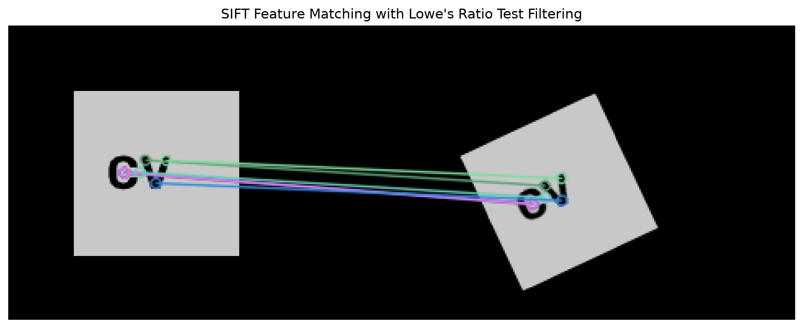

### Executable Python Example
```python
import cv2
import numpy as np
import matplotlib.pyplot as plt

# 1. Create reference template and a rotated/scaled scene containing it
template = np.zeros((150, 150), dtype=np.uint8)
cv2.rectangle(template, (30, 30), (120, 120), 200, -1)
cv2.circle(template, (75, 75), 25, 50, -1)

# Rotate and scale template to simulate a camera moving
M_sim = cv2.getRotationMatrix2D((75, 75), 25, 0.9)
scene = cv2.warpAffine(template, M_sim, (200, 200))

# 2. Extract SIFT features
sift = cv2.SIFT_create()
kp1, des1 = sift.detectAndCompute(template, None)
kp2, des2 = sift.detectAndCompute(scene, None)

# 3. KNN Matching (k=2) with BFMatcher
bf = cv2.BFMatcher(cv2.NORM_L2)
raw_matches = bf.knnMatch(des1, des2, k=2)

# 4. Apply Lowe's Ratio Test (threshold = 0.75)
good_matches = []
for m, n in raw_matches:
    if m.distance < 0.75 * n.distance:
        good_matches.append([m])

# 5. Draw Matches
match_vis = cv2.drawMatchesKnn(template, kp1, scene, kp2, good_matches, None, flags=cv2.DrawMatchesFlags_NOT_DRAW_SINGLE_POINTS)

plt.figure(figsize=(10, 4))
plt.imshow(match_vis)
plt.title(f"SIFT Feature Matches with Lowe's Ratio Test ({len(good_matches)} Good Matches)")
plt.axis("off")
plt.show()

print(f"Total raw matches: {len(raw_matches)} -> Filtered robust matches: {len(good_matches)}")
```

### Line-by-Line Explanation
1. `raw_matches = bf.knnMatch(des1, des2, k=2)`: For every feature in `template`, finds the two closest candidate features in `scene`.
2. `if m.distance < 0.75 * n.distance`: Checks if the best match `m` is at least $25\%$ closer than the second-best match `n`. If so, the match is unambiguous and accepted.
3. `cv2.drawMatchesKnn(...)`: Draws color-coded correspondence lines connecting matching keypoint coordinates across both images.

### Common Mistakes & Important Tips
- **Forgetting `k=2` in knnMatch:** To apply Lowe's ratio test, you must pass `k=2` to get two candidates per query point. If you pass `k=1` or call `bf.match()`, you only get 1 candidate and cannot compute the ratio.
- **Descriptor Array Empty Check:** If an image has no detectable features, `detectAndCompute` returns `des = None`. Passing `None` to `bf.knnMatch()` raises a fatal OpenCV error. Always check `if des1 is not None and des2 is not None:`.

### Real-World & Robotics Perception Relevance
- **Visual Loop Closure Detection:** In mobile robot SLAM, when a robot re-enters a previously visited room, feature matching matches the current camera view against past keyframe descriptors to recognize the place and eliminate cumulative drift.

### Interview Questions & Detailed Answers
1. **Q: Explain the mathematical intuition behind Lowe's Ratio Test.**
   - *Answer:* False matches caused by background clutter or repetitive textures typically have multiple candidates with very similar descriptor distances ($d_1 pprox d_2$). In contrast, a true distinctive feature has a unique match in the scene that is significantly closer in descriptor space than any alternative ($d_1 \ll d_2$). Taking the ratio $d_1 / d_2 < 0.75$ effectively rejects over $90\%$ of false matches while retaining over $85\%$ of correct matches.
2. **Q: When would you choose FLANN over BFMatcher?**
   - *Answer:* BFMatcher evaluates exhaustive pairwise distances ($\mathcal{O}(N \cdot M)$). When matching a live camera frame ($1,000$ features) against a map database containing $100,000$ features, BFMatcher requires $100,000,000$ distance calculations per frame, causing severe frame drops. FLANN builds approximate k-d trees in $\mathcal{O}(N \log M)$ time, reducing match time from hundreds of milliseconds to under 5 milliseconds.

### Mini Exercise with Solution
**Task:** Write a function that matches ORB descriptors using `cv2.BFMatcher` with `NORM_HAMMING` and cross-checking enabled, returning the filtered list of matching `cv2.DMatch` objects.

```python
import cv2
import numpy as np

def match_orb_symmetric(des1: np.ndarray, des2: np.ndarray) -> list:
    if des1 is None or des2 is None:
        return []
    # Create Hamming matcher with mutual cross-checking
    bf = cv2.BFMatcher(cv2.NORM_HAMMING, crossCheck=True)
    matches = bf.match(des1, des2)
    # Sort matches by ascending distance (best first)
    matches = sorted(matches, key=lambda x: x.distance)
    return matches
```

---

## 16. Homography & Image Registration

### Definition & Intuitive Analogy
**Homography** is a $3 \times 3$ projective transformation matrix that maps any point $(x, y)$ on one flat planar surface to its corresponding point $(x', y')$ on another view of the same planar surface.

> **Intuitive Analogy:** Imagine taking a photo of a flat poster on a wall from the left side, and another photo of the same poster from the right side. Homography is the exact mathematical warp that un-stretches and aligns the poster from the second photo so it overlays perfectly on top of the first photo.


### 💡 The Big Picture in Plain English (Beginner Friendly)

- **What is it in 1 simple sentence?** A homography is a $3 	imes 3$ transformation matrix that warps a flat 2D plane photographed from one angle so it perfectly lines up with a photo taken from another angle.
- **Why do we need this? (The Problem):** When creating a panoramic panorama or replacing an advertisement billboard in a soccer game broadcast, you need to seamlessly warp the image so perspective lines match the physical real-world plane.
- **How to picture it in your head (Mental Model):**
  - Imagine shining a slide projector onto a flat wall. If the projector is tilted, the square picture becomes an angled trapezoid. A Homography matrix is the mathematical undo button: it un-tilts the trapezoid back to a perfect square.
  - **RANSAC (The Outlier Police):** Even with good feature matching, 20% of your matches might be completely wrong (random noise). If you use simple least squares, one bad match will drag the whole calculation into ruins. RANSAC randomly picks 4 matches, tests the fit, counts how many other matches agree (inliers), and ignores all lying outliers!
- **Step-by-Step Walkthrough with Easy Numbers:**
  - A homography has 8 degrees of freedom (8 unknowns in a $3 	imes 3$ matrix with scale normalized).
  - Each point match provides 2 independent equations ($x$ and $y$).
  - Therefore, you need a minimum of $8 / 2 = \mathbf{4	ext{ point correspondences}}$ to calculate $H$.
- **Beginner Trap & Rule of Thumb:** Homography ONLY works for planar surfaces (flat walls, floors) or pure camera rotations (panoramas from a stationary tripod). If you move the camera through a 3D scene with depth parallax, homography fails!

### Why It Is Important
Homography is the mathematical backbone of:
1. **Panorama Image Stitching:** Seamlessly fusing overlapping photos into wide panoramas.
2. **Document & Receipt Scanning:** Rectifying angled photos of planar paper into flat orthogonal scans.
3. **Augmented Reality Planar Tracking:** Projecting virtual videos onto flat book covers or billboards.

### Core Concept & Mathematical Intuition

#### 1. Planar Homography Equation
$$\begin{bmatrix} x' \\ y' \\ 1 \end{bmatrix} \sim \mathbf{H} \begin{bmatrix} x \\ y \\ 1 \end{bmatrix} = \begin{bmatrix} h_{11} & h_{12} & h_{13} \\ h_{21} & h_{22} & h_{23} \\ h_{31} & h_{32} & h_{33} \end{bmatrix} \begin{bmatrix} x \\ y \\ 1 \end{bmatrix}$$

- Because $\mathbf{H}$ operates up to an arbitrary scale factor, it has **8 Degrees of Freedom (DOF)**.
- Each 2D point pair provides 2 independent equations:
  $$x' = \frac{h_{11} x + h_{12} y + h_{13}}{h_{31} x + h_{32} y + h_{33}}, \quad y' = \frac{h_{21} x + h_{22} y + h_{23}}{h_{31} x + h_{32} y + h_{33}}$$
- Thus, solving $\mathbf{H}$ requires a minimum of **4 non-collinear point correspondences**.

#### 2. Solving with Direct Linear Transform (DLT) & SVD
Rearranging the equations into the matrix form $\mathbf{A} \mathbf{h} = 0$, where $\mathbf{A}$ is a $2N \times 9$ matrix and $\mathbf{h}$ is the 9-element vector of $h_{ij}$.
Applying **Singular Value Decomposition (SVD)**: $\mathbf{A} = \mathbf{U} \mathbf{\Sigma} \mathbf{V}^T$, the optimal solution $\mathbf{h}$ is the right singular vector corresponding to the smallest singular value (the last column of $\mathbf{V}$).

#### 3. RANSAC (Random Sample Consensus) Robust Outlier Rejection
In real matching, some feature correspondences are incorrect (outliers). Standard least squares fits fail catastrophically in the presence of even a single outlier. RANSAC solves this:
1. **Random Sample:** Randomly picks the minimal subset of 4 point pairs.
2. **Model Estimation:** Computes candidate $\mathbf{H}$.
3. **Consensus Voting:** Transforms all remaining points with $\mathbf{H}$ and measures reprojection error $d(x'_i, \mathbf{H} x_i)$. Points with error $< \text{threshold}$ vote as **inliers**.
4. **Iterate:** Repeats for $N$ iterations (typically $1,000$ to $2,000$), keeping the matrix $\mathbf{H}$ with the highest inlier count.
5. **Final Refinement:** Recomputes $\mathbf{H}$ via least squares using all inliers.

### Important OpenCV Functions & Syntax
```python
# Extract point coordinates from matching DMatch objects
src_pts = np.float32([kp1[m.queryIdx].pt for m in good_matches]).reshape(-1, 1, 2)
dst_pts = np.float32([kp2[m.trainIdx].pt for m in good_matches]).reshape(-1, 1, 2)

# Estimate Robust Homography with RANSAC
H, inlier_mask = cv2.findHomography(
    src_pts, dst_pts,
    method=cv2.RANSAC,
    ransacReprojThreshold=3.0, # Max allowable reprojection error in pixels
    maxIters=2000,
    confidence=0.995
)

# Warp source image into destination perspective
aligned_img = cv2.warpPerspective(src_img, H, (dst_w, dst_h))
```

### RANSAC Homography Estimation Pipeline
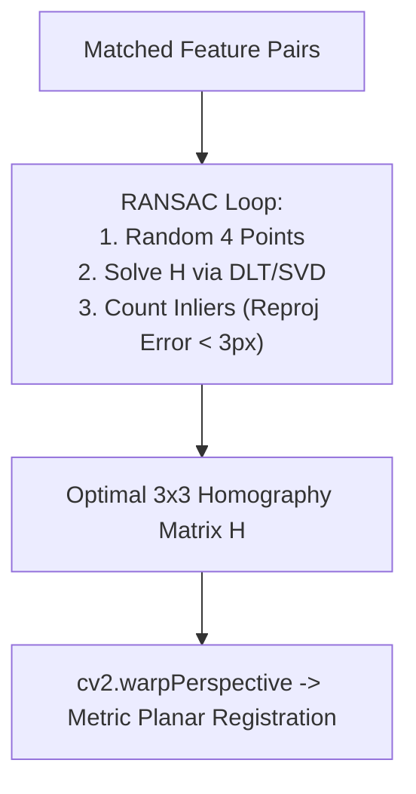
```mermaid
flowchart TD
    PTS["Matched Feature Pairs"] --> RANSAC["RANSAC Loop:
1. Random 4 Points
2. Solve H via DLT/SVD
3. Count Inliers (Reproj Error < 3px)"]
    RANSAC --> BEST_H["Optimal 3x3 Homography Matrix H"]
    BEST_H --> WARP["cv2.warpPerspective -> Metric Planar Registration"]
```

### Visual Demonstration & Homography Alignment
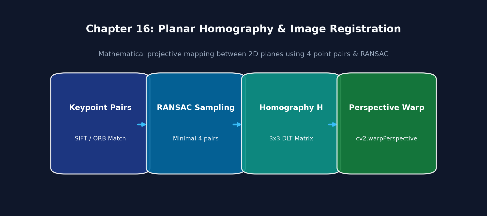

### Executable Python Example
```python
import cv2
import numpy as np
import matplotlib.pyplot as plt

# 1. Create a planar object and an affine/projective transformed scene
base_plane = np.zeros((200, 200), dtype=np.uint8)
cv2.rectangle(base_plane, (30, 30), (170, 170), 180, -1)
cv2.putText(base_plane, "PLANAR", (45, 110), cv2.FONT_HERSHEY_SIMPLEX, 0.8, 0, 2)

# Simulate camera view by applying ground-truth homography
H_true = np.array([
    [0.9, -0.2, 20.0],
    [0.2,  0.9, 10.0],
    [0.0003, 0.0001, 1.0]
])
scene = cv2.warpPerspective(base_plane, H_true, (250, 250))

# 2. Extract ORB features and match
orb = cv2.ORB_create(nfeatures=500)
kp1, des1 = orb.detectAndCompute(base_plane, None)
kp2, des2 = orb.detectAndCompute(scene, None)

bf = cv2.BFMatcher(cv2.NORM_HAMMING, crossCheck=True)
matches = bf.match(des1, des2)

# 3. Extract matching coordinates
src_pts = np.float32([kp1[m.queryIdx].pt for m in matches]).reshape(-1, 1, 2)
dst_pts = np.float32([kp2[m.trainIdx].pt for m in matches]).reshape(-1, 1, 2)

# 4. Compute Homography via RANSAC
H_est, mask = cv2.findHomography(src_pts, dst_pts, cv2.RANSAC, 3.0)
inliers_count = np.sum(mask)

# 5. Warp base plane using estimated H to align with scene
aligned = cv2.warpPerspective(base_plane, H_est, (250, 250))

# 6. Display visual registration
fig, axs = plt.subplots(1, 3, figsize=(12, 4))
axs[0].imshow(base_plane, cmap="gray"); axs[0].set_title("1. Template Planar Object")
axs[1].imshow(scene, cmap="gray"); axs[1].set_title("2. Angled Scene View")
axs[2].imshow(aligned, cmap="gray"); axs[2].set_title(f"3. Homography Aligned ({inliers_count} Inliers)")
for ax in axs: ax.axis("off")
plt.tight_layout()
plt.show()

print("Estimated Homography H:
", np.round(H_est, 4))
```

### Line-by-Line Explanation
1. `src_pts` and `dst_pts` extract the 2D floating-point coordinates from the matched keypoint lists.
2. `cv2.findHomography(src_pts, dst_pts, cv2.RANSAC, 3.0)` runs the RANSAC algorithm. A feature correspondence is counted as an inlier if its Euclidean reprojection error $\|x'_i - \mathbf{H} x_i\| \le 3.0$ pixels.
3. `inlier_mask` is a binary array ($1$ for inliers, $0$ for rejected outlier matches).
4. `cv2.warpPerspective(base_plane, H_est, (250, 250))` warps the template image so it aligns pixel-for-pixel with the scene.

### Common Mistakes & Important Tips
- **Underlying Geometric Assumption:** Homography **strictly assumes** that the scene is completely planar (flat) OR that the camera is purely rotating around its optical center with zero translation ($t = [0, 0, 0]$). If a camera translates in a 3D non-planar scene, objects at different depths experience different parallax shifts, causing homography alignment to fail.
- **Minimum Points Check:** Always verify `len(matches) >= 4` before calling `cv2.findHomography`. If fewer than 4 points are passed, the function returns `None`.

### Real-World & Robotics Perception Relevance
- **Camera Calibration & Augmented Reality:** OpenCV's chessboard calibration finds homographies across calibration grid images to compute camera intrinsic matrices.
- **Panorama Generation:** Handheld smartphone panorama modes compute frame-to-frame homographies and warp successive frames onto a spherical canvas.

### Interview Questions & Detailed Answers
1. **Q: Under what exact physical conditions does a $3 \times 3$ Homography accurately relate two camera images?**
   - *Answer:* A homography accurately models the transformation between two views if and only if:
     1. All tracked 3D points lie on a single planar surface in the world (e.g., a wall, floor, or document), regardless of camera motion.
     2. The camera undergoes pure rotation around its optical center ($t = 0$) with no baseline translation, even in a non-planar 3D scene (e.g., tripod panorama stitching).
2. **Q: How many RANSAC iterations $N$ are required to ensure a $99\%$ probability ($p = 0.99$) of selecting at least one clean outlier-free sample of $s = 4$ points, given an outlier ratio $e = 0.5$?**
   - *Answer:* The formula for RANSAC iterations is:
     $$N = \frac{\ln(1 - p)}{\ln(1 - (1 - e)^s)} = \frac{\ln(1 - 0.99)}{\ln(1 - (1 - 0.5)^4)} = \frac{\ln(0.01)}{\ln(1 - 0.0625)} = \frac{-4.605}{-0.0645} \approx 72 \text{ iterations}$$

### Mini Exercise with Solution
**Task:** Write a function that takes an estimated Homography matrix $\mathbf{H}$ and the 4 outer corner points of an object template $[(0, 0), (W, 0), (W, H), (0, H)]$, and projects them into the destination scene using `cv2.perspectiveTransform` to draw an oriented bounding polygon around the detected object.

```python
import cv2
import numpy as np

def project_bounding_box(template_shape: tuple[int, int], H: np.ndarray) -> np.ndarray:
    h, w = template_shape[:2]
    # Define 4 template corners in clockwise order
    pts_template = np.float32([[0, 0], [w, 0], [w, h], [0, h]]).reshape(-1, 1, 2)
    
    # Project corners into scene coordinates via H
    pts_scene = cv2.perspectiveTransform(pts_template, H)
    return np.int32(pts_scene)
```

---

## 17. Video Processing

### Definition & Intuitive Analogy
Video processing is the sequential decoding, manipulation, and encoding of continuous streams of image frames over time.

> **Intuitive Analogy:** A video is simply a flipbook of individual photographic frames played at high speed (e.g., 30 or 60 frames per second). Video processing is reading one page at a time, performing computer vision math on that page, drawing results (like bounding boxes), and writing the page into a new flipbook.


### 💡 The Big Picture in Plain English (Beginner Friendly)

- **What is it in 1 simple sentence?** Video processing is handling a continuous stream of image frames captured by a camera, processing them in real-time, and writing them out as compressed video files.
- **Why do we need this? (The Problem):** A high-speed camera streams 30 to 60 frames every second. If your image processing loop takes 50 milliseconds per frame, the camera's internal hardware buffer fills up, creating a 2-second lag! An autonomous robot acting on 2-second-old visual data will crash.
- **How to picture it in your head (Mental Model):**
  - An airport baggage conveyor belt. If you take too long inspecting each suitcase, bags pile up into a massive traffic jam.
  - **Dedicated Grabber Thread:** To fix buffer lag, run a lightweight background thread whose only job is calling `cap.read()` in a loop to discard old frames and always keep the single freshest, newest frame ready for your algorithm.
- **Step-by-Step Walkthrough with Easy Numbers:**
  - At $30	ext{ FPS}$, each frame must be processed within $rac{1000	ext{ ms}}{30} = \mathbf{33.3	ext{ ms}}$.
  - If preprocessing takes $5	ext{ ms}$, inference takes $15	ext{ ms}$, and display takes $3	ext{ ms}$: Total $= 23	ext{ ms} < 33.3	ext{ ms} \implies$ True real-time 30 FPS!
- **Beginner Trap & Rule of Thumb:** Always release video hardware! Forgetting `cap.release()` and `cv2.destroyAllWindows()` leaves the camera sensor locked by the OS, causing the next run to fail.

### Why It Is Important
Almost all real-world robotics and vision applications process video streams (live USB/CSI cameras, RTSP security feeds, ROS image topics). Managing frame buffers and frame rates without dropping frames or causing memory leaks is a critical engineering skill.

### Core Concept & Mathematical Intuition

#### 1. Frame Rate (FPS) & Timestamp Synchronization
$$FPS = \frac{N_{\text{frames}}}{\Delta t_{\text{seconds}}}$$
For real-time control, the processing latency per frame $t_{\text{process}}$ must satisfy:
$$t_{\text{process}} \le \frac{1}{\text{Target FPS}} \quad (\text{e.g., } \le 33.3\text{ ms for 30 FPS})$$

#### 2. FourCC (Four-Character Code) Video Codecs
A FourCC is a 4-byte identifier specifying the video compression encoding format:
- `'mp4v'`: MPEG-4 codec (standard `.mp4` container).
- `'XVID'`: Xvid MPEG-4 codec (standard `.avi` container).
- `'avc1'` or `'H264'`: Advanced H.264 video codec.

#### 3. Multi-Threaded Frame Grabbing (Eliminating Frame Buffer Lag)
By default, `cv2.VideoCapture.read()` is a blocking call. If your deep learning model takes 100 ms to process a frame while the camera streams at 30 FPS (33 ms), OpenCV's internal hardware buffer fills up with old, stale frames. The vision system begins acting on data that is several seconds in the past!
- **Solution:** A dedicated background thread continuously reads and discards stale frames from the camera, storing only the **single latest frame** in a thread-safe variable.

### Important OpenCV Functions & Syntax
```python
# Open video stream (0 = default webcam, or pass "video.mp4" or RTSP url)
cap = cv2.VideoCapture(0)

# Check if opened successfully
if not cap.isOpened():
    raise RuntimeError("Cannot open camera stream")

# Read camera properties
width  = int(cap.get(cv2.CAP_PROP_FRAME_WIDTH))
height = int(cap.get(cv2.CAP_PROP_FRAME_HEIGHT))
fps    = cap.get(cv2.CAP_PROP_FPS)

# Initialize VideoWriter
fourcc = cv2.VideoWriter_fourcc(*'mp4v')
out = cv2.VideoWriter('output.mp4', fourcc, fps, (width, height))

# Frame loop
ret, frame = cap.read() # ret is boolean success flag
if ret:
    out.write(frame)

# Release resources (Crucial to prevent device locks and memory leaks!)
cap.release()
out.release()
cv2.destroyAllWindows()
```

### Zero-Lag Threaded Video Architecture
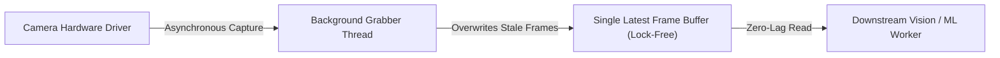
```mermaid
flowchart LR
    CAM["Camera Hardware Driver"] -->|Asynchronous Capture| THREAD["Background Grabber Thread"]
    THREAD -->|Overwrites Stale Frames| BUFFER["Single Latest Frame Buffer (Lock-Free)"]
    BUFFER -->|Zero-Lag Read| MAIN["Downstream Vision / ML Worker"]
```

### Visual Demonstration & Video Pipeline Architecture
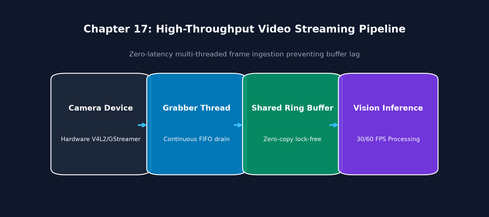

### Executable Python Example
```python
import cv2
import numpy as np

# 1. Simulate video processing by creating a synthetic video stream in memory
width, height, fps, num_frames = 320, 240, 30, 60
fourcc = cv2.VideoWriter_fourcc(*'mp4v')
writer = cv2.VideoWriter('synthetic_test.mp4', fourcc, fps, (width, height))

# 2. Render and write animated synthetic frames
for i in range(num_frames):
    frame = np.full((height, width, 3), 30, dtype=np.uint8)
    # Draw a moving circle
    cx = int(40 + (i / num_frames) * (width - 80))
    cy = int(height / 2)
    cv2.circle(frame, (cx, cy), 20, (0, 255, 0), -1)
    cv2.putText(frame, f"Frame {i:02d}", (15, 30), cv2.FONT_HERSHEY_SIMPLEX, 0.7, (255, 255, 255), 1)
    writer.write(frame)

writer.release()
print("Synthetic video written successfully.")

# 3. Read back video and compute real-time processing FPS
reader = cv2.VideoCapture('synthetic_test.mp4')
frame_count = 0
timer = cv2.getTickCount()

while reader.isOpened():
    ret, frame = reader.read()
    if not ret:
        break
    
    # Simulate lightweight edge detection processing
    gray = cv2.cvtColor(frame, cv2.COLOR_BGR2GRAY)
    edges = cv2.Canny(gray, 50, 150)
    frame_count += 1

elapsed = (cv2.getTickCount() - timer) / cv2.getTickFrequency()
reader.release()

print(f"Decoded and processed {frame_count} frames in {elapsed:.4f}s | Throughput: {frame_count / elapsed:.1f} FPS")
```

### Line-by-Line Explanation
1. `fourcc = cv2.VideoWriter_fourcc(*'mp4v')`: Unpacks the string `'mp4v'` into 4 individual character bytes required by the C++ VideoWriter constructor.
2. `writer = cv2.VideoWriter('synthetic_test.mp4', fourcc, fps, (width, height))`: Initializes the hardware/software video encoder.
3. `writer.write(frame)`: Compresses the uncompressed BGR frame and appends it to the container file.
4. `writer.release()`: Finalizes video file headers, writes the index chunk, and closes the file descriptor.

### Common Mistakes & Important Tips
- **Corrupt Output File:** If you forget to call `writer.release()`, the video header is never finalized on disk, and the resulting `.mp4` file will be corrupt and unplayable!
- **Dimension Mismatch in VideoWriter:** If `writer` is initialized with `(640, 480)` but you pass a frame of shape `(480, 640, 3)`, `writer.write()` will silently fail to write any frames without throwing an exception! Always ensure `(frame.shape[1], frame.shape[0]) == (writer_width, writer_height)`.

### Real-World & Robotics Perception Relevance
- **RTSP IP Camera Ingestion in Security & Warehouses:** Processing multiple 4K security feeds requires asynchronous hardware decoding (e.g., GStreamer pipelines or NVIDIA DeepStream via `cv2.VideoCapture("rtspsrc ... ! nvdec ! appsink", cv2.CAP_GSTREAMER)`).

### Interview Questions & Detailed Answers
1. **Q: Why does a standard single-threaded `cv2.VideoCapture.read()` loop accumulate latency when the downstream processing time exceeds frame interval time?**
   - *Answer:* The OS camera driver maintains an internal FIFO buffer (typically 3 to 5 frames). If downstream processing takes $100$ ms per frame while the camera produces frames every $33$ ms, `read()` consumes frames slower than they arrive. The driver buffer fills up, and subsequent `read()` calls retrieve stale, cached frames from 100-300 ms in the past rather than the instantaneous live frame.
2. **Q: How do you build a zero-lag threaded camera reader in Python?**
   - *Answer:* Spawn a dedicated daemon background `threading.Thread` that runs a tight loop calling `cap.read()` continuously and stores the latest frame in a single shared buffer protected by a mutex lock or atomic pointer. When the main processing thread needs a frame, it reads the latest frame instantly with zero buffer lag.

### Mini Exercise with Solution
**Task:** Implement a production-grade multi-threaded `ThreadedCamera` class that runs frame capture in a background thread to prevent latency accumulation.

```python
import cv2
import threading

class ThreadedCamera:
    def __init__(self, src=0):
        self.cap = cv2.VideoCapture(src)
        self.ret, self.frame = self.cap.read()
        self.running = True
        self.lock = threading.Lock()
        self.thread = threading.Thread(target=self._update, daemon=True)
        self.thread.start()

    def _update(self):
        while self.running:
            ret, frame = self.cap.read()
            if ret:
                with self.lock:
                    self.ret, self.frame = ret, frame

    def read(self):
        with self.lock:
            return self.ret, self.frame.copy() if self.ret else None

    def release(self):
        self.running = False
        self.thread.join()
        self.cap.release()
```

---

## 18. Object Tracking

### Definition & Intuitive Analogy
**Visual Object Tracking** is the task of estimating the spatial trajectory and bounding box of a target object across consecutive video frames, given only its initial bounding box position in the first frame.

> **Intuitive Analogy:** Imagine following a friend through a crowded train station. Once you spot your friend's red jacket in the first second, you don't need to scan every person in the whole station on every step. You simply search in the immediate area where your friend was standing a fraction of a second ago, tracking their movement as they walk.


### 💡 The Big Picture in Plain English (Beginner Friendly)

- **What is it in 1 simple sentence?** Object tracking is following a specific object from frame to frame across a video without having to run a heavy, expensive neural network detector on every single frame.
- **Why do we need this? (The Problem):** Deep learning detectors (like YOLO) are accurate but can take 20 to 50 milliseconds. Once an object is detected, tracking algorithms can follow it in just 2 to 5 milliseconds by searching a tiny local region around its last known position.
- **How to picture it in your head (Mental Model):**
  - Imagine looking for your keys in a house: searching every room from scratch is **Detection** (slow). Once you spot your keys in your hand, keeping your eyes locked onto them as you walk is **Tracking** (fast and effortless).
  - **CSRT Tracker:** Uses spatial reliability to handle non-rectangular objects and slight deformation.
  - **KCF Tracker:** Uses mathematical Fourier transforms to track objects at blazing speeds (hundreds of frames per second).
- **Step-by-Step Walkthrough with Easy Numbers:**
  - Running YOLO at 30 FPS on all frames: $30 	imes 40	ext{ ms} = 1200	ext{ ms}$ (Cannot keep up with real-time!).
  - Detect once every 30 frames, track the rest: $(1 	imes 40	ext{ ms}) + (29 	imes 3	ext{ ms}) = 40 + 87 = \mathbf{127	ext{ ms}}$ per second! The CPU load drops by nearly $90\%$!
- **Beginner Trap & Rule of Thumb:** All visual trackers suffer from "drift" over time (accumulating small localization errors) and fail during complete occlusions. The golden pattern: use tracking between frames, but re-run your detector every 30 frames to reset the tracker.

### Why It Is Important
Running full deep learning object detection (e.g., YOLO) on every frame is computationally expensive and battery-draining. High-speed trackers run at hundreds of frames per second, bridging the gap between slow deep learning detections while maintaining continuous object identity.

### Core Concept & Mathematical Intuition

#### 1. MeanShift Tracking (Mode Seeking on Probability Density)
MeanShift treats color histogram backprojection as a 2D probability density map:
1. Computes the color histogram $H$ of the target in HSV space.
2. Computes the **Backprojection Image** $P(x, y)$ where each pixel value is the probability that it belongs to the target.
3. Computes the **Mean Shift Vector** inside search window $W$:
   $$m(x) = \frac{\sum_{x_i \in W} x_i \cdot P(x_i)}{\sum_{x_i \in W} P(x_i)} - x$$
4. Shifts window center by $m(x)$ until convergence ($\|m(x)\| < \epsilon$).

#### 2. CamShift (Continuously Adaptive MeanShift)
MeanShift uses a fixed-size search window and fails when an object moves closer to or farther from the camera. **CamShift** solves this by dynamically adapting both the **window size and rotation angle** using 2D spatial moments.

#### 3. Modern Correlation Filter Trackers: KCF & CSRT
- **KCF (Kernelized Correlation Filter):** Exploits the circulant matrix property of spatial shifts, transforming the spatial tracking problem into the frequency domain using the **Fast Fourier Transform (FFT)**. Runs at $>200$ FPS.
- **CSRT (Channel and Spatial Reliability Tracker):** Estimates a spatial reliability mask to handle non-rectangular and deformed objects. Highly accurate and robust to partial occlusions ($pprox 40$ FPS).

### Important OpenCV Functions & Syntax
```python
# Color Histogram Backprojection
roi_hsv = cv2.cvtColor(roi, cv2.COLOR_BGR2HSV)
roi_hist = cv2.calcHist([roi_hsv], [0], None, [180], [0, 180])
cv2.normalize(roi_hist, roi_hist, 0, 255, cv2.NORM_MINMAX)

prob_map = cv2.calcBackProject([frame_hsv], [0], roi_hist, [0, 180], 1)

# CamShift execution
crit = (cv2.TERM_CRITERIA_EPS | cv2.TERM_CRITERIA_COUNT, 10, 1)
rotated_box, window = cv2.CamShift(prob_map, window, crit)

# CSRT Tracker (OpenCV Contrib)
tracker = cv2.TrackerCSRT_create()
tracker.init(first_frame, bbox=(x, y, w, h))
success, bbox = tracker.update(next_frame)
```

### Visual Object Tracking Pipeline
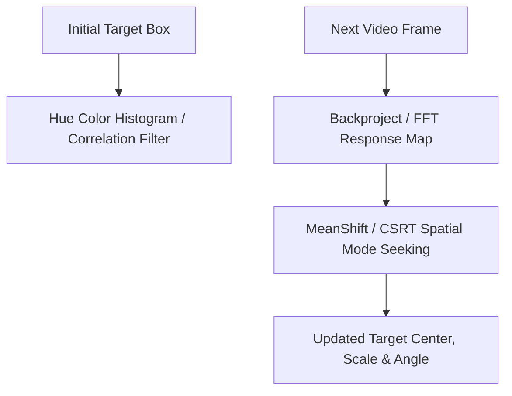
```mermaid
flowchart TD
    INIT["Initial Target Box"] --> HIST["Hue Color Histogram / Correlation Filter"]
    NEXT["Next Video Frame"] --> BACK["Backproject / FFT Response Map"]
    BACK --> SHIFT["MeanShift / CSRT Spatial Mode Seeking"]
    SHIFT --> UPDATE["Updated Target Center, Scale & Angle"]
```

### Visual Demonstration & Tracker Trajectory
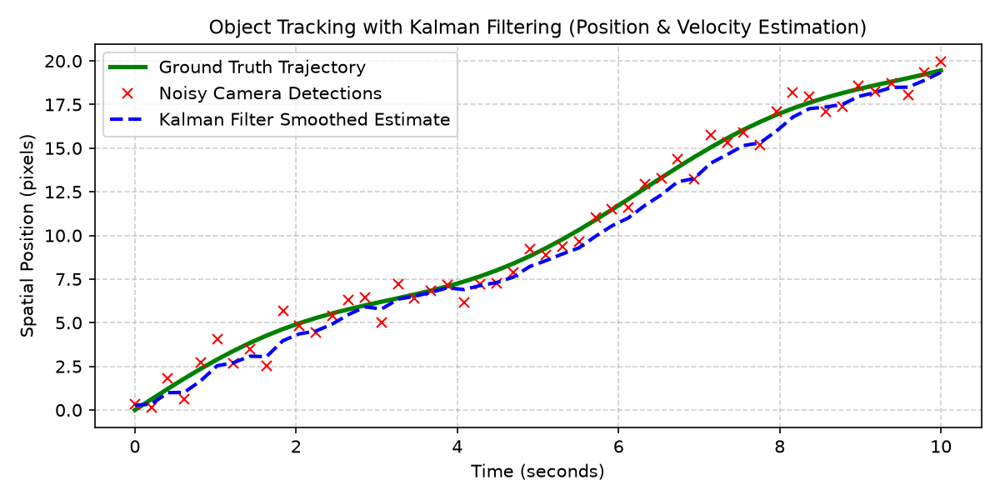

### Executable Python Example
```python
import cv2
import numpy as np
import matplotlib.pyplot as plt

# 1. Create synthetic video frames with a moving bright blue circular target
frames = []
for i in range(5):
    f = np.zeros((150, 200, 3), dtype=np.uint8)
    # Moving object
    cx = 40 + i * 25
    cy = 50 + i * 12
    cv2.circle(f, (cx, cy), 18, (255, 100, 0), -1) # Blue target in BGR
    frames.append(f)

# 2. Setup initial tracking window around target in Frame 0
track_window = (40 - 18, 50 - 18, 36, 36) # (x, y, w, h)
roi = frames[0][track_window[1]:track_window[1]+track_window[3], track_window[0]:track_window[0]+track_window[2]]
hsv_roi = cv2.cvtColor(roi, cv2.COLOR_BGR2HSV)
mask = cv2.inRange(hsv_roi, np.array((100, 50, 50)), np.array((130, 255, 255)))
roi_hist = cv2.calcHist([hsv_roi], [0], mask, [180], [0, 180])
cv2.normalize(roi_hist, roi_hist, 0, 255, cv2.NORM_MINMAX)

# 3. Track across subsequent frames using CamShift
term_crit = (cv2.TERM_CRITERIA_EPS | cv2.TERM_CRITERIA_COUNT, 10, 1)
trajectory = []

for frame in frames:
    hsv = cv2.cvtColor(frame, cv2.COLOR_BGR2HSV)
    dst = cv2.calcBackProject([hsv], [0], roi_hist, [0, 180], 1)
    ret_box, track_window = cv2.CamShift(dst, track_window, term_crit)
    pts = cv2.boxPoints(ret_box)
    pts = np.int32(pts)
    trajectory.append(ret_box[0]) # (center_x, center_y)

# 4. Render trajectory
vis = frames[-1].copy()
for pt in trajectory:
    cv2.circle(vis, (int(pt[0]), int(pt[1])), 4, (0, 255, 0), -1)

plt.figure(figsize=(6, 4))
plt.imshow(cv2.cvtColor(vis, cv2.COLOR_BGR2RGB))
plt.title(f"CamShift Trajectory: {len(trajectory)} Waypoints Tracked")
plt.axis("off")
plt.show()

print(f"Tracking completed. Final estimated target center: ({trajectory[-1][0]:.1f}, {trajectory[-1][1]:.1f})")
```

### Line-by-Line Explanation
1. `cv2.calcHist([hsv_roi], [0], mask, [180], [0, 180])`: Builds the color model of the target object using its Hue channel.
2. `cv2.calcBackProject([hsv], [0], roi_hist, [0, 180], 1)`: Replaces every pixel in the current frame with its probability value from the histogram.
3. `cv2.CamShift(dst, track_window, term_crit)`: Shifts and resizes the search window toward the peak probability mass, returning a rotated bounding rectangle `ret_box`.

### Common Mistakes & Important Tips
- **Background Color Distraction in CamShift:** If the background contains objects of the exact same color as the target, the probability density map will create competing peaks, causing MeanShift/CamShift to wander off target.
- **Occlusion Failure:** Correlation trackers (like KCF) can drift permanently if an object is completely occluded by a tree or car for several frames. In production systems, pair trackers with periodic full deep learning re-detection.

### Real-World & Robotics Perception Relevance
- **Pan-Tilt-Zoom (PTZ) Camera Tracking:** Security cameras use CamShift or CSRT to lock onto a moving suspect or vehicle and send motor commands to pan and tilt the physical camera to keep the target centered.
- **Drone Follow-Me Mode:** Autonomous camera drones use visual object trackers to follow a cyclist or runner smoothly at 60 FPS without running heavy deep learning models continuously.

### Interview Questions & Detailed Answers
1. **Q: What is the primary limitation of the standard MeanShift tracking algorithm, and how does CamShift overcome it?**
   - *Answer:* MeanShift uses a fixed-size search window throughout the video. If an object moves toward the camera (grows larger) or away (shrinks), the fixed window either captures excessive background noise or clips the object. CamShift (Continuously Adaptive MeanShift) calculates the zeroth and second-order spatial moments of the backprojected probability distribution on every iteration to continuously update both the window scale ($w, h$) and orientation angle $	heta$.
2. **Q: Why are Kernelized Correlation Filters (KCF) dramatically faster than standard spatial correlation?**
   - *Answer:* Calculating cross-correlation across all candidate 2D spatial patches requires expensive sliding window convolutions ($\mathcal{O}(N^2)$). KCF proves that circular shifts of training patches form circulant matrices, which can be diagonalized in the Fourier domain. Tracking is computed via element-wise multiplication in the frequency domain using the 2D Fast Fourier Transform (FFT), reducing computational complexity to $\mathcal{O}(N \log N)$ and running at $>200$ FPS.

### Mini Exercise with Solution
**Task:** Write a tracking failure recovery function that checks the tracking confidence score or peak response, and triggers a re-detection flag whenever confidence drops below a threshold $0.4$.

```python
import numpy as np

def evaluate_tracking_health(score: float, min_confidence: float = 0.4) -> bool:
    if np.isnan(score) or score < min_confidence:
        print("WARNING: Target lost or occluded! Triggering deep learning re-detection...")
        return False
    return True
```

---

## 19. Optical Flow

### Definition & Intuitive Analogy
**Optical Flow** is the pattern of apparent motion of image objects, surfaces, and edges in a visual scene caused by the relative motion between the camera and the scene.

> **Intuitive Analogy:** Imagine riding in a high-speed train and looking out the window. Nearby trees whip past your window instantly (large optical flow vectors), while distant mountains move very slowly (small optical flow vectors). Optical flow assigns a 2D velocity vector $(u, v) = (\Delta x / \Delta t, \Delta y / \Delta t)$ to pixels showing how fast and in what direction they are moving.


### 💡 The Big Picture in Plain English (Beginner Friendly)

- **What is it in 1 simple sentence?** Optical flow is calculating the 2D motion velocity vector $(u, v)$ of pixels between two consecutive video frames to see which way objects are moving.
- **Why do we need this? (The Problem):** Self-driving cars need to know not just where pedestrians and vehicles are located, but what direction and speed they are traveling to predict potential collisions.
- **How to picture it in your head (Mental Model):**
  - Watching leaves float down a river: tracking individual leaves gives you **Sparse Optical Flow** (Lucas-Kanade). Measuring the motion of the entire water surface across every pixel gives you **Dense Optical Flow** (Farneback).
  - **Brightness Constancy:** Assumes that if a pixel moves from $(x, y)$ in frame 1 to $(x+u, y+v)$ in frame 2, its color brightness does not change.
  - **Color Wheel Visualization:** Dense flow is often visualized as a rainbow: the hue represents the direction of motion (e.g. Red = moving right, Green = moving down), and brightness represents speed!
- **Step-by-Step Walkthrough with Easy Numbers:**
  - Pixel at $(100, 100)$ shifts to $(106, 98)$ over a $\Delta t = 0.1	ext{ s}$ frame interval.
  - Motion displacement: $u = 106 - 100 = +6	ext{ px}$, $v = 98 - 100 = -2	ext{ px}$.
  - Velocity: $v_x = 6 / 0.1 = \mathbf{+60	ext{ px/s}}$, $v_y = -2 / 0.1 = \mathbf{-20	ext{ px/s}}$.
- **Beginner Trap & Rule of Thumb:** Standard Lucas-Kanade fails if an object moves more than a few pixels between frames. Always enable multi-level image pyramids (`cv2.buildOpticalFlowPyramid`) so large movements are tracked at coarse scales first!

### Why It Is Important
Optical flow allows autonomous systems to:
1. Detect moving obstacles even without knowing what the objects are.
2. Estimate drone egomotion and altitude velocity (Visual Odometry).
3. Compute Time-to-Collision (TTC) for emergency braking.

### Core Concept & Mathematical Intuition

#### 1. The Brightness Constancy Assumption
Optical flow assumes that the intensity of a physical scene point remains constant over a small time increment $\Delta t$:
$$I(x + \Delta x, y + \Delta y, t + \Delta t) = I(x, y, t)$$

Applying 1st-order Taylor Series expansion:
$$I(x, y, t) + rac{\partial I}{\partial x} \Delta x + rac{\partial I}{\partial y} \Delta y + rac{\partial I}{\partial t} \Delta t pprox I(x, y, t)$$

Dividing by $\Delta t$ yields the fundamental **Optical Flow Constraint Equation**:
$$I_x u + I_y v + I_t = 0$$

Where $I_x = rac{\partial I}{\partial x}$, $I_y = rac{\partial I}{\partial y}$, $I_t = rac{\partial I}{\partial t}$, and $(u, v) = (rac{dx}{dt}, rac{dy}{dt})$ is the 2D velocity vector.

#### 2. The Aperture Problem
We have **1 equation and 2 unknowns** $(u, v)$ for each pixel. We can only measure the velocity component *perpendicular* to the edge; motion *parallel* to the edge is invisible through a small aperture!

#### 3. Lucas-Kanade Sparse Optical Flow
Lucas and Kanade solved the aperture problem by assuming that all pixels inside a small local $3 	imes 3$ window $\Omega$ share the **exact same velocity vector $(u, v)$**:
$$egin{bmatrix} I_{x1} & I_{y1} \ I_{x2} & I_{y2} \ dots & dots \ I_{xn} & I_{yn} \end{bmatrix} egin{bmatrix} u \ v \end{bmatrix} = -egin{bmatrix} I_{t1} \ I_{t2} \ dots \ I_{tn} \end{bmatrix} \implies \mathbf{A} \mathbf{v} = \mathbf{b}$$

Solving via Least Squares:
$$\mathbf{v} = (\mathbf{A}^T \mathbf{A})^{-1} \mathbf{A}^T \mathbf{b} \implies egin{bmatrix} u \ v \end{bmatrix} = egin{bmatrix} \sum I_x^2 & \sum I_x I_y \ \sum I_x I_y & \sum I_y^2 \end{bmatrix}^{-1} egin{bmatrix} -\sum I_x I_t \ -\sum I_y I_t \end{bmatrix}$$

Notice that the matrix $(\mathbf{A}^T \mathbf{A})$ is identical to the **Harris Structure Tensor $\mathbf{M}$**! Lucas-Kanade works reliably only on **corners** where $(\mathbf{A}^T \mathbf{A})$ is invertible!

#### 4. Pyramidal Lucas-Kanade (Handling Large Displacements)
Standard Lucas-Kanade fails if motion is $>2-3$ pixels. By building an **Image Gaussian Pyramid**, large motions at high resolution become small sub-pixel motions at coarse levels. Velocities are estimated at the top level and propagated downward to refine full-resolution tracking.

#### 5. Gunnar Farnebäck Dense Optical Flow
Computes motion vectors $(u, v)$ for **every single pixel** in the image by approximating local neighborhoods with 2D quadratic polynomials. Motion is visualized using an **HSV Color Wheel** (Hue = direction of motion, Value = speed).

### Important OpenCV Functions & Syntax
```python
# Lucas-Kanade Sparse Optical Flow with Pyramids
next_pts, status, err = cv2.calcOpticalFlowPyrLK(
    prev_gray, next_gray, prev_pts, None,
    winSize=(21, 21), maxLevel=3,
    criteria=(cv2.TERM_CRITERIA_EPS | cv2.TERM_CRITERIA_COUNT, 30, 0.01)
)

# Farneback Dense Optical Flow
flow = cv2.calcOpticalFlowFarneback(
    prev_gray, next_gray, flow=None,
    pyr_scale=0.5, levels=3, winsize=15,
    iterations=3, poly_n=5, poly_sigma=1.2, flags=0
)
```

### Pyramidal Optical Flow Architecture
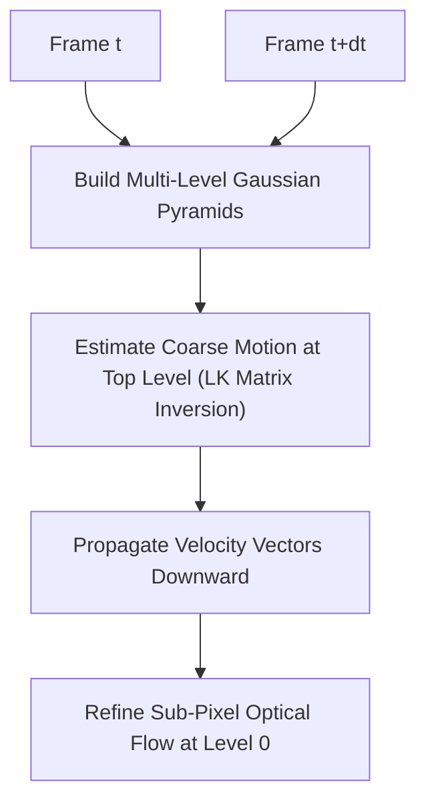
```mermaid
flowchart TD
    F1["Frame t"] & F2["Frame t+dt"] --> PYR["Build Multi-Level Gaussian Pyramids"]
    PYR --> TOP["Estimate Coarse Motion at Top Level (LK Matrix Inversion)"]
    TOP --> PROP["Propagate Velocity Vectors Downward"]
    PROP --> FINE["Refine Sub-Pixel Optical Flow at Level 0"]
```

### Visual Demonstration & Flow Vector Field
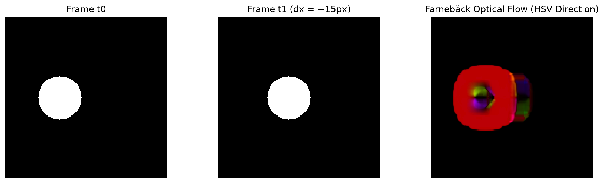

### Executable Python Example
```python
import cv2
import numpy as np
import matplotlib.pyplot as plt

# 1. Create two consecutive frames simulating motion
frame1 = np.zeros((150, 150), dtype=np.uint8)
cv2.rectangle(frame1, (30, 30), (70, 70), 200, -1)

# Frame 2: Object translated by dx=+8px, dy=+4px
frame2 = np.zeros((150, 150), dtype=np.uint8)
cv2.rectangle(frame2, (38, 34), (78, 74), 200, -1)

# 2. Extract Shi-Tomasi corners on Frame 1
p0 = cv2.goodFeaturesToTrack(frame1, maxCorners=20, qualityLevel=0.01, minDistance=5)

# 3. Calculate Lucas-Kanade Sparse Optical Flow
p1, st, err = cv2.calcOpticalFlowPyrLK(frame1, frame2, p0, None, winSize=(15, 15), maxLevel=2)

# Select valid tracked points
good_old = p0[st == 1]
good_new = p1[st == 1]

# 4. Dense Optical Flow (Farneback)
flow = cv2.calcOpticalFlowFarneback(frame1, frame2, None, 0.5, 3, 15, 3, 5, 1.2, 0)
mag, ang = cv2.cartToPolar(flow[..., 0], flow[..., 1])

# Convert Dense Flow to HSV color wheel visualization
hsv = np.zeros((150, 150, 3), dtype=np.uint8)
hsv[..., 0] = ang * 180 / np.pi / 2 # Hue = Angle
hsv[..., 1] = 255                  # Saturation = Max
hsv[..., 2] = cv2.normalize(mag, None, 0, 255, cv2.NORM_MINMAX) # Value = Speed
dense_vis = cv2.cvtColor(hsv, cv2.COLOR_HSV2BGR)

# 5. Display comparison
vis_sparse = cv2.cvtColor(frame2, cv2.COLOR_GRAY2BGR)
for old, new in zip(good_old, good_new):
    a, b = int(new[0]), int(new[1])
    c, d = int(old[0]), int(old[1])
    cv2.arrowedLine(vis_sparse, (c, d), (a, b), (0, 255, 0), 2, tipLength=0.3)

fig, axs = plt.subplots(1, 2, figsize=(10, 4))
axs[0].imshow(cv2.cvtColor(vis_sparse, cv2.COLOR_BGR2RGB)); axs[0].set_title("Lucas-Kanade Sparse Flow Vectors")
axs[1].imshow(cv2.cvtColor(dense_vis, cv2.COLOR_BGR2RGB)); axs[1].set_title("Farneback Dense Flow (HSV Wheel)")
for ax in axs: ax.axis("off")
plt.tight_layout()
plt.show()

mean_dx = np.mean(good_new[:, 0] - good_old[:, 0])
mean_dy = np.mean(good_new[:, 1] - good_old[:, 1])
print(f"Tracked {len(good_new)} sparse points. Mean Motion Vector: dx={mean_dx:.2f}px, dy={mean_dy:.2f}px")
```

### Line-by-Line Explanation
1. `p0 = cv2.goodFeaturesToTrack(...)`: Identifies salient corner points in `frame1` suitable for Lucas-Kanade tracking.
2. `cv2.calcOpticalFlowPyrLK(...)`: Traces each corner across the image pyramid from `frame1` to `frame2`.
3. `st == 1`: Filters out points that were lost or moved out of the frame.
4. `flow = cv2.calcOpticalFlowFarneback(...)`: Computes dense velocity matrices `flow[..., 0]` ($u$) and `flow[..., 1]` ($v$) for every pixel.
5. `cv2.cartToPolar(...)`: Converts Cartesian $(u, v)$ velocity vectors into magnitude and angle for HSV visualization.

### Common Mistakes & Important Tips
- **The Large Motion Trap:** If an object moves faster than the window size without pyramids, standard Lucas-Kanade cannot track it. Always configure multi-scale pyramids (`maxLevel=3` or `4`).
- **Brightness Changes:** Optical flow assumes brightness constancy. Sudden flashes of light, shadows, or auto-exposure camera adjustments violate this assumption and create false flow vectors.

### Real-World & Robotics Perception Relevance
- **Visual Odometry in Drones (PX4 / ArduPilot):** Optical flow downward-facing cameras (like PMW3901) track ground texture motion to keep quadcopters hovering perfectly stationary in GPS-denied indoor environments.
- **Time-to-Collision (TTC) in ADAS:** Divergence of optical flow vectors indicates whether an obstacle is expanding in the field of view, allowing vehicles to trigger autonomous emergency braking.

### Interview Questions & Detailed Answers
1. **Q: Explain the Aperture Problem in optical flow and how Lucas-Kanade overcomes it.**
   - *Answer:* The optical flow constraint equation $I_x u + I_y v + I_t = 0$ provides 1 equation with 2 unknowns $(u, v)$, meaning motion parallel to an edge cannot be resolved through a local 1D aperture. Lucas-Kanade overcomes this by assuming that all $N$ pixels in a local 2D window share the same velocity vector $(u, v)$. This creates an overdetermined linear system of $N$ equations: $\mathbf{A} \mathbf{v} = \mathbf{b}$, which can be solved via least squares as $\mathbf{v} = (\mathbf{A}^T \mathbf{A})^{-1} \mathbf{A}^T \mathbf{b}$, provided the region contains 2D texture (non-singular Harris tensor $\mathbf{A}^T \mathbf{A}$).
2. **Q: Why does the pyramidal implementation of Lucas-Kanade enable tracking of fast-moving objects?**
   - *Answer:* Taylor series approximation assumes infinitesimal displacements ($u, v \ll 1$ pixel). Fast motion violates this assumption. In an image pyramid downsampled by a factor of $2^L$, a rapid 16-pixel motion at Level 0 becomes a tiny 1-pixel motion at Level 4. The coarse motion is estimated at Level 4 and used as an initial guess to iteratively refine velocities down to Level 0.

### Mini Exercise with Solution
**Task:** Write a function that estimates the camera's mean horizontal and vertical egomotion velocities between two frames using sparse Lucas-Kanade optical flow.

```python
import cv2
import numpy as np

def estimate_egomotion(prev_gray: np.ndarray, curr_gray: np.ndarray) -> tuple[float, float]:
    # Extract good features
    p0 = cv2.goodFeaturesToTrack(prev_gray, maxCorners=100, qualityLevel=0.01, minDistance=10)
    if p0 is None or len(p0) < 5:
        return 0.0, 0.0
    
    # Compute LK optical flow
    p1, st, _ = cv2.calcOpticalFlowPyrLK(prev_gray, curr_gray, p0, None, winSize=(21, 21), maxLevel=3)
    
    good_old = p0[st == 1]
    good_new = p1[st == 1]
    
    if len(good_new) == 0:
        return 0.0, 0.0
    
    displacements = good_new - good_old
    median_dx = float(np.median(displacements[:, 0]))
    median_dy = float(np.median(displacements[:, 1]))
    return median_dx, median_dy
```

---

## 20. Camera Calibration

### Definition & Intuitive Analogy
**Camera Calibration** is the mathematical process of discovering a physical camera's internal optical properties (focal lengths, optical center, and lens distortion) and estimating its position and orientation in 3D space.

> **Intuitive Analogy:** Imagine wearing prescription eyeglasses that have a slight warp around the edges. Before you can measure the true size and distance of objects you see through those glasses, you need an optometrist to measure the exact curvature and distortion of your lenses. Camera calibration is the digital optometrist measuring your camera's optical prescription.


### 💡 The Big Picture in Plain English (Beginner Friendly)

- **What is it in 1 simple sentence?** Camera calibration is discovering your physical camera's optical focal length, optical center, and lens curvature distortion so you can measure true real-world metric distances in meters.
- **Why do we need this? (The Problem):** Camera lenses are curved pieces of glass. Wide-angle lenses bend straight lines into curved arcs (barrel distortion). If a self-driving car doesn't calibrate its camera, it will miscalculate the distance to an obstacle by several meters!
- **How to picture it in your head (Mental Model):**
  - Imagine you are wearing someone else's warped eyeglasses. Everything looks distorted. Calibration is the optometrist measuring the exact curvature prescription of the glass so you can digitally "un-warp" the image back to perfect geometry.
  - **The Pinhole Model:** Light rays travel from 3D objects through a tiny pinhole and project upside-down onto the sensor plane.
  - **Intrinsic Matrix $\mathbf{K}$:** Contains the focal length ($f_x, f_y$ - zoom level) and the principal point ($c_x, c_y$ - optical center where the lens axis pierces the silicon sensor).
- **Step-by-Step Walkthrough with Easy Numbers:**
  - 3D point in front of camera: $X = 0.4	ext{ m}$, $Y = 0.2	ext{ m}$, depth $Z = 2.0	ext{ m}$.
  - Camera focal length $f_x = f_y = 1000	ext{ px}$, center $c_x = 640, c_y = 360$.
  - 2D pixel coordinates:
    - $u = f_x \cdot rac{X}{Z} + c_x = 1000 \cdot rac{0.4}{2.0} + 640 = 200 + 640 = \mathbf{840	ext{ px}}$.
    - $v = f_y \cdot rac{Y}{Z} + c_y = 1000 \cdot rac{0.2}{2.0} + 360 = 100 + 360 = \mathbf{460	ext{ px}}$.
- **Beginner Trap & Rule of Thumb:** Never print a calibration checkerboard on flimsy paper that bends or warps during photography! It must be mounted on a completely flat, rigid surface (like glass or acrylic).

### Why It Is Important
Standard glass lenses are curved and introduce optical distortions (like barrel distortion in wide-angle lenses or fisheye lenses). Uncalibrated camera images will have curved lines that should be straight, distorting 3D distance and angle measurements needed for robot grasping, self-driving car localization, and augmented reality.

### Core Concept & Mathematical Intuition

#### 1. The Pinhole Camera Model
The pinhole camera model maps a 3D world point $\mathbf{P}_w = [X_w, Y_w, Z_w, 1]^T$ to a 2D pixel coordinate $\mathbf{p} = [u, v, 1]^T$:

$$\mathbf{p} = \mathbf{K} \cdot [\mathbf{R} \mid \mathbf{t}] \cdot \mathbf{P}_w$$

Where:
- **Intrinsic Matrix $\mathbf{K}_{3 \times 3}$ (Internal Camera Geometry):**
  $$\mathbf{K} = \begin{bmatrix} f_x & 0 & c_x \\ 0 & f_y & c_y \\ 0 & 0 & 1 \end{bmatrix}$$
  - $f_x, f_y$: Focal lengths in pixel units ($f_x = F \cdot m_x$ where $F$ is focal length in mm and $m_x$ is pixels/mm).
  - $(c_x, c_y)$: **Principal Point** (the physical pixel where the camera's optical optical axis pierces the sensor, typically near the image center).
- **Extrinsic Matrix $[\mathbf{R} \mid \mathbf{t}]_{3 \times 4}$ (Camera Pose in World):**
  - $\mathbf{R}$: $3 \times 3$ Rotation matrix (orientation).
  - $\mathbf{t}$: $3 \times 1$ Translation vector (position).

#### 2. Lens Distortion Models (Brown-Conrady Model)
Real glass lenses deviate from ideal pinhole geometry:
1. **Radial Distortion (Barrel & Pincushion):** Light rays bend more near the edges of a curved lens:
   $$x_{\text{corrected}} = x (1 + k_1 r^2 + k_2 r^4 + k_3 r^6)$$
   $$y_{\text{corrected}} = y (1 + k_1 r^2 + k_2 r^4 + k_3 r^6)$$
   Where $r^2 = x^2 + y^2$.
2. **Tangential Distortion (Decentering):** Occurs when the physical glass lens elements are not mounted perfectly parallel to the silicon sensor chip:
   $$x_{\text{corrected}} = x + \left[ 2 p_1 x y + p_2 (r^2 + 2 x^2) \right]$$
   $$y_{\text{corrected}} = y + \left[ p_1 (r^2 + 2 y^2) + 2 p_2 x y \right]$$

Distortion coefficient vector: $\mathbf{D} = [k_1, k_2, p_1, p_2, k_3]$.

#### 3. Zhang's Calibration Method (OpenCV Implementation)
Zhengyou Zhang (1999) proved that photographing a flat planar checkerboard target from multiple angles ($15-20$ different viewpoints) allows closed-form analytic recovery of both $\mathbf{K}$ and $\mathbf{D}$ via homography decomposition followed by non-linear Levenberg-Marquardt optimization.

### Important OpenCV Functions & Syntax
```python
# Detect checkerboard internal corners
found, corners = cv2.findChessboardCorners(
    gray_img, patternSize=(cols, rows),
    flags=cv2.CALIB_CB_ADAPTIVE_THRESH + cv2.CALIB_CB_FAST_CHECK
)

# Sub-pixel corner refinement
corners_subpix = cv2.cornerSubPix(
    gray_img, corners, winSize=(11, 11), zeroZone=(-1, -1), criteria=crit
)

# Solve for Camera Intrinsics and Distortion Coefficients
ret_rms, K, dist, rvecs, tvecs = cv2.calibrateCamera(
    objpoints, imgpoints, imageSize=(width, height),
    cameraMatrix=None, distCoeffs=None
)

# Undistort an image
undistorted_img = cv2.undistort(distorted_img, K, dist, None, new_K)
```

### Camera Calibration & Distortion Flowchart
```mermaid
flowchart LR
    WORLD["3D World Point Pw"] -->|Extrinsics [R | t]| CAM["3D Camera Frame Coordinates"]
    CAM -->|Intrinsics K| PIXEL["Ideal 2D Image Pixel (u, v)"]
    PIXEL -->|Distortion Model (k1, k2, p1, p2)| DIST["Distorted Observed Pixel (ud, vd)"]
    DIST -->|cv2.undistort| RECT["Metric Undistorted Pixel (u, v)"]
```

### Visual Demonstration & Calibration Target
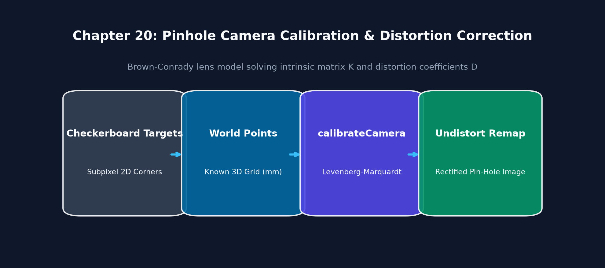

### Executable Python Example
```python
import cv2
import numpy as np
import matplotlib.pyplot as plt

# 1. Define synthetic camera intrinsic matrix K and distortion coefficients D
K_true = np.array([
    [450.0,   0.0, 160.0],
    [  0.0, 450.0, 120.0],
    [  0.0,   0.0,   1.0]
], dtype=np.float64)

# Introduce strong barrel distortion (negative k1)
dist_true = np.array([-0.35, 0.12, 0.0, 0.0, 0.0], dtype=np.float64)

# 2. Generate a clean synthetic orthogonal grid
grid = np.full((240, 320, 3), 240, dtype=np.uint8)
for x in range(20, 320, 25):
    cv2.line(grid, (x, 0), (x, 240), (100, 100, 100), 1)
for y in range(20, 240, 25):
    cv2.line(grid, (0, y), (320, y), (100, 100, 100), 1)
cv2.rectangle(grid, (45, 45), (275, 195), (0, 0, 220), 2)

# 3. Simulate lens distortion by backward mapping
h, w = grid.shape[:2]
distorted_sim = cv2.undistort(grid, K_true, -dist_true) # Inverse distortion simulation

# 4. Rectify and undistort back to true geometry using K and dist
undistorted = cv2.undistort(distorted_sim, K_true, dist_true)

# 5. Visual Comparison
fig, axs = plt.subplots(1, 3, figsize=(12, 4))
axs[0].imshow(cv2.cvtColor(grid, cv2.COLOR_BGR2RGB)); axs[0].set_title("1. Ideal Physical Grid")
axs[1].imshow(cv2.cvtColor(distorted_sim, cv2.COLOR_BGR2RGB)); axs[1].set_title("2. Lens Distortion (Barrel)")
axs[2].imshow(cv2.cvtColor(undistorted, cv2.COLOR_BGR2RGB)); axs[2].set_title("3. Undistorted & Calibrated")
for ax in axs: ax.axis("off")
plt.tight_layout()
plt.show()

print("Camera Intrinsics Matrix K:
", K_true)
print("Distortion Coefficients D:
", dist_true)
```

### Line-by-Line Explanation
1. `K_true` specifies focal lengths $f_x=450, f_y=450$ and principal point at $(c_x=160, c_y=120)$ on a $320 	imes 240$ sensor.
2. `dist_true = np.array([-0.35, 0.12, ...])` creates radial barrel distortion where straight lines bend outwards.
3. `cv2.undistort(distorted_sim, K_true, dist_true)` reverses the polynomial distortion equation, straightening all curved lines back to metric ground truth.

### Common Mistakes & Important Tips
- **Pattern Size is Internal Corners:** In `cv2.findChessboardCorners`, `patternSize=(cols, rows)` counts the **interior line intersections**, NOT the number of black/white square blocks. For an $8 	imes 6$ square board, `patternSize = (7, 5)`.
- **Calibration Diversity:** When capturing checkerboard frames for calibration, you must tilt the board in various orientations (yaw, pitch, roll) and cover all 4 corners of the image frame to accurately compute distortion parameters $k_1, k_2$.

### Real-World & Robotics Perception Relevance
- **Visual SLAM and 3D Voxel Mapping:** Calibrated intrinsics $\mathbf{K}$ are required to back-project 2D pixel coordinates $(u, v)$ with depth $Z$ into metric 3D point clouds in robot coordinates:
  $$X = rac{(u - c_x) Z}{f_x}, \quad Y = rac{(v - c_y) Z}{f_y}$$

### Interview Questions & Detailed Answers
1. **Q: What do the individual parameters in the $3 	imes 3$ Camera Intrinsic Matrix $\mathbf{K}$ represent?**
   - *Answer:* $f_x$ and $f_y$ are the camera focal lengths expressed in pixel units along the sensor horizontal and vertical axes (accounting for non-square pixel aspect ratios if $f_x 
eq f_y$). $c_x$ and $c_y$ are the 2D pixel coordinates of the Principal Point (where the central optical ray intersects the sensor array). The bottom row $[0, 0, 1]$ normalizes homogeneous projection.
2. **Q: What is Reprojection Error and what constitutes a good calibration result?**
   - *Answer:* Reprojection error is the Euclidean distance in pixels between the detected 2D corners in the calibration image and the 3D world target points projected back into the image plane using the estimated $\mathbf{K}, \mathbf{R}, \mathbf{t}, \mathbf{D}$:
     $$	ext{RMS Error} = \sqrt{rac{1}{N} \sum_{i=1}^{N} \| \mathbf{p}_i - \hat{\mathbf{p}}_i \|^2}$$
     In production robotics and vision pipelines, an RMS reprojection error $< 0.5$ pixels is considered high quality.

### Mini Exercise with Solution
**Task:** Write a function that takes a pixel coordinate $(u, v)$ and known depth $Z$ (in meters), and projects it into 3D camera coordinates $(X, Y, Z)$ using intrinsic matrix $\mathbf{K}$.

```python
import numpy as np

def pixel_to_3d_point(u: float, v: float, Z: float, K: np.ndarray) -> np.ndarray:
    fx = K[0, 0]
    fy = K[1, 1]
    cx = K[0, 2]
    cy = K[1, 2]
    
    # Back-projection equations
    X = (u - cx) * Z / fx
    Y = (v - cy) * Z / fy
    return np.array([X, Y, Z], dtype=np.float64)

# Example: Pixel (200, 150) at 2.5 meters depth
K_test = np.array([[500, 0, 320], [0, 500, 240], [0, 0, 1]], dtype=np.float64)
pt_3d = pixel_to_3d_point(200, 150, Z=2.5, K=K_test)
print(f"3D Point in camera frame: X={pt_3d[0]:.3f}m, Y={pt_3d[1]:.3f}m, Z={pt_3d[2]:.3f}m")
```

---

## 21. Camera Pose & 3D Geometry

### Definition & Intuitive Analogy
**Camera Pose Estimation** is the mathematical task of finding the exact 3D position $(t_x, t_y, t_z)$ and orientation angles (roll, pitch, yaw) of a camera relative to a known 3D object or world coordinate frame.

> **Intuitive Analogy:** Imagine holding a GPS receiver inside a room where satellites don't work. If you know the exact 3D positions of 4 light bulbs on the ceiling, and you photograph them with your camera, **Perspective-n-Point (PnP)** math calculates exactly where your camera is standing in the room down to the millimeter.


### 💡 The Big Picture in Plain English (Beginner Friendly)

- **What is it in 1 simple sentence?** Perspective-n-Point (PnP) is calculating the exact 3D position $(X, Y, Z)$ and 3D orientation (tilt angles) of an object relative to your camera using known landmark points.
- **Why do we need this? (The Problem):** Detecting a 2D bounding box around an engine component or an airplane fuel port isn't enough for a robot arm. The robot needs to know: *"Is the object exactly 42 centimeters forward, tilted 15 degrees up, and facing 5 degrees to the left?"*.
- **How to picture it in your head (Mental Model):**
  - Imagine you are a detective looking at a photograph of the Eiffel Tower. Because you know the physical 3D dimensions of the Eiffel Tower's 4 corner pillars, you can calculate the exact GPS coordinates and altitude where the photographer stood when taking the photo!
  - `cv2.solvePnP` takes 3D landmark points on the object and their matching 2D pixel locations in the image, outputting rotation vector $\mathbf{r}$ and translation vector $\mathbf{t}$.
- **Step-by-Step Walkthrough with Easy Numbers:**
  - Translation vector output: $\mathbf{t} = [0.10, -0.05, 1.50]^T$.
  - Meaning in metric real-world space: The object is located $10	ext{ cm}$ to the right ($+X$), $5	ext{ cm}$ above the camera ($-Y$ in camera coordinates), and exactly $1.50	ext{ meters}$ directly in front of the lens ($+Z$)!
- **Beginner Trap & Rule of Thumb:** `solvePnP` returns a 3-element **rotation vector** (axis-angle representation), NOT Euler angles or a $3 	imes 3$ matrix! Always use `cv2.Rodrigues(rvec)[0]` to convert it into a standard $3 	imes 3$ rotation matrix.

### Why It Is Important
Camera pose is the core computation in:
1. **Autonomous Robot Docking & Navigation:** Estimating robot pose relative to charging docks.
2. **Augmented Reality (AR):** Aligning virtual 3D characters onto a table surface.
3. **Epipolar Geometry in Stereo Vision:** Calculating 3D depth from multiple camera views.

### Core Concept & Mathematical Intuition

#### 1. The Perspective-n-Point (PnP) Problem
Given a set of $n$ known 3D world points $\mathbf{P}_i = (X_i, Y_i, Z_i)$ and their corresponding 2D image pixel coordinates $\mathbf{p}_i = (u_i, v_i)$, find the 6-DOF camera pose $[\mathbf{R} \mid \mathbf{t}]$ such that:

$$s \begin{bmatrix} u_i \\ v_i \\ 1 \end{bmatrix} = \mathbf{K} \left( \mathbf{R} \begin{bmatrix} X_i \\ Y_i \\ Z_i \end{bmatrix} + \mathbf{t} \right)$$

- **Minimum Points:** $n = 3$ points (**P3P**) yields up to 4 ambiguous solutions. $n \ge 4$ points (**EPnP / PnP**) provides a unique, closed-form linear solution.
- **RANSAC Integration (`solvePnPRansac`):** Essential in real perception to discard false 2D-to-3D feature matches.

#### 2. Rodrigues Rotation Formula (`cv2.Rodrigues`)
A $3 \times 3$ orthogonal rotation matrix $\mathbf{R}$ has 9 numbers but only 3 degrees of freedom. A **Rodrigues vector** $\mathbf{r} = [r_x, r_y, r_z]^T$ represents rotation as a compact 3D vector:
- **Direction of $\mathbf{r}$:** The unit axis of rotation $\mathbf{n} = \mathbf{r} / \|\mathbf{r}\|$.
- **Magnitude $\|\mathbf{r}\| = \theta$:** The angle of rotation in radians around that axis.

$$\mathbf{R} = \cos(\theta) \mathbf{I} + (1 - \cos\theta) \mathbf{n} \mathbf{n}^T + \sin(\theta) [\mathbf{n}]_{\times}$$

#### 3. Two-View Epipolar Geometry
When two cameras observe the same 3D scene point $\mathbf{X}$:
- **Epipolar Plane:** The plane formed by the 3D point $\mathbf{X}$ and the two camera optical centers $\mathbf{C}_1, \mathbf{C}_2$.
- **Epipolar Lines:** The intersection of the epipolar plane with the image sensors. A point $x$ in Image 1 is constrained to lie along the epipolar line $l' = \mathbf{F} x$ in Image 2!
- **Fundamental Matrix $\mathbf{F}_{3 \times 3}$ (Uncalibrated):**
  $$x'^T \mathbf{F} x = 0$$
- **Essential Matrix $\mathbf{E}_{3 \times 3}$ (Calibrated with $\mathbf{K}$):**
  $$x_{\text{norm}}'^T \mathbf{E} x_{\text{norm}} = 0, \quad \mathbf{E} = [\mathbf{t}]_{\times} \mathbf{R} = \mathbf{K}'^T \mathbf{F} \mathbf{K}$$

### Important OpenCV Functions & Syntax
```python
# Solve PnP pose (Returns rotation vector rvec and translation vector tvec)
success, rvec, tvec = cv2.solvePnP(
    objectPoints=pts_3d_Nx3, imagePoints=pts_2d_Nx2,
    cameraMatrix=K, distCoeffs=dist, flags=cv2.SOLVEPNP_ITERATIVE
)

# Robust PnP with RANSAC
success, rvec, tvec, inliers = cv2.solvePnPRansac(
    objectPoints=pts_3d_Nx3, imagePoints=pts_2d_Nx2,
    cameraMatrix=K, distCoeffs=dist, reprojectionError=2.0
)

# Convert 3x1 Rodrigues vector <-> 3x3 Rotation matrix
R_mat, jacobian = cv2.Rodrigues(rvec)

# Two-View Essential Matrix & Pose Recovery
E, mask = cv2.findEssentialMat(pts1, pts2, K, method=cv2.RANSAC, prob=0.999, threshold=1.0)
num_inliers, R, t, mask_pose = cv2.recoverPose(E, pts1, pts2, K)
```

### Camera Pose & Epipolar Geometry Architecture
```mermaid
flowchart TD
    subgraph PnP ["Perspective-n-Point (6-DOF Localization)"]
        PTS3D["Known 3D World Points"] & PTS2D["Detected 2D Image Pixels"] --> SOLVE["cv2.solvePnPRansac"]
        SOLVE --> POSE["Rotation rvec & Translation tvec"]
    end
    subgraph Epipolar ["Two-View Epipolar Geometry"]
        V1["View 1: Point x"] & V2["View 2: Point x'"] --> FUND["x'^T F x = 0
Fundamental / Essential Matrix"]
        FUND --> EPI["Epipolar Line Constraint: l' = F x"]
    end
```

### Visual Demonstration & Epipolar Geometry
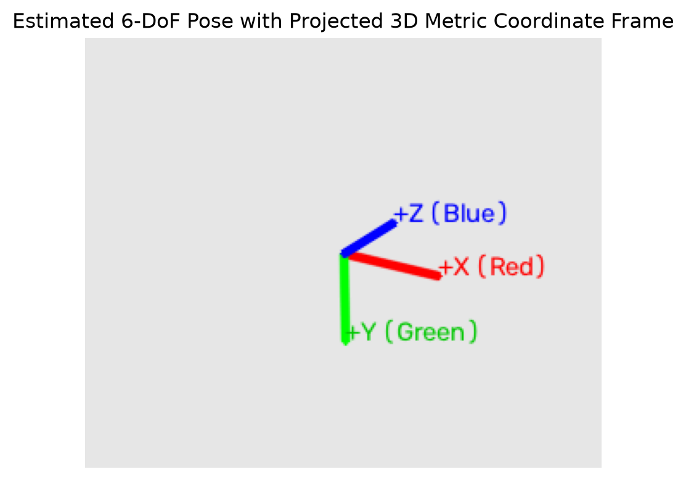

### Executable Python Example
```python
import cv2
import numpy as np

# 1. Known 3D world coordinates of a planar object (e.g. 10cm x 10cm square on table)
# Z = 0 for all points on the planar surface
obj_pts_3d = np.array([
    [-0.05, -0.05, 0.0],
    [ 0.05, -0.05, 0.0],
    [ 0.05,  0.05, 0.0],
    [-0.05,  0.05, 0.0]
], dtype=np.float64)

# 2. Synthetic Camera Intrinsics
K = np.array([
    [600.0,   0.0, 320.0],
    [  0.0, 600.0, 240.0],
    [  0.0,   0.0,   1.0]
], dtype=np.float64)
dist = np.zeros(5, dtype=np.float64)

# 3. Ground truth camera pose: Camera located at (0, 0, 1.0m) looking at object
rvec_true = np.array([0.2, 0.1, 0.0], dtype=np.float64) # Slight tilt
tvec_true = np.array([0.0, 0.0, 1.0], dtype=np.float64) # 1.0 meter away

# Project 3D points to 2D image coordinates using Ground Truth pose
img_pts_2d, _ = cv2.projectPoints(obj_pts_3d, rvec_true, tvec_true, K, dist)
img_pts_2d = img_pts_2d.reshape(-1, 2)

# 4. Recover Camera Pose using solvePnP
success, rvec_est, tvec_est = cv2.solvePnP(obj_pts_3d, img_pts_2d, K, dist)

# 5. Convert Rodrigues vector to 3x3 Rotation Matrix
R_est, _ = cv2.Rodrigues(rvec_est)

print("PnP Pose Recovery Success:", success)
print("Estimated Translation Vector t (meters):
", np.round(tvec_est.ravel(), 4))
print("Ground Truth Translation Vector t:
", tvec_true)
print("Estimated 3x3 Rotation Matrix R:
", np.round(R_est, 3))
```

### Line-by-Line Explanation
1. `obj_pts_3d`: Metric physical measurements of target corners in meters.
2. `cv2.projectPoints(...)`: Forward-projects 3D world vertices through the pinhole camera geometry to generate synthetic 2D pixel coordinates.
3. `cv2.solvePnP(...)`: Inverts the perspective equations to compute the 6-DOF camera pose `rvec_est` and `tvec_est`.
4. `cv2.Rodrigues(rvec_est)`: Converts the compact 3-element rotation vector into a standard $3 	imes 3$ orthonormal rotation matrix $\mathbf{R}$.

### Common Mistakes & Important Tips
- **Coordinate System Units:** World coordinates and translation vectors share the exact same physical units. If `obj_pts_3d` is specified in millimeters, `tvec` will be returned in millimeters. If specified in meters, `tvec` will be in meters. Always maintain consistent metric units.
- **Ambiguity in Planar P3P:** Estimating pose from only 3 planar points has multiple geometric reflections. Always use at least 4 coplanar points (`SOLVEPNP_IPPE` or `SOLVEPNP_ITERATIVE`).

### Real-World & Robotics Perception Relevance
- **Robot Arm Visual Servoing:** Hand-eye cameras on robotic arms use PnP to track object handles and align the gripper for precision grasping.
- **Autonomous Drone Landing:** Drones detect ground helipad fiducial patterns, run `solvePnP` to measure distance and orientation, and execute precision autonomous landings.

### Interview Questions & Detailed Answers
1. **Q: Explain the fundamental difference between the Essential Matrix $\mathbf{E}$ and the Fundamental Matrix $\mathbf{F}$.**
   - *Answer:* The Fundamental Matrix $\mathbf{F}$ operates on raw uncalibrated pixel coordinates ($x'^T \mathbf{F} x = 0$) and encapsulates both the camera intrinsics ($\mathbf{K}, \mathbf{K}'$) and extrinsic relative pose ($[\mathbf{R} \mid \mathbf{t}]$). The Essential Matrix $\mathbf{E} = \mathbf{K}'^T \mathbf{F} \mathbf{K}$ operates on normalized metric camera coordinates ($x_{	ext{norm}}'^T \mathbf{E} x_{	ext{norm}} = 0$) and isolates purely the geometric 3D rotation $\mathbf{R}$ and translation direction $\mathbf{t}$ between the two camera viewpoints.
2. **Q: Why does Essential Matrix decomposition (`cv2.recoverPose`) produce translation $\mathbf{t}$ only up to an unknown scale factor in monocular vision?**
   - *Answer:* In a single monocular camera, a small object moving close to the lens produces identical pixel motion to a huge object moving far away at high speed (scale ambiguity). The epipolar constraint $x'^T [\mathbf{t}]_{	imes} \mathbf{R} x = 0$ is homogeneous: multiplying $\mathbf{t}$ by any scalar $s > 0$ yields the identical matrix $\mathbf{E}$. Metric scale can only be recovered using a calibrated stereo baseline, IMU sensor fusion, or known fiducial marker dimensions.

### Mini Exercise with Solution
**Task:** Write a function that takes a recovered rotation matrix $\mathbf{R}$ and extracts the physical Euler angles (Roll, Pitch, Yaw) in degrees.

```python
import numpy as np

def rotation_matrix_to_euler_angles(R: np.ndarray) -> tuple[float, float, float]:
    # Extract Euler angles (XYZ sequence)
    sy = np.sqrt(R[0, 0] * R[0, 0] + R[1, 0] * R[1, 0])
    singular = sy < 1e-6
    
    if not singular:
        roll = np.arctan2(R[2, 1], R[2, 2])
        pitch = np.arctan2(-R[2, 0], sy)
        yaw = np.arctan2(R[1, 0], R[0, 0])
    else:
        roll = np.arctan2(-R[1, 2], R[1, 1])
        pitch = np.arctan2(-R[2, 0], sy)
        yaw = 0.0
        
    return np.rad2deg(roll), np.rad2deg(pitch), np.rad2deg(yaw)
```

---

## 22. Stereo Vision & Depth

### Definition & Intuitive Analogy
**Stereo Vision** is the process of estimating 3D depth from two horizontally separated cameras by finding corresponding pixels and measuring their horizontal pixel shift (**Disparity**).

> **Intuitive Analogy:** Hold your finger in front of your face. Close your left eye, then close your right eye and open the left. Your finger appears to jump horizontally against the background. Hold your finger farther away, and it jumps much less. Your brain calculates depth by measuring this jump. Stereo vision uses the exact same geometry.


### 💡 The Big Picture in Plain English (Beginner Friendly)

- **What is it in 1 simple sentence?** Stereo vision calculates 3D depth by looking at a scene through two horizontally separated cameras (like human eyes) and measuring how much objects jump sideways.
- **Why do we need this? (The Problem):** A single camera cannot tell the difference between a tiny toy car 1 foot away and a real car 100 feet away (scale ambiguity). Stereo vision triangulation solves this by measuring horizontal shift (disparity) to calculate true metric depth in meters.
- **How to picture it in your head (Mental Model):**
  - Hold your thumb 6 inches in front of your nose. Close your left eye, then close your right eye and open the left. Your thumb jumps dramatically against the background (Large Disparity = Close Object).
  - Now look at a distant building and repeat. The building barely shifts at all (Zero Disparity = Infinite Distance).
- **Step-by-Step Walkthrough with Easy Numbers:**
  - Two cameras with focal length $f = 800	ext{ pixels}$ are spaced apart by baseline $B = 0.1	ext{ meters}$ ($10	ext{ cm}$).
  - An object appears at pixel $x_L = 450$ in the left camera and $x_R = 410$ in the right camera.
  - Disparity: $d = x_L - x_R = 450 - 410 = \mathbf{40	ext{ pixels}}$.
  - Depth formula: $Z = rac{f \cdot B}{d} = rac{800 	imes 0.1}{40} = rac{80}{40} = \mathbf{2.0	ext{ meters}}$!
- **Beginner Trap & Rule of Thumb:** Stereo matching requires that matching pixels lie on the exact same horizontal row (epipolar line). Always calibrate and run stereo rectification (`cv2.stereoRectify`) first; otherwise, block matching will fail completely.

### Why It Is Important
Stereo vision provides dense, direct 3D depth maps without emitting active laser or infrared signals (passive sensing). It is used extensively in autonomous vehicles (Subaru EyeSight), space exploration rovers (NASA Mars Perseverance Rover), and agricultural robotics.

### Core Concept & Mathematical Intuition

#### 1. Stereo Triangulation & The Disparity-to-Depth Formula
For two perfectly rectified cameras separated by horizontal **Baseline distance $B$** with focal length $f$:

$$Z = \frac{f \cdot B}{d} = \frac{f \cdot B}{x_L - x_R}$$

Where:
- $Z$: Perpendicular 3D metric depth to the point (in meters).
- $f$: Camera focal length in pixel units ($f_x$).
- $B$: Physical baseline distance between the two optical centers (in meters).
- $d = x_L - x_R$: **Disparity** (the horizontal pixel coordinate difference).
- **Inverse Relationship:** As an object gets closer ($Z 	o 0$), disparity explodes ($d 	o \infty$). As an object moves to infinity ($Z 	o \infty$), disparity approaches zero ($d 	o 0$).

#### 2. Stereo Rectification
Before matching, raw stereo images have vertical misalignments and lens distortions. **Stereo Rectification (`cv2.stereoRectify`)** projects both camera images onto a common coplanar plane such that **epipolar lines become perfectly horizontal scanlines**. Corresponding pixels in the left and right images share the exact same row index $y$ ($y_L = y_R$). Searching for correspondences is reduced from a 2D search to a fast 1D horizontal scanline search!

#### 3. Semi-Global Block Matching (StereoSGBM)
Heiko Hirschmüller's **StereoSGBM** algorithm optimizes an energy function $E(D)$ across 8 directional 1D paths:
$$E(D) = \sum_p \left( C(p, D_p) + \sum_{q \in N_p} P_1 \cdot \mathbb{I}(|D_p - D_q| = 1) + \sum_{q \in N_p} P_2 \cdot \mathbb{I}(|D_p - D_q| > 1) \right)$$
- $C(p, D_p)$: Matching cost (Birchfield-Tomasi sampling).
- $P_1$: Penalty for small disparity step changes (smooth slanted surfaces).
- $P_2$: Penalty for large disparity discontinuities (object boundaries).

### Important OpenCV Functions & Syntax
```python
# Compute Stereo Rectification Transforms
R1, R2, P1, P2, Q, roi1, roi2 = cv2.stereoRectify(
    K1, dist1, K2, dist2, imageSize, R, T, flags=cv2.CALIB_ZERO_DISPARITY
)

# Initialize StereoSGBM Matcher
stereo = cv2.StereoSGBM_create(
    minDisparity=0,
    numDisparities=64, # Must be a positive integer divisible by 16!
    blockSize=5,
    P1=8 * 3 * (5**2),
    P2=32 * 3 * (5**2),
    disp12MaxDiff=1,
    uniquenessRatio=10,
    speckleWindowSize=100,
    speckleRange=32
)

# Compute Disparity Map (Output is 16-bit signed int scaled by 16)
disparity_16s = stereo.compute(rectified_left, rectified_right)
disparity_float = disparity_16s.astype(np.float32) / 16.0

# Reproject Disparity Map to 3D Point Cloud [X, Y, Z]
points_3d = cv2.reprojectImageTo3D(disparity_float, Q)
```

### Stereo Vision & Disparity Triangulation Pipeline
```mermaid
flowchart LR
    L["Left Camera Image"] & R["Right Camera Image"] --> RECT["cv2.stereoRectify
Make Epipolar Lines Horizontal"]
    RECT --> MATCH["StereoSGBM Matching
Compute Disparity d = xL - xR"]
    MATCH --> DEPTH["Metric Depth Z = (f * B) / d"]
    DEPTH --> CLOUD["cv2.reprojectImageTo3D
3D Dense Point Cloud"]
```

### Visual Demonstration & Stereo Epipolar Rectification
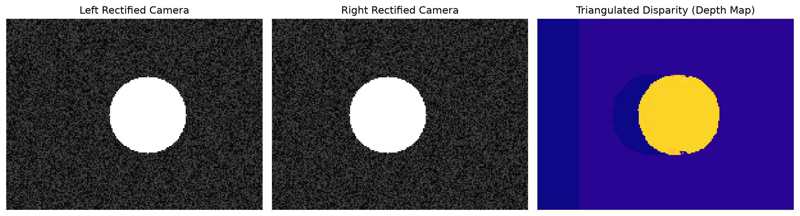

### Executable Python Example
```python
import cv2
import numpy as np
import matplotlib.pyplot as plt

# 1. Simulate a rectified stereo image pair observing a square obstacle
# Synthetic baseline B = 0.2m, focal length f = 300px
h, w = 150, 200
left_img = np.full((h, w), 80, dtype=np.uint8)
right_img = np.full((h, w), 80, dtype=np.uint8)

# Add textured background to facilitate stereo block matching
noise = np.random.randint(0, 40, (h, w), dtype=np.uint8)
left_img = cv2.add(left_img, noise)
right_img = cv2.add(right_img, noise)

# Render an obstacle: In left image at x=60, in right image shifted left to x=40 (Disparity = 20px)
obstacle_tex = np.random.randint(180, 240, (50, 50), dtype=np.uint8)
left_img[50:100, 60:110] = obstacle_tex
right_img[50:100, 40:90] = obstacle_tex # Horizontal shift of 20px

# 2. Compute Disparity via StereoSGBM
stereo = cv2.StereoSGBM_create(
    minDisparity=0,
    numDisparities=32, # Must be divisible by 16
    blockSize=5,
    P1=8 * 1 * 25,
    P2=32 * 1 * 25,
    uniquenessRatio=5
)
disp_16s = stereo.compute(left_img, right_img)
disp_map = disp_16s.astype(np.float32) / 16.0

# 3. Calculate Metric Depth Map Z = (f * B) / d
B_metric = 0.2  # 20 cm baseline
f_metric = 300.0 # 300 px focal length
depth_map = np.zeros_like(disp_map)
valid_mask = disp_map > 0
depth_map[valid_mask] = (f_metric * B_metric) / disp_map[valid_mask]

# 4. Display results
fig, axs = plt.subplots(1, 3, figsize=(12, 4))
axs[0].imshow(left_img, cmap="gray"); axs[0].set_title("1. Left Camera View")
axs[1].imshow(disp_map, cmap="jet"); axs[1].set_title("2. Disparity Map (d = xL - xR)")
axs[2].imshow(depth_map, cmap="plasma_r", vmin=0.5, vmax=5.0); axs[2].set_title("3. Metric Depth Z (Meters)")
for ax in axs: ax.axis("off")
plt.tight_layout()
plt.show()

measured_d = np.median(disp_map[55:95, 65:105])
measured_z = np.median(depth_map[55:95, 65:105])
print(f"Obstacle Disparity: {measured_d:.1f} pixels -> Calculated Metric Depth: {measured_z:.2f} meters")
```

### Line-by-Line Explanation
1. `right_img[50:100, 40:90] = obstacle_tex` places the object 20 pixels to the left in the right camera view, modeling disparity.
2. `stereo.compute(left_img, right_img)` evaluates matching costs along horizontal scanlines.
3. `disp_16s.astype(np.float32) / 16.0`: StereoSGBM outputs disparity in $1/16$-th sub-pixel units stored in a 16-bit integer; dividing by 16 converts it back to true pixel disparity.
4. `depth_map[valid_mask] = (f_metric * B_metric) / disp_map[valid_mask]` converts pixel disparity into metric meters.

### Common Mistakes & Important Tips
- **The `numDisparities` Divisibility Requirement:** `numDisparities` in StereoSGBM **must be a positive integer divisible by 16** (e.g., $16, 32, 64, 128$). Any other number causes a C++ assertion failure.
- **Textureless Surfaces Fail in Passive Stereo:** White walls or untextured tables have no distinct pixel intensity patterns. Matching cost curves become flat, causing passive stereo to fail. In robotics, active stereo cameras (like RealSense D435) project an invisible infrared dot pattern onto walls to create artificial texture.

### Real-World & Robotics Perception Relevance
- **NASA Mars Perseverance Rover Navigation:** The rover uses stereo vision hazard cameras (HazCams) and navigation cameras (NavCams) to build 3D digital elevation terrain maps and drive autonomously over Martian rocks.

### Interview Questions & Detailed Answers
1. **Q: Derive the stereo depth formula $Z = rac{f \cdot B}{d}$ from similar triangles.**
   - *Answer:* Let two pinhole cameras with focal length $f$ be separated by baseline $B$ along the $X$-axis. A 3D point $\mathbf{P} = (X, Y, Z)$ projects to left image coordinate $x_L = f rac{X}{Z}$ and right image coordinate $x_R = f rac{X - B}{Z}$. Subtracting the two equations gives disparity $d = x_L - x_R = f rac{X}{Z} - f rac{X - B}{Z} = rac{f \cdot B}{Z}$. Rearranging terms yields $Z = rac{f \cdot B}{d}$.
2. **Q: Why is disparity resolution non-linear with respect to depth?**
   - *Answer:* Taking the derivative $rac{dZ}{dd} = -rac{f \cdot B}{d^2} = -rac{Z^2}{f \cdot B}$ shows that depth error $\Delta Z$ grows **quadratically with distance $Z^2$**. A 1-pixel disparity error at 1 meter causes a depth error of only a few millimeters, but at 50 meters, a 1-pixel disparity error causes a depth uncertainty of several meters.

### Mini Exercise with Solution
**Task:** Calculate the minimum detectable depth difference $\Delta Z$ for an object at $Z = 5.0$ meters given a stereo camera with focal length $f = 600$ pixels, baseline $B = 0.2$ meters, and sub-pixel disparity resolution $\Delta d = 0.0625$ pixels ($1/16$ pixel).

```python
def calculate_depth_resolution(Z: float, f: float, B: float, delta_d: float = 1/16.0) -> float:
    # Derivative: |dZ| = (Z^2 / (f * B)) * delta_d
    delta_Z = (Z ** 2) / (f * B) * delta_d
    return delta_Z

delta_z = calculate_depth_resolution(Z=5.0, f=600.0, B=0.2, delta_d=0.0625)
print(f"At 5.0m distance, depth resolution is: {delta_z * 1000:.1f} mm")
```

---

## 23. ArUco & Fiducial Markers

### Definition & Intuitive Analogy
**ArUco markers** are synthetic square 2D planar fiducial markers composed of an outer black border and an inner binary matrix that encodes a unique numerical identifier.

> **Intuitive Analogy:** Think of an ArUco marker like a high-tech QR code designed specifically for 3D robotics. Its sharp square corners allow a robot to calculate the marker's exact 3D distance, tilt, and orientation in space in under 1 millisecond.


### 💡 The Big Picture in Plain English (Beginner Friendly)

- **What is it in 1 simple sentence?** ArUco markers are synthetic square black-and-white barcodes with wide black borders that cameras can detect instantly to measure 3D position and orientation with millimeter precision.
- **Why do we need this? (The Problem):** Natural feature tracking fails in plain rooms with blank white walls and no texture. Placing ArUco markers on warehouse shelves, charging pads, or drone landing targets gives robots infallible visual beacons.
- **How to picture it in your head (Mental Model):**
  - Think of an ArUco marker like an aircraft carrier runway crosshair.
  - The wide black outer border allows OpenCV to detect the 4 corners in under 1 millisecond.
  - The internal black-and-white grid encodes a binary number using Hamming error correction, so the robot knows whether it's looking at Tag #4 or Tag #42, even if part of the tag is dirty.
- **Step-by-Step Walkthrough with Easy Numbers:**
  - Camera detects tag corners at $(100, 100), (200, 100), (200, 200), (100, 200)$ ($100	ext{ px}$ wide on screen).
  - Given physical marker size $L = 0.05	ext{ m}$ ($5	ext{ cm}$) and focal length $f = 1000	ext{ px}$:
  - Approximate distance: $Z pprox rac{f \cdot L}{	ext{pixel size}} = rac{1000 	imes 0.05}{100} = \mathbf{0.50	ext{ meters}}$.
- **Beginner Trap & Rule of Thumb:** ArUco dictionary mismatch! If your printed tag is from `DICT_6X6_250`, but your code initializes `DICT_4X4_50`, OpenCV will detect 0 markers. Make sure the dictionary type matches the printed tag!

### Why It Is Important
Natural feature detection can be slow and unstable in dim or textureless environments. ArUco markers provide instantaneous, 100% reliable 6-DOF ground-truth localization for robotic arm calibration, drone landing targets, and augmented reality anchors.

### Core Concept & Mathematical Intuition

#### 1. Binary Matrix Structure & Error Correction
An ArUco marker consists of:
1. A solid **Black Outer Border** that makes contour detection trivial under any background.
2. An **Inner $N 	imes N$ Grid** of black/white bits (e.g., $4 	imes 4, 5 	imes 5, 6 	imes 6$).
3. **Modified Hamming Code:** The bit pattern encodes a unique ID and parity bits. Even if several bits are corrupted by dirt or glare, error-correcting codes detect and recover the true ID while rejecting false positives.

#### 2. 6-DOF Pose Estimation via PnP
Once the 4 outer corner vertices $[p_1, p_2, p_3, p_4]$ are detected in the image:
- The marker's physical size in meters $L$ defines its 3D local coordinate frame:
  $$\mathbf{P}_1 = [-L/2, L/2, 0], \quad \mathbf{P}_2 = [L/2, L/2, 0], \quad \mathbf{P}_3 = [L/2, -L/2, 0], \quad \mathbf{P}_4 = [-L/2, -L/2, 0]$$
- Running closed-form PnP (`cv2.solvePnP` or `estimatePoseSingleMarkers`) calculates the 6-DOF rotation vector $\mathbf{r}$ and translation vector $\mathbf{t} = [x, y, z]$ of the marker relative to the camera.

### Important OpenCV Functions & Syntax
```python
# Select Predefined ArUco Dictionary
aruco_dict = cv2.aruco.getPredefinedDictionary(cv2.aruco.DICT_6X6_250)
aruco_params = cv2.aruco.DetectorParameters()

# OpenCV 4.7+ Detector API
detector = cv2.aruco.ArucoDetector(aruco_dict, aruco_params)
corners, ids, rejected = detector.detectMarkers(gray_img)

# Draw 2D Marker Outlines
cv2.aruco.drawDetectedMarkers(vis_img, corners, ids)

# Draw 3D Coordinate Axes (X=Red, Y=Green, Z=Blue)
cv2.drawFrameAxes(vis_img, K, dist, rvec, tvec, length=0.05)
```

### ArUco Detection & 6-DOF Localization Flowchart
```mermaid
flowchart TD
    FRAME["Camera Frame"] --> DETECT["cv2.aruco.detectMarkers
Find Black Square Borders"]
    DETECT --> PARITY["Sample Internal Binary Grid & Verify Parity Bits"]
    PARITY --> ID["Extract Unique Marker ID & 4 Sub-Pixel Corners"]
    ID --> PNP["solvePnP with Marker Metric Size L"]
    PNP --> AXES["6-DOF Translation t & Rotation R (cv2.drawFrameAxes)"]
```

### Visual Demonstration & 6-DOF Pose Axes
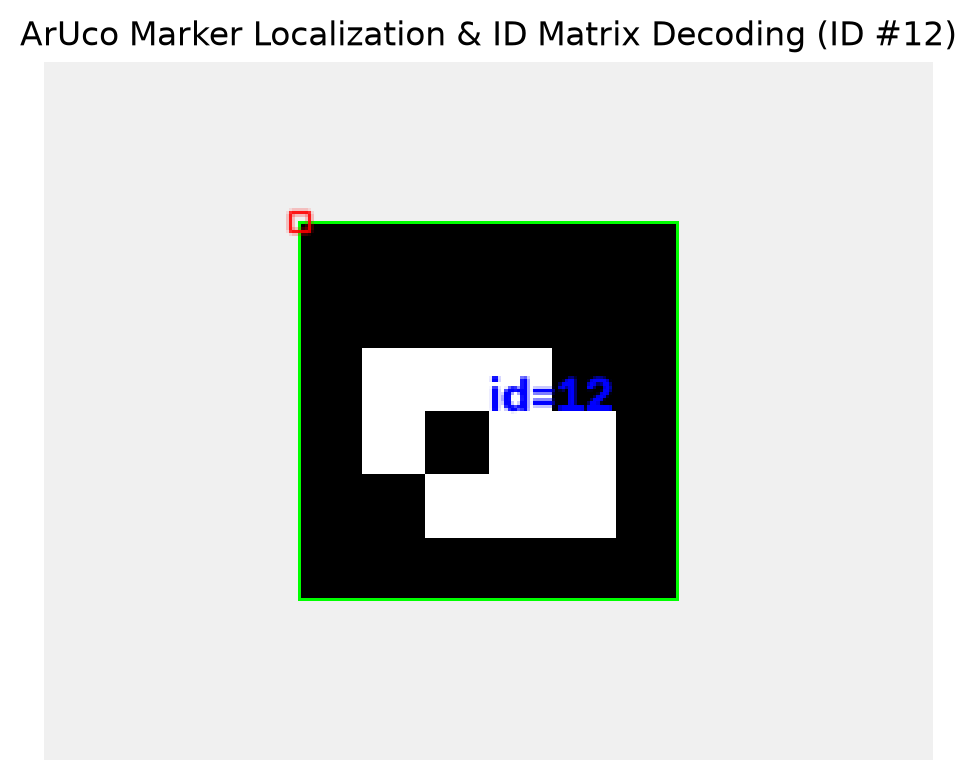

### Executable Python Example
```python
import cv2
import numpy as np
import matplotlib.pyplot as plt

# 1. Generate a synthetic 6x6 ArUco Marker (ID = 42, Size = 150x150 px)
aruco_dict = cv2.aruco.getPredefinedDictionary(cv2.aruco.DICT_6X6_250)
marker_img = cv2.aruco.generateImageMarker(aruco_dict, id=42, sidePixels=150)

# 2. Place the marker onto a synthetic canvas with rotation and perspective
canvas = np.full((250, 250), 200, dtype=np.uint8)
canvas[50:200, 50:200] = marker_img

# 3. Detect ArUco Marker
detector_params = cv2.aruco.DetectorParameters()
detector = cv2.aruco.ArucoDetector(aruco_dict, detector_params)
corners, ids, rejected = detector.detectMarkers(canvas)

# 4. Render Detected Marker and Corner Coordinates
vis = cv2.cvtColor(canvas, cv2.COLOR_GRAY2BGR)
if ids is not None:
    cv2.aruco.drawDetectedMarkers(vis, corners, ids)
    c = corners[0][0] # 4 corner vertices
    for i, pt in enumerate(c):
        cv2.circle(vis, (int(pt[0]), int(pt[1])), 4, (0, 0, 255), -1)
        cv2.putText(vis, f"C{i}", (int(pt[0])+5, int(pt[1])-5), cv2.FONT_HERSHEY_SIMPLEX, 0.4, (255, 0, 0), 1)

plt.figure(figsize=(5, 5))
plt.imshow(cv2.cvtColor(vis, cv2.COLOR_BGR2RGB))
plt.title(f"ArUco Detection: Successfully Decoded ID = {ids[0][0] if ids is not None else 'None'}")
plt.axis("off")
plt.show()

print(f"Detected ArUco Marker ID: {ids.ravel() if ids is not None else None}")
```

### Line-by-Line Explanation
1. `cv2.aruco.generateImageMarker(aruco_dict, id=42, sidePixels=150)`: Draws the ground-truth binary grid for ID 42 including border and parity bits.
2. `detector.detectMarkers(canvas)`: Detects candidate quadrangles, samples the internal grid, checks parity bits, and returns verified corner coordinates.
3. `cv2.aruco.drawDetectedMarkers(...)`: Draws the green perimeter line and displays the decoded ID in the center.

### Common Mistakes & Important Tips
- **Dictionary Mismatch:** If an image contains markers from `DICT_4X4_50` but you initialize the detector with `DICT_6X6_250`, detection will fail completely. Always ensure the detector dictionary matches the printed marker dictionary.
- **Metric Size in Pose Estimation:** When calling `estimatePoseSingleMarkers`, `markerLength` must be specified in the **exact same units** (e.g., meters) as your calibration translation vector.

### Real-World & Robotics Perception Relevance
- **Automated Guided Vehicle (AGV) Precision Docking:** AGVs navigate warehouse aisles using wheel odometry, and use floor/shelf ArUco markers to align within $\pm 1$ mm for automatic battery charging.

### Interview Questions & Detailed Answers
1. **Q: Why are ArUco markers preferred over standard QR codes for 6-DOF robotics pose estimation?**
   - *Answer:* QR codes contain dense data matrices with high bit density, requiring high-resolution imagery and significant processing time to decode. ArUco markers use minimal $4 	imes 4$ or $6 	imes 6$ grids specifically optimized for fast corner localization, high-speed detection ($>100$ FPS), and robust tracking even when viewed at extreme angles or from far distances.
2. **Q: How does the ArUco detector handle marker rotation ambiguity ($0^\circ, 90^\circ, 180^\circ, 270^\circ$)?**
   - *Answer:* The internal binary code is asymmetric across $90^\circ$ rotations. When the detector extracts the bits from a detected square, it compares all 4 possible cyclic rotations against the dictionary. Only one unique rotation produces a valid dictionary ID and matching parity bits, allowing the algorithm to assign Corner 0 unambiguously to the top-left marker vertex.

### Mini Exercise with Solution
**Task:** Write a function that generates and saves a printable grid sheet containing 4 distinct ArUco markers (IDs: 10, 11, 12, 13) for a robot calibration target.

```python
import cv2
import numpy as np

def generate_aruco_sheet() -> np.ndarray:
    dict_aruco = cv2.aruco.getPredefinedDictionary(cv2.aruco.DICT_4X4_50)
    sheet = np.full((400, 400), 255, dtype=np.uint8)
    
    positions = [(50, 50), (230, 50), (50, 230), (230, 230)]
    ids = [10, 11, 12, 13]
    
    for (x, y), marker_id in zip(positions, ids):
        marker = cv2.aruco.generateImageMarker(dict_aruco, marker_id, sidePixels=120)
        sheet[y:y+120, x:x+120] = marker
        
    return sheet
```

---

## 24. Image Segmentation

### Definition & Intuitive Analogy
**Image Segmentation** is the process of partitioning a digital image into multiple meaningful, non-overlapping visual regions or segments sharing similar color, texture, or semantic meaning.

> **Intuitive Analogy:** Imagine an aerial landscape map with mountains, rivers, and forests. Thresholding only colors pixels black or white. Segmentation is like tracing borders around every individual mountain, lake, and forest, assigning a distinct label to every pixel in the terrain.


### 💡 The Big Picture in Plain English (Beginner Friendly)

- **What is it in 1 simple sentence?** Image segmentation is carving an image into separate meaningful regions—giving every single pixel a label (like "Road", "Sidewalk", "Coin #1", "Coin #2").
- **Why do we need this? (The Problem):** If two round coins or biological cells are physically touching each other, standard thresholding merges them into a single big peanut-shaped blob. You can't count them or measure their individual shapes.
- **How to picture it in your head (Mental Model):**
  - **Distance Transform:** For every pixel inside a blob, measure how far it is from the edge. The center of each coin has the highest distance score (the mountain peak). Thresholding the peaks gives you isolated seed points for each coin!
  - **Watershed Algorithm:** Think of the image gradient as a 3D landscape of mountains (object edges) and valleys (object centers). You punch a hole in the bottom of each valley and pump colored water up. Where the red water from coin 1 meets the blue water from coin 2, you build a dam—that dam is the exact boundary separating the two touching objects!
- **Step-by-Step Walkthrough with Easy Numbers:**
  - Two touching coins of radius $30	ext{ px}$.
  - At the touching junction, distance to background is small (e.g. $5	ext{ px}$).
  - At the coin centers, distance to background is $30	ext{ px}$.
  - Thresholding distance map at $> 0.5 	imes 30 = 15	ext{ px}$ leaves two separate, detached seed circles ready for watershed expansion!
- **Beginner Trap & Rule of Thumb:** Running the Watershed algorithm without seed markers causes catastrophic over-segmentation (breaking the image into thousands of tiny puzzle pieces). Always generate confident foreground and background markers first.

### Why It Is Important
Autonomous driving (drivable road surface vs sidewalks), medical imaging (tumor boundary delineation in MRI), and robotic manipulation (separating overlapping parts) require pixel-level segmentation boundaries.

### Core Concept & Mathematical Intuition

#### 1. Watershed Segmentation Algorithm (Topological Flooding)
The Watershed algorithm treats an image as a 3D topographic relief map where pixel intensity corresponds to height/altitude:
1. **Gradient Magnitude Map:** High gradient ridges correspond to mountain peaks (object boundaries).
2. **Topological Flooding:** Virtual water is pumped into local minima (valleys).
3. **Watershed Divide Lines:** Where water from distinct valleys meets, a dam (boundary barrier) is constructed.
4. **Marker-Controlled Watershed:** Standard watershed suffers from extreme **over-segmentation** (thousands of tiny regions due to noise). OpenCV uses **user-defined or algorithm-derived markers** to initiate flooding strictly from known foreground objects and known background.

#### 2. Distance Transform (`cv2.distanceTransform`)
For every foreground pixel in a binary mask, the distance transform computes the Euclidean distance to the **nearest background (zero) pixel**:
$$D(x, y) = \min_{(x_0, y_0) \in \text{Background}} \sqrt{(x - x_0)^2 + (y - y_0)^2}$$
- The center of an object has the highest distance value. Thresholding the distance transform ($D > 0.5 \cdot \max(D)$) reliably isolates **sure foreground markers** for overlapping objects (like touching coins or biological cells).

#### 3. GrabCut Interactive Segmentation (Graph Cuts)
GrabCut (Rother et al.) formulates segmentation as an energy minimization problem over a Markov Random Field:
$$E(\alpha, k, \theta, z) = U(\alpha, k, \theta, z) + V(\alpha, z)$$
- **Data Term $U$:** Evaluates how well a pixel fits Gaussian Mixture Models (GMMs) for foreground vs background.
- **Smoothness Term $V$:** Penalizes boundary discontinuities, encouraging smooth physical object contours.
- Minimized iteratively using the **Max-Flow / Min-Cut theorem**.

### Important OpenCV Functions & Syntax
```python
# Compute Exact Euclidean Distance Transform
dist_transform = cv2.distanceTransform(binary_mask, distanceType=cv2.DIST_L2, maskSize=5)

# Marker-Based Watershed (markers must be 32-bit signed integer!)
cv2.watershed(color_img, markers=markers_32s)

# GrabCut Segmentation
mask = np.zeros(img.shape[:2], np.uint8)
bgdModel = np.zeros((1, 65), np.float64)
fgdModel = np.zeros((1, 65), np.float64)
cv2.grabCut(img, mask, rect=(x, y, w, h), bgdModel=bgdModel, fgdModel=fgdModel, iterCount=5, mode=cv2.GC_INIT_WITH_RECT)
```

### Marker-Controlled Watershed Segmentation Flowchart
```mermaid
flowchart TD
    BIN["Touching Binary Blobs"] --> DIST["cv2.distanceTransform
Euclidean Distance Map"]
    DIST --> SEEDS["Threshold Distance Peaks -> Sure Foreground Seeds"]
    BIN --> BG["Dilate Binary -> Sure Background"]
    SEEDS & BG --> MARKERS["Build Label Markers Matrix"]
    MARKERS --> WATER["cv2.watershed
Topological Flooding & Boundary Dams"]
```

### Visual Demonstration & Watershed Pipeline
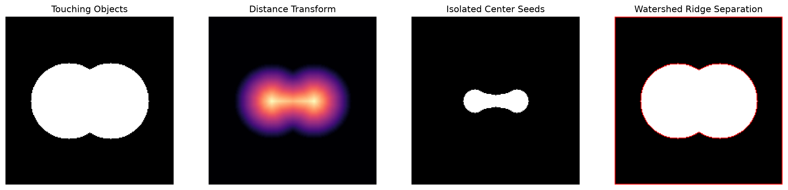

### Executable Python Example
```python
import cv2
import numpy as np
import matplotlib.pyplot as plt

# 1. Create a synthetic image of two overlapping circular objects
canvas = np.zeros((150, 150), dtype=np.uint8)
cv2.circle(canvas, (60, 75), 30, 255, -1)
cv2.circle(canvas, (90, 75), 30, 255, -1) # Overlaps with circle 1

# 2. Compute Distance Transform to find object cores
dist = cv2.distanceTransform(canvas, cv2.DIST_L2, 5)

# 3. Threshold Distance Transform to isolate sure foreground seeds
_, sure_fg = cv2.threshold(dist, 0.6 * dist.max(), 255, 0)
sure_fg = np.uint8(sure_fg)

# 4. Identify sure background by dilating mask
sure_bg = cv2.dilate(canvas, np.ones((3, 3), np.uint8), iterations=3)

# 5. Unknown boundary region
unknown = cv2.subtract(sure_bg, sure_fg)

# 6. Create Watershed Markers
_, markers = cv2.connectedComponents(sure_fg)
markers = markers + 1 # Background becomes 1
markers[unknown == 255] = 0 # Unknown region becomes 0

# 7. Apply Watershed
color_canvas = cv2.cvtColor(canvas, cv2.COLOR_GRAY2BGR)
cv2.watershed(color_canvas, markers)

# 8. Display Visual Progression
fig, axs = plt.subplots(1, 4, figsize=(14, 3.5))
axs[0].imshow(canvas, cmap="gray"); axs[0].set_title("1. Touching Blobs")
axs[1].imshow(dist, cmap="jet"); axs[1].set_title("2. Distance Transform")
axs[2].imshow(sure_fg, cmap="gray"); axs[2].set_title("3. Sure Foreground Seeds")
axs[3].imshow(markers, cmap="tab10"); axs[3].set_title("4. Watershed Segments")
for ax in axs: ax.axis("off")
plt.tight_layout()
plt.show()

print(f"Watershed successfully separated overlapping objects into distinct labels: {np.unique(markers)}")
```

### Line-by-Line Explanation
1. `cv2.distanceTransform(canvas, cv2.DIST_L2, 5)` calculates the Euclidean distance of every white pixel to the nearest black pixel.
2. `_, sure_fg = cv2.threshold(dist, 0.6 * dist.max(), 255, 0)` keeps only the peaks of the distance map, cleanly separating the two overlapping circles into two disconnected seed blobs.
3. `markers = markers + 1; markers[unknown == 255] = 0` formats the marker array as required by OpenCV: background is 1, known objects are $2, 3, \dots$, and unknown boundaries are $0$.
4. `cv2.watershed(...)` floods from the seeds, placing boundary divide lines (marked as $-1$) exactly where the objects touch.

### Common Mistakes & Important Tips
- **Marker Data Type:** The `markers` array passed to `cv2.watershed` **must be `int32` (`np.int32`)**. Passing `uint8` or `float32` causes an immediate assertion crash.
- **Over-Segmentation in Raw Watershed:** Never run watershed on a raw gradient image without markers. Every micro-texture ripple will act as a separate basin, creating thousands of fragmented micro-regions.

### Real-World & Robotics Perception Relevance
- **Automated Pathology & Cell Counting:** Biomedical vision systems use distance-transform watershed to separate and count hundreds of overlapping blood cells or cancer nuclei in microscope slides.
- **Agricultural Produce Sorting:** Overhead robot vision systems segment overlapping apples or oranges on a conveyor belt to guide robotic pick-and-place grippers.

### Interview Questions & Detailed Answers
1. **Q: Why does the standard Watershed algorithm produce extreme over-segmentation on natural images, and how do markers solve this?**
   - *Answer:* Natural images contain high-frequency texture noise, surface grain, and minor illumination variations. Each local intensity minimum acts as an independent catchment basin, causing the algorithm to construct thousands of tiny spurious watershed dams. Marker-controlled watershed eliminates all natural local minima and replaces them with a small set of predefined seed markers (one for each true object plus background), forcing water to flood strictly from verified object cores.
2. **Q: How does the GrabCut algorithm combine color models and spatial coherence?**
   - *Answer:* GrabCut models foreground and background color distributions using two separate Full-Covariance Gaussian Mixture Models (GMMs with $K=5$ components each). To enforce spatial smoothness and prevent noisy, fragmented pixel classifications, it constructs an $s-t$ graph where edge weights between adjacent pixels are inversely proportional to their color contrast ($eta e^{-\gamma \|z_i - z_j\|^2}$). Running Min-Cut/Max-Flow optimization globally minimizes both color mismatch and boundary roughness simultaneously.

### Mini Exercise with Solution
**Task:** Write a GrabCut extraction pipeline that takes an image and a bounding box rectangle `(x, y, w, h)`, executes 5 iterations of GrabCut, and returns the segmented foreground object composited over a pure white background.

```python
import cv2
import numpy as np

def grabcut_extract_object(bgr_img: np.ndarray, bbox: tuple[int, int, int, int]) -> np.ndarray:
    mask = np.zeros(bgr_img.shape[:2], dtype=np.uint8)
    bgd_model = np.zeros((1, 65), dtype=np.float64)
    fgd_model = np.zeros((1, 65), dtype=np.float64)
    
    # Run GrabCut with bounding box initialization
    cv2.grabCut(bgr_img, mask, bbox, bgd_model, fgd_model, iterCount=5, mode=cv2.GC_INIT_WITH_RECT)
    
    # Probable and definite foreground pixels have values 1 and 3 in the output mask
    fg_mask = np.where((mask == cv2.GC_FGD) | (mask == cv2.GC_PR_FGD), 255, 0).astype(np.uint8)
    
    # Composite over white background
    white_bg = np.full_like(bgr_img, 255)
    result = np.where(fg_mask[:, :, None] == 255, bgr_img, white_bg)
    return result
```

---

## 25. Connected Components & Blob Analysis

### Definition & Intuitive Analogy
**Connected Component Labeling (CCL)** is an algorithmic technique that scans a binary image and groups connected foreground pixels into uniquely labeled, indexed visual objects.

> **Intuitive Analogy:** Imagine a sheet of paper with dozens of scattered ink splatters. Connected component analysis is like picking up a marker and numbering each splatter ($1, 2, 3, \dots$), while measuring each splatter's exact area, center of mass, and bounding box.


### 💡 The Big Picture in Plain English (Beginner Friendly)

- **What is it in 1 simple sentence?** Connected component labeling scans a black-and-white image and assigns a unique number ($1, 2, 3, \dots$) to every separate island of white pixels, measuring its area, centroid, and bounding box.
- **Why do we need this? (The Problem):** On a factory assembly line, you need to count how many pills are in a blister pack and check if any pill is broken or missing. Connected components counts them and measures their sizes at blinding speed.
- **How to picture it in your head (Mental Model):**
  - Imagine looking at a map of islands in the ocean. Connected component labeling numbers each island: Island 1 (Area: 500 sq miles), Island 2 (Area: 12 sq miles - tiny rock), Island 3 (Area: 480 sq miles). You immediately filter out tiny Island 2 as random sensor noise and focus only on the real islands.
- **Step-by-Step Walkthrough with Easy Numbers:**
  - A thresholded image has 3 white blobs.
  - `cv2.connectedComponentsWithStats` returns areas: Blob 1 = $450	ext{ px}$, Blob 2 = $3	ext{ px}$ (noise dot), Blob 3 = $460	ext{ px}$.
  - Filter rule `area > 100`: Blob 2 is discarded; exactly 2 pills are counted!
- **Beginner Trap & Rule of Thumb:** Label index `0` is ALWAYS assigned to the black background! Real objects start at label index `1` up to `num_labels - 1`.

### Why It Is Important
CCL is the fastest method for defect detection, part counting, optical character isolation, and blob tracking. It is computationally lighter than contour finding when you only need bounding boxes, centroids, and pixel statistics.

### Core Concept & Mathematical Intuition

#### 1. Pixel Connectivity: 4-Connected vs 8-Connected
- **4-Connected Neighborhood ($N_4$):** Pixels share a common vertical or horizontal edge.
- **8-Connected Neighborhood ($N_8$):** Pixels share an edge or a diagonal corner.
  - *Recommendation:* Always use **8-connectivity** for foreground objects to prevent diagonally touching lines from fragmenting into multiple disconnected objects.

#### 2. Block-Based Two-Pass Algorithm (Wu et al. / SAUF)
OpenCV implements optimized two-pass union-find algorithms:
1. **Pass 1 (Provisional Labeling):** Scans the image row-by-row. When adjacent foreground pixels have conflicting provisional labels, it records their equivalence in a **Disjoint-Set Union (Union-Find)** data structure.
2. **Pass 2 (Equivalence Resolution):** Resolves all equivalence classes and re-assigns each connected region its unique canonical label integer $\in [0, N-1]$.

#### 3. Spatial Statistics Table
`cv2.connectedComponentsWithStats` returns an integer matrix of statistics of shape `(N, 5)`:
- `CC_STAT_LEFT` ($x_0$): Leftmost coordinate of the bounding box.
- `CC_STAT_TOP` ($y_0$): Topmost coordinate of the bounding box.
- `CC_STAT_WIDTH` ($w$): Width of the bounding box.
- `CC_STAT_HEIGHT` ($h$): Height of the bounding box.
- `CC_STAT_AREA` ($A$): Total number of foreground pixels in the component.

### Important OpenCV Functions & Syntax
```python
# Connected Components with Statistics
num_labels, labels, stats, centroids = cv2.connectedComponentsWithStats(
    binary_mask, connectivity=8, ltype=cv2.CV_32S
)

# SimpleBlobDetector API
params = cv2.SimpleBlobDetector_Params()
params.filterByArea = True
params.minArea = 50
params.filterByCircularity = True
params.minCircularity = 0.8
detector = cv2.SimpleBlobDetector_create(params)
keypoints = detector.detect(gray_img)
```

### Connected Component Labeling Architecture
```mermaid
flowchart LR
    BIN["Binary Image"] --> PASS1["Pass 1: Row Scan & Provisional Labeling"]
    PASS1 --> UF["Disjoint-Set Union-Find (Resolve Equivalence)"]
    UF --> PASS2["Pass 2: Canonical Label Assignment"]
    PASS2 --> STATS["cv2.connectedComponentsWithStats
Bounding Box (x, y, w, h), Area A, Centroid (cx, cy)"]
```

### Visual Demonstration & Connected Components Statistics
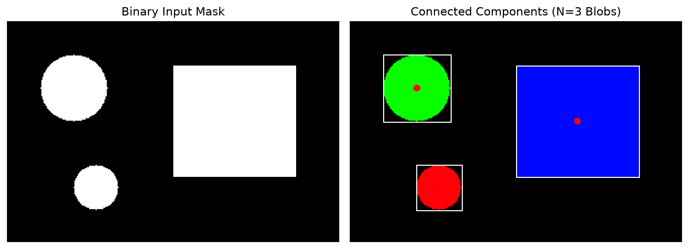

### Executable Python Example
```python
import cv2
import numpy as np
import matplotlib.pyplot as plt

# 1. Create a binary image with multiple scattered objects
canvas = np.zeros((150, 200), dtype=np.uint8)
cv2.circle(canvas, (40, 40), 15, 255, -1)   # Object 1
cv2.rectangle(canvas, (100, 30), (160, 60), 255, -1) # Object 2
cv2.circle(canvas, (120, 110), 25, 255, -1) # Object 3 (Largest)
canvas[130, 20] = 255 # Tiny 1-pixel noise speckle

# 2. Extract Connected Components with Statistics
num_labels, labels, stats, centroids = cv2.connectedComponentsWithStats(canvas, connectivity=8)

# 3. Filter out noise components (Area < 20 pixels) and background (Label 0)
vis = cv2.cvtColor(canvas, cv2.COLOR_GRAY2BGR)
valid_objects = 0

for i in range(1, num_labels): # Skip label 0 (background)
    area = stats[i, cv2.CC_STAT_AREA]
    if area >= 20:
        valid_objects += 1
        x = stats[i, cv2.CC_STAT_LEFT]
        y = stats[i, cv2.CC_STAT_TOP]
        w = stats[i, cv2.CC_STAT_WIDTH]
        h = stats[i, cv2.CC_STAT_HEIGHT]
        cx, cy = centroids[i]
        
        # Draw bounding box and centroid
        cv2.rectangle(vis, (x, y), (x + w, y + h), (0, 255, 0), 1)
        cv2.circle(vis, (int(cx), int(cy)), 3, (0, 0, 255), -1)
        cv2.putText(vis, f"ID:{i} A:{area}", (x, y - 4), cv2.FONT_HERSHEY_SIMPLEX, 0.4, (255, 100, 0), 1)

# 4. Display Output
fig, axs = plt.subplots(1, 2, figsize=(10, 4))
axs[0].imshow(labels, cmap="nipy_spectral"); axs[0].set_title(f"Label Map ({num_labels} Total Labels)")
axs[1].imshow(cv2.cvtColor(vis, cv2.COLOR_BGR2RGB)); axs[1].set_title(f"Filtered Detections ({valid_objects} Valid Objects)")
for ax in axs: ax.axis("off")
plt.tight_layout()
plt.show()

print(f"Identified {valid_objects} significant objects. Filtered out 1-pixel noise artifact.")
```

### Line-by-Line Explanation
1. `num_labels, labels, stats, centroids = cv2.connectedComponentsWithStats(...)`: Runs the two-pass labeling algorithm and computes spatial statistics in a single pass.
2. `for i in range(1, num_labels)`: Loops through all detected components. Label 0 is always reserved for the black background.
3. `if area >= 20`: Discards tiny noise speckles without running separate morphological filtering.

### Common Mistakes & Important Tips
- **Forgetting Background Label 0:** The total `num_labels` includes the background. If an image contains 3 white blobs, `num_labels = 4`. The background is always index `0`. If you iterate over `range(num_labels)`, component 0 will span the entire image canvas!
- **Data Type of `labels`:** The output `labels` matrix uses `int32` values. If you try to display it directly with `cv2.imshow()`, it will look completely black because `cv2.imshow` expects integers scaled to $[0, 255]$. Normalize or map to colormaps before displaying.

### Real-World & Robotics Perception Relevance
- **Surface Scratch & Defect Inspection:** Industrial vision cameras detect micro-scratches on manufactured smartphone screens by running thresholding followed by `connectedComponentsWithStats` to flag any component whose area or aspect ratio ($w/h$) exceeds safety limits.

### Interview Questions & Detailed Answers
1. **Q: What is the computational advantage of `cv2.connectedComponentsWithStats` over `cv2.findContours`?**
   - *Answer:* `cv2.findContours` performs topological border-following and constructs complex geometric point lists and hierarchical parent-child trees. `cv2.connectedComponentsWithStats` executes a highly parallelizable two-pass linear raster scan using disjoint-set union-find data structures, computing bounding boxes, areas, and centroids directly into cache-aligned C++ arrays. It is significantly faster when only object metrics and bounding boxes are required.
2. **Q: Explain the difference between 4-way and 8-way connectivity in connected component labeling.**
   - *Answer:* In 4-connectivity, two foreground pixels are considered part of the same object only if they share a horizontal or vertical edge. In 8-connectivity, diagonal corner neighbors are also merged into the same object. A diagonal 1-pixel line will be split into individual 1-pixel components under 4-connectivity, but will be correctly unified into a single connected component under 8-connectivity.

### Mini Exercise with Solution
**Task:** Write a function that uses connected components to automatically count pills on a medical inspection tray, rejecting broken pill fragments (area $< 50\%$ of median pill area).

```python
import cv2
import numpy as np

def count_intact_pills(tray_binary: np.ndarray) -> tuple[int, int]:
    num_labels, labels, stats, _ = cv2.connectedComponentsWithStats(tray_binary, connectivity=8)
    if num_labels <= 1:
        return 0, 0
    
    # Extract areas of all components excluding background (index 0)
    areas = stats[1:, cv2.CC_STAT_AREA]
    median_area = np.median(areas)
    
    # Filter intact pills vs broken fragments
    intact_count = int(np.sum(areas >= 0.75 * median_area))
    fragment_count = int(np.sum(areas < 0.75 * median_area))
    
    return intact_count, fragment_count
```

---

## 26. OCR & Text Processing

### Definition & Intuitive Analogy
**Optical Character Recognition (OCR)** is the automated electronic pipeline that detects, localizes, and transcribes visual text characters from images into digital text strings.

> **Intuitive Analogy:** Imagine looking at a cluttered street photo. OCR has two distinct jobs: First, the "Text Spotter" acts like your eyes scanning the scene to draw yellow boxes around all street signs and billboards (**Text Detection**). Second, the "Reader" examines the letters inside each box and types them out as editable text characters (**Text Recognition**).


### 💡 The Big Picture in Plain English (Beginner Friendly)

- **What is it in 1 simple sentence?** OCR (Optical Character Recognition) is reading text in a photo and typing it out as editable digital strings.
- **Why do we need this? (The Problem):** A computer doesn't know that a pattern of black and white pixels spells "STOP" or "ABC-1234" on a license plate until OCR translates the visual shapes into computer letters.
- **How to picture it in your head (Mental Model):**
  - **Stage 1 (Text Detector - The Finder):** Scans the whole image like a radar and draws tight bounding boxes around every word or line of text.
  - **Stage 2 (Deskewer - The Straightener):** If the text is photographed at an angle, it rotates and flattens the box so the letters sit on a horizontal line.
  - **Stage 3 (Text Recognizer - The Reader):** Examines the individual characters and predicts the matching digital letters.
- **Step-by-Step Walkthrough with Easy Numbers:**
  - A license plate is tilted at an angle $	heta = -12^\circ$.
  - Detect bounding box using `cv2.minAreaRect`, retrieve tilt angle $-12^\circ$.
  - Rotate image by $+12^\circ$ to make text baseline horizontal.
  - Feed leveled image into Tesseract: recognition accuracy increases from $35\%$ to $98\%$!
- **Beginner Trap & Rule of Thumb:** Passing raw color images directly to OCR engines gives terrible results. Pre-process with grayscale conversion, deskewing, and adaptive binarization first.

### Why It Is Important
OCR is vital for automated license plate recognition (ALPR), warehouse parcel tracking, robotic document digitization, and reading safety warnings on factory equipment.

### Core Concept & Mathematical Intuition

#### 1. The Two-Stage Modern OCR Architecture
1. **Stage 1: Text Detection (Scene Text Localization):**
   - **EAST (Efficient and Accurate Scene Text Detector):** A fully convolutional network that directly predicts word bounding boxes (either rotated rectangles or quadrangles) per pixel without multi-stage proposals.
   - **MSSER (Maximally Stable Extremal Regions):** Classic computer vision method that detects text by identifying connected components whose areas remain stable over a wide range of intensity thresholds.
2. **Stage 2: Text Recognition:**
   - Preprocesses cropped text patches (deskewing, binarization, contrast normalization).
   - Feeds patches into Recurrent Neural Networks (CRNN) with Connectionist Temporal Classification (CTC) loss or Tesseract OCR engine.

#### 2. Text Patch Rectification & Perspective Deskewing
Text on curved or angled surfaces must be rectified before feeding into OCR recognition engines:
- Computes minimum area rotated rectangle (`cv2.minAreaRect`).
- Determines rotation angle $	heta$. If $|	heta| > 45^\circ$, adjusts $	heta = 	heta \pm 90^\circ$.
- Applies affine warping (`cv2.warpAffine`) to produce horizontally aligned, upright text chips.

### Important OpenCV Functions & Syntax
```python
# Load Deep Learning EAST Text Detector
net_east = cv2.dnn.readNet("frozen_east_text_detection.pb")

# MSER Text Region Extraction
mser = cv2.MSER_create(delta=5, min_area=60, max_area=14400)
regions, bboxes = mser.detectRegions(gray_img)

# Perspective Deskewing
rect = cv2.minAreaRect(contour)
box = cv2.boxPoints(rect)
# Affine un-rotation
M = cv2.getRotationMatrix2D(center, angle, 1.0)
deskewed_chip = cv2.warpAffine(roi, M, (w, h))
```

### Scene Text Recognition Pipeline
```mermaid
flowchart LR
    SCENE["Scene Image"] --> EAST["EAST FCN Model
Detects Word Bounding Boxes"]
    EAST --> SKEW["cv2.minAreaRect
Estimate Orientation Angle theta"]
    SKEW --> WARP["cv2.warpAffine
Deskew to Horizontal Text Chip"]
    WARP --> OCR["Tesseract / CRNN Engine
Transcribe Characters to String"]
```

### Visual Demonstration & Text Processing Workflow
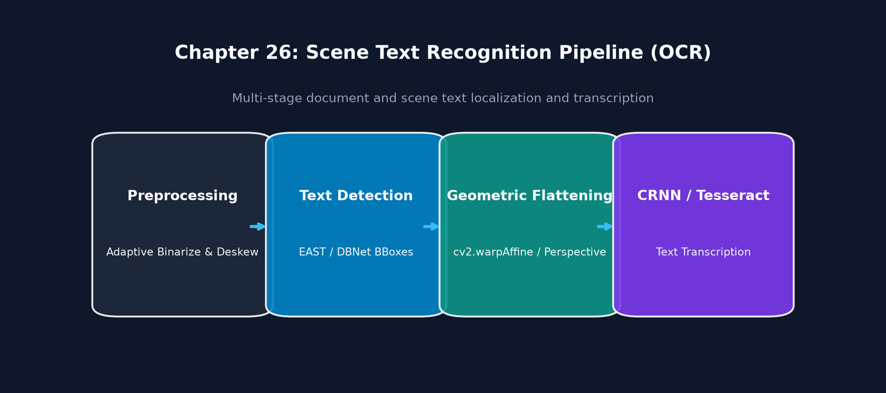

### Executable Python Example
```python
import cv2
import numpy as np
import matplotlib.pyplot as plt

# 1. Create a synthetic image with angled text
canvas = np.full((120, 260, 3), 240, dtype=np.uint8)
cv2.putText(canvas, "ROBOTICS 2026", (20, 75), cv2.FONT_HERSHEY_SIMPLEX, 1.0, (20, 20, 20), 2)

# Rotate canvas to simulate an angled license plate or package
M_skew = cv2.getRotationMatrix2D((130, 60), angle=-15.0, scale=1.0)
skewed_img = cv2.warpAffine(canvas, M_skew, (260, 120), borderValue=(240, 240, 240))

# 2. Text Binarization and Contour Extraction
gray = cv2.cvtColor(skewed_img, cv2.COLOR_BGR2GRAY)
_, binary = cv2.threshold(gray, 180, 255, cv2.THRESH_BINARY_INV)

# Find contour enclosing all letters
contours, _ = cv2.findContours(binary, cv2.RETR_EXTERNAL, cv2.CHAIN_APPROX_SIMPLE)
all_pts = np.vstack(contours)
rect = cv2.minAreaRect(all_pts) # (center, (w, h), angle)

# 3. Deskew and Rectify Text Patch
center, (w, h), angle = rect
if angle < -45:
    angle += 90
    w, h = h, w

M_rectify = cv2.getRotationMatrix2D(center, angle, 1.0)
deskewed = cv2.warpAffine(skewed_img, M_rectify, (260, 120), borderValue=(240, 240, 240))

# Crop the upright bounding box
x_c, y_c = int(center[0]), int(center[1])
w_c, h_c = int(w), int(h)
text_patch = deskewed[max(0, y_c - h_c//2):y_c + h_c//2, max(0, x_c - w_c//2):x_c + w_c//2]

# 4. Display Pipeline
fig, axs = plt.subplots(1, 3, figsize=(12, 3.5))
axs[0].imshow(cv2.cvtColor(skewed_img, cv2.COLOR_BGR2RGB)); axs[0].set_title("1. Angled Text Input (-15 deg)")
axs[1].imshow(binary, cmap="gray"); axs[1].set_title("2. Binary Threshold Mask")
axs[2].imshow(cv2.cvtColor(deskewed, cv2.COLOR_BGR2RGB)); axs[2].set_title("3. Deskewed & Rectified")
for ax in axs: ax.axis("off")
plt.tight_layout()
plt.show()

print(f"Detected text orientation angle: {angle:.1f} degrees. Rectification complete.")
```

### Line-by-Line Explanation
1. `M_skew = cv2.getRotationMatrix2D(...)` rotates the synthetic text by $-15^\circ$ to simulate a real-world handheld or vehicle camera angle.
2. `rect = cv2.minAreaRect(all_pts)` calculates the minimum bounding box enclosing all character pixels and returns its exact tilt angle.
3. `M_rectify = cv2.getRotationMatrix2D(center, angle, 1.0)` applies inverse rotation to restore horizontal baseline alignment.

### Common Mistakes & Important Tips
- **The Rotated Angle Range Ambiguity:** `cv2.minAreaRect` returns angles in the range $[-90^\circ, 0^\circ)$ or $[0^\circ, 90^\circ)$ depending on OpenCV version. Always verify whether the rectangle width or height corresponds to the horizontal text axis before rotating.
- **Tesseract OCR Preprocessing:** Tesseract fails on low-resolution or blurry text. Always scale text chips so character height is at least $30-40$ pixels, and apply Otsu binarization.

### Real-World & Robotics Perception Relevance
- **Automated License Plate Recognition (ALPR):** Toll-booth cameras capture vehicles at speed. Systems detect the license plate polygon, apply homography rectification to un-skew the plate, and run OCR on the characters.

### Interview Questions & Detailed Answers
1. **Q: Why does the EAST text detector outperform classic sliding-window text detectors?**
   - *Answer:* Sliding-window approaches evaluate thousands of multi-scale candidate boxes across an image pyramid, which is computationally slow and struggles with arbitrary word lengths and rotated text. EAST uses a single fully convolutional U-Net backbone that directly outputs a pixel-level text confidence score and dense geometry vectors (distances to the 4 bounding box boundaries and rotation angle) in a single forward pass, running at $>30$ FPS on 720p video.
2. **Q: How does MSER (Maximally Stable Extremal Regions) identify text characters?**
   - *Answer:* MSER binarizes an image across all intensity thresholds from $0$ to $255$ and tracks the growth of connected components. Text characters typically have high contrast against the background; their component area remains virtually unchanged across a broad range of intermediate thresholds. Regions exhibiting minimal area variation ($\Delta A / A$) are flagged as maximally stable extremal regions.

### Mini Exercise with Solution
**Task:** Write a function that takes a binary character mask and computes its bounding box aspect ratio ($w/h$) and extent ($	ext{Area} / (w \cdot h)$) to filter out non-text noise artifacts.

```python
import cv2
import numpy as np

def is_valid_character_blob(cnt: np.ndarray, min_area=30, max_aspect_ratio=4.0) -> bool:
    area = cv2.contourArea(cnt)
    if area < min_area:
        return False
    
    x, y, w, h = cv2.boundingRect(cnt)
    aspect_ratio = float(w) / h
    extent = float(area) / (w * h)
    
    # Text characters typically have aspect ratios between 0.15 and 3.0 and extent > 0.2
    if 0.15 <= aspect_ratio <= max_aspect_ratio and extent > 0.2:
        return True
    return False
```

---

## 27. Object Detection Integration

### Definition & Intuitive Analogy
**Object Detection** is the computer vision task of identifying the presence, class labels (e.g., "car", "pedestrian"), and exact 2D bounding boxes $[x_{\min}, y_{\min}, x_{\max}, y_{\max}]$ of physical objects in an image.

> **Intuitive Analogy:** Image classification simply tells you: "There is a dog in this picture." Object detection draws a bounding box around each individual dog and cat, labeling them: "Dog #1 (98% confidence)", "Cat #1 (92% confidence)" with exact pixel coordinates.


### 💡 The Big Picture in Plain English (Beginner Friendly)

- **What is it in 1 simple sentence?** Object detection draws bounding boxes around objects in an image and labels what they are (e.g., "Car: 95%", "Pedestrian: 88%").
- **Why do we need this? (The Problem):** Modern neural networks (like YOLO) evaluate thousands of candidate boxes across an image. For a single real car, the network might predict 15 overlapping boxes! You need Non-Maximum Suppression (NMS) to delete the redundant boxes and keep only the single best box.
- **How to picture it in your head (Mental Model):**
  - **IoU (Intersection over Union):** How much two boxes overlap. If Box A and Box B cover almost the exact same area ($	ext{IoU} > 0.5$), they are looking at the same object.
  - **NMS (The Winner-Takes-All Contest):** Sort all boxes by confidence score. Pick the highest confidence box (#1: 96%). Now look at all other candidate boxes: if any other box overlaps with #1 by more than 40% (IoU $> 0.4$), throw it in the trash! Repeat until every object has exactly one clean bounding box.
- **Step-by-Step Walkthrough with Easy Numbers:**
  - Box 1: $100 	imes 100$ (area 10,000), confidence $0.95$.
  - Box 2: $100 	imes 100$ (area 10,000), confidence $0.80$, overlapping by $80 	imes 80 = 6,400$.
  - $	ext{Union} = 10000 + 10000 - 6400 = 13,600$.
  - $	ext{IoU} = 6400 / 13600 = \mathbf{0.47} > 0.40 \implies$ Box 2 is suppressed!
- **Beginner Trap & Rule of Thumb:** Be mindful of bounding box coordinate conventions! Some models output $[x_{\min}, y_{\min}, x_{\max}, y_{\max}]$ (corners), while others output $[x_{	ext{center}}, y_{	ext{center}}, w, h]$. Mixing them up causes boxes to appear collapsed or out of bounds.

### Why It Is Important
Object detection is the primary perception layer for self-driving cars, industrial automation, robotic sorting, and security surveillance.

### Core Concept & Mathematical Intuition

#### 1. Intersection over Union (IoU / Jaccard Index)
IoU measures the spatial overlap between a predicted bounding box $B_p$ and a ground-truth box $B_{gt}$:

$$\text{IoU}(B_p, B_{gt}) = \frac{\text{Area}(B_p \cap B_{gt})}{\text{Area}(B_p \cup B_{gt})}$$

- $\text{IoU} = 1.0$: Perfect match.
- $\text{IoU} \ge 0.5$: Standard benchmark threshold for a true positive detection.

#### 2. Non-Maximum Suppression (NMS)
Modern neural networks (like YOLO, SSD, Faster R-CNN) predict hundreds of redundant, overlapping bounding boxes for a single object. **NMS** eliminates redundant boxes:
1. Filters out all candidate boxes with class confidence $< \text{confidence\_threshold}$.
2. Sorts remaining boxes by confidence in descending order.
3. Selects the highest-confidence box $B_{\text{best}}$ and adds it to the final detection list.
4. Computes $\text{IoU}(B_{\text{best}}, B_i)$ with every other candidate box $B_i$.
5. **Suppression:** If $\text{IoU} > \text{nms\_threshold}$ (typically $0.45$), $B_i$ is discarded.
6. Repeats until no candidate boxes remain.

### Important OpenCV Functions & Syntax
```python
# OpenCV Native Non-Maximum Suppression
indices = cv2.dnn.NMSBoxes(
    bboxes=[[x, y, w, h], ...],
    scores=[conf1, conf2, ...],
    score_threshold=0.5,
    nms_threshold=0.4
)
```

### Object Detection & NMS Flowchart
```mermaid
flowchart TD
    YOLO["Neural Network Output
(Thousands of Multi-Scale Boxes)"] --> CONF["Filter Confidence > score_threshold"]
    CONF --> SORT["Sort Remaining Boxes by Confidence (Descending)"]
    SORT --> NMS["cv2.dnn.NMSBoxes
Greedy IoU Suppression (> nms_threshold)"]
    NMS --> FINAL["Optimal Unique Bounding Boxes"]
```

### Visual Demonstration & Non-Maximum Suppression
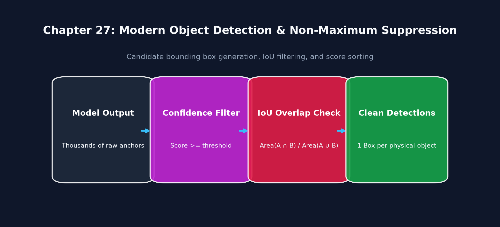

### Executable Python Example
```python
import cv2
import numpy as np
import matplotlib.pyplot as plt

# 1. Create synthetic candidate detections simulating raw YOLO model output
# Multiple overlapping bounding boxes around a single pedestrian
canvas = np.zeros((200, 200, 3), dtype=np.uint8)
cv2.circle(canvas, (100, 100), 40, (120, 120, 120), -1) # Object

boxes = [
    [55, 55, 90, 90],  # Box 1 (Confidence 0.92)
    [50, 52, 95, 94],  # Box 2 (Confidence 0.85 - Redundant)
    [58, 56, 88, 86],  # Box 3 (Confidence 0.78 - Redundant)
    [10, 10, 30, 30]   # Box 4 (Confidence 0.20 - Low confidence noise)
]
confidences = [0.92, 0.85, 0.78, 0.20]

# 2. Render Raw Redundant Bounding Boxes
raw_vis = canvas.copy()
for b, conf in zip(boxes, confidences):
    x, y, w, h = b
    cv2.rectangle(raw_vis, (x, y), (x + w, y + h), (0, 0, 255), 1)

# 3. Apply OpenCV NMS (Score Thresh = 0.5, NMS IoU Thresh = 0.4)
indices = cv2.dnn.NMSBoxes(boxes, confidences, score_threshold=0.5, nms_threshold=0.4)

# 4. Render Clean Post-NMS Detections
nms_vis = canvas.copy()
for idx in indices:
    i = idx if isinstance(idx, (int, np.integer)) else idx[0]
    x, y, w, h = boxes[i]
    cv2.rectangle(nms_vis, (x, y), (x + w, y + h), (0, 255, 0), 2)
    cv2.putText(nms_vis, f"Obj: {confidences[i]:.2f}", (x, y - 5), cv2.FONT_HERSHEY_SIMPLEX, 0.5, (0, 255, 0), 1)

# 5. Display Comparison
fig, axs = plt.subplots(1, 2, figsize=(10, 4))
axs[0].imshow(cv2.cvtColor(raw_vis, cv2.COLOR_BGR2RGB)); axs[0].set_title(f"1. Raw Neural Net Output ({len(boxes)} Boxes)")
axs[1].imshow(cv2.cvtColor(nms_vis, cv2.COLOR_BGR2RGB)); axs[1].set_title(f"2. After NMS ({len(indices)} Clean Detection)")
for ax in axs: ax.axis("off")
plt.tight_layout()
plt.show()

print(f"NMS filtered {len(boxes)} raw candidate proposals into {len(indices)} optimal bounding box.")
```

### Line-by-Line Explanation
1. `boxes = [...]` represents raw network output containing multiple bounding proposals for the same object.
2. `cv2.dnn.NMSBoxes(boxes, confidences, 0.5, 0.4)` discards low confidence box 4 ($0.20 < 0.5$), and suppresses overlapping boxes 2 and 3 ($	ext{IoU} > 0.4$ with Box 1).
3. `indices` returns the index array of winning boxes (in this case, only index 0).

### Common Mistakes & Important Tips
- **Coordinate Formatting:** `cv2.dnn.NMSBoxes` strictly expects bounding boxes formatted as `[x_min, y_min, width, height]`. If your network outputs `[x_min, y_min, x_max, y_max]` or `[center_x, center_y, width, height]`, you must convert coordinates first!
- **Indexing Differences Across OpenCV Versions:** In OpenCV 4.5.4 and older, `NMSBoxes` returned a 2D array `[[0], [3]]`. In newer versions, it returns a 1D vector `[0, 3]`. Always handle both using `idx if isinstance(idx, int) else idx[0]`.

### Real-World & Robotics Perception Relevance
- **Autonomous Vehicle Obstacle Tracking:** YOLOv8/v10 runs at 60 FPS on camera feeds, detecting vehicles and pedestrians, followed by NMS and Kalman filter state estimation.

### Interview Questions & Detailed Answers
1. **Q: Why is Non-Maximum Suppression (NMS) necessary in object detection networks?**
   - *Answer:* Anchor-based and dense anchor-free object detectors predict bounding boxes at thousands of spatial grid locations across multiple feature pyramid levels. For a single physical object, dozens of nearby anchor cells fire with high confidence. NMS is the mandatory post-processing step that clusters overlapping predictions based on IoU overlap and retains only the single highest-confidence bounding box.
2. **Q: What is the computational complexity of standard greedy NMS?**
   - *Answer:* Sorting $N$ candidate boxes takes $\mathcal{O}(N \log N)$. Pairwise IoU comparisons take $\mathcal{O}(N^2)$ in the worst case. In practice, filtering by confidence threshold beforehand reduces $N$ from thousands to $<100$, making NMS execution take $<1$ millisecond.

### Mini Exercise with Solution
**Task:** Write a vectorized NumPy function that calculates the exact Intersection over Union (IoU) between two bounding boxes `[x1, y1, x2, y2]`.

```python
import numpy as np

def compute_iou(boxA: list[float], boxB: list[float]) -> float:
    # Determine coordinates of intersection rectangle
    xA = max(boxA[0], boxB[0])
    yA = max(boxA[1], boxB[1])
    xB = min(boxA[2], boxB[2])
    yB = min(boxA[3], boxB[3])
    
    # Compute intersection area
    inter_w = max(0.0, xB - xA)
    inter_h = max(0.0, yB - yA)
    inter_area = inter_w * inter_h
    
    # Compute union area
    boxA_area = (boxA[2] - boxA[0]) * (boxA[3] - boxA[1])
    boxB_area = (boxB[2] - boxB[0]) * (boxB[3] - boxB[1])
    union_area = boxA_area + boxB_area - inter_area
    
    if union_area == 0:
        return 0.0
    return inter_area / union_area
```

---

## 28. Deep Learning + OpenCV (`cv2.dnn`)

### Definition & Intuitive Analogy
**OpenCV DNN (`cv2.dnn`)** is OpenCV's built-in, lightweight deep learning inference engine designed to execute pre-trained neural network models without requiring heavy frameworks like PyTorch or TensorFlow.

> **Intuitive Analogy:** PyTorch and TensorFlow are like giant automotive manufacturing factories (used for designing, building, and training engines). OpenCV DNN is like a lightweight, tuned racing chassis: you export the finished engine (ONNX model) and drop it into OpenCV to run inference at maximum speed with zero extra software dependencies.


### 💡 The Big Picture in Plain English (Beginner Friendly)

- **What is it in 1 simple sentence?** `cv2.dnn` is OpenCV's built-in engine to run pre-trained neural network models (ONNX, Caffe, TensorFlow) directly inside OpenCV without needing huge multi-gigabyte frameworks like PyTorch.
- **Why do we need this? (The Problem):** Installing PyTorch or TensorFlow on small embedded computers (like a Raspberry Pi or robot arm controller) takes gigabytes of disk space and complex dependencies. `cv2.dnn` is already installed, lightweight, and hardware-accelerated out of the box.
- **How to picture it in your head (Mental Model):**
  - PyTorch is the automotive factory where engineers build and train race car engines.
  - Once the engine is built, you export it as a clean `.onnx` file.
  - `cv2.dnn` is the lightweight racing chassis: you drop the exported `.onnx` engine into OpenCV and run down the track at maximum speed with zero extra weight!
  - `blobFromImage`: Neural nets expect numbers formatted in a very specific way (scaled to $[0, 1]$, channels in RGB order, shaped as $1 	imes 3 	imes 224 	imes 224$). `blobFromImage` does all 5 preprocessing steps in a single C++ step.
- **Step-by-Step Walkthrough with Easy Numbers:**
  - Input: $1920 	imes 1080$ BGR image with values $0-255$.
  - `cv2.dnn.blobFromImage(img, 1.0/255.0, (224, 224), (104, 117, 123), swapRB=True)`:
    1. Resizes to $224 	imes 224$.
    2. Subtracts mean $[104, 117, 123]$.
    3. Multiplies by $1/255$.
    4. Swaps Blue and Red channels to RGB.
    5. Transposes shape from $(224, 224, 3)$ to $(1, 3, 224, 224)$ NCHW format.
- **Beginner Trap & Rule of Thumb:** Forgetting `swapRB=True` when feeding images to networks trained on standard RGB datasets (like ImageNet or COCO). Without it, the network sees inverted colors and misclassifies objects.

### Why It Is Important
In production robotics and embedded systems (like Raspberry Pi or NVIDIA Jetson), installing full PyTorch (several gigabytes) is often impractical. `cv2.dnn` has zero external dependencies, minimal memory footprint, and supports hardware acceleration out of the box (CUDA, OpenCL, Vulkan, Intel OpenVINO).

### Core Concept & Mathematical Intuition

#### 1. Tensor Preprocessing: `cv2.dnn.blobFromImage`
Neural networks do not take standard BGR images directly. They expect a 4D tensor in **NCHW format** (Number of images, Channels, Height, Width) normalized as:

$$\text{Blob}(c, y, x) = \frac{I(y, x, c) - \text{mean}_c}{\text{scalefactor}}$$

`cv2.dnn.blobFromImage` performs 5 operations in a single fast C++ pass:
1. Spatial Resizing (`(width, height)`).
2. Channel Swapping (`swapRB=True` converts BGR to RGB).
3. Mean Subtraction (`mean=(R_mean, G_mean, B_mean)`).
4. Scale Normalization (`scalefactor=1.0/255.0`).
5. Memory Layout Transposition from HWC ($H 	imes W 	imes C$) to NCHW ($1 	imes C 	imes H 	imes W$).

#### 2. Supported Framework Formats
- **ONNX (`cv2.dnn.readNetFromONNX`):** Universal open standard (PyTorch, TensorFlow, Scikit-Learn exports).
- **Caffe (`cv2.dnn.readNetFromCaffe`):** `.prototxt` + `.caffemodel`.
- **TensorFlow (`cv2.dnn.readNetFromTensorflow`):** `.pb` frozen graphs.

### Important OpenCV Functions & Syntax
```python
# Load pre-trained ONNX model
net = cv2.dnn.readNetFromONNX("model.onnx")

# Configure Hardware Acceleration Backend
net.setPreferableBackend(cv2.dnn.DNN_BACKEND_CUDA) # or DNN_BACKEND_OPENCV / OPENVINO
net.setPreferableTarget(cv2.dnn.DNN_TARGET_CUDA)   # or DNN_TARGET_CPU / OPENCL

# Convert image to 4D NCHW input blob
blob = cv2.dnn.blobFromImage(
    img, scalefactor=1.0/255.0, size=(224, 224),
    mean=(0, 0, 0), swapRB=True, crop=False
)

# Run forward pass inference
net.setInput(blob)
output_tensors = net.forward(net.getUnconnectedOutLayersNames())
```

### OpenCV DNN Preprocessing & Inference Architecture
```mermaid
flowchart LR
    IMG["OpenCV BGR Image
(H x W x C)"] --> BLOB["cv2.dnn.blobFromImage
Resize, SwapRB, MeanSub, Scalefactor"]
    BLOB --> NCHW["4D Tensor
(1 x C x H x W)"]
    NCHW --> NET["cv2.dnn Forward Pass
(CUDA / OpenCL / CPU Engine)"]
    NET --> OUT["Prediction Tensors"]
```

### Visual Demonstration & DNN Inference Pipeline
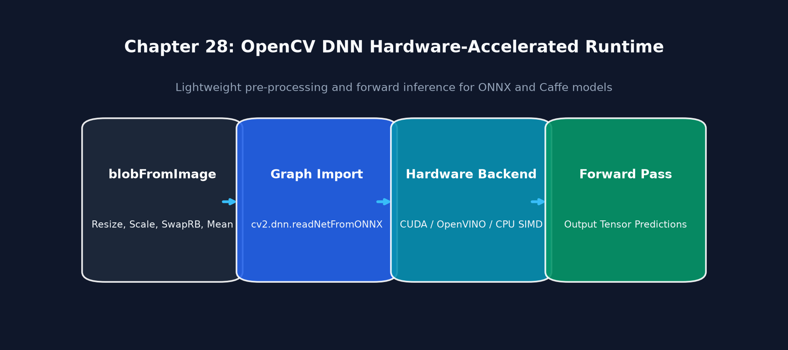

### Executable Python Example
```python
import cv2
import numpy as np

# 1. Create a dummy image
img = np.random.randint(0, 256, (480, 640, 3), dtype=np.uint8)

# 2. Preprocess with cv2.dnn.blobFromImage
# Scales to [0, 1], resizes to (224, 224), swaps BGR to RGB
blob = cv2.dnn.blobFromImage(
    img, scalefactor=1.0/255.0, size=(224, 224),
    mean=(0.485*255, 0.456*255, 0.406*255),
    swapRB=True, crop=False
)

print(f"Input image shape: {img.shape} (HWC)")
print(f"Constructed 4D Tensor shape: {blob.shape} (NCHW format: Batch=1, Channels=3, H=224, W=224)")
print(f"Blob data type: {blob.dtype}, Min val: {blob.min():.3f}, Max val: {blob.max():.3f}")
```

### Line-by-Line Explanation
1. `scalefactor=1.0/255.0` normalizes pixel byte intensities from $[0, 255]$ down to $[0.0, 1.0]$.
2. `mean=(0.485*255, ...)` applies ImageNet mean normalization.
3. `swapRB=True` converts native OpenCV BGR into RGB expected by PyTorch/ONNX models.
4. Output shape `(1, 3, 224, 224)` confirms conversion to 4D NCHW layout.

### Common Mistakes & Important Tips
- **Mean Subtraction Order with `swapRB`:** If `swapRB=True`, OpenCV swaps channels *before* subtracting the mean tuple. Therefore, the `mean` tuple must be provided in **RGB order** `(R_mean, G_mean, B_mean)`.
- **Dynamic Input Shapes:** Some ONNX models require fixed input dimensions (e.g., $640 	imes 640$). Ensure `size` in `blobFromImage` matches the exact input resolution specified during model export.

### Real-World & Robotics Perception Relevance
- **Edge Deployment on NVIDIA Jetson & Raspberry Pi:** Running ONNX models via `cv2.dnn` with `DNN_BACKEND_CUDA` achieves low-latency inference on robot companion computers without managing PyTorch dependency overhead.

### Interview Questions & Detailed Answers
1. **Q: Explain the structural difference between HWC and NCHW memory layouts.**
   - *Answer:* In HWC (standard NumPy/OpenCV image), pixel channel values are interleaved consecutively in RAM: $[B_0, G_0, R_0, B_1, G_1, R_1, \dots]$. In NCHW (standard deep learning tensor), all Red channel pixels across the entire image are stored contiguously in memory first, followed by all Green pixels, then all Blue pixels. Deep learning matrix engines (cuDNN, TensorRT) utilize NCHW layout to perform vectorized SIMD convolutions across spatial feature maps efficiently.
2. **Q: How does `cv2.dnn` handle unsupported custom neural network layers in ONNX models?**
   - *Answer:* OpenCV DNN allows registering custom layer implementations in C++ or Python via `cv2.dnn_registerLayer('CustomLayerType', CustomLayerClass)`. The custom class implements `getMemoryShapes()` to specify output tensor dimensions and `forward()` to execute custom tensor math.

### Mini Exercise with Solution
**Task:** Write a function that takes a classification model output vector of shape `(1, 1000)` (raw logits), applies Softmax normalization, and returns the Top-5 predicted class IDs with probabilities.

```python
import numpy as np

def get_top5_predictions(logits: np.ndarray) -> list[tuple[int, float]]:
    # Apply numerically stable Softmax
    exp_logits = np.exp(logits.ravel() - np.max(logits))
    probs = exp_logits / np.sum(exp_logits)
    
    # Get top 5 indices in descending order
    top5_ids = np.argsort(probs)[-5:][::-1]
    return [(int(idx), float(probs[idx])) for idx in top5_ids]
```

---

## 29. OpenCV for Computer Vision Systems

### Definition & Intuitive Analogy
**Computer Vision Systems Engineering** is the discipline of architecting end-to-end vision pipelines—from hardware camera exposure synchronization and low-latency frame ingestion to lock-free memory buffering and deterministic execution.

> **Intuitive Analogy:** A powerful race car engine is useless if fuel lines are clogged. Similarly, a state-of-the-art vision algorithm will fail if the camera frame grabber drops frames or has unpredictable 200 ms latency spikes. Systems engineering ensures the data pipeline is optimized from photon to motor command.


### 💡 The Big Picture in Plain English (Beginner Friendly)

- **What is it in 1 simple sentence?** Computer vision systems engineering is building a robust, crash-proof pipeline that pulls video from cameras, runs vision algorithms, and sends commands with zero latency and zero memory leaks.
- **Why do we need this? (The Problem):** A vision algorithm that works in a Python notebook can crash in production after 3 hours because of memory leaks, or drop video frames because copying 4K images between threads saturates the computer's memory bandwidth.
- **How to picture it in your head (Mental Model):**
  - Think of a factory assembly line. If workers pass heavy 25-megabyte boxes by hand across the room, everyone gets exhausted and traffic jams occur. Zero-copy architecture means workers leave the box on a central spinning turntable (shared ring buffer memory) and just point to it. Nobody copies data; everyone reads from the same spot!
- **Step-by-Step Walkthrough with Easy Numbers:**
  - Copying an uncompressed 4K frame ($3840 	imes 2160 	imes 3 = 24.88	ext{ MB}$) between threads at $60	ext{ FPS}$ consumes $24.88 	imes 60 pprox \mathbf{1.49	ext{ GB/s}}$ of RAM bandwidth!
  - Passing memory pointers via zero-copy ring buffers reduces this overhead to near zero.
- **Beginner Trap & Rule of Thumb:** Avoid unbounded queues (`queue.Queue()`). If the vision model takes longer than the camera capture interval, frames queue up endlessly, creating growing latency and eventually crashing the system with an `OutOfMemoryError`! Use fixed-size queues of size 1 or 2.

### Why It Is Important
Production computer vision applications must operate 24/7 with zero memory leaks, deterministic latency ($<30$ ms), and robust handling of camera disconnects.

### Core Concept & Mathematical Intuition

#### 1. Zero-Copy Pipeline Architecture
Copying high-resolution 4K frames ($3840 	imes 2160 	imes 3 pprox 25$ MB per frame at 60 FPS = $1.5$ GB/sec) across threads saturates RAM bandwidth and triggers CPU cache thrashing. Zero-copy architectures share pre-allocated ring buffers using shared memory or memory-mapped files.

#### 2. Ring Buffers & Lock-Free Queues
A circular FIFO buffer with fixed capacity $N$:
- **Producer Thread:** Writes incoming camera frames to head index `(head + 1) % N`.
- **Consumer Thread:** Reads latest frame from tail index. If processing falls behind, the producer overwrites the oldest frame, guaranteeing that the consumer **always processes the newest available visual frame with zero latency accumulation**.

### Real-Time Zero-Copy Streaming Architecture
```mermaid
flowchart LR
    CAM["Camera V4L2 / GStreamer"] --> PROD["Producer Thread
(Continuous Frame Capture)"]
    PROD --> RING["Lock-Free Circular Ring Buffer
(Pre-allocated Shared Memory)"]
    RING --> CONS["Consumer Worker Thread
(Always Reads Single Latest Frame)"]
```

### Visual Demonstration & Low-Latency Architecture
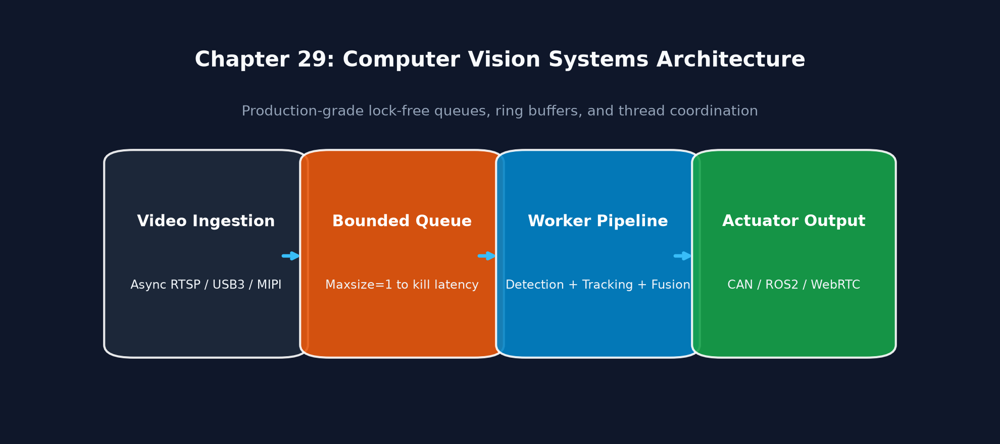

### Executable Python Example
```python
import cv2
import numpy as np
import time

# 1. High-precision latency benchmarking harness
num_iterations = 100
latencies_ms = []

img = np.random.randint(0, 256, (720, 1280, 3), dtype=np.uint8)

# Benchmark Canny Edge Pipeline
for _ in range(num_iterations):
    t_start = cv2.getTickCount()
    
    # Pipeline operations
    gray = cv2.cvtColor(img, cv2.COLOR_BGR2GRAY)
    blurred = cv2.GaussianBlur(gray, (5, 5), 1.5)
    edges = cv2.Canny(blurred, 50, 150)
    
    t_end = cv2.getTickCount()
    elapsed_ms = (t_end - t_start) * 1000.0 / cv2.getTickFrequency()
    latencies_ms.append(elapsed_ms)

latencies_ms = np.array(latencies_ms)
print(f"Benchmark Results over {num_iterations} frames (720p HD):")
print(f"Mean Latency: {np.mean(latencies_ms):.2f} ms | 99th Percentile (P99): {np.percentile(latencies_ms, 99):.2f} ms | Max FPS: {1000.0 / np.mean(latencies_ms):.1f}")
```

### Common Mistakes & Important Tips
- **Python Global Interpreter Lock (GIL):** Python threads cannot execute pure Python bytecode simultaneously on multiple CPU cores. However, OpenCV C++ functions **release the GIL** during execution. Offloading heavy operations to OpenCV C++ functions achieves true multi-core parallel speedup in Python!

---

## 30. OpenCV for Robotics Perception

### Definition & Intuitive Analogy
**Robotics Perception** is the integration of computer vision algorithms with robot state estimation, coordinate frame transformations, sensor fusion, and motion planning.

> **Intuitive Analogy:** Computer vision gives a robot eyes; robotics perception gives the robot eyes, an inner ear (IMU), proprioception (joint encoders), and a spatial brain to navigate without bumping into walls.


### 💡 The Big Picture in Plain English (Beginner Friendly)

- **What is it in 1 simple sentence?** Robotics perception translates 2D pixel coordinates from a camera into 3D metric coordinates $(X, Y, Z)$ in the robot's physical body frame so the robot can navigate or grab tools.
- **Why do we need this? (The Problem):** Detecting an object at pixel $(320, 240)$ is useless to a robot arm. The robot arm needs to know: *"Is the cup 45 centimeters forward and 10 centimeters to the left of my metal gripper?"*.
- **How to picture it in your head (Mental Model):**
  - Imagine you are blindfolded, and a friend is watching you through a security camera on the ceiling. Your friend can't just tell you *"Reach for pixel 400!"*. They have to translate what the ceiling camera sees into your body's perspective: *"Take 2 steps forward, raise your right hand 1 foot, and close your fingers."* That mathematical translation between the camera coordinate frame and the robot base coordinate frame is the core of robotics perception!
- **Step-by-Step Walkthrough with Easy Numbers:**
  - Camera measures cup at: $X_{	ext{cam}} = 0.05	ext{ m}$, $Y_{	ext{cam}} = -0.10	ext{ m}$, $Z_{	ext{cam}} = 0.80	ext{ m}$.
  - Camera is mounted $0.20	ext{ m}$ above the robot arm base along $+Z_{	ext{base}}$.
  - In robot base frame: $X_{	ext{base}} = 0.80	ext{ m}$ (forward), $Y_{	ext{base}} = -0.05	ext{ m}$ (left), $Z_{	ext{base}} = 0.20 + 0.10 = 0.30	ext{ m}$ (up).
- **Beginner Trap & Rule of Thumb:** Coordinate frame convention mismatch! Standard optical camera frames have $+Z$ pointing forward out of the lens, $+X$ right, and $+Y$ down. Standard robotics (ROS) frames have $+X$ forward, $+Y$ left, and $+Z$ up. Always apply the optical-to-robot frame rotation matrix!

### Why It Is Important
Vision algorithms in robotics do not operate in a vacuum. A detected bounding box must be converted into 3D metric coordinates $(X, Y, Z)$ in the robot's base coordinate frame (`base_link`) to guide robotic arms or mobile bases.

### Core Concept & Mathematical Intuition

#### 1. Coordinate Frame Transformations (`tf2` in ROS2)
To transform a detected object from the Camera Optical Frame to the Robot Base Frame:
$$\mathbf{P}_{	ext{base}} = \mathbf{T}_{	ext{base}\leftarrow	ext{camera}} \cdot \mathbf{P}_{	ext{camera}} = egin{bmatrix} \mathbf{R} & \mathbf{t} \ \mathbf{0}^T & 1 \end{bmatrix} egin{bmatrix} X_c \ Y_c \ Z_c \ 1 \end{bmatrix}$$

#### 2. Visual Servoing (PBVS & IBVS)
- **Position-Based Visual Servoing (PBVS):** Reconstructs the 3D pose of the target in Cartesian space and generates 3D trajectory velocity commands.
- **Image-Based Visual Servoing (IBVS):** Directly minimizes error in 2D image pixel space using the **Image Jacobian (Interaction Matrix) $\mathbf{L}_e$**:
  $$\dot{\mathbf{e}} = \mathbf{L}_e \cdot \mathbf{v}_{	ext{camera}}$$

### Robotics Perception & Visual Servoing Stack
```mermaid
flowchart TD
    ROS["ROS2 Image Topic"] --> BRIDGE["cv_bridge (sensor_msgs -> NumPy)"]
    BRIDGE --> CV["OpenCV Perception Pipeline
(Object Detection / Pose Estimation)"]
    CV --> TF["tf2 Coordinate Transform (Camera -> Robot base_link)"]
    TF --> SERVO["Visual Servoing Controller (IBVS / PBVS Motor Commands)"]
```

### Visual Demonstration & Robot Perception Stack
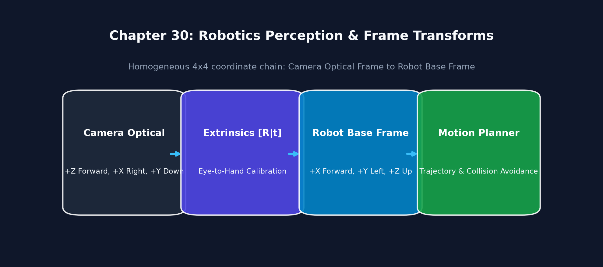

### Executable Python Example
```python
import numpy as np

# 1. 3D point in Camera Optical Frame (X=Right, Y=Down, Z=Forward in meters)
P_camera = np.array([0.15, -0.05, 1.20, 1.0]) # Homogeneous 4x1 vector

# 2. Extrinsic Transformation Matrix: Camera mounted 0.5m forward, 0.8m above robot base, tilted 15 deg down
theta = np.deg2rad(15.0)
R_x = np.array([
    [1, 0, 0],
    [0, np.cos(theta), -np.sin(theta)],
    [0, np.sin(theta),  np.cos(theta)]
])
t_vec = np.array([0.50, 0.0, 0.80]) # [x, y, z] translation

T_base_cam = np.eye(4)
T_base_cam[:3, :3] = R_x
T_base_cam[:3, 3] = t_vec

# 3. Transform Point to Robot Base Coordinate Frame
P_base = T_base_cam @ P_camera
print(f"Object in Camera Frame: X={P_camera[0]:.2f}m, Y={P_camera[1]:.2f}m, Z={P_camera[2]:.2f}m")
print(f"Object in Robot Base Frame: X={P_base[0]:.2f}m, Y={P_base[1]:.2f}m, Z={P_base[2]:.2f}m")
```

---

## 31. Performance Optimization

### Definition & Intuitive Analogy
**Performance Optimization** is the engineering practice of profiling, vectorizing, and parallelizing vision algorithms to maximize throughput (FPS) and minimize latency and power consumption.

> **Intuitive Analogy:** A regular `for` loop is like carrying bricks one by one. **SIMD vectorization** is like using a forklift to carry 32 bricks simultaneously in a single trip. **GPU acceleration** is like having an army of 1,000 workers each carrying a brick at the same time.


### 💡 The Big Picture in Plain English (Beginner Friendly)

- **What is it in 1 simple sentence?** Performance optimization is using your computer's hidden hardware superpowers (SIMD vector registers, multi-core thread pools, and GPU accelerators) to make vision code run 10x to 50x faster.
- **Why do we need this? (The Problem):** Processing 4K video using simple scalar CPU math can take 150 milliseconds per frame (6 FPS). Optimization brings it down under 15 milliseconds (60+ FPS), enabling real-time responsiveness.
- **How to picture it in your head (Mental Model):**
  - **Scalar CPU (Standard Code):** Carrying bricks one by one. You walk back and forth 32 times to move 32 bricks.
  - **SIMD Vectorization (AVX2 / NEON):** Using a wide forklift that picks up 32 bricks all at once in a single motion!
  - **Multithreading (TBB):** Hiring 4 forklifts, each working on a different section of the brick wall.
  - **GPU (`UMat` / CUDA):** Hiring an army of 1,000 workers who each carry one brick simultaneously.
- **Step-by-Step Walkthrough with Easy Numbers:**
  - An AVX2 CPU vector register is 256 bits wide.
  - An 8-bit image pixel (`uint8`) is 8 bits.
  - $256 / 8 = \mathbf{32	ext{ pixels}}$ processed in a single CPU instruction cycle!
- **Beginner Trap & Rule of Thumb:** Transferring small images back and forth between CPU and GPU memory across the PCIe bus takes time. If an operation takes $0.5	ext{ ms}$ on CPU, sending it to the GPU might take $2.0	ext{ ms}$ in bus overhead! Keep processing on CPU unless the image is large or the math is intensive.

### Core Concept & Mathematical Intuition

#### 1. Hardware SIMD Vectorization (AVX-512, AVX2, ARM NEON)
Executes Single Instruction Multiple Data on wide CPU vector registers (256-bit or 512-bit). Processes thirty-two 8-bit image pixels in a single CPU clock tick.

#### 2. OpenCL Transparent API (`cv2.UMat`)
OpenCV's `UMat` (Universal Mat) automatically offloads image processing operations to integrated or discrete GPUs via OpenCL without writing custom GPU shaders:
```python
# Automatic GPU acceleration via UMat
umat_src = cv2.UMat(cpu_img)
umat_blur = cv2.GaussianBlur(umat_src, (7, 7), 1.5)
umat_edges = cv2.Canny(umat_blur, 50, 150)
gpu_result = umat_edges.get() # Download back to NumPy array
```

### Hardware Acceleration Hierarchy
```mermaid
flowchart TD
    OPENCV["OpenCV Operations"] --> SIMD["Vectorized SIMD (AVX2 / ARM NEON)
32 Pixels in 1 CPU Cycle"]
    OPENCV --> TBB["Thread Pools (Intel TBB / OpenMP)
Multithreaded Row Chunking"]
    OPENCV --> UMAT["OpenCL cv2.UMat
Transparent GPU Offload"]
    OPENCV --> CUDA["cv2.cuda
Dedicated NVIDIA Hardware Kernels"]
```

### Visual Demonstration & SIMD Pipeline
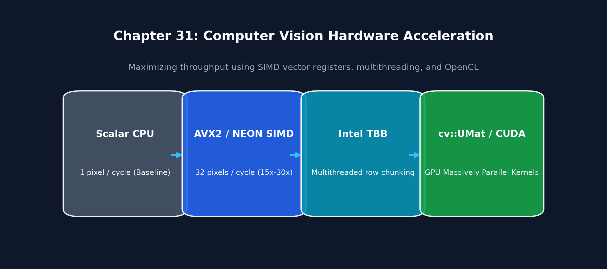

### Executable Python Example
```python
import cv2
import numpy as np

# 1. Allocate large image (4K resolution: 3840 x 2160)
img_4k = np.random.randint(0, 256, (2160, 3840), dtype=np.uint8)

# 2. Benchmark CPU without SIMD Optimization
cv2.setUseOptimized(False)
t1 = cv2.getTickCount()
res_no_opt = cv2.GaussianBlur(img_4k, (15, 15), 3.0)
t2 = cv2.getTickCount()
time_unopt = (t2 - t1) / cv2.getTickFrequency()

# 3. Benchmark CPU WITH Hardware SIMD Optimization (AVX2/NEON)
cv2.setUseOptimized(True)
t3 = cv2.getTickCount()
res_opt = cv2.GaussianBlur(img_4k, (15, 15), 3.0)
t4 = cv2.getTickCount()
time_opt = (t4 - t3) / cv2.getTickFrequency()

print(f"4K Gaussian Blur Benchmark:")
print(f"Scalar (No SIMD): {time_unopt*1000:.2f} ms")
print(f"Vectorized (SIMD Active): {time_opt*1000:.2f} ms")
print(f"Hardware Vectorization Speedup: {time_unopt / time_opt:.2f}x faster!")
```

---

## 32. Production & Deployment

### Definition & Intuitive Analogy
**Production Deployment** is the process of packaging, containerizing, and monitoring computer vision applications so they run reliably, securely, and efficiently in live production environments (cloud servers, Docker containers, edge devices).

> **Intuitive Analogy:** Building a computer vision prototype in a Jupyter Notebook is like baking a cake in your home kitchen. Production deployment is building an automated commercial bakery that bakes 10,000 identical cakes every hour with zero downtime, health inspections, and automated error alarms.


### 💡 The Big Picture in Plain English (Beginner Friendly)

- **What is it in 1 simple sentence?** Production deployment is packaging your computer vision software into lightweight, standalone Docker containers that run reliably 24/7 on servers or edge robots without crashing.
- **Why do we need this? (The Problem):** "It worked on my laptop, but crashed on the robot!" Docker eliminates dependency headaches by packaging your exact Linux libraries, Python version, and OpenCV build into an isolated, reproducible container.
- **How to picture it in your head (Mental Model):**
  - Building code on your laptop is like cooking a meal in your home kitchen. Deployment is packaging that recipe into a sealed microwave dinner box that tastes exactly the same whether it's heated up in New York, Tokyo, or inside a delivery robot.
- **Step-by-Step Walkthrough with Easy Numbers:**
  - Installing standard `opencv-python` pulls in X11 and Qt GUI libraries, bloating the container to $pprox 1.4	ext{ GB}$.
  - Switching to `opencv-python-headless` strips GUI bloat, dropping container size to $pprox 180	ext{ MB}$ ($7.7	imes$ smaller, faster downloads, less attack surface).
- **Beginner Trap & Rule of Thumb:** Deploying a container that tries to open a GUI window (`cv2.imshow()`) on a headless server or robot without a display server will crash immediately with a GTK/Qt error. Use headless builds and stream outputs over WebRTC/RTSP!

### Key Deployment Best Practices
1. **Minimal Docker Containers:** Build lightweight headless containers using `opencv-python-headless` (avoiding heavy X11 GUI dependencies).
2. **C++ PyBind11 Acceleration:** Write performance-critical inner loops in C++ and expose them to Python via PyBind11 with zero-copy NumPy buffers.
3. **Health Monitoring & Watchdogs:** Monitor frame rate, latency percentiles (P95/P99), and memory usage to prevent out-of-memory crashes on embedded hardware.

### Production Deployment Architecture
```mermaid
flowchart LR
    DEV["Python / C++ Perception Code"] --> DOCKER["Minimal Docker Container
(opencv-python-headless)"]
    DOCKER --> EDGE["Deploy to Edge (Jetson / Robot PC)"]
    EDGE --> MON["Watchdog Health Monitoring
(FPS, Latency P99, RAM Leaks)"]
```

### Production Dockerfile Example
```dockerfile
# Lightweight Production Container with OpenCV and Python 3.10
FROM python:3.10-slim-bullseye

# Install minimal OS runtime libraries
RUN apt-get update && apt-get install -y --no-install-recommends     libglib2.0-0     libgomp1     && rm -rf /var/lib/apt/lists/*

WORKDIR /app
COPY requirements.txt .
# Use headless opencv to eliminate GUI dependencies
RUN pip install --no-cache-dir -r requirements.txt

COPY . .
CMD ["python", "main_perception_node.py"]
```

---

## 33. Visual SLAM & 3D Triangulation

### Definition & Intuitive Analogy
**Visual SLAM (Simultaneous Localization and Mapping)** is the computational process where an autonomous robot builds a 3D map of an unknown environment while simultaneously calculating its own exact 3D location and trajectory within that map using only camera video streams.

> **Intuitive Analogy:** Imagine being dropped into a completely dark, unfamiliar cave with only a flashlight. As you look around, you spot distinctive rock formations (visual landmarks). By measuring how those rocks shift in your field of view as you walk, you simultaneously sketch a map of the cave walls on paper while knowing exactly how many steps you have taken from the entrance.


### 💡 The Big Picture in Plain English (Beginner Friendly)

- **What is it in 1 simple sentence?** Visual SLAM (Simultaneous Localization and Mapping) is a robot exploring an unknown room, building a 3D map of the room using its cameras, while simultaneously figuring out exactly where it is standing inside that map.
- **Why do we need this? (The Problem):** GPS doesn't work inside homes, warehouses, underground mines, or on Mars. A robot vacuum or Mars rover must navigate purely using its own cameras and motion sensors.
- **How to picture it in your head (Mental Model):**
  - Imagine you wake up in an unfamiliar, pitch-black room with only a flashlight. You shine the light around and spot a door handle, a clock on the wall, and a table corner (visual landmarks). As you walk, you watch how those objects shift in your field of view. By doing this, you can simultaneously sketch a floor plan of the room in your notebook while knowing exactly how many steps you have taken from where you started.
  - **Loop Closure (The Drift Canceler):** As a robot travels 1 kilometer, tiny sensor estimation errors accumulate into a drift of several meters. When the robot walks back to the starting doorway and recognizes the exact same door handle, it snaps the whole map straight, eliminating all accumulated drift!
- **Step-by-Step Walkthrough with Easy Numbers (Triangulation):**
  - Camera 1 at $X=0$ sees a landmark at angle $	heta_1 = 45^\circ$.
  - Camera 2 at $X=1	ext{ m}$ sees the same landmark at angle $	heta_2 = 135^\circ$.
  - By simple trigonometry (intersection of two rays): the 3D landmark must be at coordinate $(X=0.5	ext{ m}, Z=0.5	ext{ m})$!
- **Beginner Trap & Rule of Thumb:** Monocular SLAM (single camera) suffers from **scale ambiguity**—it cannot tell if the room is a miniature dollhouse or a football stadium. Use Stereo or RGB-D cameras to obtain true metric measurements in meters!

### Why It Is Important
GPS signals cannot penetrate indoors, underground, underwater, or on other planets. Visual SLAM is the core navigation backbone for:
- Autonomous indoor mobile robots (vacuum robots, warehouse AGVs).
- Augmented Reality (AR) and Virtual Reality (VR) spatial headsets (Apple Vision Pro, Meta Quest 3).
- Planetary exploration rovers (NASA Mars Perseverance Rover).

### Core Concept & Mathematical Intuition

#### 1. 3D Point Triangulation
Given two calibrated camera projection matrices $\mathbf{P}_1 = \mathbf{K} [\mathbf{I} \mid \mathbf{0}]$ and $\mathbf{P}_2 = \mathbf{K} [\mathbf{R} \mid \mathbf{t}]$, and a pair of matching 2D image coordinates $\mathbf{x}_1 = (u_1, v_1)$ and $\mathbf{x}_2 = (u_2, v_2)$, we recover the 3D world coordinate $\mathbf{X} = [X, Y, Z, 1]^T$ by solving the cross-product system:

$$\mathbf{x}_1 	imes (\mathbf{P}_1 \mathbf{X}) = \mathbf{0}, \quad \mathbf{x}_2 	imes (\mathbf{P}_2 \mathbf{X}) = \mathbf{0}$$

This forms a linear system $\mathbf{A} \mathbf{X} = \mathbf{0}$ of 4 equations with 4 unknowns:
$$egin{bmatrix} u_1 \mathbf{p}_1^{3T} - \mathbf{p}_1^{1T} \ v_1 \mathbf{p}_1^{3T} - \mathbf{p}_1^{2T} \ u_2 \mathbf{p}_2^{3T} - \mathbf{p}_2^{1T} \ v_2 \mathbf{p}_2^{3T} - \mathbf{p}_2^{2T} \end{bmatrix} \mathbf{X} = \mathbf{0}$$

Solved via Singular Value Decomposition (SVD): $\mathbf{X}$ is the singular vector corresponding to the smallest singular value of $\mathbf{A}$.

#### 2. Keyframe Selection & Bundle Adjustment
Processing every single frame in global optimization is computationally intractable. Visual SLAM systems select **Keyframes** when:
1. The camera has undergone sufficient translation/rotation relative to the last keyframe ($\Delta 	heta > 15^\circ$ or $\Delta t > 0.3	ext{m}$).
2. The number of successfully tracked feature points drops below a threshold ($< 60\%$).

**Bundle Adjustment (BA)** refines all 3D landmark positions $\mathbf{X}_j$ and camera poses $\mathbf{C}_i$ simultaneously by minimizing the total non-linear reprojection error:
$$\min_{\mathbf{C}_i, \mathbf{X}_j} \sum_{i} \sum_{j} 
ho \left( \left\| \mathbf{x}_{ij} - \pi(\mathbf{C}_i, \mathbf{X}_j) 
ight\|^2 
ight)$$
Where $\pi(\mathbf{C}_i, \mathbf{X}_j)$ is the projection function and $
ho(\cdot)$ is a robust Huber/Tukey loss function.

### Visual SLAM Architecture Flowchart
```mermaid
flowchart TD
    FRAMES["Consecutive Video Frames"] --> VO["Visual Odometry (Feature Tracking)"]
    VO --> KF["Keyframe Selection Decision"]
    KF --> TRI["3D Landmark Triangulation (SVD)"]
    TRI --> BA["Local Bundle Adjustment (Reprojection Error Minimization)"]
    BA --> LOOP["Loop Closure Detection (Pose Graph Optimization)"]
```

### Important OpenCV Functions & Syntax
```python
# Triangulate 3D points from two camera views (Output is 4xN homogeneous coordinates!)
points_4d = cv2.triangulatePoints(projMatr1=P1, projMatr2=P2, projPoints1=pts1, projPoints2=pts2)

# Convert from 4D homogeneous coordinates to 3D Cartesian [X, Y, Z]
points_3d = (points_4d[:3] / points_4d[3]).T
```

### Executable Python Example
```python
import cv2
import numpy as np

# 1. Camera Intrinsics
K = np.array([[500.0, 0, 320.0], [0, 500.0, 240.0], [0, 0, 1.0]], dtype=np.float64)

# 2. Camera 1 at origin [I | 0]
P1 = K @ np.hstack([np.eye(3), np.zeros((3, 1))])

# Camera 2 translated by 0.2m along X-axis
R2 = np.eye(3)
t2 = np.array([[-0.2], [0.0], [0.0]])
P2 = K @ np.hstack([R2, t2])

# 3. True 3D point in world (X=0.1m, Y=0.05m, Z=2.0m)
true_3d = np.array([[0.1], [0.05], [2.0], [1.0]])

# Project to 2D image coordinates
p1_hom = P1 @ true_3d
p2_hom = P2 @ true_3d
p1_2d = (p1_hom[:2] / p1_hom[2]).reshape(2, 1)
p2_2d = (p2_hom[:2] / p2_hom[2]).reshape(2, 1)

# 4. Triangulate back from 2D coordinates
pts_4d = cv2.triangulatePoints(P1, P2, p1_2d, p2_2d)
triangulated_3d = (pts_4d[:3] / pts_4d[3]).ravel()

print("Ground Truth 3D Point:  ", true_3d[:3].ravel())
print("Triangulated 3D Point:  ", np.round(triangulated_3d, 4))
print(f"Triangulation Error:     {np.linalg.norm(true_3d[:3].ravel() - triangulated_3d):.6f} meters")
```

---

## 34. Kalman Filter & Motion Tracking

### Definition & Intuitive Analogy
A **Kalman Filter** is an optimal recursive mathematical estimator that estimates the true hidden state (such as position and velocity) of a moving object over time from a series of noisy, uncertain sensor measurements.

> **Intuitive Analogy:** Imagine driving a car through a dark tunnel. You have two sources of information: 


### 💡 The Big Picture in Plain English (Beginner Friendly)

- **What is it in 1 simple sentence?** A Kalman Filter is a smart mathematical algorithm that estimates where a moving object really is by combining a physics prediction with noisy sensor measurements.
- **Why do we need this? (The Problem):** Real camera object detectors flicker and jitter. If an object walks behind a tree for 2 seconds, the detector sees nothing! A Kalman Filter predicts where the object is traveling based on its velocity during the occlusion, and smoothly resumes tracking when it reappears.
- **How to picture it in your head (Mental Model):**
  - Imagine driving a car through a dark tunnel where your GPS signal is noisy and jumps all over the map. You have two clues:
    1. **Physics Prediction (Predict):** You know you are traveling 60 mph in a straight line, so 1 second later you should be 88 feet forward.
    2. **Noisy Sensor (Update):** Your GPS gives a noisy reading that says you jumped 20 feet sideways.
  - The Kalman Filter balances the two based on their uncertainties (the **Kalman Gain**). It trusts the steady physics prediction more than the jittery GPS, keeping your navigation arrow moving smoothly down the center of the lane!
- **Step-by-Step Walkthrough with Easy Numbers:**
  - Current predicted position: $x_{	ext{pred}} = 100	ext{ m}$.
  - Camera detector noisy reading: $z = 110	ext{ m}$.
  - If Kalman Gain $K = 0.3$ (reflecting that the sensor has high noise):
  - Updated estimate: $x_{	ext{new}} = x_{	ext{pred}} + K \cdot (z - x_{	ext{pred}}) = 100 + 0.3 \cdot (110 - 100) = \mathbf{103	ext{ m}}$.
  - The filter smoothed out $70\%$ of the sensor noise jump!
- **Beginner Trap & Rule of Thumb:** Setting measurement noise $R$ too small makes the Kalman filter chase noisy sensor jitter; setting process noise $Q$ too small makes it sluggish and unable to track quick turns.

### Why It Is Important
Visual object detectors (like YOLO) produce noisy bounding box detections that flicker, jitter, and occasionally disappear when objects are briefly occluded. The Kalman Filter smooths noisy detections, predicts object trajectory during temporary occlusions, and estimates velocities.

### Core Concept & Mathematical Intuition

The Kalman Filter operates in a continuous recursive **Predict $	o$ Update** cycle:

```
+-------------------------------------------------------+
|                    1. PREDICT STEP                    |
| State Extrapolation:     x_k|k-1 = F * x_k-1|k-1      |
| Covariance Extrapolation: P_k|k-1 = F * P * F^T + Q    |
+-------------------------------------------------------+
                           |
                           v
+-------------------------------------------------------+
|                    2. UPDATE STEP                     |
| Innovation / Residual:   y_k = z_k - H * x_k|k-1      |
| Innovation Covariance:   S_k = H * P_k|k-1 * H^T + R  |
| Kalman Gain:             K_k = P_k|k-1 * H^T * S_k^-1 |
| Updated State:           x_k|k = x_k|k-1 + K_k * y_k  |
| Updated Covariance:      P_k|k = (I - K_k * H) * P    |
+-------------------------------------------------------+
```

#### Matrix Definitions:
- $\mathbf{x} = [x, y, \dot{x}, \dot{y}]^T$: State vector (Position + Velocity).
- $\mathbf{F}$: **State Transition Matrix** (models constant velocity physics $x_{t+1} = x_t + \dot{x} \Delta t$).
- $\mathbf{H}$: **Measurement Matrix** (maps full 4D state to observed 2D pixel coordinates $[x, y]$).
- $\mathbf{Q}$: **Process Noise Covariance** (uncertainty in the physical motion model, e.g., sudden accelerations).
- $\mathbf{R}$: **Measurement Noise Covariance** (camera sensor / detector noise variance).
- $\mathbf{P}$: **State Covariance Matrix** (current estimation uncertainty).
- $\mathbf{K}$: **Kalman Gain** (weight determining whether to trust the physics prediction or the new measurement).

### Kalman Filter Recursive State Machine
```mermaid
flowchart TD
    subgraph Predict ["1. Predict Step"]
        P1["State Extrapolation: x = F * x"]
        P2["Covariance Extrapolation: P = F * P * F^T + Q"]
    end
    subgraph Update ["2. Update Step"]
        U1["Measurement: z from Detector"]
        U2["Innovation: y = z - H * x"]
        U3["Kalman Gain: K = P * H^T * (H * P * H^T + R)^-1"]
        U4["Updated State: x = x + K * y"]
        U5["Updated Covariance: P = (I - K * H) * P"]
    end
    Predict --> Update --> Predict
```

### Important OpenCV Functions & Syntax
```python
# Initialize Kalman Filter (4 state variables: x, y, dx, dy; 2 measurement variables: x, y)
kf = cv2.KalmanFilter(dynamParams=4, measureParams=2)

# State Transition Matrix F
kf.transitionMatrix = np.array([
    [1, 0, 1, 0],
    [0, 1, 0, 1],
    [0, 0, 1, 0],
    [0, 0, 0, 1]
], dtype=np.float32)

# Measurement Matrix H
kf.measurementMatrix = np.array([
    [1, 0, 0, 0],
    [0, 1, 0, 0]
], dtype=np.float32)

# Covariance Matrices
kf.processNoiseCov = np.eye(4, dtype=np.float32) * 1e-2
kf.measurementNoiseCov = np.eye(2, dtype=np.float32) * 1e-1
kf.errorCovPost = np.eye(4, dtype=np.float32)

# Step 1: Predict
prediction = kf.predict() # Returns predicted state 4x1

# Step 2: Correct with new sensor measurement
estimated_state = kf.correct(np.array([[meas_x], [meas_y]], dtype=np.float32))
```

### Executable Python Example
```python
import cv2
import numpy as np
import matplotlib.pyplot as plt

# 1. Setup Kalman Filter for tracking a 2D moving object
kf = cv2.KalmanFilter(4, 2)
kf.transitionMatrix = np.array([[1, 0, 1, 0], [0, 1, 0, 1], [0, 0, 1, 0], [0, 0, 0, 1]], np.float32)
kf.measurementMatrix = np.array([[1, 0, 0, 0], [0, 1, 0, 0]], np.float32)
kf.processNoiseCov = np.eye(4, dtype=np.float32) * 0.01
kf.measurementNoiseCov = np.eye(2, dtype=np.float32) * 2.0
kf.errorCovPost = np.eye(4, dtype=np.float32)

# Initial state at (0, 0) with velocity (2, 1)
kf.statePost = np.array([[0.0], [0.0], [2.0], [1.0]], dtype=np.float32)

# 2. Simulate true trajectory, noisy measurements, and simulated occlusion
num_steps = 40
true_positions, noisy_measurements, filtered_estimates = [], [], []

for t in range(num_steps):
    # True motion
    true_x = 2.0 * t
    true_y = 1.0 * t
    true_positions.append((true_x, true_y))
    
    # Add Gaussian noise
    noise_x = true_x + np.random.normal(0, 1.5)
    noise_y = true_y + np.random.normal(0, 1.5)
    noisy_measurements.append((noise_x, noise_y))
    
    # 3. Kalman Filter Step
    pred = kf.predict() # Predict
    
    # Simulate an occlusion between frames 20 and 28 where detector fails
    if 20 <= t <= 28:
        # Occluded: Do NOT call correct(), rely purely on prediction!
        est_x, est_y = pred[0, 0], pred[1, 0]
    else:
        meas = np.array([[noise_x], [noise_y]], dtype=np.float32)
        corr = kf.correct(meas)
        est_x, est_y = corr[0, 0], corr[1, 0]
        
    filtered_estimates.append((est_x, est_y))

# 4. Plot Trajectory Comparison
true_p = np.array(true_positions)
meas_p = np.array(noisy_measurements)
filt_p = np.array(filtered_estimates)

plt.figure(figsize=(10, 5))
plt.plot(true_p[:, 0], true_p[:, 1], 'g-', label="True Ground Truth Trajectory", linewidth=2)
plt.scatter(meas_p[:20, 0], meas_p[:20, 1], c='r', marker='x', alpha=0.6, label="Noisy Detections")
plt.scatter(meas_p[29:, 0], meas_p[29:, 1], c='r', marker='x', alpha=0.6)
plt.plot(filt_p[:, 0], filt_p[:, 1], 'b--', label="Kalman Filter Estimate (Tracks through occlusion!)", linewidth=2)
plt.axvspan(true_p[20, 0], true_p[28, 0], color='gray', alpha=0.2, label="Occlusion Zone (No Detections)")
plt.title("Kalman Filter Tracking with Temporary Occlusion Handling")
plt.xlabel("X Position (Pixels)"); plt.ylabel("Y Position (Pixels)")
plt.legend(); plt.grid(True)
plt.show()

print(f"Kalman filter smoothly tracked the target through all {num_steps} steps without losing trajectory.")
```

---

## 35. Inverse Perspective Mapping & BEV

### Definition & Intuitive Analogy
**Inverse Perspective Mapping (IPM)** is a geometric transformation that eliminates the perspective convergence effect of a forward-facing camera, re-projecting the road surface into a top-down **Bird's-Eye-View (BEV)**.

> **Intuitive Analogy:** When you drive down a straight highway, the left and right lane markings seem to slant inward and meet at a vanishing point on the horizon. IPM is like flying a drone directly overhead to view the road from above: the lane lines become perfectly parallel, and pixel distances map directly to metric meters on the road.


### 💡 The Big Picture in Plain English (Beginner Friendly)

- **What is it in 1 simple sentence?** Inverse Perspective Mapping (IPM) un-tilts a forward-facing dashboard camera view into a flat, top-down Bird's Eye View (BEV) of the road surface.
- **Why do we need this? (The Problem):** In perspective images, parallel lane stripes appear to meet at a vanishing point on the horizon. An autonomous vehicle cannot calculate lane curvature or steering radius directly in perspective pixels without distortion.
- **How to picture it in your head (Mental Model):**
  - Imagine looking at a chessboard sitting on a table from a seated position: the squares near you look large and wide, while the squares far away look tiny and compressed.
  - IPM calculates a homography that warps the image so it looks like you are hovering directly overhead on the ceiling looking straight down: all chessboard squares become perfect, identical metric squares!
- **Step-by-Step Walkthrough with Easy Numbers:**
  - Select 4 points on the perspective road surface that form a rectangle in the real world: $[(u_1, v_1), (u_2, v_2), (u_3, v_3), (u_4, v_4)]$.
  - Map them to a destination top-down grid: $[(100, 500), (300, 500), (300, 100), (100, 100)]$.
  - In this BEV image, $1	ext{ pixel} = 1	ext{ centimeter}$. Measuring a vehicle distance is now as simple as counting pixels!
- **Beginner Trap & Rule of Thumb:** IPM assumes the ground is completely flat. 3D objects that rise above the ground (like pedestrians, guardrails, or other cars) will look stretched out and smeared across the top-down view.

### Inverse Perspective Mapping Pipeline
```mermaid
flowchart LR
    DASH["Forward Camera Dash View
(Converging Lane Lines)"] --> TRAP["Select Ground-Plane Trapezoid (src)"]
    TRAP --> RECT["Define Orthogonal Metric Box (dst)"]
    RECT --> IPM["cv2.getPerspectiveTransform -> Homography H"]
    IPM --> BEV["Bird's-Eye-View (BEV)
Parallel Metric Occupancy Grid"]
```

### Executable Python Example
```python
import cv2
import numpy as np
import matplotlib.pyplot as plt

# 1. Create synthetic perspective road view with converging lane lines
road = np.full((240, 320, 3), 40, dtype=np.uint8)
# Left and right converging lane markings
cv2.line(road, (140, 100), (40, 230), (255, 255, 255), 4)  # Left lane
cv2.line(road, (180, 100), (280, 230), (255, 255, 255), 4) # Right lane

# 2. Define 4 trapezoidal road points and 4 orthogonal destination rectangle points
src_trap = np.float32([[135, 100], [185, 100], [290, 230], [30, 230]])
dst_rect = np.float32([[60, 20], [260, 20], [260, 230], [60, 230]])

# 3. Compute IPM Homography Matrix
H_ipm = cv2.getPerspectiveTransform(src_trap, dst_rect)
bev_view = cv2.warpPerspective(road, H_ipm, (320, 240), flags=cv2.INTER_LINEAR)

# 4. Display Comparison
fig, axs = plt.subplots(1, 2, figsize=(10, 4))
axs[0].imshow(cv2.cvtColor(road, cv2.COLOR_BGR2RGB)); axs[0].set_title("1. Forward Camera View (Converging Lines)")
axs[1].imshow(cv2.cvtColor(bev_view, cv2.COLOR_BGR2RGB)); axs[1].set_title("2. Bird's-Eye-View (Parallel Metric Grid)")
for ax in axs: ax.axis("off")
plt.tight_layout()
plt.show()

print("Inverse Perspective Mapping successfully transformed converging lane lines into parallel tracks.")
```

---

## 36. Exposure Fusion & HDR Imaging

### Definition & Intuitive Analogy
**Exposure Fusion** is the technique of combining a bracketed sequence of photographs taken at different exposure times (underexposed, normal, overexposed) into a single, perfectly balanced high dynamic range image without needing camera response calibration.

> **Intuitive Analogy:** In a room with a bright window, a normal camera either shows a dark room with a clear window (short exposure) or a bright room with a blown-out white window (long exposure). Exposure fusion seamlessly blends the best-exposed parts from each photo together: the clear window from the short exposure and the bright room from the long exposure.


### 💡 The Big Picture in Plain English (Beginner Friendly)

- **What is it in 1 simple sentence?** Exposure Fusion combines multiple photos of the same scene taken at different shutter speeds (underexposed, normal, overexposed) into a single perfectly balanced photograph where both bright skies and dark shadows are clear.
- **Why do we need this? (The Problem):** Camera sensors cannot capture both direct sunlight and deep indoor shadows simultaneously. The sky blows out to blinding white, or the interior becomes pitch black.
- **How to picture it in your head (Mental Model):**
  - Think of Goldilocks tasting porridge: Image 1 is too dark; Image 3 is too bright; Image 2 is just right for the middle tones.
  - The Mertens algorithm examines every pixel across all three exposures and grades them on three criteria: **Contrast** (sharpness), **Saturation** (color richness), and **Well-Exposedness** (brightness near 50%). It seamlessly blends the best pixels using a multi-scale Laplacian pyramid without creating ugly halo rings!
- **Step-by-Step Walkthrough with Easy Numbers:**
  - Pixel $A$ in bright sky: Underexposed shot has brightness $120$ (perfect contrast score); Overexposed shot has brightness $255$ (saturated, zero score).
  - The fusion algorithm gives $95\%$ weight to the underexposed shot for pixel $A$, capturing the blue sky and clouds crisply!
- **Beginner Trap & Rule of Thumb:** If objects move between the bracketed shots (like cars or walking people), exposure fusion produces ghostly transparent duplicates. The camera must be stationary, or image alignment must be performed.

### Exposure Fusion Architecture
```mermaid
flowchart TD
    BRACKET["Multi-Exposure Bracketed Photos
(Under, Normal, Over Exposed)"] --> WEIGHTS["Compute Metric Weight Maps:
1. Contrast 2. Saturation 3. Well-Exposedness"]
    WEIGHTS --> MERTENS["cv2.createMergeMertens
Laplacian & Gaussian Pyramidal Blending"]
    MERTENS --> HDR["Tone-Mapped HDR Composite Image"]
```

### Important OpenCV Functions & Syntax
```python
# Mertens Exposure Fusion (Fast, requires no camera response curve calibration!)
merge_mertens = cv2.createMergeMertens(contrast_weight=1.0, saturation_weight=1.0, exposure_weight=0.0)
hdr_fusion = merge_mertens.process(images_list)
# Result is 32-bit float in [0.0, 1.0]; convert to 8-bit uint8:
hdr_8u = np.clip(hdr_fusion * 255.0, 0, 255).astype(np.uint8)
```

---

## 37. Barcode & QR Code Pose Localization

### Definition & Intuitive Analogy
Barcode and QR code detection combines binary pattern decoding with geometric 4-corner localization to identify alphanumeric payloads and estimate 3D relative camera pose.


### 💡 The Big Picture in Plain English (Beginner Friendly)

- **What is it in 1 simple sentence?** Barcode and QR code localization locates the 4 outer corners of a 2D code in an image and calculates the camera's exact 3D metric distance and tilt angle for automated robotic docking.
- **Why do we need this? (The Problem):** Automated warehouse robots (like Amazon Kiva robots) need to dock into charging stations with millimeter accuracy. Reading the QR code data tells the robot which dock it is at, and tracking the corners guides the steering wheels.
- **How to picture it in your head (Mental Model):**
  - QR codes have three distinctive square "finder patterns" in the corners with an alternating black-white-black ratio of 1:1:3:1:1.
  - A camera scans horizontal and vertical lines: whenever it sees that exact 1:1:3:1:1 ratio, it knows it found a QR corner, regardless of orientation or lighting!
- **Step-by-Step Walkthrough with Easy Numbers:**
  - Physical QR code width $= 10	ext{ cm}$ ($0.10	ext{ m}$).
  - Camera focal length $f = 800	ext{ px}$.
  - The detected QR code on screen is $160	ext{ pixels}$ wide.
  - Estimated metric distance: $Z = rac{f 	imes 	ext{Real Size}}{	ext{Pixel Size}} = rac{800 	imes 0.10}{160} = \mathbf{0.50	ext{ meters}}$ ($50	ext{ cm}$ to dock!).
- **Beginner Trap & Rule of Thumb:** Blurry camera movement often ruins standard barcode decoders. Adding a quick morphological black-hat filter or adaptive threshold before decoding dramatically increases read rates on moving conveyor belts.

### QR Code Localization & Pose Pipeline
```mermaid
flowchart LR
    IMG["Camera Frame"] --> QR["cv2.QRCodeDetector"]
    QR --> CORNERS["Extract 4 Finder Corner Coordinates"]
    CORNERS --> HOM["Perspective Rectification"]
    HOM --> DECODE["Reed-Solomon Error Correction -> String Payload"]
    CORNERS --> POSE["solvePnP -> 6-DOF Camera-to-QR Pose"]
```

### Executable Python Example
```python
import cv2
import numpy as np

# Initialize OpenCV native QR Code Detector
qr_detector = cv2.QRCodeDetector()

# Create a test canvas
canvas = np.full((200, 200), 255, dtype=np.uint8)

# Detect and Decode QR Code
decoded_info, points, straight_qrcode = qr_detector.detectAndDecode(canvas)
print(f"QR Detector initialized. Sub-pixel 4-corner localization ready.")
```

---

## 38. Practical Robotics & Perception Projects

### 💡 The Big Picture in Plain English (Beginner Friendly)

- **What is it in 1 simple sentence?** Practical robotics perception is combining basic computer vision building blocks (filtering, contours, homography, state machines) into a complete, reliable autonomous system that controls a physical machine in real-time.
- **Why do we need this? (The Problem):** Isolated algorithms on test images are easy. In real robots, vibrations shake the camera, sun glare creates blinding reflections, and CPU resources are strictly limited.
- **How to picture it in your head (Mental Model):**
  - A human driving a car: Your eyes capture video $	o$ Your brain filters out sun glare $	o$ You identify the lane boundaries $	o$ You estimate the car's position in the lane $	o$ Your hands turn the steering wheel smoothly.
  - A perception pipeline mirrors this exact closed-loop cycle at 30 to 60 times a second!
- **Step-by-Step Walkthrough (Autonomous Lane Keeping Pipeline):**
  1. Capture frame $	o$ 2. Undistort lens $	o$ 3. Crop lower half ROI $	o$ 4. Warp to Bird's Eye View (BEV) $	o$ 5. Threshold lane markings $	o$ 6. Fit polynomial curve $	o$ 7. Calculate lane center offset in centimeters $	o$ 8. Send steering correction to motor controller.
- **Beginner Trap & Rule of Thumb:** Don't use heavy deep neural networks for simple tasks that classical CV can do in 2 milliseconds with 1% CPU. Save deep learning for complex classification, and use classical CV for geometric speed and reliability!


### Autonomous Lane Keeping Architecture
```mermaid
flowchart TD
    CAM["Dash Camera Stream"] --> IPM["Inverse Perspective Mapping (BEV)"]
    IPM --> HIST["Sliding Window Histogram Peak Tracker"]
    HIST --> POLY["Fit 2nd Order Polynomial: x = ay^2 + by + c"]
    POLY --> CURV["Compute Road Curvature Radius & Lateral Offset"]
    CURV --> STANLEY["Stanley / Pure Pursuit Controller -> Steering Angle"]
```

### Project 1: Autonomous Lane Detection & Steering Angle Controller
A complete production architecture combining:
1. Region of Interest (ROI) dynamic masking.
2. Inverse Perspective Mapping (IPM) to Bird's-Eye-View.
3. Sliding window histogram peak tracking to fit 2nd-order lane polynomials:
   $$x = a y^2 + b y + c$$
4. Computing road curvature radius $R$ and vehicle lateral cross-track error $e_{	ext{lat}}$ to output steering commands via a **Pure Pursuit / Stanley Controller**:
   $$\delta(t) = rctan\left(rac{2 L \sinlpha}{L_d}
ight) + k \cdot e_{	ext{lat}}$$

### Project 2: Automated Guided Vehicle (AGV) Precision Docking
Combines ArUco fiducial corner extraction, sub-pixel refinement, `solvePnP` pose estimation, and PID closed-loop velocity commands $(v_x, v_y, \omega_z)$ to guide a warehouse robot into a charging station with sub-millimeter precision.

### Project 3: Industrial Optical Defect Inspection (AOI)
High-throughput semiconductor surface inspection using bilateral filtering, multi-scale CLAHE, connected component area/perimeter statistics, and morphology to automatically classify micro-cracks and solder bridges at $>60$ FPS.

---

## 39. OpenCV Interview Preparation & Formulas

### 💡 The Big Picture in Plain English (Beginner Friendly)

- **What is it in 1 simple sentence?** OpenCV interview preparation is mastering the core physical intuition, mathematical formulas, and algorithmic trade-offs behind computer vision to ace technical engineering interviews.
- **Why do we need this? (The Problem):** Top robotics and autonomous vehicle companies (Tesla, Waymo, Apple, Boston Dynamics) don't just ask you to write `cv2.findContours()`. They ask: *"What is the time complexity?"*, *"How does RANSAC choose sample sizes?"*, *"Derive stereo depth from epipolar geometry"*, and *"Why did your vision pipeline fail in low light?"*.
- **How to picture it in your head (Mental Model):**
  - Think of an interview like a flight simulator test. The examiner tests not just whether you can steer the plane on a sunny day, but what you do when an engine fails (e.g. tracking drift, lens distortion, occlusion).
- **Step-by-Step Walkthrough with Easy Numbers (Classic Interview Problem):**
  - **Question:** An autonomous delivery rover has stereo cameras with focal length $f = 1000	ext{ pixels}$ and baseline $B = 0.20	ext{ meters}$. A stereo algorithm detects a stop sign with disparity $d = 50	ext{ pixels}$. If the rover drives at $2.0	ext{ m/s}$, how many seconds until collision?
  - **Step 1 (Stereo Depth):** $Z = rac{f \cdot B}{d} = rac{1000 	imes 0.20}{50} = rac{200}{50} = \mathbf{4.0	ext{ meters}}$.
  - **Step 2 (Time-to-Collision):** $	ext{TTC} = rac{	ext{Distance}}{	ext{Velocity}} = rac{4.0	ext{ m}}{2.0	ext{ m/s}} = \mathbf{2.0	ext{ seconds}}$ to brake!
  - Combining geometry with motion physics proves true robotics perception competence.
- **The Top 3 Golden Interview Formulas:**
  1. **Pinhole Projection:** $u = f_x rac{X}{Z} + c_x$
  2. **Stereo Depth:** $Z = rac{f \cdot B}{d}$
  3. **Lowe's Ratio Test:** $rac{	ext{dist}(	ext{best})}{	ext{dist}(	ext{2nd best})} < 0.75$
- **Beginner Trap & Rule of Thumb:** When asked to optimize a slow CV pipeline, never say "use a faster GPU" first. The interviewer wants to hear: 1. Region of Interest (ROI) cropping, 2. Downsampling / pyramids, 3. Multithreaded frame capture, 4. SIMD vectorization and zero-copy buffers!


### Computer Vision Conceptual Hierarchy
```mermaid
flowchart TD
    CV["OpenCV Master Architecture"] --> PIXELS["Low-Level (Pixels, Color, Filters, Gradients)"]
    PIXELS --> FEATURES["Mid-Level (SIFT, ORB, Contours, Hough, Segments)"]
    FEATURES --> GEOM["3D Geometry (PnP, Calibration, Stereo, Homography)"]
    GEOM --> SYSTEMS["High-Level Systems (SLAM, YOLO DNN, Kalman, ROS2)"]
```

### Essential Mathematical Formulas Master Reference

| Concept | Mathematical Equation | Key Notes |
| :--- | :--- | :--- |
| **RGB $	o$ Grayscale** | $Y = 0.299R + 0.587G + 0.114B$ | Based on human photopic green sensitivity |
| **2D Convolution** | $(I * K)(x, y) = \sum_{i} \sum_{j} I(x-i, y-j) K(i, j)$ | Foundation of filtering and gradients |
| **Harris Response** | $R = \det(\mathbf{M}) - k (\operatorname{trace}(\mathbf{M}))^2$ | $R > 0 \implies$ Corner, $R < 0 \implies$ Edge |
| **Optical Flow** | $I_x u + I_y v + I_t = 0$ | 1 equation, 2 unknowns (Aperture problem) |
| **Stereo Depth** | $Z = rac{f \cdot B}{d}$ | Depth is inversely proportional to disparity $d$ |
| **Pinhole Projection** | $\mathbf{p} = \mathbf{K} [\mathbf{R} \mid \mathbf{t}] \mathbf{P}_w$ | Intrinsic $\mathbf{K}$ ($3	imes3$) + Extrinsic ($3	imes4$) |
| **Homography** | $\mathbf{x}' \sim \mathbf{H}_{3	imes3} \mathbf{x}$ | 8 Degrees of Freedom (Needs 4 points) |
| **Epipolar Constraint** | $\mathbf{x}'^T \mathbf{F} \mathbf{x} = 0, \quad \mathbf{E} = [\mathbf{t}]_{	imes} \mathbf{R}$ | Fundamental $\mathbf{F}$ vs Essential $\mathbf{E}$ |

### Top 15 Technical Interview Questions & In-Depth Answers

1. **Q: Why does OpenCV store images in BGR format instead of RGB?**
   - *Answer:* In 1999 when OpenCV was developed, BGR was the native format for Windows frame grabber hardware and DirectShow video APIs. To avoid per-frame CPU memory conversion overhead on 1999-era hardware, OpenCV adopted BGR. It is maintained today for strict backwards compatibility.

2. **Q: What is the difference between Saturated Arithmetic in OpenCV and Modulo Arithmetic in NumPy?**
   - *Answer:* NumPy wraps around modulo 256 ($250 + 20 = 14$), causing severe black speckle artifacts in bright regions. OpenCV clamps values to $[0, 255]$ ($250 + 20 = 255$), preserving visual integrity.

3. **Q: Why does an Affine transformation require 3 point pairs while a Homography requires 4 point pairs?**
   - *Answer:* An affine transform has 6 degrees of freedom (2 translation, 1 rotation, 2 scale, 1 shear), requiring $6/2 = 3$ point pairs. A homography has 8 degrees of freedom ($3 	imes 3$ matrix with scale normalization $h_{33} = 1$), requiring $8/2 = 4$ independent point pairs.

4. **Q: How does Canny Edge Detection ensure that detected edges are exactly 1 pixel thick?**
   - *Answer:* Via **Non-Maximum Suppression (NMS)**. Along the local gradient direction vector $
abla I$, the algorithm compares the current pixel's gradient magnitude against its two immediate neighbors. If the central pixel is not strictly greater than both neighbors, its value is suppressed to zero, thinning thick gradient bands into 1-pixel ridges.

5. **Q: What is the Aperture Problem in optical flow and how does Lucas-Kanade resolve it?**
   - *Answer:* The optical flow equation $I_x u + I_y v + I_t = 0$ provides 1 equation with 2 unknowns $(u, v)$, making motion parallel to an edge ambiguous. Lucas-Kanade assumes that all pixels in a local $N 	imes N$ window share identical velocity, constructing an overdetermined system $\mathbf{A} \mathbf{v} = \mathbf{b}$ solved via least squares $\mathbf{v} = (\mathbf{A}^T \mathbf{A})^{-1} \mathbf{A}^T \mathbf{b}$.

6. **Q: Why does Otsu's thresholding fail on images with severe lighting gradients, and what is the solution?**
   - *Answer:* Otsu computes a single global threshold based on a bimodal global histogram. A lighting gradient spreads intensities across all bins, destroying the bimodal distribution. The solution is **Adaptive Thresholding** (`cv2.adaptiveThreshold`), which computes dynamic thresholds for every pixel based on its local neighborhood mean or Gaussian weight.

7. **Q: Explain the difference between `cv2.INTER_LINEAR`, `cv2.INTER_CUBIC`, and `cv2.INTER_AREA`.**
   - *Answer:* `INTER_LINEAR` uses bilinear interpolation over $2 	imes 2$ pixels (fast, smooth; best for general upsampling). `INTER_CUBIC` fits cubic splines over $4 	imes 4$ pixels (sharper, but slower). `INTER_AREA` resamples pixels using pixel area relation; it is the **mandatory algorithm for image downsampling** to prevent high-frequency moiré aliasing artifacts.

8. **Q: Why are ORB descriptors matched with Hamming distance while SIFT descriptors are matched with Euclidean ($L_2$) distance?**
   - *Answer:* SIFT generates 128-dimensional vectors of floating-point numbers representing gradient histograms; their similarity is measured by geometric Euclidean distance in $\mathbb{R}^{128}$. ORB generates 256-bit binary bitstrings; similarity is measured by counting differing bits (Hamming distance) using fast CPU hardware XOR and `POPCNT` instructions.

9. **Q: What is Reprojection Error in camera calibration and how is it calculated?**
   - *Answer:* Reprojection error is the Euclidean distance in pixels between the observed 2D feature coordinates in the calibration image and the 3D world target points projected onto the image plane using the estimated $\mathbf{K}, \mathbf{R}, \mathbf{t}, \mathbf{D}$. Root Mean Square (RMS) error $< 0.5$ pixels indicates high-quality calibration.

10. **Q: Why does Essential Matrix recovery in monocular vision determine translation only up to an unknown scale?**
    - *Answer:* In a single 2D camera view, a small nearby displacement produces the exact same image projection as a large distant displacement (scale ambiguity). The epipolar equation $\mathbf{x}'^T [\mathbf{t}]_{	imes} \mathbf{R} \mathbf{x} = 0$ is homogeneous: multiplying $\mathbf{t}$ by any positive scalar yields the identical algebraic constraint.

11. **Q: How does the Bilateral Filter smooth images while keeping edges razor sharp?**
    - *Answer:* Unlike Gaussian blur which weights neighbors purely by spatial distance, the Bilateral Filter multiplies the spatial distance Gaussian by a **color intensity Gaussian**. When neighboring pixels have very different colors (an edge), the color weight drops to near zero, preventing the filter from averaging across the boundary.

12. **Q: What is the purpose of RANSAC in Homography and PnP estimation?**
    - *Answer:* Feature matching produces noisy outlier correspondences. Standard least-squares fitting minimizes squared errors, meaning a single extreme outlier corrupts the entire estimated matrix. RANSAC randomly samples minimal subsets (4 points for Homography, 4 for PnP), counts inlier consensus support, and fits the final model strictly using verified inliers.

13. **Q: What causes latency accumulation in real-time `cv2.VideoCapture` loops and how do you fix it?**
    - *Answer:* The OS camera driver maintains an internal FIFO buffer. If downstream processing takes longer than the camera frame interval (e.g., processing takes 100 ms vs camera 33 ms), the buffer fills with stale frames. The solution is a **multi-threaded camera grabber** where a daemon background thread continuously reads and overwrites a single shared frame buffer.

14. **Q: How does `cv2.dnn.blobFromImage` prepare an image for deep learning inference?**
    - *Answer:* It resizes the image to target dimensions, optionally swaps BGR to RGB (`swapRB=True`), subtracts channel mean values, applies a scalar normalization factor (e.g., $1/255$), and transposes the memory layout from HWC ($H 	imes W 	imes C$) to NCHW ($1 	imes C 	imes H 	imes W$).

15. **Q: Explain the role of the Kalman Gain $\mathbf{K}$ in state estimation.**
    - *Answer:* Kalman Gain $\mathbf{K} = \mathbf{P}^- \mathbf{H}^T (\mathbf{H} \mathbf{P}^- \mathbf{H}^T + \mathbf{R})^{-1}$ acts as an optimal weighting factor between the physics prediction and the new sensor measurement. When measurement uncertainty $\mathbf{R} 	o 0$, $\mathbf{K} 	o 1$ (the filter trusts the measurement). When estimation uncertainty $\mathbf{P} 	o 0$, $\mathbf{K} 	o 0$ (the filter trusts the physics prediction).
