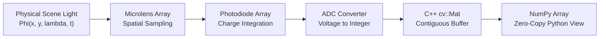
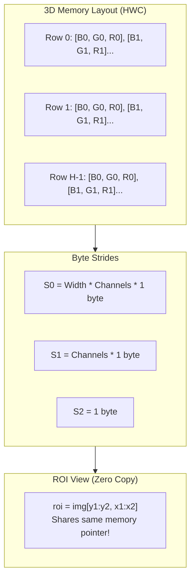
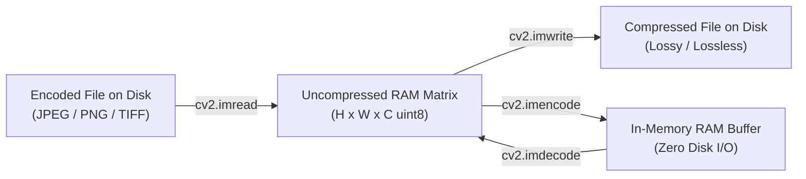
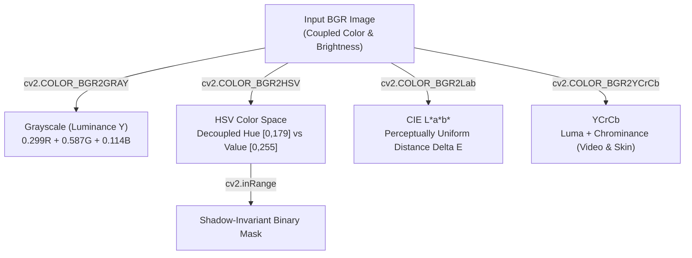
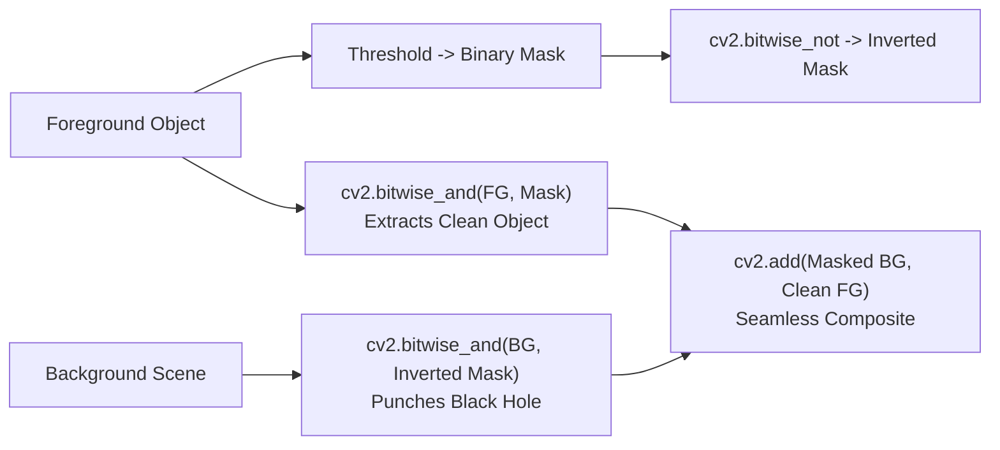
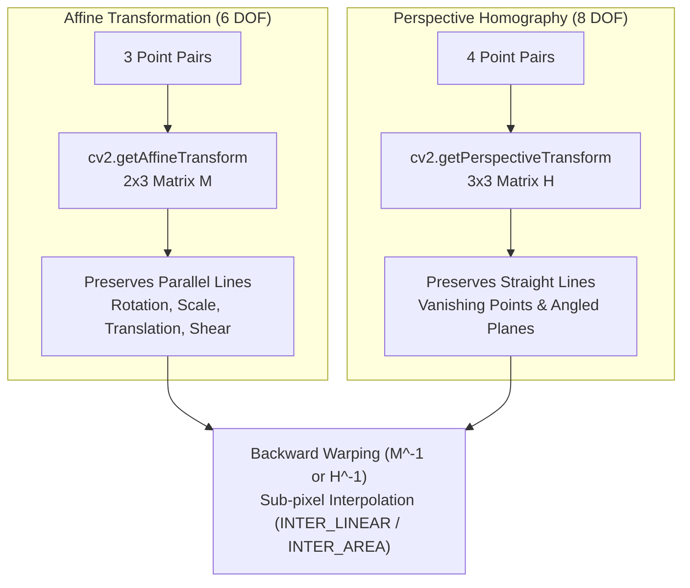

# Part 1: OpenCV & Image Fundamentals


## 1. OpenCV Fundamentals

### Definition & Intuitive Analogy
**OpenCV** (Open Source Computer Vision Library) is the world's most widely used open-source software library for computer vision, image processing, and machine learning.

> **Intuitive Analogy:** Think of an image as a giant mosaic made of millions of colored tiles (pixels). A camera sensor is like an array of tiny buckets (photodiodes) collecting raindrops (photons of light). OpenCV is the master toolkit containing thousands of high-speed mathematical tools designed to analyze, measure, modify, and understand these pixel mosaics in real-time.


### 💡 The Big Picture in Plain English (Beginner Friendly)

- **What is it in 1 simple sentence?** OpenCV is a gigantic, super-fast digital toolbox that takes pictures from cameras and turns them into tables of numbers so computers can "see," detect shapes, and track objects in real time.
- **Why do we need this? (The Problem):** Python is easy to write, but if you try to process a 1080p camera feed (over 2 million pixels) 30 times a second using standard Python `for` loops, your computer will freeze—it is over 100 times too slow. OpenCV solves this by letting you write simple Python commands while running ultra-optimized C++ code on your computer's fastest CPU and GPU circuits underneath.
- **How to picture it in your head (Mental Model):** Imagine you are the director of a Hollywood movie. You sit in a chair giving high-level commands: *"Zoom in!"*, *"Blur the background!"*, *"Find that face!"*. You don't build the camera lenses yourself. Python is you speaking into a walkie-talkie, and OpenCV is an army of Olympic-level athletes running around at light speed executing every command instantly.
- **Step-by-Step Walkthrough with Easy Numbers (Light to Pixels):**
  1. Light bounces off a red apple and hits your camera's photodiode sensor.
  2. The sensor accumulates electrons during the shutter exposure time (like rain filling a bucket).
  3. The bucket voltage is measured: say $0.5$ Volts out of a maximum $1.0$ Volt scale.
  4. The Analog-to-Digital Converter (ADC) maps this voltage to an 8-bit integer between $0$ (darkness) and $255$ (maximum brightness). Since $0.5$ is halfway, it records the integer **128**.
  5. That single number **128** is stored in computer memory as a pixel!
- **Beginner Trap & Rule of Thumb:** In OpenCV geometry functions, points are given as $(x, y) = (	ext{column}, 	ext{row})$. But in NumPy array indexing, you MUST index as `image[y, x] = image[row, col]`. If you mix them up, your program crashes or draws annotations sideways!

### Why It Is Important
In production systems—from self-driving cars and warehouse robots to medical scanners and smartphones—visual data must be processed within strict time limits (often under 10 to 30 milliseconds per frame). Python's standard loops are far too slow for processing millions of numbers per frame. OpenCV solves this by running highly optimized C++ code under the hood with hardware acceleration (SIMD CPU instructions and GPU acceleration), while giving developers a clean, easy-to-use Python interface.

### Core Concept & Mathematical Intuition: How Light Becomes Digital Pixels

In the physical universe, light is a continuous wave of electromagnetic radiation emitted by light sources (the Sun, light bulbs) and reflected off physical objects in the world. 

```
+---------------------------------------------------------------------------------------------------+
|                            THE PHYSICAL-TO-DIGITAL CAMERA PIPELINE                                |
+---------------------------------------------------------------------------------------------------+
| 1. CONTINUOUS LIGHT   |  2. SPATIAL SAMPLING   |  3. EXPOSURE INTEGRATION  |  4. ADC QUANTIZATION |
|   Radiant Light Flux  |    Microlens Array     |     Photodiode Array      |   Analog-to-Digital  |
|                       |                        |                           |                      |
|      ~ ~ ~ ~ ~ ~      |     [ ] [ ] [ ] [ ]    |     |_| |_| |_| |_|       |     01101100 (108)   |
|     Photons (Waves)   |     Discrete 2D Grid   |   Accumulate Electrons    |   Discrete Integer   |
|   Phi(x, y, lambda, t)|   W x H Pixel Sensors  |   Charge proportional to  |   [0, 255] in RAM    |
|                       |                        |   photon count in dt      |                      |
+---------------------------------------------------------------------------------------------------+
```

#### Step 1: Continuous Radiant Light Flux $\Phi(x, y, \lambda, t)$
Light entering a camera lens is a continuous mathematical function containing 4 variables:
- **$(x, y)$ (Space):** Continuous physical coordinates on the camera sensor plane (measured in millimeters or micrometers).
- **$\lambda$ (Wavelength / Color):** The spectral wavelength of the photons. Visible light ranges from $\approx 380\text{ nm}$ (violet/blue) to $\approx 740\text{ nm}$ (red). Infrared is $>750\text{ nm}$.
- **$t$ (Time):** Continuous physical time (in seconds).
- **$\Phi$ (Radiant Flux / Intensity):** The power of incoming electromagnetic energy (measured in Watts/$\text{m}^2$).

#### Step 2: Spatial Sampling (The Photodiode Grid)
The continuous spatial image must be cut into discrete pieces. A camera sensor (CMOS or CCD) consists of a silicon wafer etched with a rectangular grid of millions of tiny microscopic light collectors called **photodiodes** (pixels):
- A $1920 \times 1080$ Full HD sensor contains exactly $2,073,600$ individual photodiode buckets.
- **Spatial Sampling** means the sensor averages all light hitting each tiny square area into a single point:
  $$I_{\text{continuous}}(r, c) = \iint_{\text{Pixel Area}(r,c)} \Phi(x, y) \, dx \, dy$$

#### Step 3: Exposure Integration (Rain into Buckets Analogy)
> **Bucket Analogy:** Think of photons like raindrops falling from the sky. Each photodiode is an empty bucket. When the camera shutter opens for exposure time $\Delta t$ (e.g., $1/100$th of a second), raindrops collect in the bucket. A bright spot in the scene pours thousands of photons into its bucket, generating a large electrical charge. A dark shadow only drips a few photons, generating a tiny electrical charge.

The accumulated electric charge $Q$ in pixel bucket $(r, c)$ is:
$$Q(r, c) = \int_{t_{\text{start}}}^{t_{\text{start}} + \Delta t} \int_{\lambda_{\min}}^{\lambda_{\max}} \Phi(r, c, \lambda, t) \cdot S(\lambda) \, d\lambda \, dt$$
Where $S(\lambda)$ is the spectral sensitivity of the silicon sensor.

#### Step 4: Quantization via ADC (Analog-to-Digital Converter)
The accumulated electrical charge is an analog voltage (e.g., $0.00\text{V}$ to $1.25\text{V}$). A computer processor cannot store continuous voltages—it only understands digital numbers. The **Analog-to-Digital Converter (ADC)** slices the continuous voltage range into discrete integer steps:

```
Voltage (Analog)                 Digital Integer (8-bit)
1.25 V  ---------------------->  255 (Pure White / Saturated)
1.00 V  ---------------------->  204
0.625V  ---------------------->  128 (Medium Gray)
0.25 V  ---------------------->  51
0.00 V  ---------------------->  0   (Pitch Black / Darkness)
```

#### Bit Depth Comparison
- **8-bit Unsigned Integer (`uint8`):** $2^8 = 256$ intensity levels ($[0, 255]$). This is standard for consumer cameras, webcams, and display monitors.
- **16-bit Unsigned Integer (`uint16`):** $2^{16} = 65,536$ intensity levels ($[0, 65535]$). Commonly used in:
  - Depth sensors (LiDAR, Time-of-Flight, Intel RealSense), where each integer represents metric distance in millimeters ($1500 = 1.5\text{ meters}$).
  - Medical imaging (CT scans, X-rays, MRI) to capture subtle bone and soft-tissue density variations.
- **32-bit Floating Point (`float32`):** Stores continuous real numbers $[0.0, 1.0]$ or $[-\infty, +\infty]$. Essential for gradient maps, machine learning feature tensors, and HDR radiance fields.

---

### Coordinate System in Computer Vision: Why Top-Left $(0, 0)$?

In standard Cartesian school mathematics, the origin $(0, 0)$ is at the **bottom-left**, and $+Y$ points **upward**. 

In Computer Vision, digital image matrices place $(0, 0)$ at the **TOP-LEFT** corner, $+X$ extends to the **RIGHT**, and $+Y$ extends **DOWNWARD**:

```
(0, 0) [Top-Left Origin]  ----------------------->  +X (Width / Columns)
   |
   |       Pixel (x=3, y=1) or Array[row=1, col=3]
   |                 |
   |                 v
   |       +---+---+---+---+---+
   |  row0 | . | . | . | . | . |
   |       +---+---+---+---+---+
   |  row1 | . | . | . | X | . |
   |       +---+---+---+---+---+
   |  row2 | . | . | . | . | . |
   |       +---+---+---+---+---+
   v
  +Y (Height / Rows)
```

#### Why did this convention develop?
1. **Cathode Ray Tube (CRT) Raster Scanning:** Early television sets and computer monitors scanned an electron beam across the phosphor screen starting from the top-left corner, sweeping horizontally across the row from left-to-right, then jumping down to the next row (raster scan).
2. **Western Reading Order:** In Western languages, text is read from left-to-right and top-to-bottom. Memory addresses in computer RAM follow this exact linear sequence.

#### The Fundamental Indexing Rule: $(x, y)$ vs $[y, x]$
This is the single most common source of bugs in computer vision engineering:
- **OpenCV Geometry Functions (`cv2.circle`, `cv2.line`, `cv2.rectangle`):** Expect spatial coordinates $(x, y) = (\text{column}, \text{row})$.
- **NumPy Matrix Indexing (`img[row, col]`):** Expects matrix coordinates $[y, x] = [\text{row}, \text{column}]$.

```
         OpenCV Call:  cv2.circle(image, (x=200, y=100), radius=10, color)
         NumPy Index:  pixel_val = image[y=100, x=200]
```

---

### How It Works Internally: Memory Layout & Hardware Acceleration

```
+------------------------------------------------------------------------------------+
|                         OPENCV cv::Mat / NUMPY MEMORY MODEL                        |
+------------------------------------------------------------------------------------+
|   HEADER (Small fixed metadata in C++)         DATA BUFFER (Heap Allocation)       |
|   - Dimensions: Height=480, Width=640          [B0][G0][R0] [B1][G1][R1] ...       |
|   - Channels: 3 (BGR)                          Continuous 1D array of raw bytes    |
|   - Data Type: CV_8UC3 (uint8)                 Total bytes = H * W * C             |
|   - Step / Strides: (1920, 3, 1) bytes         Shared by NumPy via Zero-Copy!      |
|   - Reference Counter: RefCount = 1                                                |
|   - Data Pointer: 0x7ffee4b20000 -----------> [ 120, 45, 230, 118, 44, 229, ... ] |
+------------------------------------------------------------------------------------+
```

#### 1. C++ `cv::Mat` Internal Architecture
A `cv::Mat` object is lightweight because it separates the metadata from the raw image data:
1. **The Header (Fixed-size $\approx 32-64$ bytes):** Contains matrix dimensions ($H, W$), number of channels ($C$), bit depth (`CV_8U`, `CV_32F`), memory strides (step size in bytes), and an atomic thread-safe reference counter.
2. **The Data Buffer (Variable size, e.g., 6 MB for 1080p):** A heap-allocated contiguous 1D block of memory holding the raw pixel bytes.
3. **Reference Counting (Copy-on-Write semantics):** Copying a `cv::Mat` (or passing it between functions) only copies the small header and increments `RefCount++`. No expensive pixel memory copying takes place until an explicit `.clone()` or `.copy()` is requested.

#### 2. Zero-Copy Python $\leftrightarrow$ C++ Bridge
When you pass a NumPy array to `cv2` in Python:
- Python's C-API / PyBind11 wrapper reads the memory address of NumPy's internal `data` pointer.
- It instantly instantiates a `cv::Mat` header pointing directly to NumPy's memory buffer.
- **Zero data duplication occurs.** The C++ OpenCV algorithm computes directly inside the NumPy array memory buffer.

#### 3. Hardware SIMD Vectorization (AVX2, AVX-512, ARM NEON)
Standard CPU code runs in **Scalar Mode**: it adds or multiplies one number at a time:
```
Scalar Loop (1 pixel per clock cycle):
Cycle 1: Pixel[0] + 50
Cycle 2: Pixel[1] + 50
Cycle 3: Pixel[2] + 50
... (Takes 32 clock cycles for 32 pixels)
```

With **SIMD (Single Instruction, Multiple Data)**, the CPU loads a wide 256-bit vector register (Intel AVX2) or 512-bit register (AVX-512) and executes arithmetic on **32 separate pixels simultaneously in a single clock cycle**:

```
AVX2 SIMD Register (256-bit wide) - 1 Clock Cycle:
[P0][P1][P2][P3][P4][P5][P6][P7] ... [P31]  +  [50][50][50] ... [50]
====================================================================
[R0][R1][R2][R3][R4][R5][R6][R7] ... [R31]  (32 pixels processed at once!)
```
OpenCV automatically detects CPU support at runtime and dispatches compiled SIMD assembly kernels.

#### 4. Multithreaded Row Chunking (Intel TBB / OpenMP)
For large images, OpenCV divides the image into horizontal row bands and dispatches them across multiple CPU cores:
- Core 0 processes Rows $0 \to 249$
- Core 1 processes Rows $250 \to 499$
- Core 2 processes Rows $500 \to 749$
- Core 3 processes Rows $750 \to 999$

Controlled via `cv2.setNumThreads(N)`.

### Important OpenCV Functions & Syntax
```python
import cv2

# Check OpenCV version string
version = cv2.getVersionString()

# Check if hardware SIMD acceleration is currently active
is_opt = cv2.useOptimized() # Returns True if SIMD vectorization is active

# Enable or disable SIMD acceleration
cv2.setUseOptimized(True)

# Set the number of worker CPU threads for parallel loops
cv2.setNumThreads(4)

# High-precision performance timing
t1 = cv2.getTickCount()
# ... perform image operations ...
t2 = cv2.getTickCount()
elapsed_sec = (t2 - t1) / cv2.getTickFrequency()
```

### System Architecture & Pipeline Flowchart


### Visual Demonstration & Coordinate Alignment


### Executable Python Example
```python
import cv2
import numpy as np
import matplotlib.pyplot as plt

# 1. Verify optimization flags and hardware dispatch
print(f"OpenCV Version: {{cv2.__version__}}")
print(f"Hardware Vectorization Enabled: {{cv2.useOptimized()}}")
cv2.setUseOptimized(True)
cv2.setNumThreads(4)

# 2. Build a synthetic calibration canvas (Height=300, Width=400, Channels=3)
# np.full initializes an array filled with 245 (light gray)
canvas = np.full((300, 400, 3), 245, dtype=np.uint8)

# 3. Draw coordinate axes and geometric primitives
# NOTE: OpenCV points are specified as (x, y) = (col, row)
cv2.line(canvas, (50, 50), (350, 50), (200, 0, 0), thickness=2, lineType=cv2.LINE_AA) # X-axis (Blue in BGR)
cv2.line(canvas, (50, 50), (50, 250), (0, 150, 0), thickness=2, lineType=cv2.LINE_AA) # Y-axis (Green in BGR)
cv2.putText(canvas, "+X (Columns/Width)", (200, 40), cv2.FONT_HERSHEY_SIMPLEX, 0.5, (200, 0, 0), 1, cv2.LINE_AA)
cv2.putText(canvas, "+Y (Rows/Height)", (60, 230), cv2.FONT_HERSHEY_SIMPLEX, 0.5, (0, 150, 0), 1, cv2.LINE_AA)

# Draw geometric shapes: circle at center (200, 150) with radius 50 (Red in BGR: 0, 0, 220)
cv2.circle(canvas, (200, 150), 50, (0, 0, 220), thickness=2, lineType=cv2.LINE_AA)
cv2.rectangle(canvas, (100, 100), (300, 200), (120, 120, 120), thickness=1)

# 4. Display with Matplotlib (Convert BGR -> RGB for correct display)
plt.figure(figsize=(6, 4))
plt.imshow(cv2.cvtColor(canvas, cv2.COLOR_BGR2RGB))
plt.title("OpenCV Image Coordinate System & Geometric Primitives")
plt.axis("off")
plt.show()

print(f"Canvas shape: {{canvas.shape}} (Height=300, Width=400, Channels=3), Data type: {{canvas.dtype}}")
```

### Line-by-Line Explanation
1. `cv2.setUseOptimized(True)`: Forces OpenCV to use compiled CPU vector instructions (AVX2/NEON) for maximum processing speed.
2. `np.full((300, 400, 3), 245, dtype=np.uint8)`: Allocates a $300 \times 400$ 3-channel matrix in memory where each byte is initialized to value $245$.
3. `cv2.line(canvas, (50, 50), (350, 50), (200, 0, 0), ...)`: Draws an anti-aliased line from point $(x_1, y_1) = (50, 50)$ to $(x_2, y_2) = (350, 50)$. Notice the color is a tuple `(B, G, R)` so `(200, 0, 0)` is blue.
4. `cv2.LINE_AA`: Anti-aliased line drawing flag. Calculates sub-pixel Gaussian weights along the boundary to prevent jagged "staircase" pixel edges.
5. `cv2.cvtColor(canvas, cv2.COLOR_BGR2RGB)`: Swaps the first and third channels so Matplotlib (which expects RGB) displays colors accurately.

### Common Mistakes & Important Tips
- **The BGR Trap:** OpenCV stores color channels in **Blue-Green-Red (BGR)** order, while almost every other library (Matplotlib, PIL, PyTorch, TensorFlow) expects **Red-Green-Blue (RGB)**. Forgetting to convert BGR to RGB when displaying with Matplotlib makes red objects appear blue and blue objects appear red.
- **Coordinate Order Confusion:** When calling OpenCV drawing functions (e.g., `cv2.circle(img, (x, y), ...)`), coordinates are given as `(x, y)` which is `(column, row)`. But when indexing the NumPy array directly, you must write `img[y, x]` which is `img[row, column]`. Mixing these up leads to "index out of bounds" errors or flipped geometries!
- **Memory Contiguity:** OpenCV functions expect C-contiguous memory arrays (`array.flags['C_CONTIGUOUS'] == True`). If you take non-contiguous slices or transposed views, always use `np.ascontiguousarray()` before passing them to OpenCV.

### Real-World & Robotics Perception Relevance
- **Visual Odometry (VO) & SLAM:** Autonomous drones and mobile robots track high-speed feature points across frames. Real-time CPU optimizations (`cv2.useOptimized()`) ensure that the tracking loop runs at $>60$ FPS, preventing tracking drift.
- **Deterministic Latency Budgeting:** In autonomous driving, visual perception pipelines have a strict latency budget (e.g., $<15$ ms per frame). Knowing how OpenCV manages threads and memory prevents unpredictable garbage collection pauses.

### Interview Questions & Detailed Answers
1. **Q: Why does OpenCV represent images in BGR format instead of RGB by default?**
   - *Answer:* When OpenCV was originally created at Intel Research in 1999, the dominant camera frame grabbers and Windows graphic hardware manufacturers (DirectShow and Video for Windows) stored pixel buffers in BGR byte order. To avoid the runtime overhead of converting every single camera frame in memory on 1999-era CPUs, OpenCV adopted BGR natively. It remains BGR today to maintain backwards compatibility.
2. **Q: What is the memory ownership model when passing NumPy arrays into OpenCV Python functions?**
   - *Answer:* OpenCV's Python bindings use a zero-copy mechanism. The C++ wrapper creates a `cv::Mat` header whose data pointer points directly to the existing NumPy memory buffer without copying data. Deep copies only occur if the array data is not contiguous in memory or if an explicit `.copy()` is invoked.

### Mini Exercise with Solution
**Task:** Write a Python function that generates a $400 \times 400$ blank image, draws 5 concentric circles spaced 30 pixels apart centered at $(200, 200)$, and accurately measures the execution time over 1,000 iterations using `cv2.getTickCount()`.

```python
import cv2
import numpy as np

def benchmark_concentric_circles(iterations=1000):
    t_start = cv2.getTickCount()
    for _ in range(iterations):
        img = np.zeros((400, 400, 3), dtype=np.uint8)
        for r in range(30, 180, 30):
            cv2.circle(img, (200, 200), r, (0, 255, 0), thickness=2, lineType=cv2.LINE_AA)
    t_end = cv2.getTickCount()
    
    total_time_sec = (t_end - t_start) / cv2.getTickFrequency()
    avg_fps = iterations / total_time_sec
    print(f"Total time for {{iterations}} iterations: {{total_time_sec:.4f}}s | Average Speed: {{avg_fps:.1f}} FPS")

benchmark_concentric_circles()
```

---

## 2. Images & NumPy Fundamentals

### Definition & Intuitive Analogy
In Python OpenCV, every image is simply a standard NumPy $N$-dimensional numerical array (`np.ndarray`). A single grayscale image is a 2D matrix (rows $\times$ columns), while a color image is a 3D volume (rows $\times$ columns $\times$ channels).

> **Intuitive Analogy:** Imagine an image as a spreadsheet. For a grayscale image, each cell holds a single number representing how bright that spot is. For a color image, imagine a stack of three spreadsheets taped together: the top sheet contains the Blue brightness values, the middle sheet contains Green, and the bottom sheet contains Red.


### 💡 The Big Picture in Plain English (Beginner Friendly)

- **What is it in 1 simple sentence?** An image is nothing more than a giant spreadsheet or 3D grid of numbers where each cell holds a brightness level from 0 (pitch black) to 255 (blinding white).
- **Why do we need this? (The Problem):** If you try to brighten an image in regular Python using `pixel + 20`, an 8-bit number at 250 wraps around like a car odometer and becomes `14`! Your bright sunny sky suddenly gets bizarre black spots. OpenCV's saturated arithmetic prevents this by clamping values at 255.
- **How to picture it in your head (Mental Model):**
  - **Grayscale image:** A single spreadsheet. Row 5, Column 10 has the number `45` (a dark gray pixel).
  - **Color image:** Three spreadsheets stacked on top of each other like pancakes. The top sheet holds the Blue brightness, the middle holds Green, and the bottom holds Red.
  - **Modulo vs Saturated Arithmetic:** Modulo arithmetic is like a clock ($11	ext{ o'clock} + 2	ext{ hours} = 1	ext{ o'clock}$). Saturated arithmetic is like filling a water cup: once the cup is 100% full, adding more water doesn't make it empty—it stays 100% full ($255$).
- **Step-by-Step Walkthrough with Easy Numbers:**
  - Let pixel $A = 240$ and you add brightness $+30$.
  - In pure NumPy (modulo 8-bit): $(240 + 30) = 270 \implies 270 - 256 = \mathbf{14}$ (Turns nearly black!).
  - In OpenCV `cv2.add`: $\min(240 + 30, 255) = \mathbf{255}$ (Stays pure white, as human eyes expect).
- **Beginner Trap & Rule of Thumb:** Slicing an image in NumPy (`crop = img[0:100, 0:100]`) creates a **view**, not a copy. If you modify `crop`, you accidentally modify the original image! Always call `.copy()` if you want an independent image.

### Why It Is Important
Understanding how NumPy stores and indexes image matrices allows you to perform fast, vectorized image arithmetic, crop regions of interest (ROI), and mask out objects without writing slow `for` loops in Python.

### Core Concept & Mathematical Intuition
Mathematically, an image is a 2D spatial function mapping discrete pixel coordinates to intensity values:
$$I: \Omega \subset \mathbb{Z}^2 \to \mathcal{V}$$

Where $(r, c)$ denotes row $r \in [0, H-1]$ and column $c \in [0, W-1]$:
- **8-bit Unsigned Integer (`np.uint8`):** $\mathcal{V} = \{0, 1, 2, \dots, 255\}$. This is standard for normal display images.
- **16-bit Unsigned Integer (`np.uint16`):** $\mathcal{V} = \{0, 1, 2, \dots, 65535\}$. Standard for depth maps (where pixel values represent distance in millimeters).
- **32-bit Floating Point (`np.float32`):** $\mathcal{V} = [0.0, 1.0]$ or $[-\infty, +\infty]$. Standard for gradient calculations, machine learning feature maps, and optical flow vectors.

#### Indexing Rules: Spatial vs Matrix Convention
| Framework | Coordinate Notation | Order | Example |
| :--- | :--- | :--- | :--- |
| **OpenCV Geometry** | $(x, y)$ | $(\text{Column}, \text{Row})$ | `cv2.circle(img, (x, y), r, color)` |
| **NumPy Matrix Indexing** | `[y, x]` or `[row, col]` | $(\text{Height}, \text{Width})$ | `pixel = img[y, x]` |
| **Shape Attribute** | `img.shape` | $(H, W, C)$ | `(480, 640, 3)` $\to$ 480 rows, 640 cols |

### Saturated Arithmetic vs Modulo Arithmetic
A critical difference between OpenCV and standard NumPy math is how they handle numerical overflow and underflow:

1. **NumPy Uses Modulo (Wrap-around) Arithmetic:**
   - When an 8-bit number exceeds $255$, it wraps around: $250 + 20 = 270 \pmod{{256}} = 14$.
   - **Danger in Vision:** If you brighten an image with NumPy `img + 50`, bright highlights ($>205$) will instantly wrap around to near-zero, creating bizarre dark/black spots in the brightest parts of the image!
2. **OpenCV Uses Saturated Arithmetic:**
   - Values are clamped strictly to $[0, 255]$:
     $$\text{{cv2.add}}(a, b) = \min(a + b, 255)$$
     $$\text{{cv2.subtract}}(a, b) = \max(a - b, 0)$$
   - With OpenCV `cv2.add(250, 20)`, the result is correctly clamped to $255$ (pure white).

### How It Works Internally: NumPy Memory Strides
NumPy arrays use a **strided memory layout**. A 3D image array is stored in RAM as a flat 1D sequence of bytes. To find the memory address of pixel at row $r$, column $c$, channel $k$, the CPU computes:

$$\text{{Memory Address}}(r, c, k) = \text{{DataPointer}} + r \cdot S_0 + c \cdot S_1 + k \cdot S_2$$

Where $S_0, S_1, S_2$ are the **strides** (the number of bytes to step in memory to advance by 1 row, 1 column, or 1 channel).
- **Views vs Copies:** When you slice an image using `roi = img[50:150, 50:150]`, NumPy creates a new array header with adjusted strides pointing to the **same underlying memory buffer** (Zero-Copy). Modifying `roi` directly alters `img`! To create an independent copy, you must explicitly call `.copy()`.

### Important OpenCV & NumPy Syntax
```python
# Array properties
height, width, channels = img.shape
data_type = img.dtype # e.g., dtype('uint8')

# Slicing a Region of Interest (ROI) - Zero Copy View
roi = img[y_min:y_max, x_min:x_max]

# Creating an independent deep copy
roi_copy = img[y_min:y_max, x_min:x_max].copy()

# Saturated arithmetic
bright_img = cv2.add(img, np.array([50.0])) # Clamped to 255
dark_img = cv2.subtract(img, np.array([50.0])) # Clamped to 0

# Channel splitting and merging
b, g, r = cv2.split(img) # Splits into three 2D arrays
merged = cv2.merge([b, g, r]) # Combines three 2D arrays back to 3D
```

### Memory Architecture & Strides Diagram


### Visual Demonstration & Channel Architecture


### Executable Python Example
```python
import numpy as np
import cv2
import matplotlib.pyplot as plt

# 1. Create a synthetic 3-channel BGR test image (Height=200, Width=300)
img_bgr = np.zeros((200, 300, 3), dtype=np.uint8)
img_bgr[:, :100] = (255, 0, 0)    # Left stripe: Pure Blue (BGR: 255, 0, 0)
img_bgr[:, 100:200] = (0, 255, 0)  # Middle stripe: Pure Green (BGR: 0, 255, 0)
img_bgr[:, 200:] = (0, 0, 255)    # Right stripe: Pure Red (BGR: 0, 0, 255)

# 2. Extract a Region of Interest (ROI) via NumPy strided slicing (Zero-Copy view)
roi = img_bgr[50:150, 50:250]

# Modify the ROI in-place: turn on full Green intensity across the ROI
roi[:, :, 1] = 255

# 3. Channel separation using cv2.split
b_plane, g_plane, r_plane = cv2.split(img_bgr)
reconstructed = cv2.merge([b_plane, g_plane, r_plane])

# 4. Demonstrate Saturated vs Modulo Arithmetic
val_np = np.uint8(250) + np.uint8(20) # NumPy wrap-around: 270 % 256 = 14
val_cv = cv2.add(np.uint8(250), np.uint8(20)) # OpenCV saturated: min(270, 255) = 255
print(f"NumPy Modulo Addition (250+20): {{val_np}} | OpenCV Saturated Addition (250+20): {{val_cv[0][0]}}")

# 5. Visual Multi-Panel Comparison
fig, axs = plt.subplots(1, 4, figsize=(14, 3.5))
axs[0].imshow(cv2.cvtColor(img_bgr, cv2.COLOR_BGR2RGB))
axs[0].set_title("Modified Image (ROI edited)")
axs[1].imshow(b_plane, cmap="Blues")
axs[1].set_title("Blue Channel Plane")
axs[2].imshow(g_plane, cmap="Greens")
axs[2].set_title("Green Channel Plane")
axs[3].imshow(r_plane, cmap="Reds")
axs[3].set_title("Red Channel Plane")
for ax in axs: ax.axis("off")
plt.tight_layout()
plt.show()

print(f"Memory identity verified: {{np.array_equal(img_bgr, reconstructed)}}")
```

### Line-by-Line Explanation
1. `img_bgr[:, :100] = (255, 0, 0)`: Slices all rows and the first 100 columns across all 3 channels, assigning Blue=255, Green=0, Red=0.
2. `roi = img_bgr[50:150, 50:250]`: Creates a view into the central $100 \times 200$ rectangular region of `img_bgr`. No new memory is allocated.
3. `roi[:, :, 1] = 255`: Updates channel index 1 (Green) inside that slice. Because `roi` shares memory with `img_bgr`, the original image is instantly modified.
4. `cv2.split(img_bgr)`: Deconstructs the interleaved BGR array into three separate 2D single-channel matrices.
5. `cv2.merge([b_plane, g_plane, r_plane])`: Interleaves the three individual single-channel arrays back into a single 3D BGR image.

### Common Mistakes & Important Tips
- **NumPy Direct Addition Bug:** Never use `img + 50` to adjust brightness. Always use `cv2.add(img, 50)` or `np.clip(img.astype(np.int16) + 50, 0, 255).astype(np.uint8)`.
- **Unexpected In-Place Modification:** Modifying a sliced sub-array modifies the original frame. If you want to crop a patch to process without altering the original camera frame, always use `patch = img[y1:y2, x1:x2].copy()`.
- **Direct Channel Indexing is Faster:** `cv2.split()` creates three new arrays and incurs memory allocation. If you only need one channel (e.g., Red), indexing `r = img[:, :, 2]` is significantly faster because it returns a zero-copy 2D view.

### Real-World & Robotics Perception Relevance
- **RGB-D Sensor Data Processing:** In mobile robots equipped with RGB-D cameras (like Intel RealSense or Microsoft Azure Kinect), depth information is provided as a 2D `uint16` array where each number represents distance in millimeters. Spatial slicing (`depth[y, x]`) gives the exact metric distance to an obstacle for collision avoidance.
- **Bounding Box Crop for Deep Learning:** When an object detector (e.g., YOLO) predicts a bounding box `[x1, y1, x2, y2]`, the vision system crops `chip = frame[y1:y2, x1:x2]` and passes it to a secondary classifier (such as a license plate reader or facial recognition model).

### Interview Questions & Detailed Answers
1. **Q: Explain the difference between saturated arithmetic in OpenCV and modulo arithmetic in NumPy.**
   - *Answer:* NumPy performs standard C-style modulo arithmetic on fixed-width types: adding numbers to an 8-bit unsigned integer wraps around upon reaching $256$ ($250 + 20 = 14$). OpenCV uses saturated arithmetic implemented via specialized CPU instructions: addition is capped at the maximum representable value ($255$) and subtraction is floored at $0$. In vision applications, saturated arithmetic prevents catastrophic visual corruption like black patches appearing in bright regions.
2. **Q: How does memory stride affect the performance of OpenCV operations on sliced sub-images?**
   - *Answer:* When an image is sliced horizontally (`img[y1:y2, x1:x2]`), rows are no longer contiguous in physical RAM—there is a stride jump between the end of one cropped row and the start of the next. Some OpenCV SIMD routines require contiguous buffers for vector loads. When non-contiguous arrays are passed, OpenCV may allocate an internal contiguous temporary buffer, run the operation, and copy back, incurring performance overhead.

### Mini Exercise with Solution
**Task:** Generate an $8 \times 8$ chessboard pattern of size $512 \times 512$ pixels (each square is $64 \times 64$ pixels) using pure NumPy broadcasting and vectorization without any `for` loops.

```python
import numpy as np
import matplotlib.pyplot as plt

def generate_chessboard(board_size=8, square_size=64):
    # 1. Create an 8x8 index grid using broadcasting
    r = np.arange(board_size)[:, None] # Column vector (8, 1)
    c = np.arange(board_size)[None, :] # Row vector (1, 8)
    
    # 2. Check parity of (row + col): Even is 255 (white), Odd is 0 (black)
    board_8x8 = ((r + c) % 2 * 255).astype(np.uint8)
    
    # 3. Scale up each cell to square_size x square_size using Kronecker product
    chessboard = np.kron(board_8x8, np.ones((square_size, square_size), dtype=np.uint8))
    return chessboard

cb = generate_chessboard()
print(f"Chessboard generated with shape: {{cb.shape}}, min val: {{cb.min()}}, max val: {{cb.max()}}")
```

---

## 3. Image Input & Output

### Definition & Intuitive Analogy
Image I/O is the process of reading encoded, compressed visual files (like JPEG, PNG, TIFF) from storage into uncompressed, editable NumPy memory arrays, and saving NumPy arrays back into compressed file formats.

> **Intuitive Analogy:** Think of an image file on disk like a tightly folded, vacuum-packed tent in a camping bag. You cannot sleep in a folded tent. Reading an image (`cv2.imread`) is like unzipping the bag and pitching the tent so you can use every inch of space (raw uncompressed pixels in RAM). Writing an image (`cv2.imwrite`) is folding the tent back up and compressing it into the bag.


### 💡 The Big Picture in Plain English (Beginner Friendly)

- **What is it in 1 simple sentence?** Image I/O is unpacking a compressed image file (like a `.jpg` or `.png` on your hard drive) into an open table of numbers in your computer's RAM, and packing it back up into a compressed file when you want to save it.
- **Why do we need this? (The Problem):** An uncompressed 1080p color photo takes about 6 Megabytes of memory. A 1-minute video at 30 frames per second would take over **10 Gigabytes** of storage! Compression shrinks these files by $10	imes$ to $50	imes$ so they fit on your disk and fly across the internet.
- **How to picture it in your head (Mental Model):** Imagine a huge camping tent. When you want to sleep in it, you have to unfold it and pitch it—that's `cv2.imread()`. It takes up a lot of space in your room (RAM), but you can actually use it. When you're ready to pack your backpack, you fold the tent tightly and squeeze it into a tiny carry bag—that's `cv2.imwrite()`.
- **Step-by-Step Walkthrough with Easy Numbers:**
  - Uncompressed 1080p: $1920 	imes 1080 	imes 3	ext{ bytes} = 6,220,800	ext{ bytes} pprox \mathbf{6.22	ext{ MB}}$.
  - Saved as JPEG (quality 90): Frequency coefficients are quantized, shrinking the file to $pprox \mathbf{350	ext{ KB}}$ (a $17.7	imes$ size reduction with near-zero noticeable loss to the human eye).
- **Beginner Trap & Rule of Thumb:** If the file path is incorrect or the image is corrupt, `cv2.imread()` does NOT crash or raise an error—it silently returns `None`! Always write `if img is None: raise FileNotFoundError(...)`.

### Why It Is Important
Autonomous perception pipelines constantly stream, record, and transmit visual data. Knowing how to efficiently compress and decompress images—especially in memory without hitting slow SSD/flash storage—is essential for building high-bandwidth, low-latency vision servers.

### Core Concept & Mathematical Intuition
Raw uncompressed 1080p RGB video produces huge data rates:
$$1920 \times 1080 \text{{ pixels}} \times 3 \text{{ bytes/pixel}} \times 30 \text{{ FPS}} \approx 186.6 \text{{ Megabytes per second}}$$

Compression formats solve this by reducing file sizes:

1. **Lossy Compression (JPEG):**
   - Breaks the image into $8 \times 8$ pixel blocks.
   - Applies the **2D Discrete Cosine Transform (DCT)** to convert spatial pixel values into frequency components.
   - High-frequency details (which human eyes barely notice) are aggressively quantized (divided and rounded), and the rest is compressed using Huffman encoding.
   - **Trade-off:** Very small file size, but introduces compression artifacts along sharp edges.
2. **Lossless Compression (PNG):**
   - Uses predictive filters on image scanlines followed by the **DEFLATE** algorithm (a combination of LZ77 dictionary matching and Huffman entropy coding).
   - **Trade-off:** Exactly reproduces the original pixel values bit-for-bit, but file sizes are larger than JPEG.
3. **High Dynamic Range / Metric Formats (TIFF, OpenEXR):**
   - Supports 16-bit integers and 32-bit floating-point radiance values without lossy truncation. Essential for medical imaging, satellite imagery, and depth sensors.

### Image I/O Processing Flowchart


### Important OpenCV Functions & Syntax
```python
# Reading an image from disk
img = cv2.imread(filename: str, flags: int = cv2.IMREAD_COLOR)

# Writing an image to disk
success = cv2.imwrite(filename: str, img: np.ndarray, params: list = None)

# In-Memory Encoding (compress directly to RAM byte buffer)
success, encoded_buf = cv2.imencode(ext: str, img: np.ndarray, params: list = None)

# In-Memory Decoding (decompress raw byte buffer directly into NumPy array)
decoded_img = cv2.imdecode(buf: np.ndarray, flags: int)
```

#### Read Flags Deep Dive:
- `cv2.IMREAD_COLOR` (Default, value `1`): Loads the image in 8-bit BGR 3-channel format, stripping any alpha/transparency channel.
- `cv2.IMREAD_GRAYSCALE` (Value `0`): Converts the image directly to a 1-channel grayscale matrix during decoding.
- `cv2.IMREAD_UNCHANGED` (Value `-1`): Loads the image exactly as stored in the file, preserving 4-channel BGRA transparency or 16-bit depth.
- `cv2.IMREAD_ANYDEPTH` (Value `2`): Retains 16-bit or 32-bit precision instead of downscaling to 8-bit.

#### Write Parameters:
- `[cv2.IMWRITE_JPEG_QUALITY, quality_val]`: JPEG quality from `0` (lowest, smallest file) to `100` (highest, largest file). Default is `95`.
- `[cv2.IMWRITE_PNG_COMPRESSION, compression_level]`: PNG compression level from `0` (no compression, fastest) to `9` (maximum compression, slowest). Default is `3`.

### Executable Python Example
```python
import cv2
import numpy as np

# 1. Create a synthetic 16-bit depth map (simulating LiDAR / ToF sensor values in mm)
depth_sim = np.random.randint(500, 5000, (480, 640), dtype=np.uint16)
print(f"Original simulated depth: shape={{depth_sim.shape}}, dtype={{depth_sim.dtype}}")

# 2. In-Memory Lossless PNG Compression (Zero disk I/O)
# Useful for transmitting sensor frames over ROS networks or WebSockets
encode_params = [cv2.IMWRITE_PNG_COMPRESSION, 4]
success, encoded_buffer = cv2.imencode(".png", depth_sim, encode_params)
assert success, "Encoding failed!"

raw_bytes_size = depth_sim.nbytes # 480 * 640 * 2 = 614,400 bytes
compressed_size = len(encoded_buffer)
print(f"Raw RAM size: {{raw_bytes_size:,}} bytes | Compressed size: {{compressed_size:,}} bytes")
print(f"Compression ratio: {{raw_bytes_size / compressed_size:.2f}}x")

# 3. In-Memory Decoding back to 16-bit array
# NOTE: Must use cv2.IMREAD_UNCHANGED to preserve uint16 bit-depth!
decoded_depth = cv2.imdecode(encoded_buffer, cv2.IMREAD_UNCHANGED)

# 4. Mathematical Verification
assert decoded_depth.dtype == np.uint16
assert np.array_equal(depth_sim, decoded_depth)
print("SUCCESS: 16-bit depth reconstructed with 100% mathematical fidelity!")
```

### Line-by-Line Explanation
1. `depth_sim = np.random.randint(500, 5000, (480, 640), dtype=np.uint16)`: Simulates a $640 \times 480$ depth frame where pixel values range from $500$ mm to $5000$ mm.
2. `cv2.imencode(".png", depth_sim, encode_params)`: Compresses the uncompressed matrix into a PNG byte stream held entirely in RAM.
3. `cv2.imdecode(encoded_buffer, cv2.IMREAD_UNCHANGED)`: Decompresses the in-memory byte buffer back into a NumPy array. Specifying `cv2.IMREAD_UNCHANGED` ensures the 16-bit depth values are not truncated down to 8-bit.
4. `np.array_equal(depth_sim, decoded_depth)`: Verifies that every single pixel in the decoded image matches the original image bit-for-bit.

### Common Mistakes & Important Tips
- **The Silent `None` Failure:** If you pass a wrong or nonexistent file path to `cv2.imread("wrong_path.jpg")`, OpenCV **does not throw a Python exception**. Instead, it silently returns `None`. Any subsequent call like `img.shape` will crash with `AttributeError: 'NoneType' object has no attribute 'shape'`. Always verify:
  ```python
  img = cv2.imread("image.jpg")
  if img is None:
      raise FileNotFoundError("Could not load image file.")
  ```
- **Accidental Bit-Depth Downsampling:** If you read a 16-bit sensor image using default `cv2.imread("depth.png")`, OpenCV will automatically scale and truncate it to 8-bit `uint8`, destroying your depth accuracy! Always use `cv2.imread("depth.png", cv2.IMREAD_UNCHANGED)`.

### Real-World & Robotics Perception Relevance
- **Network Streaming in Robotics (ROS2):** Autonomous robots stream live camera feeds to ground control stations over Wi-Fi/5G. Instead of saving frames to disk, frames are encoded in RAM using `cv2.imencode('.jpg', frame, [cv2.IMWRITE_JPEG_QUALITY, 70])` and sent over UDP/WebRTC sockets with minimal latency.
- **Dataset Sharding:** Training vision models on millions of images is bottlenecked by disk file handles. High-performance pipelines pack images as encoded byte strings inside binary database containers (LMDB, WebDataset, TFRecords).

### Interview Questions & Detailed Answers
1. **Q: What happens under the hood if you pass a 16-bit grayscale PNG to `cv2.imread(path, cv2.IMREAD_COLOR)`?**
   - *Answer:* OpenCV's underlying image decoder detects the 16-bit single-channel data, downsamples the bit-depth from 16-bit $[0, 65535]$ down to 8-bit $[0, 255]$ via linear quantization (dividing by 256), and then duplicates that single 8-bit channel across all three B, G, and R channels to return an 8-bit 3-channel array. All fine 16-bit depth precision is irreversibly lost.
2. **Q: How do you stream live camera frames over HTTP/WebSockets without disk I/O bottlenecks?**
   - *Answer:* Capture the raw frame using `cv2.VideoCapture()`, compress it in memory to a JPEG byte buffer using `cv2.imencode('.jpg', frame, [cv2.IMWRITE_JPEG_QUALITY, q])`, extract the underlying byte sequence with `.tobytes()`, and yield it wrapped in a multipart MIME stream (`multipart/x-mixed-replace; boundary=frame`).

### Mini Exercise with Solution
**Task:** Build an adaptive image compression function that encodes an image to JPEG in memory, checks if the encoded payload exceeds 50 KB, and dynamically reduces the JPEG quality in steps of 10 until the file size is under 50 KB.

```python
import cv2
import numpy as np

def compress_under_limit(img: np.ndarray, max_bytes: int = 50 * 1024) -> bytes:
    quality = 95
    while quality >= 10:
        success, buf = cv2.imencode(".jpg", img, [cv2.IMWRITE_JPEG_QUALITY, quality])
        if success and len(buf) <= max_bytes:
            print(f"Achieved payload size: {{len(buf)}} bytes at JPEG Quality={{quality}}")
            return buf.tobytes()
        quality -= 10
    print(f"Warning: Minimum quality reached. Payload size: {{len(buf)}} bytes")
    return buf.tobytes()

# Test with random synthetic image
test_img = np.random.randint(0, 256, (800, 800, 3), dtype=np.uint8)
compressed_bytes = compress_under_limit(test_img)
```

---

## 4. Color Spaces

### Definition & Intuitive Analogy
A **color space** is a mathematical coordinate system used to describe and represent colors as numerical tuples (such as BGR, HSV, HLS, CIE $L^*a^*b^*$, and YCrCb).

> **Intuitive Analogy:** Think of color spaces like different languages describing the same object. BGR describes a color by how an electronic monitor produces it (mixing Red, Green, and Blue light beams). HSV describes a color the way an artist thinks (What color is it? How pure is it? How bright is it?). CIE $L^*a^*b^*$ describes a color the way the human brain experiences it.


### 💡 The Big Picture in Plain English (Beginner Friendly)

- **What is it in 1 simple sentence?** A color space is just a different coordinate system to describe colors—like describing your location using GPS coordinates versus street names.
- **Why do we need this? (The Problem):** In standard BGR, color and brightness are tangled together in all three numbers. If a cloud passes over the sun, the shadow drops the Blue, Green, and Red values of a yellow traffic sign by 50%. A simple BGR color detector thinks the sign vanished! In the **HSV color space**, the Hue (the actual color) stays around $30^\circ$ (Yellow) regardless of whether it's in bright sunlight or deep shade.
- **How to picture it in your head (Mental Model):**
  - **BGR:** Mixing three colored flashlights (Blue, Green, Red) against a dark wall.
  - **HSV (Hue, Saturation, Value):** Think of a painter's color wheel:
    - **Hue:** Which angle on the wheel are you pointing to? (Red, Yellow, Green, or Blue).
    - **Saturation:** How pure or pastel is the paint? (0 is dull muddy gray; 255 is neon vibrant color).
    - **Value:** The dimmer switch in the room (0 is pitch black darkness; 255 is maximum light).
  - **CIE $L^*a^*b^*$:** Designed to match the human brain. A distance of 5 units in $L^*a^*b^*$ looks equally different to human eyes everywhere in the color spectrum.
- **Step-by-Step Walkthrough with Easy Numbers:**
  - A bright yellow sign in sunlight: $[B=20, G=220, R=240] \implies 	ext{Hue} pprox 27$.
  - The same sign in a dark shadow: $[B=10, G=110, R=120] \implies 	ext{Hue} pprox 27$.
  - An HSV color detector filtering `20 <= Hue <= 35` tracks the sign perfectly in both sun and shadow!
- **Beginner Trap & Rule of Thumb:** In OpenCV, Hue values range from **0 to 179** (not 0 to 360) so the angle fits into an 8-bit integer (`uint8 < 256`). Always divide standard 360-degree angles by 2!

### Why It Is Important
In real-world computer vision (e.g., self-driving cars, outdoor robotics), lighting conditions change constantly. In BGR, a shadow changes all three channel values $(B, G, R)$ simultaneously, making simple color thresholding fail. Specialized color spaces (like HSV and $L^*a^*b^*$) separate **luminance (brightness)** from **chrominance (color information)**, allowing robust computer vision algorithms that are invariant to shadows and sunlight changes.

### Core Concept & Mathematical Intuition

#### 1. RGB $\to$ Grayscale Conversion (ITU-R BT.601 Standard)
Converting a color image to a single luminance channel is computed as a weighted sum:
$$Y = 0.299 \cdot R + 0.587 \cdot G + 0.114 \cdot B$$

**Why are the weights unequal?**
Human eyes contain three types of cone photoreceptors, with the highest sensitivity concentrated in green wavelengths ($\approx 555\text{{ nm}}$). Green contributes $58.7\%$ of perceived brightness, Red contributes $29.9\%$, and Blue contributes only $11.4\%$.

#### 2. HSV Color Space (Hue, Saturation, Value)
HSV separates color into intuitive geometric components:
- **Hue ($H$):** The base color angle on a color circle ($0^\circ = \text{{Red}}$, $60^\circ = \text{{Yellow}}$, $120^\circ = \text{{Green}}$, $240^\circ = \text{{Blue}}$).
  - *OpenCV Special Rule:* To store Hue in a standard 8-bit unsigned integer (`uint8` max 255), OpenCV divides the $0^\circ - 360^\circ$ angle by 2:
    $$H_{{\text{{OpenCV}}}} \in [0, 179]$$
- **Saturation ($S \in [0, 255]$):** Purity/vibrancy of the color ($0 = \text{{pure gray/faded}}$, $255 = \text{{pure vibrant color}}$).
- **Value ($V \in [0, 255]$):** Brightness/intensity of the light ($0 = \text{{pitch black}}$, $255 = \text{{maximum brightness}}$).

Mathematical derivation from RGB:
$$V = \max(R, G, B), \quad S = \begin{{cases}} 0 & \text{{if }} V = 0 \\ \frac{{V - \min(R, G, B)}}{{V}} \times 255 & \text{{otherwise}} \end{{cases}}$$

#### 3. CIE $L^*a^*b^*$ (Perceptually Uniform Color Space)
In RGB or HSV, the geometric distance between two color vectors does not match how different they look to human eyes. The CIE $L^*a^*b^*$ standard is designed to be **perceptually uniform**:
- **$L^*$ (Lightness):** Ranges from $0$ (black) to $100$ (or $0-255$ in `uint8`).
- **$a^*$ (Green $\leftrightarrow$ Red axis):** Negative values are green; positive values are red/magenta.
- **$b^*$ (Blue $\leftrightarrow$ Yellow axis):** Negative values are blue; positive values are yellow.

The perceptual color difference between two colors is simply the Euclidean distance:
$$\Delta E^* = \sqrt{{(\Delta L^*)^2 + (\Delta a^*)^2 + (\Delta b^*)^2}}$$
If $\Delta E^* < 1.0$, the difference is imperceptible to the human eye.

#### 4. YCrCb Color Space
Widely used in video compression (H.264, MPEG) and human skin color detection:
- **$Y$:** Luma (brightness).
- **$Cr$:** Red-difference chroma ($R - Y$).
- **$Cb$:** Blue-difference chroma ($B - Y$).

### Color Space Transformation Graph


### Important OpenCV Functions & Syntax
```python
# Convert between color spaces
gray = cv2.cvtColor(img_bgr, cv2.COLOR_BGR2GRAY)
hsv  = cv2.cvtColor(img_bgr, cv2.COLOR_BGR2HSV)
lab  = cv2.cvtColor(img_bgr, cv2.COLOR_BGR2Lab)
ycrcb = cv2.cvtColor(img_bgr, cv2.COLOR_BGR2YCrCb)

# Range-based thresholding (binary segmentation)
# Output mask has 255 where lower_bound <= pixel <= upper_bound, 0 elsewhere
mask = cv2.inRange(hsv, lower_bound, upper_bound)
```

### Visual Demonstration & Color Decomposition


### Executable Python Example
```python
import cv2
import numpy as np
import matplotlib.pyplot as plt

# 1. Create synthetic scene: A yellow hazard object partially covered in shadow
scene = np.zeros((200, 300, 3), dtype=np.uint8)
# Sunlight region: Bright yellow (BGR: 0, 220, 220)
scene[30:170, 30:130] = (0, 220, 220)
# Shadow region: Dark yellow with half intensity (BGR: 0, 110, 110)
scene[30:170, 170:270] = (0, 110, 110)

# 2. Convert to HSV and Lab color spaces
hsv = cv2.cvtColor(scene, cv2.COLOR_BGR2HSV)
lab = cv2.cvtColor(scene, cv2.COLOR_BGR2Lab)

# 3. Robust HSV Segmentation: Isolate Yellow based on Hue (20 to 35 in OpenCV)
# Even though intensity (V) drops in the shadow, Hue remains ~30!
lower_yellow = np.array([20, 100, 50], dtype=np.uint8)
upper_yellow = np.array([35, 255, 255], dtype=np.uint8)
hsv_mask = cv2.inRange(hsv, lower_yellow, upper_yellow)

# 4. Display all planes side-by-side
fig, axs = plt.subplots(1, 4, figsize=(14, 3.5))
axs[0].imshow(cv2.cvtColor(scene, cv2.COLOR_BGR2RGB))
axs[0].set_title("Input (Bright + Shadow)")
axs[1].imshow(hsv[:, :, 0], cmap="hsv")
axs[1].set_title("HSV Hue (Constant!)")
axs[2].imshow(lab[:, :, 0], cmap="gray")
axs[2].set_title("Lab Lightness L*")
axs[3].imshow(hsv_mask, cmap="gray")
axs[3].set_title("Shadow-Invariant Mask")
for ax in axs: ax.axis("off")
plt.tight_layout()
plt.show()

print(f"Segmented pixel count: {{cv2.countNonZero(hsv_mask)}} (Both regions captured perfectly!)")
```

### Line-by-Line Explanation
1. `scene[30:170, 30:130] = (0, 220, 220)` creates a bright yellow square, and `scene[30:170, 170:270] = (0, 110, 110)` creates a shadowed version with identical chromaticity but lower intensity.
2. `cv2.cvtColor(scene, cv2.COLOR_BGR2HSV)` transforms the image into Hue, Saturation, and Value channels.
3. `lower_yellow = np.array([20, 100, 50])`: We define a lower bound where Hue is at least 20 (yellow range) and Value is as low as 50 (allowing shadowed pixels).
4. `cv2.inRange(hsv, lower_yellow, upper_yellow)` tests every pixel. If all three HSV channels fall within bounds, the output pixel is set to $255$; otherwise $0$.

### Common Mistakes & Important Tips
- **The Red Hue Singularity:** Red light lies at $0^\circ$ on the color circle. Because the spectrum wraps around from $360^\circ$ back to $0^\circ$, red in OpenCV spans **two separate ranges**: $[0, 10]$ and $[170, 180]$. To segment red objects cleanly, you must create two masks and combine them using `cv2.bitwise_or()`:
  ```python
  mask1 = cv2.inRange(hsv, np.array([0, 120, 70]), np.array([10, 255, 255]))
  mask2 = cv2.inRange(hsv, np.array([170, 120, 70]), np.array([180, 255, 255]))
  red_mask = cv2.bitwise_or(mask1, mask2)
  ```
- **Ignoring Low-Saturation Noise:** When an image is nearly grayscale or white/black (Saturation $S \approx 0$ or Value $V \approx 0$), Hue values become mathematically undefined and noisy. Always set a minimum Saturation ($S > 50$) and Value ($V > 50$) threshold when filtering by Hue.

### Real-World & Robotics Perception Relevance
- **Autonomous Road Lane Detection:** Road perception systems convert forward camera frames into $L^*a^*b^*$ and $HLS$. White lane markings are detected using the $L^*$ channel (Lightness), while yellow center-lines are detected using the $b^*$ channel (Blue-Yellow axis).
- **Warehouse Robot Guidance:** AGVs (Automated Guided Vehicles) track colored tape paths (yellow, green, cyan) painted on factory floors regardless of changing shadows from overhead skylights.

### Interview Questions & Detailed Answers
1. **Q: Why is CIE $L^*a^*b^*$ preferred over BGR for automated industrial quality inspection?**
   - *Answer:* BGR is not perceptually uniform: moving a Euclidean distance of 10 units in BGR space in the green direction creates a much larger visible difference to human inspectors than 10 units in the blue direction. CIE $L^*a^*b^*$ is specifically normalized such that Euclidean distance $\Delta E^*$ correlates linearly with human perceptual difference, making thresholding thresholds uniform across all colors.
2. **Q: Why does standard BGR thresholding fail under shadows, and how does HSV solve it?**
   - *Answer:* In BGR, a shadow scales all three color components $(R, G, B)$ down simultaneously, shifting the pixel outside a static BGR bounding box. In HSV, shadow primarily affects the Value ($V$) channel, while the Hue ($H$) channel (the fundamental chromatic wavelength) remains nearly constant.

### Mini Exercise with Solution
**Task:** Write a Python function that isolates pure red traffic cones from an image by computing the union of the two red hue boundary bands.

```python
import cv2
import numpy as np

def segment_red_cones(bgr_image: np.ndarray) -> np.ndarray:
    hsv = cv2.cvtColor(bgr_image, cv2.COLOR_BGR2HSV)
    
    # Lower red band: 0 to 10
    lower_red1 = np.array([0, 100, 100], dtype=np.uint8)
    upper_red1 = np.array([10, 255, 255], dtype=np.uint8)
    mask1 = cv2.inRange(hsv, lower_red1, upper_red1)
    
    # Upper red band: 170 to 180
    lower_red2 = np.array([170, 100, 100], dtype=np.uint8)
    upper_red2 = np.array([180, 255, 255], dtype=np.uint8)
    mask2 = cv2.inRange(hsv, lower_red2, upper_red2)
    
    # Combine both masks
    complete_red_mask = cv2.bitwise_or(mask1, mask2)
    return complete_red_mask
```

---

## 5. Image Manipulation

### Definition & Intuitive Analogy
Image manipulation refers to low-level spatial and logical operations performed on image matrices: extracting Regions of Interest (ROI), bitwise masking, alpha blending, padding, and resizing.

> **Intuitive Analogy:** Think of bitwise masking like using painter's tape or a stencil. When painting a wall, you stick tape over the areas you want to protect. In computer vision, a binary mask acts as digital stencil tape: it allows you to copy, replace, or blend specific shapes into a background without affecting the rest of the picture.


### 💡 The Big Picture in Plain English (Beginner Friendly)

- **What is it in 1 simple sentence?** Image manipulation is digital arts and crafts: cropping regions of interest (ROI), cutting out shapes with digital stencils (masks), and pasting logos seamlessly without leaving ugly borders.
- **Why do we need this? (The Problem):** If you take a red circular logo with a black background and simply paste it onto a photo using standard addition, the black background might bleed or the colors will blend into an ugly ghosted semi-transparent blur.
- **How to picture it in your head (Mental Model):** Think of **Bitwise Masking** like painter's blue masking tape:
  1. You create a black-and-white stencil of the logo (White where the logo is, Black everywhere else).
  2. You flip the stencil (Inverted Mask) and lay it on your background picture.
  3. You punch out a black hole in the background matching the exact shape of your logo.
  4. You drop your logo into that custom black hole. Since $0 + 	ext{Color} = 	ext{Color}$, the logo fits like a laser-cut jigsaw puzzle piece with zero halo fringes!
- **Step-by-Step Walkthrough with Easy Numbers:**
  - Background pixel = $200$ (bright gray). Logo pixel = $150$ (blue).
  - Stencil mask = $0$ (hole). Inverted mask = $255$.
  - Step 1: Punch background: $200 	ext{ AND } 0 = \mathbf{0}$ (black cavity).
  - Step 2: Combine: $0 + 150 = \mathbf{150}$ (clean logo color, zero bleed!).
- **Beginner Trap & Rule of Thumb:** Pasting an ROI outside image boundaries throws a shape mismatch error. Always check that `y + h <= img.shape[0]` and `x + w <= img.shape[1]`.

### Why It Is Important
Every perception pipeline manipulates images: cropping faces from video frames, overlaying HUD telemetry on pilot displays, inserting synthetic data augmentations, and padding rectangular camera frames into square aspect ratios for deep learning models (like YOLO).

### Core Concept & Mathematical Intuition

#### 1. Alpha Blending (Linear Interpolation)
To blend a foreground image $I_1$ smoothly onto a background $I_2$, we compute a weighted sum:
$$I_{{\text{{out}}}}(x, y) = \alpha \cdot I_1(x, y) + \beta \cdot I_2(x, y) + \gamma$$

Where $\alpha \in [0.0, 1.0]$ is the foreground opacity, $\beta = 1.0 - \alpha$ is the background transparency, and $\gamma$ is an optional scalar brightness offset.

#### 2. Bitwise Boolean Matrix Operations
Bitwise operations evaluate binary logic on each bit of each pixel byte ($0$ to $255$):
- **Bitwise AND (`cv2.bitwise_and`):** $A \land B$. Pixel is retained only where both inputs are non-zero. Used to extract an object using a binary mask ($I \land M$).
- **Bitwise OR (`cv2.bitwise_or`):** $A \lor B$. Combines features from two images.
- **Bitwise NOT (`cv2.bitwise_not`):** $\neg A = 255 - A$. Inverts a binary mask ($0 \leftrightarrow 255$).
- **Bitwise XOR (`cv2.bitwise_xor`):** $A \oplus B$. Highlights differences between two images (returns 0 where pixels match).

### Bitwise Masking Pipeline Flowchart


### Important OpenCV Functions & Syntax
```python
# Alpha Blending / Weighted Addition
blended = cv2.addWeighted(src1, alpha, src2, beta, gamma)

# Bitwise Masking Operations
masked_fg = cv2.bitwise_and(src1, src2, mask=binary_mask)
inv_mask  = cv2.bitwise_not(binary_mask)

# Adding borders / padding
padded = cv2.copyMakeBorder(
    src, top, bottom, left, right,
    borderType=cv2.BORDER_CONSTANT, value=[114, 114, 114]
)

# Spatial Resizing
resized = cv2.resize(src, dsize=(new_width, new_height), interpolation=cv2.INTER_LINEAR)
```

### Visual Demonstration & Bitwise Logic Pipeline


### Executable Python Example
```python
import cv2
import numpy as np
import matplotlib.pyplot as plt

# 1. Background scene: Light gray canvas with text
bg = np.full((200, 200, 3), 180, dtype=np.uint8)
cv2.putText(bg, "BACKGROUND", (15, 110), cv2.FONT_HERSHEY_SIMPLEX, 0.7, (40, 40, 40), 2)

# 2. Foreground object: Solid Red circular logo on black canvas
fg = np.zeros((200, 200, 3), dtype=np.uint8)
cv2.circle(fg, (100, 100), 55, (0, 0, 255), thickness=-1)

# 3. Create a clean binary mask of the logo (Threshold the grayscale image)
fg_gray = cv2.cvtColor(fg, cv2.COLOR_BGR2GRAY)
_, mask = cv2.threshold(fg_gray, 10, 255, cv2.THRESH_BINARY)
mask_inv = cv2.bitwise_not(mask) # Inverted mask for the background hole

# 4. Step-by-Step Seamless Integration Pipeline
# a. Punch a black hole in the background matching the logo shape
bg_hole = cv2.bitwise_and(bg, bg, mask=mask_inv)
# b. Extract only the red logo pixels (ensuring black background is 0)
fg_clean = cv2.bitwise_and(fg, fg, mask=mask)
# c. Add the two together (0 + pixel = pixel)
seamless_result = cv2.add(bg_hole, fg_clean)

# 5. Display the 5-step visual pipeline
fig, axs = plt.subplots(1, 5, figsize=(16, 3.2))
axs[0].imshow(cv2.cvtColor(bg, cv2.COLOR_BGR2RGB)); axs[0].set_title("1. Background")
axs[1].imshow(cv2.cvtColor(fg, cv2.COLOR_BGR2RGB)); axs[1].set_title("2. Foreground")
axs[2].imshow(mask, cmap="gray"); axs[2].set_title("3. Mask")
axs[3].imshow(cv2.cvtColor(bg_hole, cv2.COLOR_BGR2RGB)); axs[3].set_title("4. Masked BG")
axs[4].imshow(cv2.cvtColor(seamless_result, cv2.COLOR_BGR2RGB)); axs[4].set_title("5. Composite")
for ax in axs: ax.axis("off")
plt.tight_layout()
plt.show()

print("Overlay composition completed without color bleed artifacts.")
```

### Line-by-Line Explanation
1. `fg_gray = cv2.cvtColor(fg, cv2.COLOR_BGR2GRAY)`: Converts the foreground image to grayscale so we can create a single-channel threshold mask.
2. `_, mask = cv2.threshold(fg_gray, 10, 255, cv2.THRESH_BINARY)`: Any pixel with intensity $>10$ becomes $255$ (white); background pixels remain $0$ (black).
3. `mask_inv = cv2.bitwise_not(mask)`: Inverts the mask so the circular area is $0$ and everything outside is $255$.
4. `bg_hole = cv2.bitwise_and(bg, bg, mask=mask_inv)`: Punches out a black circular hole in the background where the logo will be placed.
5. `seamless_result = cv2.add(bg_hole, fg_clean)`: Adds the black hole ($0$) to the red circle ($255$), producing a perfect composite without color fringes.

### Common Mistakes & Important Tips
- **Shape Mismatch Crashes:** `cv2.addWeighted(img1, 0.5, img2, 0.5, 0)` will crash with an assertion error if `img1` and `img2` differ by even 1 single pixel in height or width, or if their data types differ (`uint8` vs `float32`).
- **Resizing Dimension Ordering:** When calling `cv2.resize(img, (width, height))`, remember the tuple order is `(width, height)` $(W, H)$, which is the **reverse** of `img.shape[:2]` which gives $(H, W)$.

### Real-World & Robotics Perception Relevance
- **HUD & Augmented Reality Teleoperation:** Drone operators and surgical robots use `cv2.addWeighted` to overlay semi-transparent telemetry data, artificial horizon lines, and danger zones onto real-time camera feeds.
- **Letterbox Preprocessing for Neural Networks:** Object detection networks (YOLO, SSD) require fixed-size square inputs (e.g., $640 \times 640$). Rather than squishing rectangular camera frames (which distorts object aspect ratios), pipelines resize the longest edge to 640 and pad the borders using `cv2.copyMakeBorder()`.

### Interview Questions & Detailed Answers
1. **Q: Why is aspect-ratio preserving letterboxing preferred over direct resizing when feeding images to deep learning object detectors?**
   - *Answer:* Direct resizing squashes or stretches objects non-uniformly (e.g., turning a tall pedestrian into a wide box or a circular traffic sign into an ellipse). Convolutional neural network filters learn spatial aspect ratio features; severe geometric distortion reduces detection confidence. Letterboxing scales the image uniformly and pads the empty edges with a neutral color (typically gray $114$), preserving true physical proportions.
2. **Q: Why use bitwise masking instead of simple alpha blending to paste an icon with transparent regions?**
   - *Answer:* Simple alpha addition without masking blends the background of the icon into the scene, creating dark halo fringes or ghosting artifacts. Bitwise masking punches an exact silhouette hole in the background first, so that the foreground pixels are placed over pure zeros ($0$), resulting in crisp, artifact-free edges.

### Mini Exercise with Solution
**Task:** Write an automated letterbox padding function that takes any arbitrary rectangular image $(H, W)$, scales it uniformly so its longest dimension fits inside a target square size (e.g., $640 \times 640$), and centers it with constant gray padding $(114, 114, 114)$.

```python
import cv2
import numpy as np

def letterbox_image(image: np.ndarray, target_size: int = 640) -> tuple[np.ndarray, float, tuple[int, int]]:
    h, w = image.shape[:2]
    # Compute scale factor
    scale = min(target_size / h, target_size / w)
    new_w, new_h = int(w * scale), int(h * scale)
    
    # Resize image preserving aspect ratio
    resized = cv2.resize(image, (new_w, new_h), interpolation=cv2.INTER_LINEAR)
    
    # Compute padding offsets to center the image
    pad_w = (target_size - new_w) // 2
    pad_h = (target_size - new_h) // 2
    
    # Pad borders with neutral gray (114, 114, 114)
    letterboxed = cv2.copyMakeBorder(
        resized,
        top=pad_h,
        bottom=target_size - new_h - pad_h,
        left=pad_w,
        right=target_size - new_w - pad_w,
        borderType=cv2.BORDER_CONSTANT,
        value=(114, 114, 114)
    )
    return letterboxed, scale, (pad_w, pad_h)

# Test with a wide rectangular image (300 x 600)
sample = np.full((300, 600, 3), 200, dtype=np.uint8)
out_img, scale, (pw, ph) = letterbox_image(sample, target_size=640)
print(f"Letterbox output shape: {{out_img.shape}}, Scale factor: {{scale:.3f}}, Padding: ({{pw}}, {{ph}})")
```

---

## 6. Geometric Transformations

### Definition & Intuitive Analogy
A **geometric transformation** is a mathematical operation that changes the spatial positions of pixels in an image—such as scaling, translation, rotation, shearing, affine warping, or perspective projection.

> **Intuitive Analogy:** Imagine an image printed on a sheet of stretchable rubber. 
> - An **Affine transformation** is like stretching, rotating, or sliding the sheet while keeping it completely flat (parallel lines remain parallel).
> - A **Perspective transformation (Homography)** is like tilting the rubber sheet in 3D space and looking at it from an angle: objects closer to you look larger, and parallel lines (like train tracks) appear to converge toward a vanishing point on the horizon.


### 💡 The Big Picture in Plain English (Beginner Friendly)

- **What is it in 1 simple sentence?** Geometric transformations are ways of stretching, turning, sliding, or un-tilting an image so it looks flat and centered.
- **Why do we need this? (The Problem):** When you take a photo of a receipt or a document sitting on a desk from an angle, the paper looks like an angled trapezoid instead of a clean rectangle. You can't read it easily or feed it into OCR text readers until you "un-tilt" it back to a flat view.
- **How to picture it in your head (Mental Model):**
  - Imagine your picture is printed on a stretchy sheet of rubber lying on a table.
  - **Affine Transformation (3 Points):** You slide the sheet, rotate it, or stretch it across the table, but you **keep it completely flat**. Parallel lines (like railroad tracks) stay parallel.
  - **Perspective Transformation / Homography (4 Points):** You grab one edge of the rubber sheet and **tilt it into 3D space** toward your face. The edge close to you looks huge, and the far edge looks tiny. Parallel lines converge toward a vanishing point on the horizon!
  - **Backward Warping:** Why doesn't OpenCV move pixels from the old image to the new image? Because rounding numbers leaves gaps (ugly black holes!). Instead, OpenCV looks at every blank spot on the new canvas, looks backwards to find where it came from in the old image, and blends neighboring pixels cleanly.
- **Step-by-Step Walkthrough with Easy Numbers:**
  - In a 90-degree counter-clockwise rotation, new coordinate $(x', y') = (y, W - 1 - x)$.
  - Pixel at top-left $(x=0, y=0)$ moves to bottom-left $(x'=0, y'=W-1)$.
- **Beginner Trap & Rule of Thumb:** Standard `cv2.getRotationMatrix2D` rotates around the center but clips corners outside the original canvas width and height. To prevent clipping, calculate the expanded bounding box width: $W_{	ext{new}} = W|\cos	heta| + H|\sin	heta|$.

### Why It Is Important
Cameras in the real world rarely look at planar objects head-on. Geometric transformations allow vision systems to:
1. Rectify skewed images (e.g., flattening a document photographed at an angle).
2. Generate **Bird's-Eye-View (BEV)** ground-plane maps in autonomous driving.
3. Stabilize shaky video streams.
4. Correct optical lens distortion.

### Core Concept & Mathematical Intuition

#### 1. Affine Transformation (6 Degrees of Freedom)
An affine transformation preserves points, straight lines, and parallelism. It is defined as a $2 \times 3$ matrix:

$$\begin{{bmatrix}} x' \\ y' \end{{bmatrix}} = \mathbf{{A}} \begin{{bmatrix}} x \\ y \end{{bmatrix}} + \mathbf{{b}} = \begin{{bmatrix}} a_{{11}} & a_{{12}} \\ a_{{21}} & a_{{22}} \end{{bmatrix}} \begin{{bmatrix}} x \\ y \end{{bmatrix}} + \begin{{bmatrix}} t_x \\ t_y \end{{bmatrix}} = \begin{{bmatrix}} a_{{11}} & a_{{12}} & t_x \\ a_{{21}} & a_{{22}} & t_y \end{{bmatrix}} \begin{{bmatrix}} x \\ y \\ 1 \end{{bmatrix}}$$

- **Degrees of Freedom (DOF):** 6 unknowns ($a_{{11}}, a_{{12}}, a_{{21}}, a_{{22}}, t_x, t_y$).
- **Points Needed:** Exactly **3 non-collinear point correspondences** $(x_i, y_i) \leftrightarrow (x'_i, y'_i)$ are required to uniquely solve the system of linear equations.

#### 2. Projective Transformation / Homography (8 Degrees of Freedom)
A perspective transformation models how a planar 3D surface projects onto a 2D camera sensor under perspective view. Straight lines remain straight, but parallel lines converge:

$$\begin{{bmatrix}} x' \\ y' \\ w' \end{{bmatrix}} = \mathbf{{H}}_{{3 \times 3}} \begin{{bmatrix}} x \\ y \\ 1 \end{{bmatrix}} = \begin{{bmatrix}} h_{{11}} & h_{{12}} & h_{{13}} \\ h_{{21}} & h_{{22}} & h_{{23}} \\ h_{{31}} & h_{{32}} & h_{{33}} \end{{bmatrix}} \begin{{bmatrix}} x \\ y \\ 1 \end{{bmatrix}}$$

To convert from homogeneous coordinates back to physical pixel coordinates:
$$x_{{\text{{dest}}}} = \frac{{x'}}{{w'}} = \frac{{h_{{11}} x + h_{{12}} y + h_{{13}}}}{{h_{{31}} x + h_{{32}} y + h_{{33}}}}, \quad y_{{\text{{dest}}}} = \frac{{y'}}{{w'}} = \frac{{h_{{21}} x + h_{{22}} y + h_{{23}}}}{{h_{{31}} x + h_{{32}} y + h_{{33}}}}$$

- **Degrees of Freedom (DOF):** 8 unknowns (since the matrix $\mathbf{{H}}$ is defined up to an arbitrary scale factor, we set $h_{{33}} = 1$).
- **Points Needed:** Exactly **4 non-collinear point correspondences** are required.

### Forward Warping vs Backward Warping (Inverse Mapping)
- **Forward Warping Problem:** If you take each source pixel $(x, y)$ and compute where it lands $(x', y')$, rounding errors will cause several destination pixels to be missed completely, creating ugly black "holes" and jagged gaps.
- **Backward Warping (OpenCV Standard):** OpenCV iterates through every destination pixel $(x', y')$, computes its inverse source coordinate $(x, y) = \mathbf{{M}}^{{-1}}(x', y')$, and samples the color value using **interpolation**.

#### Interpolation Methods:
- `cv2.INTER_NEAREST`: Picks the closest pixel. Very fast, but produces jagged/blocky edges.
- `cv2.INTER_LINEAR`: Bilinear interpolation (averages the $2 \times 2$ surrounding pixels). Fast and smooth; standard default for upscaling.
- `cv2.INTER_CUBIC`: Bicubic interpolation (fits a cubic spline over $4 \times 4$ pixels). Sharper results, but slower.
- `cv2.INTER_AREA`: Resamples based on pixel area relations. **Mandatory method for downsampling** to avoid moiré aliasing.

### Geometric Transformation Architecture


### Important OpenCV Functions & Syntax
```python
# Compute 2x3 rotation & scaling matrix around arbitrary center
M_rot = cv2.getRotationMatrix2D(center=(cx, cy), angle=deg, scale=s)

# Compute 2x3 affine matrix from 3 point pairs
M_aff = cv2.getAffineTransform(src_pts_3x2, dst_pts_3x2)

# Compute 3x3 homography matrix from 4 point pairs
H = cv2.getPerspectiveTransform(src_pts_4x2, dst_pts_4x2)

# Execute warping (dsize must be (width, height)!)
warped_aff = cv2.warpAffine(src, M_rot, dsize=(width, height), flags=cv2.INTER_LINEAR)
warped_per = cv2.warpPerspective(src, H, dsize=(width, height), flags=cv2.INTER_LINEAR)
```

### Visual Demonstration & Warp Comparison


### Executable Python Example
```python
import cv2
import numpy as np
import matplotlib.pyplot as plt

# 1. Create a synthetic test target with geometry and text
grid = np.zeros((250, 250, 3), dtype=np.uint8)
cv2.rectangle(grid, (40, 40), (210, 210), (0, 255, 0), thickness=3)
cv2.putText(grid, "TARGET", (55, 135), cv2.FONT_HERSHEY_SIMPLEX, 0.9, (255, 255, 255), 2)

# 2. Affine Transformation: Rotate 30 degrees around center and scale by 0.85
center_pt = (125, 125)
M_rot = cv2.getRotationMatrix2D(center=center_pt, angle=30.0, scale=0.85)
affine_result = cv2.warpAffine(grid, M_rot, (250, 250), flags=cv2.INTER_LINEAR)

# 3. Perspective Homography: Simulate viewing the square from an angled perspective
# Define 4 source corners and 4 trapezoidal destination corners
src_pts = np.float32([[40, 40], [210, 40], [210, 210], [40, 210]])
dst_pts = np.float32([[60, 60], [190, 40], [240, 230], [20, 220]])

H = cv2.getPerspectiveTransform(src_pts, dst_pts)
perspective_result = cv2.warpPerspective(grid, H, (250, 250), flags=cv2.INTER_LINEAR)

# 4. Display comparisons
fig, axs = plt.subplots(1, 3, figsize=(12, 4))
axs[0].imshow(cv2.cvtColor(grid, cv2.COLOR_BGR2RGB)); axs[0].set_title("1. Original Square")
axs[1].imshow(cv2.cvtColor(affine_result, cv2.COLOR_BGR2RGB)); axs[1].set_title("2. Affine (Rotate + Scale)")
axs[2].imshow(cv2.cvtColor(perspective_result, cv2.COLOR_BGR2RGB)); axs[2].set_title("3. Perspective (Homography)")
for ax in axs: ax.axis("off")
plt.tight_layout()
plt.show()

print("Computed 3x3 Homography Matrix H:\n", np.round(H, 3))
```

### Line-by-Line Explanation
1. `M_rot = cv2.getRotationMatrix2D((125, 125), 30, 0.85)` builds the $2 \times 3$ affine matrix:
   $$\mathbf{{M}} = \begin{{bmatrix}} \alpha & \beta & (1-\alpha)c_x - \beta c_y \\ -\beta & \alpha & \beta c_x + (1-\alpha)c_y \end{{bmatrix}}$$
   Where $\alpha = \text{{scale}} \cdot \cos(\theta)$ and $\beta = \text{{scale}} \cdot \sin(\theta)$.
2. `src_pts` and `dst_pts`: We provide 4 matching corner coordinates as `float32` arrays.
3. `H = cv2.getPerspectiveTransform(src_pts, dst_pts)`: Solves the 8-DOF linear system using Gaussian elimination to find the unique $3 \times 3$ matrix $\mathbf{{H}}$.
4. `cv2.warpPerspective(...)`: Resamples the canvas using backward warping and bilinear interpolation.

### Common Mistakes & Important Tips
- **The `dsize` (Width, Height) Parameter Trap:** The destination size parameter in `warpAffine` and `warpPerspective` expects `(width, height)`. Passing `img.shape[:2]` (which is `(height, width)`) will squish or crop non-square images. Always write:
  ```python
  dsize = (img.shape[1], img.shape[0]) # (Width, Height)
  ```
- **Float32 Required for Point Arrays:** `cv2.getPerspectiveTransform` will throw a runtime type error if points are passed as integers. Always cast with `.astype(np.float32)` or `np.float32([...])`.

### Real-World & Robotics Perception Relevance
- **Inverse Perspective Mapping (IPM) in Self-Driving Cars:** Forward-facing dash cameras see lane lines converging into the distance. By computing a homography from the camera plane to the road plane, the image is warped into a top-down **Bird's-Eye-View (BEV)**. In BEV, lane lines are parallel and distances map linearly to meters, allowing path planners to navigate safely.
- **Mobile Document Scanning:** Apps like CamScanner detect the 4 corners of a piece of paper on a desk, compute the homography matrix $\mathbf{{H}}$, and warp the angled trapezoid into a crisp, flat rectangle.

### Interview Questions & Detailed Answers
1. **Q: Why does an Affine transformation require 3 point pairs while a Perspective transformation requires 4 point pairs?**
   - *Answer:* An affine transformation has 6 degrees of freedom (2 for translation, 1 for rotation, 2 for non-uniform scaling, 1 for shear). Each 2D point correspondence provides 2 independent linear equations ($x'$ and $y'$). Therefore, $6 / 2 = 3$ point pairs are necessary and sufficient. A perspective transformation (homography) has 8 degrees of freedom (represented by a $3 \times 3$ matrix with 9 elements, normalized by scale $h_{{33}} = 1$). Solving for 8 unknowns requires $8 / 2 = 4$ independent point pairs.
2. **Q: Why does OpenCV use backward warping (inverse mapping) instead of forward warping when executing `cv2.warpPerspective`?**
   - *Answer:* Forward mapping maps integer source coordinates $(x, y)$ to floating-point destination coordinates $(x', y')$. Rounding these coordinates creates quantization gaps (unfilled black pixels/holes) where no source pixels land, and overlaps where multiple source pixels collide. Backward mapping iterates through every valid integer pixel in the output image and uses the inverse matrix $\mathbf{{H}}^{{-1}}$ to sample the source image via sub-pixel interpolation, guaranteeing a dense, hole-free output.

### Mini Exercise with Solution
**Task:** Write a function that rotates an image around its exact center by an arbitrary angle $\theta$ while dynamically expanding the output canvas size so that **no corners are clipped or cut off**.

```python
import cv2
import numpy as np

def rotate_without_cropping(image: np.ndarray, angle_deg: float) -> np.ndarray:
    h, w = image.shape[:2]
    cx, cy = w / 2.0, h / 2.0
    
    # 1. Compute basic rotation matrix
    M = cv2.getRotationMatrix2D((cx, cy), angle_deg, scale=1.0)
    
    # 2. Extract cosine and sine absolute values
    cos = np.abs(M[0, 0])
    sin = np.abs(M[0, 1])
    
    # 3. Compute new bounding dimensions
    new_w = int((h * sin) + (w * cos))
    new_h = int((h * cos) + (w * sin))
    
    # 4. Adjust the translation components of the matrix
    M[0, 2] += (new_w / 2.0) - cx
    M[1, 2] += (new_h / 2.0) - cy
    
    # 5. Execute warp with expanded canvas
    rotated = cv2.warpAffine(image, M, (new_w, new_h), flags=cv2.INTER_LINEAR)
    return rotated

# Test rotation
test_img = np.full((100, 200, 3), 180, dtype=np.uint8)
cv2.putText(test_img, "WIDE", (30, 60), cv2.FONT_HERSHEY_SIMPLEX, 1.2, (0, 0, 255), 2)
result = rotate_without_cropping(test_img, angle_deg=45.0)
print(f"Original shape: {test_img.shape} -> Uncropped rotated shape: {result.shape}")
```
