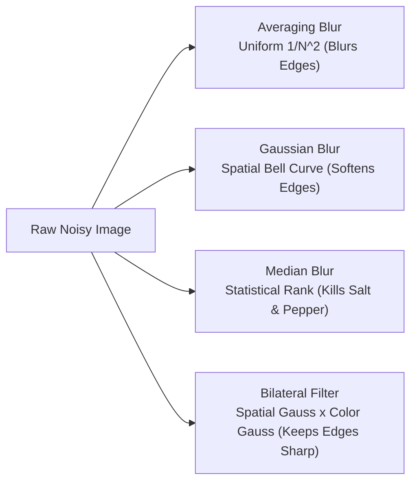
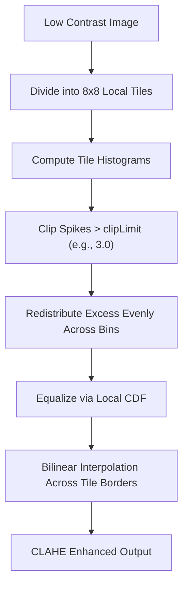
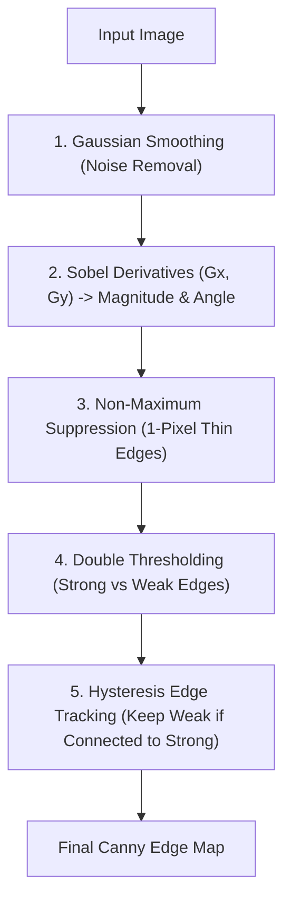
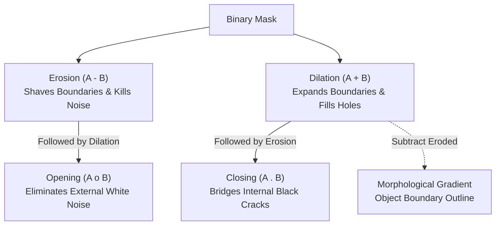
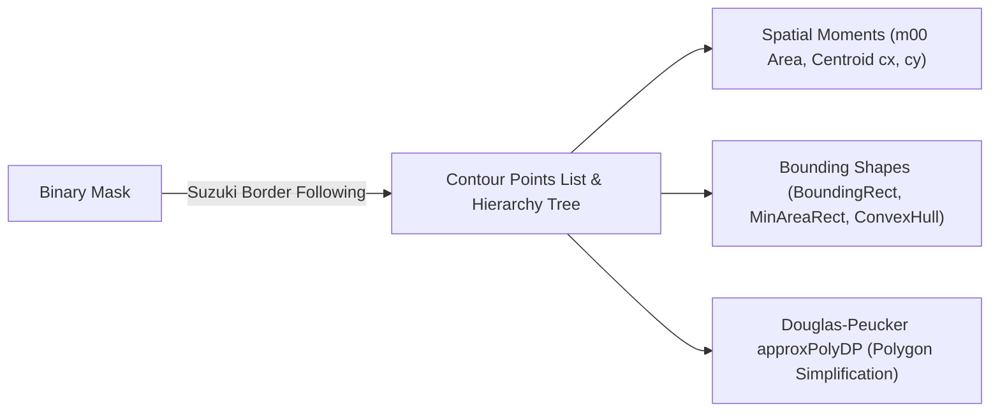

# Part 2: Core Image Processing & Geometry


## 7. Image Filtering & Smoothing

### Definition & Intuitive Analogy
Image filtering is a spatial mathematical operation where a small matrix of numbers (called a **kernel** or **filter mask**) slides across an image, calculating a weighted combination of neighboring pixels to produce an output pixel.

> **Intuitive Analogy:** Think of an image filter like looking at a noisy, grainy wall through a small magnifying stencil (e.g., $3 \times 3$ pixels). At each position, you look at the 9 numbers showing through the holes, calculate their average (or a weighted score), write down that single result on a fresh canvas, and slide the stencil by one pixel.


### 💡 The Big Picture in Plain English (Beginner Friendly)

- **What is it in 1 simple sentence?** Filtering is sliding a tiny mathematical stencil (kernel) across every pixel of an image to average out noisy camera grain or sharpen blurry edges.
- **Why do we need this? (The Problem):** Real camera sensors in low light produce "snow" or static noise (salt-and-pepper pixels). If you try to find edges or track objects on a raw noisy image, your algorithms will detect thousands of fake edges caused by random noisy dots.
- **How to picture it in your head (Mental Model):**
  - **Averaging / Box Blur:** Imagine rubbing a wet paintbrush across a chalk drawing. Everything gets smoothed out, but crisp object boundaries get fuzzy and blurry.
  - **Gaussian Blur:** Instead of treating all neighbors equally, you give the center pixel the biggest vote, and nearby neighbors smaller votes according to a bell curve. It smooths natural sensor grain much more naturally than a simple average.
  - **Median Blur (The Outlier Killer):** Imagine 9 numbers in a $3 	imes 3$ grid: eight pixels are around `100`, but one dead pixel is `255` (bright white noise). An average filter would get dragged up to `117`. A **median filter** sorts the 9 numbers in a line and picks the middle one (`100`). The extreme noise outlier `255` is completely erased!
  - **Bilateral Filter (The Magic Filter):** How do you blur a person's skin to make it smooth while keeping their eyelashes and glasses razor sharp? The Bilateral filter checks two things: Are pixels close in space? AND Are they close in color? If two pixels have totally different colors (like dark hair against pale skin), the filter **refuses to blend them**, keeping edges crisp while smoothing flat surfaces!
- **Step-by-Step Walkthrough with Easy Numbers (Median vs Box):**
  - A $3 	imes 3$ neighborhood has values: $[10, 12, 10, 11, \mathbf{250}, 12, 10, 9, 11]$ (where $250$ is a noise spike).
  - Box Blur Average: $(10+12+10+11+250+12+10+9+11)/9 = 335/9 = \mathbf{37.2}$ (The noise spreads and pollutes the whole patch!).
  - Median Blur: Sort all 9 numbers: $[9, 10, 10, 10, \mathbf{11}, 12, 12, 12, 250]$. The 5th (middle) value is $\mathbf{11}$! The noise spike 250 is completely destroyed!
- **Beginner Trap & Rule of Thumb:** Filter kernel sizes MUST always be odd positive integers ($3, 5, 7, 9\dots$). An even kernel (like $4 	imes 4$) has no center pixel and causes mathematical ambiguity.

### Why It Is Important
Raw camera sensors naturally produce sensor noise (thermal noise, shot noise, and low-light grain). If you run edge detection or feature tracking on noisy raw images, the algorithms will detect hundreds of false edges caused by random noisy pixels. Filtering and smoothing is the **mandatory pre-processing step** before almost all higher-level vision algorithms.

### Core Concept & Mathematical Intuition

#### 1. 2D Discrete Spatial Convolution
Given an image $I(x, y)$ and a kernel $K$ of size $(2k+1) \times (2k+1)$, the 2D discrete convolution is:
$$(I * K)(x, y) = \sum_{i=-k}^{k} \sum_{j=-k}^{k} I(x - i, y - j) \cdot K(i, j)$$

#### 2. Key Filtering Algorithms Compared

| Filter Type | Kernel / Algorithm Concept | Best Used For | Edge Preservation |
| :--- | :--- | :--- | :--- |
| **Averaging / Box Blur** | Uniform weights: $K(i, j) = \frac{1}{N^2}$ | Fast uniform blurring | ❌ Blurs all edges |
| **Gaussian Blur** | Bell-curve weights: $G(x, y) = \frac{1}{2\pi\sigma^2} e^{-\frac{x^2+y^2}{2\sigma^2}}$ | Removing natural Gaussian noise | ❌ Softens edges |
| **Median Filter** | Replaces central pixel with statistical median of neighbors | Removing Salt-and-Pepper noise | ⚠️ Moderately preserves |
| **Bilateral Filter** | Combines spatial distance Gaussian + pixel value intensity Gaussian | Beautification & denoising | ✅ **Sharp edges preserved!** |

#### 3. Deep Dive: Bilateral Filter (Edge-Preserving Smoothing)
Standard Gaussian blur only considers geometric distance: pixels that are close together are averaged, even if one pixel is black (background) and the neighbor is white (object), causing edges to blur.

The **Bilateral Filter** adds a radiometric (color intensity) weight:
$$I_{\text{bilateral}}(x) = \frac{1}{W_p} \sum_{x_i \in \Omega} I(x_i) \cdot \underbrace{\exp\left(-\frac{\|x - x_i\|^2}{2\sigma_s^2}\right)}_{\text{Spatial Closeness Weight}} \cdot \underbrace{\exp\left(-\frac{\|I(x) - I(x_i)\|^2}{2\sigma_r^2}\right)}_{\text{Color Similarity Weight}}$$

- If two neighboring pixels have very different colors (an edge), the color similarity weight drops to zero. The filter **refuses to average across the edge**, keeping object boundaries razor-sharp while smoothing flat surfaces!

### How It Works Internally: Separable Kernels
A 2D Gaussian kernel of size $N \times N$ requires $N^2$ multiplications per pixel. However, a 2D Gaussian function is **mathematically separable**:
$$G_{2D}(x, y) = G_{1D}(x) \cdot G_{1D}(y)$$
OpenCV optimizes Gaussian blur by applying a 1D horizontal pass ($N$ operations) followed by a 1D vertical pass ($N$ operations). This reduces computational complexity from $\mathcal{O}(N^2)$ to $\mathcal{O}(2N)$ per pixel, making it massively faster!

### Important OpenCV Functions & Syntax
```python
# Box / Averaging blur (kernel size must be positive integers)
blur = cv2.blur(src, ksize=(5, 5))

# Gaussian blur (sigmaX=0 calculates sigma automatically from ksize)
gauss = cv2.GaussianBlur(src, ksize=(5, 5), sigmaX=1.5, sigmaY=1.5)

# Median blur (ksize must be an ODD integer: 3, 5, 7, etc.)
median = cv2.medianBlur(src, ksize=5)

# Bilateral filter (d = diameter, sigmaColor, sigmaSpace)
bilat = cv2.bilateralFilter(src, d=9, sigmaColor=75, sigmaSpace=75)

# Custom 2D convolution with arbitrary kernel
filtered = cv2.filter2D(src, ddepth=-1, kernel=custom_kernel)
```

### Image Filtering Architecture


### Visual Demonstration & Filter Comparison


### Executable Python Example
```python
import cv2
import numpy as np
import matplotlib.pyplot as plt

# 1. Create a clean synthetic image with a sharp edge
clean = np.full((150, 150), 50, dtype=np.uint8)
clean[:, 75:] = 200 # Bright right half

# 2. Add synthetic "Salt and Pepper" noise (dead pixels)
noisy = clean.copy()
salt_coords = np.random.rand(*clean.shape) < 0.05
pepper_coords = np.random.rand(*clean.shape) < 0.05
noisy[salt_coords] = 255
noisy[pepper_coords] = 0

# 3. Apply different filters
gaussian_filtered = cv2.GaussianBlur(noisy, (5, 5), sigmaX=1.2)
median_filtered = cv2.medianBlur(noisy, 5)
bilateral_filtered = cv2.bilateralFilter(noisy, d=9, sigmaColor=150, sigmaSpace=75)

# 4. Multi-Panel Visual Comparison
fig, axs = plt.subplots(1, 4, figsize=(14, 3.5))
axs[0].imshow(noisy, cmap="gray"); axs[0].set_title("Noisy Input (Salt & Pepper)")
axs[1].imshow(gaussian_filtered, cmap="gray"); axs[1].set_title("Gaussian (Blurs Noise)")
axs[2].imshow(median_filtered, cmap="gray"); axs[2].set_title("Median (Noise Eliminated!)")
axs[3].imshow(bilateral_filtered, cmap="gray"); axs[3].set_title("Bilateral (Edge Sharp)")
for ax in axs: ax.axis("off")
plt.tight_layout()
plt.show()

print("Median filter successfully eliminated salt-and-pepper noise without blurring edge boundaries.")
```

### Line-by-Line Explanation
1. `clean[:, 75:] = 200` creates a sharp vertical step edge dividing dark gray ($50$) and bright white ($200$).
2. `noisy[salt_coords] = 255` injects $5\%$ random white pixels (salt) and $5\%$ black pixels (pepper).
3. `cv2.GaussianBlur` calculates a weighted average. Because the extreme $0$ and $255$ values are averaged into the neighbors, the noise spots become blurred smudges rather than disappearing.
4. `cv2.medianBlur(noisy, 5)` sorts all 25 pixels in the $5 \times 5$ window. Because the extreme noise values ($0$ or $255$) end up at the extreme ends of the sorted list, the central median value is clean, removing the noise completely.

### Common Mistakes & Important Tips
- **Even Kernel Sizes:** Kernel dimensions in `cv2.GaussianBlur` and `cv2.medianBlur` must be **odd positive integers** (e.g., $3, 5, 7$). An even kernel size has no central pixel and will cause an OpenCV runtime error.
- **Bilateral Filter Performance:** `cv2.bilateralFilter` is computationally expensive because it cannot be decomposed into separable 1D passes. For real-time applications ($>30$ FPS), keep $d \le 5$ or use domain transform filters.

### Real-World & Robotics Perception Relevance
- **LiDAR Depth Map Inpainting:** Raw LiDAR and time-of-flight depth cameras have missing pixels (dropouts due to dark or reflective surfaces). Median filtering cleanly fills single-pixel depth dropouts without corrupting nearby surface geometry.
- **Preprocessing for Feature Detection (ORB/SIFT):** Gaussian filtering suppresses sensor grain that would otherwise trigger thousands of unstable, noisy keypoints.

### Interview Questions & Detailed Answers
1. **Q: Why is a Median Filter dramatically more effective at removing Salt-and-Pepper noise than a Gaussian Filter?**
   - *Answer:* Salt-and-pepper noise introduces extreme outlier values ($0$ or $255$). A Gaussian filter is a linear weighted sum; extreme outliers heavily pull the average, spreading the noise into a larger blurry patch. A median filter is a non-linear rank filter: it sorts the window values and picks the middle element. Since outliers sit at the top or bottom of the sorted array, they are completely discarded from the output.
2. **Q: What is a separable filter and why does it matter for real-time vision algorithms?**
   - *Answer:* A 2D filter kernel $K$ is separable if it can be factored into the outer product of two 1D vectors: $K = \mathbf{v}_1 \mathbf{v}_2^T$. Convolving an $M 	imes N$ image with a non-separable $K 	imes K$ kernel requires $M \cdot N \cdot K^2$ multiplications. A separable filter splits this into two 1D passes requiring only $2 \cdot M \cdot N \cdot K$ operations. For a $15 	imes 15$ kernel, separable filtering is over $7.5	imes$ faster.

### Mini Exercise with Solution
**Task:** Implement a custom $3 \times 3$ Sharpening Filter using `cv2.filter2D`. (Hint: A sharpening filter subtracts the Laplacian/blur from the original image: center weight $5$, orthogonal neighbors $-1$).

```python
import cv2
import numpy as np

def sharpen_image(img: np.ndarray) -> np.ndarray:
    # Define 3x3 sharpening kernel
    sharpen_kernel = np.array([
        [ 0, -1,  0],
        [-1,  5, -1],
        [ 0, -1,  0]
    ], dtype=np.float32)
    
    # Apply 2D convolution
    sharpened = cv2.filter2D(img, ddepth=-1, kernel=sharpen_kernel)
    return sharpened

test = np.full((100, 100, 3), 128, dtype=np.uint8)
cv2.putText(test, "TEXT", (10, 60), cv2.FONT_HERSHEY_SIMPLEX, 1.0, (255, 255, 255), 2)
sharp_out = sharpen_image(test)
print(f"Image sharpened successfully. Shape: {sharp_out.shape}")
```

---

## 8. Image Enhancement

### Definition & Intuitive Analogy
Image enhancement is the collection of techniques used to adjust pixel contrast, dynamic range, and brightness to make visual details clearer to human observers and computer vision feature extractors.

> **Intuitive Analogy:** Imagine taking a photo in foggy weather or inside a dim parking garage. All pixel values are clustered together in a narrow band of dark gray numbers (e.g., between 40 and 90). Image enhancement (like Histogram Equalization) is like taking that narrow clump of numbers and stretching it out across the entire available dynamic range from 0 (pure black) to 255 (pure white).


### 💡 The Big Picture in Plain English (Beginner Friendly)

- **What is it in 1 simple sentence?** Image enhancement stretches and balances the dark and bright parts of a photo so hidden details in shadows or fog become crystal clear.
- **Why do we need this? (The Problem):** A self-driving car driving through thick fog or entering a dark tunnel captures images where all pixel numbers are squished into a narrow range (say, between 70 and 110). To the computer, everything looks like muddy gray soup.
- **How to picture it in your head (Mental Model):**
  - Think of an accordion squeezed shut: all the notes are compressed into a tiny space. Enhancement is grabbing both ends of the accordion and pulling them wide apart so every note from the lowest bass (0 pure black) to the highest treble (255 pure white) has room to breathe.
  - **Global Equalization:** Looks at the whole picture at once. If you have a dark road and a bright sky, it over-brightens the sky until it looks like a nuclear explosion while turning the road into harsh static.
  - **CLAHE (Contrast Limited Adaptive Histogram Equalization):** Cuts the image into an $8 	imes 8$ checkerboard of small tiles. It enhances the dark shadows inside each tile individually, but sets a speed limit (Clip Limit) so it never amplifies grain or noise. Then it stitches the tiles together seamlessly.
- **Step-by-Step Walkthrough with Easy Numbers:**
  - Suppose a foggy image has min pixel value $70$ and max $120$ (contrast range = $50$).
  - Linear contrast stretch: $I_{	ext{new}} = (I - 70) 	imes rac{255}{120 - 70} = (I - 70) 	imes 5.1$.
  - A pixel at $70$ becomes $0$ (deep black). A pixel at $120$ becomes $255$ (pure white). The muddy gray image instantly pops with sharp detail!
- **Beginner Trap & Rule of Thumb:** Never apply histogram equalization directly across all 3 BGR channels independently. Doing so distorts colors and turns skin green or purple! Always convert to LAB or HSV, equalize ONLY the luminance channel ($L$ or $V$), and convert back.

### Why It Is Important
Autonomous systems encounter harsh lighting: driving out of a dark tunnel into blinding noon sunlight, underwater robotic inspection, or nighttime security cameras. Without dynamic range enhancement, cameras capture underexposed or overexposed regions where vision models fail to detect objects.

### Core Concept & Mathematical Intuition

#### 1. Image Histogram
A histogram $h(k)$ counts the number of pixels in an image that have intensity value $k \in [0, 255]$:
$$h(k) = \sum_{x} \sum_{y} \mathbb{I}(I(x, y) == k)$$

#### 2. Global Histogram Equalization (HE)
Histogram equalization computes the **Cumulative Distribution Function (CDF)** of pixel intensities and uses it as a monotonic transfer function to flatten the histogram:
$$s_k = T(r_k) = (L - 1) \sum_{j=0}^{k} p_r(r_j) = \frac{255}{M \cdot N} \sum_{j=0}^{k} h(j)$$

- **Limitation:** Global HE looks at the entire image. If an image has a bright sky and a dark ground, global HE over-amplifies the sky noise and washes out subtle details.

#### 3. Contrast Limited Adaptive Histogram Equalization (CLAHE)
CLAHE is the production industry standard for contrast enhancement:
1. Divides the image into small contextual tiles (typically $8 \times 8$ grid blocks).
2. Computes the histogram for each tile.
3. **Contrast Limiting:** Clips histogram bins that exceed a clip limit (e.g., $2.0$ or $4.0$) and redistributes the clipped pixels uniformly across all bins to prevent noise amplification.
4. Equalizes each tile independently using its clipped CDF.
5. Merges tile boundaries using **bilinear interpolation** to eliminate artificial grid seams.

#### 4. Gamma Correction (Power-Law Transform)
Non-linear brightness adjustment:
$$I_{\text{out}} = 255 \cdot \left( \frac{I_{\text{in}}}{255} \right)^{\gamma}$$
- $\gamma < 1.0$: Brightens dark shadow regions while preserving highlights.
- $\gamma > 1.0$: Darkens bright regions.

### Important OpenCV Functions & Syntax
```python
# Compute 1D Histogram
hist = cv2.calcHist(images=[img], channels=[0], mask=None, histSize=[256], ranges=[0, 256])

# Global Histogram Equalization (Grayscale only!)
equalized = cv2.equalizeHist(src_gray)

# Create CLAHE object
clahe = cv2.createCLAHE(clipLimit=2.0, tileGridSize=(8, 8))
enhanced_clahe = clahe.apply(src_gray)
```

### CLAHE Enhancement Flowchart


### Visual Demonstration & Contrast Comparison


### Executable Python Example
```python
import cv2
import numpy as np
import matplotlib.pyplot as plt

# 1. Create a low-contrast synthetic image (simulating foggy, dim conditions)
# Raw pixels are squeezed into a narrow range between 60 and 120
low_contrast = np.clip(np.random.normal(90, 15, (200, 200)), 60, 120).astype(np.uint8)
cv2.circle(low_contrast, (100, 100), 40, 115, thickness=-1) # Faint circular object

# 2. Global Histogram Equalization
global_he = cv2.equalizeHist(low_contrast)

# 3. CLAHE (Contrast Limited Adaptive Histogram Equalization)
clahe_obj = cv2.createCLAHE(clipLimit=3.0, tileGridSize=(8, 8))
clahe_result = clahe_obj.apply(low_contrast)

# 4. Visual Comparison
fig, axs = plt.subplots(1, 3, figsize=(12, 4))
axs[0].imshow(low_contrast, cmap="gray", vmin=0, vmax=255); axs[0].set_title("1. Dim Low-Contrast Input")
axs[1].imshow(global_he, cmap="gray", vmin=0, vmax=255); axs[1].set_title("2. Global Equalization")
axs[2].imshow(clahe_result, cmap="gray", vmin=0, vmax=255); axs[2].set_title("3. CLAHE Enhanced")
for ax in axs: ax.axis("off")
plt.tight_layout()
plt.show()

print("CLAHE successfully enhanced local contrast while preventing noise blowout.")
```

### Line-by-Line Explanation
1. `low_contrast = ...` generates a synthetic low-contrast image where all intensities are squashed between 60 and 120.
2. `cv2.equalizeHist(low_contrast)` applies global histogram stretching. Notice how background noise is amplified because of the steep CDF slope.
3. `clahe_obj = cv2.createCLAHE(clipLimit=3.0, tileGridSize=(8, 8))` limits histogram peaks to 3.0 times the mean bin count, capping local noise amplification.
4. `clahe_obj.apply(low_contrast)` performs local tile equalization with bilinear boundary interpolation.

### Common Mistakes & Important Tips
- **Applying Equalization to BGR Directly:** Never call `cv2.equalizeHist` on individual B, G, and R channels independently! Doing so destroys the color balance and causes severe, unnatural color tint shifts.
  - **Correct Method for Color Images:** Convert BGR $\to$ $L^*a^*b^*$ or YCrCb, apply CLAHE **only to the luminance channel ($L^*$ or $Y$)**, and convert back to BGR:
    ```python
    lab = cv2.cvtColor(color_img, cv2.COLOR_BGR2Lab)
    lab[:, :, 0] = clahe.apply(lab[:, :, 0])
    enhanced_bgr = cv2.cvtColor(lab, cv2.COLOR_BGR2Lab)
    ```

### Real-World & Robotics Perception Relevance
- **Nighttime Autonomous Driving:** CLAHE applied to thermal or low-light CMOS sensors uncovers pedestrians obscured in deep shadows without blowing out oncoming headlights.
- **Medical Imaging (X-Ray & MRI):** Radiologists and automated diagnosis models use CLAHE to enhance bone micro-fractures and soft-tissue boundaries.

### Interview Questions & Detailed Answers
1. **Q: Why does applying histogram equalization directly to each channel of an RGB image cause color distortion?**
   - *Answer:* RGB channels are highly correlated. Equalizing each channel independently alters the relative ratio between Red, Green, and Blue at each pixel. Since color hue and saturation depend strictly on the ratio between channels, independent equalization shifts the hue, turning skin tones green or sky purple. Converting to $L^*a^*b^*$ and equalizing only the $L^*$ channel modifies perceived brightness while preserving true chromatic color.
2. **Q: What is the purpose of the `clipLimit` parameter in CLAHE?**
   - *Answer:* In flat, uniform regions of an image (e.g., clear sky or dark shadow), all pixels have nearly identical intensity, creating a massive spike in the local histogram. Equalizing this spike creates an extremely steep CDF slope, resulting in severe noise amplification. The `clipLimit` caps the maximum bin height, redistributes excess pixels evenly, and prevents noise amplification.

### Mini Exercise with Solution
**Task:** Write a complete color enhancement function that takes a dark BGR photograph, applies CLAHE to the $L^*$ luminance channel, and applies gamma correction ($\gamma = 0.8$) to brighten shadows.

```python
import cv2
import numpy as np

def enhance_color_image(bgr_img: np.ndarray, clip_limit: float = 2.0, gamma: float = 0.8) -> np.ndarray:
    # 1. Convert BGR to Lab color space
    lab = cv2.cvtColor(bgr_img, cv2.COLOR_BGR2Lab)
    
    # 2. Apply CLAHE to L* channel
    clahe = cv2.createCLAHE(clipLimit=clip_limit, tileGridSize=(8, 8))
    lab[:, :, 0] = clahe.apply(lab[:, :, 0])
    
    # 3. Convert back to BGR
    enhanced_bgr = cv2.cvtColor(lab, cv2.COLOR_Lab2BGR)
    
    # 4. Apply Gamma correction lookup table
    inv_gamma = 1.0 / gamma
    table = np.array([((i / 255.0) ** inv_gamma) * 255 for i in np.arange(0, 256)]).astype(np.uint8)
    final_output = cv2.LUT(enhanced_bgr, table)
    return final_output
```

---

## 9. Image Thresholding

### Definition & Intuitive Analogy
**Thresholding** is the fundamental segmentation method that converts a grayscale image into a binary image (black and white, $0$ and $255$) by comparing pixel intensities against a cutoff threshold value $T$.

> **Intuitive Analogy:** Imagine sorting objects into two boxes based on height. If an object is taller than a line drawn on the wall ($T$), it goes into the White Box ($255$). If it is shorter, it goes into the Black Box ($0$). 


### 💡 The Big Picture in Plain English (Beginner Friendly)

- **What is it in 1 simple sentence?** Thresholding is drawing a strict cutoff line: any pixel brighter than the line turns pure white (255), and anything darker turns pure black (0).
- **Why do we need this? (The Problem):** Computers don't want to analyze 256 different shades of gray when trying to read text or count black screws on a conveyor belt. They just want a clean 1-bit silhouette: Is this pixel the object (White) or the background (Black)?
- **How to picture it in your head (Mental Model):**
  - A nightclub bouncer with a strict height requirement: If you are $\ge 127	ext{ cm}$, you get inside (255 White). If $< 127	ext{ cm}$, you are turned away (0 Black).
  - **Otsu's Thresholding (The Smart Bouncer):** What if you don't know where to set the cutoff? Otsu looks at the image histogram (which looks like two mountain peaks: dark object and bright background) and automatically finds the deepest valley between them.
  - **Adaptive Thresholding (The Local Bouncer):** What if someone takes a photo of a document with a shadow falling across the bottom-right corner? A global cutoff will turn the whole shadowed corner pure black. Adaptive thresholding calculates a custom cutoff for every single pixel based on its immediate neighbors!
- **Step-by-Step Walkthrough with Easy Numbers:**
  - Pixel $P = 130$.
  - Global Threshold $T = 127$: Since $130 \ge 127$, $P_{	ext{out}} = \mathbf{255}$.
  - In a shadowed corner, local neighbors average $90$. Adaptive threshold sets local $T_{	ext{local}} = 90 - 5 = 85$. A pixel at $88$ is brighter than its dark surroundings, so it turns $\mathbf{255}$ (text is saved instead of being swallowed by shadow!).
- **Beginner Trap & Rule of Thumb:** Otsu's thresholding assumes a bimodal histogram (two distinct peaks). If the lighting is completely uneven or gradient across the frame, Otsu fails. Use Adaptive Thresholding instead.

### Why It Is Important
Thresholding separates **foreground objects of interest** (e.g., text on a page, laser spots, road lane markings, industrial defects) from background noise, creating clean binary masks needed for contour analysis and object counting.

### Core Concept & Mathematical Intuition

#### 1. Standard Global Thresholding Types
Given a threshold $T$:
- **`THRESH_BINARY`:** $\quad I_{\text{out}}(x, y) = \begin{cases} \text{maxVal} & \text{if } I(x, y) > T \\ 0 & \text{otherwise} \end{cases}$
- **`THRESH_BINARY_INV`:** $\quad I_{\text{out}}(x, y) = \begin{cases} 0 & \text{if } I(x, y) > T \\ \text{maxVal} & \text{otherwise} \end{cases}$
- **`THRESH_TRUNC`:** $\quad I_{\text{out}}(x, y) = \begin{cases} T & \text{if } I(x, y) > T \\ I(x, y) & \text{otherwise} \end{cases}$
- **`THRESH_TOZERO`:** $\quad I_{\text{out}}(x, y) = \begin{cases} I(x, y) & \text{if } I(x, y) > T \\ 0 & \text{otherwise} \end{cases}$

#### 2. Otsu's Bimodal Thresholding (Automatic Global Threshold)
Instead of guessing $T$, Otsu's algorithm automatically computes the optimal threshold by minimizing the **intra-class variance** $\sigma_w^2(T)$ (or maximizing inter-class variance $\sigma_b^2(T)$) across the bimodal intensity histogram:

$$\sigma_b^2(T) = \omega_0(T) \cdot \omega_1(T) \cdot \left[ \mu_0(T) - \mu_1(T) \right]^2$$

Where $\omega_0, \omega_1$ are probabilities of the two classes and $\mu_0, \mu_1$ are their mean intensity levels.

#### 3. Adaptive Thresholding (Handling Uneven Lighting & Shadows)
When an image has shadows or non-uniform illumination, a single global threshold $T$ fails. Adaptive thresholding calculates an individual threshold $T(x, y)$ for **every single pixel** based on its local $B \times B$ neighborhood:

$$T(x, y) = \mu_{\text{local}}(x, y) - C$$

- **`ADAPTIVE_THRESH_MEAN_C`:** $T(x, y)$ is the arithmetic mean of the $B \times B$ neighborhood minus constant $C$.
- **`ADAPTIVE_THRESH_GAUSSIAN_C`:** $T(x, y)$ is the Gaussian-weighted sum of the neighborhood minus constant $C$.

### Important OpenCV Functions & Syntax
```python
# Fixed threshold or Otsu's thresholding
ret_val, binary_img = cv2.threshold(
    src_gray, thresh=127, maxval=255, type=cv2.THRESH_BINARY
)

# Otsu's automatic thresholding (combine flag with cv2.THRESH_OTSU)
ret_val, otsu_img = cv2.threshold(
    src_gray, thresh=0, maxval=255, type=cv2.THRESH_BINARY + cv2.THRESH_OTSU
)

# Adaptive Thresholding (blockSize must be odd: 3, 5, 11, etc.)
adaptive_img = cv2.adaptiveThreshold(
    src_gray, maxValue=255,
    adaptiveMethod=cv2.ADAPTIVE_THRESH_GAUSSIAN_C,
    thresholdType=cv2.THRESH_BINARY,
    blockSize=11, C=2
)
```

### Thresholding Selection Pipeline
```mermaid
flowchart TD
    INPUT["Grayscale Image"] --> DECISION{"Illumination Uniform?"}
    DECISION -->|Yes| OTSU["cv2.THRESH_OTSU
Maximizes Between-Class Variance"]
    DECISION -->|No (Shadows/Gradients)| ADAPTIVE["cv2.adaptiveThreshold
Dynamic Threshold per Pixel = Local Mean - C"]
    OTSU --> BINARY["Clean Binary Mask (0 or 255)"]
    ADAPTIVE --> BINARY
```

### Visual Demonstration & Thresholding Comparison


### Executable Python Example
```python
import cv2
import numpy as np
import matplotlib.pyplot as plt

# 1. Create a synthetic document image with a severe lighting gradient (shadow)
doc = np.full((200, 300), 230, dtype=np.uint8)
# Add a diagonal shadow gradient from top-left (dark=50) to bottom-right (bright=230)
gradient = np.linspace(50, 230, 300, dtype=np.uint8)
doc = np.tile(gradient, (200, 1))

# Draw black text on the document
cv2.putText(doc, "PERCEPTION", (30, 110), cv2.FONT_HERSHEY_SIMPLEX, 1.2, 0, 3)

# 2. Global Fixed Thresholding (Fails due to shadow)
_, global_thresh = cv2.threshold(doc, 127, 255, cv2.THRESH_BINARY)

# 3. Otsu's Automatic Thresholding (Still fails globally)
_, otsu_thresh = cv2.threshold(doc, 0, 255, cv2.THRESH_BINARY + cv2.THRESH_OTSU)

# 4. Adaptive Gaussian Thresholding (Handles shadow perfectly!)
adaptive_thresh = cv2.adaptiveThreshold(
    doc, 255, cv2.ADAPTIVE_THRESH_GAUSSIAN_C, cv2.THRESH_BINARY, blockSize=15, C=4
)

# 5. Visual Comparison
fig, axs = plt.subplots(1, 4, figsize=(15, 3.5))
axs[0].imshow(doc, cmap="gray"); axs[0].set_title("1. Shadowed Document")
axs[1].imshow(global_thresh, cmap="gray"); axs[1].set_title("2. Fixed (Cutoff=127)")
axs[2].imshow(otsu_thresh, cmap="gray"); axs[2].set_title("3. Otsu Threshold")
axs[3].imshow(adaptive_thresh, cmap="gray"); axs[3].set_title("4. Adaptive Gaussian")
for ax in axs: ax.axis("off")
plt.tight_layout()
plt.show()

print("Adaptive thresholding successfully extracted text across all lighting zones.")
```

### Line-by-Line Explanation
1. `doc = np.tile(gradient, (200, 1))` simulates non-uniform illumination where the left side of the paper is in dark shadow ($50$) and the right side is bright ($230$).
2. `cv2.threshold(doc, 127, 255, ...)` applies a static cutoff at 127. Everything on the left is $<127$ so the entire left half turns completely black, wiping out the text.
3. `cv2.adaptiveThreshold(..., blockSize=15, C=4)` calculates the threshold dynamically within a $15 \times 15$ local window around each pixel. On the dark left side, the local threshold automatically drops to $\approx 46$; on the bright right side, it automatically rises to $\approx 226$. Text is extracted cleanly everywhere.

### Common Mistakes & Important Tips
- **Pre-Filtering Before Otsu:** Otsu's thresholding assumes a clean bimodal histogram (two distinct peaks). High-frequency noise creates random intermediate values that degrade Otsu's accuracy. **Always apply a light Gaussian blur (`cv2.GaussianBlur(img, (5, 5), 0)`) before calling Otsu.**
- **`blockSize` Must Be Odd:** In `cv2.adaptiveThreshold`, `blockSize` defines the square neighborhood dimension and must be an **odd integer $>1$** ($3, 5, 7, 11, 21$).

### Real-World & Robotics Perception Relevance
- **Barcode & QR Code Scanning:** Mobile robots and warehouse barcode scanners use adaptive thresholding to decode barcodes printed on crumpled, unevenly lit cardboard boxes.
- **Automated Optical Inspection (AOI):** Semiconductor chip inspection uses Otsu thresholding to segment solder joints and detect bridging defects.

### Interview Questions & Detailed Answers
1. **Q: How does Otsu's method mathematically determine the optimal threshold value?**
   - *Answer:* Otsu's algorithm iterates through all 256 possible threshold candidates $T \in [0, 255]$. For each candidate $T$, it splits the histogram into two classes: background $C_0$ and foreground $C_1$. It calculates the between-class variance $\sigma_b^2(T) = \omega_0(T)\omega_1(T)[\mu_0(T) - \mu_1(T)]^2$. The optimal threshold $T^*$ is the exact intensity that maximizes $\sigma_b^2(T)$, maximizing the statistical separation between the two clusters.
2. **Q: When would Adaptive Thresholding fail or produce undesirable results compared to Global Thresholding?**
   - *Answer:* In completely uniform, blank regions of an image (e.g., an empty white page with no text), adaptive thresholding will still compute local averages and subtract $C$. This forces subtle sensor noise fluctuations in the blank paper to be thresholded into noisy black speckles.

### Mini Exercise with Solution
**Task:** Write a function that takes a grayscale image with uneven lighting, applies Gaussian filtering, computes Otsu's threshold value, prints the calculated threshold $T$, and returns the segmented binary mask.

```python
import cv2
import numpy as np

def clean_otsu_pipeline(gray_img: np.ndarray) -> tuple[int, np.ndarray]:
    # 1. Smooth high-frequency noise
    blurred = cv2.GaussianBlur(gray_img, (5, 5), 0)
    
    # 2. Compute Otsu threshold
    optimal_t, binary_mask = cv2.threshold(
        blurred, 0, 255, cv2.THRESH_BINARY + cv2.THRESH_OTSU
    )
    return int(optimal_t), binary_mask
```

---

## 10. Image Gradients & Edge Detection

### Definition & Intuitive Analogy
An **image gradient** measures the directional change in pixel intensity at a given location. **Edge detection** is the process of identifying boundary pixels where image brightness jumps sharply.

> **Intuitive Analogy:** Imagine an image as a 3D topographic terrain map where height represents pixel brightness. A flat plateau has a gradient of zero. A steep mountain cliff has a massive gradient. Edge detectors are mathematical hikers looking for the steepest cliffs in the landscape.


### 💡 The Big Picture in Plain English (Beginner Friendly)

- **What is it in 1 simple sentence?** An edge is a place in a picture where brightness changes suddenly; edge detection turns a rich photograph into a clean line drawing of object outlines.
- **Why do we need this? (The Problem):** Colors and textures can change when the sun moves, but the physical boundaries of an object (like the edge of a road or the outline of a pedestrian) remain in the exact same place. Edge detection throws away 95% of useless color data and keeps only the structural shapes.
- **How to picture it in your head (Mental Model):**
  - Imagine walking on a flat field. Your altitude gradient is zero. Suddenly, you reach a steep cliff—in one step, the ground drops 100 feet! That sudden jump is a **gradient**. Edge detection measures how steep the cliff is.
  - **The 4 Steps of Canny Edge Detection:**
    1. **Gaussian Blur:** Smooth out tiny pebbles so you don't trip on sensor noise.
    2. **Sobel Slopes:** Measure the gradient slope in both $X$ (horizontal) and $Y$ (vertical) directions.
    3. **Non-Maximum Suppression (The Edge Thinner):** A blurred edge might be 5 pixels wide. Canny checks along the slope direction: *"Am I the tallest pixel on this ridge?"*. If yes, keep it; if no, set it to 0. This thins wide ridges into razor-sharp 1-pixel lines!
    4. **Hysteresis Thresholding (Strong Rescues Weak):** Uses two cutoffs (High and Low). Pixels above High are definitely edges. Pixels between Low and High are kept ONLY IF they connect to a strong edge.
- **Step-by-Step Walkthrough with Easy Numbers:**
  - Let pixel on left $= 20$, pixel on right $= 220$.
  - Sobel horizontal gradient $G_x = 220 - 20 = \mathbf{200}$ (Huge slope = Strong edge!).
  - Gradient magnitude $= \sqrt{G_x^2 + G_y^2} = \sqrt{200^2 + 0^2} = \mathbf{200}$.
- **Beginner Trap & Rule of Thumb:** Canny threshold ratio rule of thumb: Set `high_threshold` to $2	imes$ or $3	imes$ `low_threshold` (e.g. `low=50, high=150`).

### Why It Is Important
Edges define physical object boundaries, surface creases, and material transitions. Edge maps drastically reduce redundant pixel data while preserving essential structural geometry for object recognition, lane tracking, and 3D pose estimation.

### Core Concept & Mathematical Intuition

#### 1. Spatial Image Derivatives
For a continuous function $I(x, y)$, the gradient vector $\nabla I$ points in the direction of greatest intensity increase:

$$\nabla I = \begin{bmatrix} G_x \\ G_y \end{bmatrix} = \begin{bmatrix} \frac{\partial I}{\partial x} \\ \frac{\partial I}{\partial y} \end{bmatrix}$$

- **Gradient Magnitude:** $G = \|\nabla I\| = \sqrt{G_x^2 + G_y^2} \approx |G_x| + |G_y|$
- **Gradient Orientation Angle:** $\theta = \operatorname{atan2}(G_y, G_x)$

#### 2. Discrete Derivative Kernels
Because digital images are discrete grids, derivatives are computed using convolution kernels:

- **Sobel Operator ($3 \times 3$):** Combines Gaussian smoothing with central finite differences:
  $$K_x = \begin{bmatrix} -1 & 0 & 1 \\ -2 & 0 & 2 \\ -1 & 0 & 1 \end{bmatrix}, \quad K_y = \begin{bmatrix} -1 & -2 & -1 \\ 0 & 0 & 0 \\ 1 & 2 & 1 \end{bmatrix}$$

- **Scharr Operator ($3 \times 3$):** Provides superior rotational symmetry and more accurate gradient angles than Sobel:
  $$K_x = \begin{bmatrix} -3 & 0 & 3 \\ -10 & 0 & 10 \\ -3 & 0 & 3 \end{bmatrix}, \quad K_y = \begin{bmatrix} -3 & -10 & -3 \\ 0 & 0 & 0 \\ 3 & 10 & 3 \end{bmatrix}$$

- **Laplacian (2nd Order Derivative):** Detects zero-crossings:
  $$\nabla^2 I = \frac{\partial^2 I}{\partial x^2} + \frac{\partial^2 I}{\partial y^2}, \quad K = \begin{bmatrix} 0 & 1 & 0 \\ 1 & -4 & 1 \\ 0 & 1 & 0 \end{bmatrix}$$

#### 3. The 5-Step Canny Edge Detection Algorithm
The Canny edge detector is the gold standard multi-stage edge detection pipeline:
1. **Gaussian Smoothing:** Filters out high-frequency sensor noise ($5 \times 5$ Gaussian kernel).
2. **Gradient Intensity & Direction:** Computes $G_x, G_y$, magnitude $G$, and angle $\theta$ via Sobel.
3. **Non-Maximum Suppression (NMS):** Thins thick edge ridges into 1-pixel-wide lines. For each pixel, it checks if its magnitude is the local maximum along the gradient direction $\theta$ (rounded to $0^\circ, 45^\circ, 90^\circ, 135^\circ$). If not, it is suppressed to zero.
4. **Double Thresholding:** Classifies surviving pixels using two thresholds ($T_{\text{low}}, T_{\text{high}}$):
   - **Strong Edges ($G > T_{\text{high}}$):** Definitely an edge ($255$).
   - **Weak Edges ($T_{\text{low}} \le G \le T_{\text{high}}$):** Potential edge.
   - **Non-Edges ($G < T_{\text{low}}$):** Suppressed to $0$.
5. **Edge Tracking by Hysteresis:** A weak edge pixel is retained **only if it is spatially connected to a strong edge pixel**. Isolated weak edge speckles from noise are eliminated.

### Important OpenCV Functions & Syntax
```python
# Sobel 1st derivatives (ddepth=cv2.CV_64F prevents negative underflow!)
sobel_x = cv2.Sobel(src_gray, ddepth=cv2.CV_64F, dx=1, dy=0, ksize=3)
sobel_y = cv2.Sobel(src_gray, ddepth=cv2.CV_64F, dx=0, dy=1, ksize=3)

# Laplacian 2nd derivative
laplacian = cv2.Laplacian(src_gray, ddepth=cv2.CV_64F)

# Canny Edge Detector (Recommended ratio Thresh_high : Thresh_low = 2:1 or 3:1)
edges = cv2.Canny(src_gray, threshold1=50, threshold2=150, apertureSize=3, L2gradient=True)
```

### Canny 5-Stage Edge Detection Pipeline


### Visual Demonstration & Gradient Stages


### Executable Python Example
```python
import cv2
import numpy as np
import matplotlib.pyplot as plt

# 1. Create a synthetic image with geometric shapes
canvas = np.zeros((200, 200), dtype=np.uint8)
cv2.circle(canvas, (100, 100), 50, 200, thickness=-1)
cv2.rectangle(canvas, (40, 40), (160, 160), 120, thickness=2)

# 2. Compute Sobel Gradients in float64 to preserve negative directional slopes
gx = cv2.Sobel(canvas, cv2.CV_64F, 1, 0, ksize=3)
gy = cv2.Sobel(canvas, cv2.CV_64F, 0, 1, ksize=3)
magnitude = cv2.magnitude(gx, gy)

# 3. Canny Edge Detection (Gaussian + NMS + Hysteresis)
canny_edges = cv2.Canny(canvas, 50, 150, L2gradient=True)

# 4. Multi-Panel Display
fig, axs = plt.subplots(1, 4, figsize=(14, 3.5))
axs[0].imshow(canvas, cmap="gray"); axs[0].set_title("Input Geometry")
axs[1].imshow(np.abs(gx), cmap="gray"); axs[1].set_title("Sobel |Gx| (Vertical)")
axs[2].imshow(np.abs(gy), cmap="gray"); axs[2].set_title("Sobel |Gy| (Horizontal)")
axs[3].imshow(canny_edges, cmap="gray"); axs[3].set_title("Canny (1px Thin Edges)")
for ax in axs: ax.axis("off")
plt.tight_layout()
plt.show()

print("Canny edge detector generated 1-pixel-thin continuous boundary contours.")
```

### Line-by-Line Explanation
1. `cv2.Sobel(canvas, cv2.CV_64F, 1, 0, ksize=3)`: Computes the horizontal derivative $\frac{\partial I}{\partial x}$. We use `cv2.CV_64F` (64-bit float) because transitions from white to black produce negative numbers. If we used standard `uint8`, negative numbers would be clipped to 0!
2. `cv2.magnitude(gx, gy)`: Computes the true Euclidean norm $\sqrt{G_x^2 + G_y^2}$.
3. `cv2.Canny(canvas, 50, 150, L2gradient=True)`: Executes the full Canny pipeline. `L2gradient=True` uses precise Euclidean norm instead of fast $L_1$ approximation.

### Common Mistakes & Important Tips
- **The `uint8` Sobel Truncation Bug:** If you write `sobel = cv2.Sobel(img, cv2.CV_8U, 1, 0)`, any transition from light-to-dark has a negative derivative (e.g., $-200$). Since `uint8` cannot store negative numbers, all negative slope edges are silently clamped to $0$ and vanish! Always compute in `cv2.CV_64F` and take the absolute value with `cv2.convertScaleAbs()`.
- **Canny Threshold Ratio Rule:** Set $T_{\text{high}} \approx 2 \times T_{\text{low}}$ or $3 \times T_{\text{low}}$ to achieve stable hysteresis edge tracking.

### Real-World & Robotics Perception Relevance
- **Autonomous Lane Boundary Tracking:** Lane detection algorithms run Canny edge detection on road regions of interest to extract clean linear boundaries for curve fitting.
- **Visual SLAM Feature Tracking:** Edge-based direct SLAM systems track high-gradient edge contours in textureless environments where traditional corner detectors fail.

### Interview Questions & Detailed Answers
1. **Q: Why does Canny edge detection use Non-Maximum Suppression (NMS)?**
   - *Answer:* Raw gradient operators (like Sobel) produce thick, fuzzy edge bands that span multiple pixels across a transition. Non-maximum suppression analyzes the gradient magnitude along the perpendicular gradient direction vector and retains only the single peak pixel, thinning thick edge blobs into sharp, 1-pixel-wide contours necessary for geometric modeling.
2. **Q: Explain how Hysteresis Thresholding resolves the trade-off between edge connectivity and noise rejection.**
   - *Answer:* Using a single high threshold rejects noise but creates fragmented, broken edges. Using a single low threshold keeps edges connected but introduces false noise edges. Hysteresis thresholding uses two thresholds: it starts edges only at pixels exceeding $T_{\text{high}}$ (guaranteed true edges) and traces connected paths through weak pixels exceeding $T_{\text{low}}$, ensuring continuous contours while rejecting isolated noise speckles.

### Mini Exercise with Solution
**Task:** Write an automated, parameter-free Canny edge detector function that calculates $T_{\text{low}}$ and $T_{\text{high}}$ automatically based on the statistical median of the image intensity.

```python
import cv2
import numpy as np

def auto_canny(image_gray: np.ndarray, sigma: float = 0.33) -> np.ndarray:
    # 1. Compute median pixel intensity
    v = np.median(image_gray)
    
    # 2. Derive thresholds based on median statistics
    lower = int(max(0, (1.0 - sigma) * v))
    upper = int(min(255, (1.0 + sigma) * v))
    
    # 3. Apply Canny
    edges = cv2.Canny(image_gray, lower, upper)
    return edges
```

---

## 11. Morphological Image Processing

### Definition & Intuitive Analogy
**Morphological operations** are non-linear mathematical operations that process binary (or grayscale) images based on their geometric shapes using a small probe called a **Structuring Element (Kernel)**.

> **Intuitive Analogy:** Imagine holding a small rubber stamp (the structuring element). 


### 💡 The Big Picture in Plain English (Beginner Friendly)

- **What is it in 1 simple sentence?** Morphological operations are digital sandpaper and putty: shrinking shapes to erase tiny noise specks, and expanding shapes to fill in cracks and holes.
- **Why do we need this? (The Problem):** After thresholding an image, white objects often have tiny black holes inside them, or are surrounded by isolated white "salt" noise pixels. Morphological math cleans these imperfections.
- **How to picture it in your head (Mental Model):**
  - **Erosion (Peeling an Onion):** Eats away the outer boundary of white shapes. Tiny white noise dots smaller than the kernel are completely eaten and disappear!
  - **Dilation (Inflating a Balloon):** Expands white boundaries outward. Tiny black cracks and holes inside the object get squeezed shut.
  - **Opening (Erode then Dilate):** Like sifting flour. Small dust particles vanish, while larger shapes return to their original size.
  - **Closing (Dilate then Erode):** Fills in small cracks and bridges narrow gaps between broken lines without permanently expanding the object.
  - **Morphological Gradient (Dilation minus Erosion):** Subtracting the shrunken shape from the expanded shape leaves a perfect hollow outline!
- **Step-by-Step Walkthrough with Easy Numbers:**
  - A binary $3 	imes 3$ patch: $[[1, 1, 1], [1, 0, 1], [1, 1, 1]]$ (center pixel is a black hole $0$).
  - Dilation: Since at least one neighbor under the kernel is $1$, the center pixel becomes $\mathbf{1}$ (hole is filled!).
- **Beginner Trap & Rule of Thumb:** Remember: **Opening** opens up spaces (removes white dots); **Closing** closes up holes (fills black cracks).

### Why It Is Important
After binary thresholding, masks often contain tiny noise dots, pinhole gaps, broken lines, or overlapping blobs. Morphological operations clean up binary masks, disconnect touching objects, and isolate structural features prior to contour extraction.

### Core Concept & Mathematical Intuition

#### 1. Structuring Element (SE / Kernel $B$)
A binary matrix defining the neighborhood shape:
- **`MORPH_RECT`:** Solid square/rectangle.
- **`MORPH_ELLIPSE`:** Disc/circle.
- **`MORPH_CROSS`:** Plus sign (`+`).

#### 2. Fundamental Operations: Erosion & Dilation

- **Erosion ($A \ominus B$):** Shinks the foreground object:
  $$(A \ominus B)(x, y) = \min_{(i, j) \in B} A(x + i, y + j)$$
  The output pixel is $1$ **only if the structuring element fits completely inside the object**.

- **Dilation ($A \oplus B$):** Expands the foreground object:
  $$(A \oplus B)(x, y) = \max_{(i, j) \in B} A(x - i, y - j)$$
  The output pixel is $1$ **if at least one pixel of the structuring element touches the object**.

#### 3. Advanced Compound Morphological Operations

| Operation | Mathematical Formula | Visual Action & Primary Use Case |
| :--- | :--- | :--- |
| **Opening** | $(A \ominus B) \oplus B$ (Erosion followed by Dilation) | Removes small white noise dots without altering object size |
| **Closing** | $(A \oplus B) \ominus B$ (Dilation followed by Erosion) | Bridges small black holes and cracks inside foreground objects |
| **Morphological Gradient** | $(A \oplus B) - (A \ominus B)$ | Extracts the outer boundary outline of objects |
| **Top-Hat (White Top-Hat)** | $A - (A \circ B)$ (Original minus Opening) | Isolates elements that are brighter than their surroundings |
| **Black-Hat (Black Top-Hat)** | $(A \bullet B) - A$ (Closing minus Original) | Isolates elements that are darker than their surroundings |

### Important OpenCV Functions & Syntax
```python
# Create structuring element
kernel = cv2.getStructuringElement(shape=cv2.MORPH_RECT, ksize=(5, 5))

# Basic operations
eroded  = cv2.erode(src, kernel, iterations=1)
dilated = cv2.dilate(src, kernel, iterations=1)

# Advanced morphological transformations
opened   = cv2.morphologyEx(src, cv2.MORPH_OPEN, kernel)
closed   = cv2.morphologyEx(src, cv2.MORPH_CLOSE, kernel)
gradient = cv2.morphologyEx(src, cv2.MORPH_GRADIENT, kernel)
tophat   = cv2.morphologyEx(src, cv2.MORPH_TOPHAT, kernel)
blackhat = cv2.morphologyEx(src, cv2.MORPH_BLACKHAT, kernel)
```

### Morphological Processing Flowchart


### Visual Demonstration & Morphological Workflow


### Executable Python Example
```python
import cv2
import numpy as np
import matplotlib.pyplot as plt

# 1. Create a binary test image: A solid square corrupted with noise dots and an internal hole
binary = np.zeros((160, 160), dtype=np.uint8)
binary[30:130, 30:130] = 255
binary[70:90, 70:90] = 0 # Internal hole (crack)

# Add salt noise (spurious white dots) outside the square
binary[10, 10] = 255; binary[140, 20] = 255; binary[20, 140] = 255

# 2. Define structuring element
k = cv2.getStructuringElement(cv2.MORPH_RECT, (5, 5))

# 3. Apply Morphological Opening (removes external noise dots)
opened = cv2.morphologyEx(binary, cv2.MORPH_OPEN, k)

# 4. Apply Morphological Closing on opened result (fills internal crack)
cleaned = cv2.morphologyEx(opened, cv2.MORPH_CLOSE, k)

# 5. Extract boundary using Morphological Gradient
boundary = cv2.morphologyEx(cleaned, cv2.MORPH_GRADIENT, k)

# 6. Display visual progression
fig, axs = plt.subplots(1, 4, figsize=(14, 3.5))
axs[0].imshow(binary, cmap="gray"); axs[0].set_title("1. Noisy Input Mask")
axs[1].imshow(opened, cmap="gray"); axs[1].set_title("2. Opened (Noise Gone)")
axs[2].imshow(cleaned, cmap="gray"); axs[2].set_title("3. Closed (Hole Filled)")
axs[3].imshow(boundary, cmap="gray"); axs[3].set_title("4. Morph Gradient Outline")
for ax in axs: ax.axis("off")
plt.tight_layout()
plt.show()

print("Morphological pipeline successfully sanitized mask and extracted structural boundary.")
```

### Line-by-Line Explanation
1. `cv2.getStructuringElement(cv2.MORPH_RECT, (5, 5))` generates a $5 \times 5$ square matrix of ones.
2. `cv2.morphologyEx(binary, cv2.MORPH_OPEN, k)` runs Erosion then Dilation. Because the noise dots are smaller than $5 \times 5$, erosion wipes them out completely; dilation then restores the large central square to its original size.
3. `cv2.morphologyEx(opened, cv2.MORPH_CLOSE, k)` runs Dilation then Erosion. Dilation closes the $20 \times 20$ internal hole; erosion restores the outer boundaries.
4. `cv2.morphologyEx(cleaned, cv2.MORPH_GRADIENT, k)` subtracts the eroded mask from the dilated mask, leaving only a crisp border outline.

### Common Mistakes & Important Tips
- **Confusing Open vs Close:** Remember: **Open** removes small white objects in the background (opening a door to let noise out). **Close** fills small black holes inside objects (closing gaps in walls).
- **Choosing Kernel Shapes:** Use `cv2.MORPH_ELLIPSE` when working with biological cells, round fiducials, or organic shapes to prevent square corner distortion.

### Real-World & Robotics Perception Relevance
- **License Plate Localization:** Top-Hat morphological filtering isolates high-contrast alphanumeric characters from background vehicle bumpers under harsh lighting.
- **Robot Arm Bin Picking:** Connected component segmentation uses morphological opening to separate overlapping mechanical screws and bolts in a supply bin before calculating grasp poses.

### Interview Questions & Detailed Answers
1. **Q: Why does Morphological Opening remove small foreground noise speckles without shrinking the main object?**
   - *Answer:* Opening is defined as Erosion followed by Dilation ($A \circ B = (A \ominus B) \oplus B$). The first step (Erosion) completely erases any foreground object smaller than the structuring element. For larger objects, it only shaves off boundary pixels. The second step (Dilation) expands surviving objects by the exact same radius, restoring the primary object to its original dimensions while the erased speckles remain permanently gone.
2. **Q: How does a Morphological Gradient differ from a Sobel Gradient?**
   - *Answer:* Sobel computes linear directional spatial derivatives ($rac{\partial I}{\partial x}, rac{\partial I}{\partial y}$) and is sensitive to fine texture and intensity scale. A Morphological Gradient is a set-theoretic non-linear operator ($(I \oplus B) - (I \ominus B)$) that measures the maximum geometric span of intensity within a local neighborhood, creating uniform, non-directional boundary ridges around binary and grayscale shapes.

### Mini Exercise with Solution
**Task:** Write a function that separates two touching circular coins in a binary mask by performing iterative erosion until the bridge disconnects, followed by dilation of the separated centers.

```python
import cv2
import numpy as np

def separate_touching_objects(binary_mask: np.ndarray, kernel_size: int = 5, iterations: int = 4) -> np.ndarray:
    kernel = cv2.getStructuringElement(cv2.MORPH_ELLIPSE, (kernel_size, kernel_size))
    # Erode to disconnect bridge
    eroded = cv2.erode(binary_mask, kernel, iterations=iterations)
    # Dilate slightly to restore size while maintaining separation
    separated = cv2.dilate(eroded, kernel, iterations=iterations - 1)
    return separated
```

---

## 12. Contours & Shape Analysis

### Definition & Intuitive Analogy
A **contour** is a continuous curve joining all contiguous boundary points along an object boundary having the same color or intensity.

> **Intuitive Analogy:** Imagine tracing the silhouette of an object onto tracing paper with a pencil. Contours are those pencil outlines stored as ordered lists of $(x, y)$ coordinate points. Once you have the outline, you can calculate the object's area, perimeter, center of mass, and orientation.


### 💡 The Big Picture in Plain English (Beginner Friendly)

- **What is it in 1 simple sentence?** Contours are the continuous boundary curves outlining the shapes of white objects against a black background.
- **Why do we need this? (The Problem):** Once an object is thresholded into a white blob, you need its exact coordinates, boundary perimeter, area, center of gravity (centroid), and orientation so a robot can pick it up.
- **How to picture it in your head (Mental Model):**
  - Imagine an island in the ocean. A contour is the path a hiker walks along the exact water-to-sand coastline.
  - **Hierarchy (Parents and Children):** If the island has a donut hole (a lake inside), the outer shoreline is the "Parent" contour, and the inner lake boundary is the "Child" hole.
  - **Centroid (Center of Mass):** Image moments calculate the exact balance point where you could balance that white cutout shape on the tip of your pencil.
- **Step-by-Step Walkthrough with Easy Numbers:**
  - Area $M_{00} = 500	ext{ pixels}$.
  - First-order spatial moments: $M_{10} = 50,000$, $M_{01} = 25,000$.
  - Centroid coordinates: $C_x = rac{M_{10}}{M_{00}} = rac{50000}{500} = \mathbf{100}$, $C_y = rac{M_{01}}{M_{00}} = rac{25000}{500} = \mathbf{50}$. The center of the object is at $(100, 50)$!
- **Beginner Trap & Rule of Thumb:** `cv2.findContours` expects the object to be **White** on a **Black** background. If your target is black on white paper, you MUST invert the image (`cv2.bitwise_not`) first!

### Why It Is Important
Contour analysis is the primary method for classic geometric 2D shape classification, defect measurement, blob tracking, and computing spatial centroids for robot grasping.

### Core Concept & Mathematical Intuition

#### 1. Border Following Algorithm (Suzuki & Abe, 1985)
OpenCV's `cv2.findContours` uses Suzuki's topological border-following algorithm. It scans the binary image row-by-row, detects 1-to-0 transitions, and traces boundaries to construct a hierarchical tree of outer boundaries and inner hole boundaries.

#### 2. Contour Hierarchies Explained
Contours are returned alongside a hierarchy array of shape `(1, N, 4)` where each entry is `[Next, Previous, First_Child, Parent]`:
- **`RETR_EXTERNAL`:** Retrieves only outermost contours (ignores all internal holes).
- **`RETR_LIST`:** Retrieves all contours without establishing hierarchy relationships.
- **`RETR_CCOMP`:** Organizes contours into a 2-level hierarchy (outer boundaries and hole boundaries).
- **`RETR_TREE`:** Full nested tree hierarchy of parent-child relationships.

#### 3. Image Moments & Geometric Descriptors
Spatial moments $m_{pq}$ of a 2D contour:
$$m_{pq} = \sum_{(x, y) \in C} x^p y^q$$

- **Area:** $A = m_{00}$ (or via Green's Theorem: `cv2.contourArea(c)`)
- **Centroid (Center of Mass):**
  $$\bar{x} = \frac{m_{10}}{m_{00}}, \quad \bar{y} = \frac{m_{01}}{m_{00}}$$
- **Perimeter / Arc Length:** `cv2.arcLength(c, closed=True)`
- **Douglas-Peucker Polygon Approximation (`cv2.approxPolyDP`):**
  Reduces vertices while maintaining shape within tolerance $\epsilon = k \cdot \text{Perimeter}$.
- **Convex Hull & Defects:** Minimal convex bounding polygon enclosing all points.

### Important OpenCV Functions & Syntax
```python
# Find contours (Input image must be 8-bit single-channel binary!)
contours, hierarchy = cv2.findContours(
    binary_img, mode=cv2.RETR_TREE, method=cv2.CHAIN_APPROX_SIMPLE
)

# Draw contours (-1 draws all contours)
cv2.drawContours(canvas, contours, contourIdx=-1, color=(0, 255, 0), thickness=2)

# Geometric properties
area = cv2.contourArea(cnt)
perimeter = cv2.arcLength(cnt, closed=True)
M = cv2.moments(cnt)
cx = int(M['m10'] / M['m00']) if M['m00'] != 0 else 0
cy = int(M['m01'] / M['m00']) if M['m00'] != 0 else 0

# Bounding geometries
x, y, w, h = cv2.boundingRect(cnt) # Upright bounding box
rect = cv2.minAreaRect(cnt)        # Rotated minimum area bounding box
hull = cv2.convexHull(cnt)         # Convex Hull
approx = cv2.approxPolyDP(cnt, epsilon=0.02 * perimeter, closed=True) # Polygon
```

### Contour Extraction & Geometric Analysis


### Visual Demonstration & Contour Decomposition


### Executable Python Example
```python
import cv2
import numpy as np
import matplotlib.pyplot as plt

# 1. Create a synthetic canvas containing a polygon shape
canvas = np.zeros((200, 200), dtype=np.uint8)
pts = np.array([[50, 40], [150, 60], [170, 160], [30, 140]], np.int32)
cv2.fillPoly(canvas, [pts], 255)

# 2. Extract Contours
contours, hierarchy = cv2.findContours(canvas, cv2.RETR_EXTERNAL, cv2.CHAIN_APPROX_SIMPLE)
cnt = max(contours, key=cv2.contourArea)

# 3. Compute Metrics
area = cv2.contourArea(cnt)
perimeter = cv2.arcLength(cnt, True)
M = cv2.moments(cnt)
cx, cy = int(M['m10'] / M['m00']), int(M['m01'] / M['m00'])

# 4. Fit Approximations and Bounding Boxes
approx_poly = cv2.approxPolyDP(cnt, epsilon=0.03 * perimeter, closed=True)
hull = cv2.convexHull(cnt)
x, y, w, h = cv2.boundingRect(cnt)

# 5. Render results
vis = cv2.cvtColor(canvas, cv2.COLOR_GRAY2BGR)
cv2.drawContours(vis, [cnt], -1, (0, 255, 0), 2) # Green Contour
cv2.circle(vis, (cx, cy), 4, (0, 0, 255), -1)    # Red Centroid
cv2.rectangle(vis, (x, y), (x + w, y + h), (255, 0, 0), 1) # Blue Bounding Box

# 6. Display Output
plt.figure(figsize=(5, 5))
plt.imshow(cv2.cvtColor(vis, cv2.COLOR_BGR2RGB))
plt.title(f"Contour | Area: {area:.0f}px | Centroid: ({cx}, {cy}) | Vertices: {len(approx_poly)}")
plt.axis("off")
plt.show()

print(f"Polygon successfully identified as {len(approx_poly)}-sided quadrilateral.")
```

### Line-by-Line Explanation
1. `cv2.findContours(..., cv2.RETR_EXTERNAL, cv2.CHAIN_APPROX_SIMPLE)`: Extracts only outermost contours. `CHAIN_APPROX_SIMPLE` compresses horizontal, vertical, and diagonal segments into end-points only, saving memory.
2. `M = cv2.moments(cnt)` computes spatial moments. The centroid coordinates are calculated as $(cx, cy) = (m_{10}/m_{00}, m_{01}/m_{00})$.
3. `cv2.approxPolyDP(cnt, 0.03 * perimeter, True)` simplifies the noisy contour down to 4 primary vertices.

### Common Mistakes & Important Tips
- **In-Place Modification in Older OpenCV:** In older OpenCV 3.x, `findContours` modified the input image in-place. Always pass `binary_img.copy()` if you need to reuse the original binary image.
- **Division by Zero in Moments:** If a contour consists of a single pixel or a straight line, $m_{00} = 0$. Always guard centroid calculation with `if M['m00'] != 0:`.

### Real-World & Robotics Perception Relevance
- **Robotic Grasp Centroid Estimation:** Industrial delta robots use contour moments to find the center of mass $(cx, cy)$ and orientation angle $	heta$ of parts on a conveyor belt to position vacuum suction grippers.
- **Traffic Sign Classification:** Polygon approximation counts vertices to classify octagonal Stop signs, triangular Yield signs, and diamond warning signs.

### Interview Questions & Detailed Answers
1. **Q: What is the difference between `cv2.CHAIN_APPROX_NONE` and `cv2.CHAIN_APPROX_SIMPLE`?**
   - *Answer:* `cv2.CHAIN_APPROX_NONE` stores every single border pixel coordinate along the contour (e.g., a $100$-pixel straight line produces $100$ point tuples). `cv2.CHAIN_APPROX_SIMPLE` compresses straight horizontal, vertical, and diagonal segments, storing only the 2 endpoints. This reduces memory storage by over $90\%$ and accelerates downstream processing.
2. **Q: How does the Douglas-Peucker algorithm (`approxPolyDP`) approximate complex contours into simplified polygons?**
   - *Answer:* It recursively finds the point on the curve that has the maximum perpendicular distance $d_{\max}$ to the line segment connecting the curve's endpoints. If $d_{\max} > \epsilon$, that point is retained as a vertex and the algorithm subdivides the curve into two halves; otherwise, all intermediate points are discarded.

### Mini Exercise with Solution
**Task:** Write a shape classification function that analyzes a binary contour and identifies whether it is a Triangle (3 vertices), Quadrilateral (4 vertices), Circle (circularity $> 0.85$), or Complex Polygon.

```python
import cv2
import numpy as np

def classify_shape(cnt: np.ndarray) -> str:
    peri = cv2.arcLength(cnt, True)
    approx = cv2.approxPolyDP(cnt, 0.04 * peri, True)
    vertices = len(approx)
    
    # Calculate circularity: 4 * pi * Area / (Perimeter^2)
    area = cv2.contourArea(cnt)
    circularity = 4 * np.pi * (area / (peri ** 2)) if peri > 0 else 0
    
    if circularity > 0.82:
        return "Circle"
    elif vertices == 3:
        return "Triangle"
    elif vertices == 4:
        return "Quadrilateral"
    else:
        return f"Polygon ({vertices}-gon)"
```

---

## 13. Hough Transform & Geometric Detection

### Definition & Intuitive Analogy
The **Hough Transform** is a feature extraction technique used to detect regular geometric shapes (lines, circles, ellipses) in images by converting image edge pixels into mathematical votes in an **Accumulator Parameter Space**.

> **Intuitive Analogy:** Imagine holding an election for the best line in an image. Every single edge pixel casts a ballot for every possible line that could pass through it. The line that receives the highest number of votes in the ballot box (the accumulator array) wins and is declared a true line.


### 💡 The Big Picture in Plain English (Beginner Friendly)

- **What is it in 1 simple sentence?** The Hough Transform is a voting system that collects edge pixels and groups them together to find mathematical straight lines and circles.
- **Why do we need this? (The Problem):** Edge detection gives you a bunch of scattered white dots. A self-driving car needs an actual mathematical line equation for the road lane to steer the wheel.
- **How to picture it in your head (Mental Model):**
  - Imagine a town election. Every edge pixel in the image looks at all possible lines that could pass through it and casts a vote for each one in an accumulator grid (the ballot box).
  - If 500 edge pixels all lie along the same road stripe, they all vote for the exact same line angle $	heta$ and distance $
ho$. The ballot box cell with the most votes wins!
  - **Probabilistic Hough (`HoughLinesP`):** Instead of checking every single pixel (slow), it tests a random sample of pixels and gives you direct line segment endpoints $[x_1, y_1, x_2, y_2]$ ready for steering math.
- **Step-by-Step Walkthrough with Easy Numbers:**
  - Polar line formula: $
ho = x\cos	heta + y\sin	heta$.
  - Points $(10, 10)$ and $(20, 20)$ lie on a $45^\circ$ diagonal line ($y = x$).
  - For angle $	heta = 135^\circ$, both points calculate $
ho = 0$. That accumulator cell gets 2 votes. When 100 pixels vote for $(0, 135^\circ)$, that peak is detected as a line!
- **Beginner Trap & Rule of Thumb:** Standard `HoughLines` returns infinite lines $(
ho, 	heta)$ in polar space. For practical robotics and vision, always use `HoughLinesP` because it returns finite line segments with start and end coordinates!

### Why It Is Important
Edge detectors (like Canny) produce individual disconnected edge pixels. The Hough Transform connects those fragmented pixels into continuous, parameterized mathematical lines ($r, \theta$) and circles ($(x_c, y_c), r$). This is essential for road lane detection, dial meter reading, and architectural alignment.

### Core Concept & Mathematical Intuition

#### 1. Polar Line Representation: The Normal Form
In Cartesian coordinates $y = mx + b$, vertical lines have infinite slope ($m = \infty$). To avoid numerical singularities, lines are represented in normal polar form:

$$r = x \cdot \cos(\theta) + y \cdot \sin(\theta)$$

Where:
- $r$: Perpendicular distance from the coordinate origin $(0, 0)$ to the line.
- $\theta$: Angle between the $+X$ axis and the normal vector ($	heta \in [-90^\circ, 90^\circ]$ or $[0, 180^\circ]$).

Every single edge pixel $(x_i, y_i)$ maps to a sinusoidal curve in $(r, \theta)$ accumulator space. Where multiple sinusoidal curves intersect at a single cell $(r^*, \theta^*)$, that cell accumulates high votes, indicating a strong collinear line!

#### 2. Probabilistic Hough Line Transform (`HoughLinesP`)
Standard `HoughLines` computes votes across all edge pixels and returns infinite lines. `HoughLinesP` uses random subset sampling to return discrete, bounded **line segments** with start and end coordinates $(x_1, y_1, x_2, y_2)$.

#### 3. Hough Circle Transform (2-1 Hough Gradient Method)
A 3D circle parameter space $(x_0, y_0, r)$ requires huge memory and time ($\mathcal{O}(N^3)$). OpenCV implements the **2-1 Hough Gradient Method**:
1. Uses local gradient direction $
abla I$ to trace rays toward circle centers (2D accumulator).
2. Computes the best radius $r$ in a secondary 1D pass.

### Important OpenCV Functions & Syntax
```python
# Standard Hough Lines (returns list of (r, theta))
lines = cv2.HoughLines(edges, rho=1.0, theta=np.pi/180, threshold=100)

# Probabilistic Hough Lines (returns list of [x1, y1, x2, y2] segments)
lines_p = cv2.HoughLinesP(
    edges, rho=1.0, theta=np.pi/180, threshold=50,
    minLineLength=30, maxLineGap=10
)

# Hough Circles (2-1 Gradient method)
circles = cv2.HoughCircles(
    gray_blurred, method=cv2.HOUGH_GRADIENT, dp=1.2, minDist=30,
    param1=100, param2=30, minRadius=10, maxRadius=100
)
```

### Hough Space Accumulator Voting Flowchart
```mermaid
flowchart LR
    EDGE["Canny Edge Pixels (x, y)"] -->|r = x*cos(theta) + y*sin(theta)| ACCUM["2D Accumulator Space (r, theta)"]
    ACCUM -->|Sinusoidal Curves Intersect| PEAK["Local Peak Votes > Threshold"]
    PEAK --> LINES["Detected Parametric Lines & Segments"]
```

### Visual Demonstration & Accumulator Voting


### Executable Python Example
```python
import cv2
import numpy as np
import matplotlib.pyplot as plt

# 1. Create a synthetic test image with clean lines and circles
scene = np.zeros((200, 200), dtype=np.uint8)
cv2.line(scene, (20, 20), (180, 180), 255, 2) # Diagonal line
cv2.line(scene, (20, 180), (180, 20), 255, 2) # Cross line
cv2.circle(scene, (100, 100), 45, 255, 2)     # Center circle

# 2. Extract edge pixels
edges = cv2.Canny(scene, 50, 150)

# 3. Detect line segments with Probabilistic Hough Lines
lines = cv2.HoughLinesP(edges, rho=1, theta=np.pi/180, threshold=30, minLineLength=40, maxLineGap=5)

# 4. Detect Circles
circles = cv2.HoughCircles(
    scene, cv2.HOUGH_GRADIENT, dp=1.0, minDist=40, param1=100, param2=15, minRadius=20, maxRadius=60
)

# 5. Render detections
vis = cv2.cvtColor(scene, cv2.COLOR_GRAY2BGR)
if lines is not None:
    for line in lines:
        x1, y1, x2, y2 = line[0]
        cv2.line(vis, (x1, y1), (x2, y2), (0, 255, 0), 2)

if circles is not None:
    circles = np.uint16(np.around(circles))
    for c in circles[0, :]:
        cv2.circle(vis, (c[0], c[1]), c[2], (0, 0, 255), 2) # Red circle
        cv2.circle(vis, (c[0], c[1]), 2, (255, 0, 0), -1)   # Blue center

# 6. Display Output
plt.figure(figsize=(5, 5))
plt.imshow(cv2.cvtColor(vis, cv2.COLOR_BGR2RGB))
plt.title(f"Hough Detection: {len(lines)} Lines (Green) | {len(circles[0])} Circle (Red)")
plt.axis("off")
plt.show()

print(f"Hough transform detected {len(lines)} line segments and {len(circles[0])} circle.")
```

### Line-by-Line Explanation
1. `cv2.HoughLinesP(edges, rho=1, theta=np.pi/180, threshold=30, minLineLength=40, maxLineGap=5)`:
   - `rho=1`: Distance resolution in pixels.
   - `theta=np.pi/180`: Angular resolution ($1^\circ$).
   - `threshold=30`: Minimum accumulator votes needed to declare a line.
   - `minLineLength=40`: Discards segments shorter than 40 pixels.
   - `maxLineGap=5`: Automatically bridges broken line segments if gaps are $\le 5$ pixels.
2. `cv2.HoughCircles(..., dp=1.0, minDist=40, param1=100, param2=15)`:
   - `dp=1.0`: Inverse ratio of accumulator resolution to image resolution.
   - `minDist=40`: Minimum physical distance between detected circle centers.
   - `param1=100`: High threshold for internal Canny edge detector.
   - `param2=15`: Accumulator threshold for circle centers.

### Common Mistakes & Important Tips
- **Noise Sensitivity:** Hough transforms are sensitive to background edge clutter. **Always apply Gaussian blur before edge detection** to prevent thousands of spurious votes in the accumulator array.
- **Tuning `param2` for Circles:** In `cv2.HoughCircles`, `param2` controls center voting. If it is too low, you get hundreds of false circles. If it is too high, true circles are missed.

### Real-World & Robotics Perception Relevance
- **Autonomous Lane Keeping:** Hough line detection extracts road lane boundaries and calculates vehicle lateral offset and heading angle relative to the center of the lane.
- **Analog Dial Gauge Reading:** Industrial inspection robots detect circular pressure dials and gauge needles using Hough circle and line algorithms to read equipment measurements automatically.

### Interview Questions & Detailed Answers
1. **Q: Why is the normal polar parameterization ($r = x\cos	heta + y\sin	heta$) used instead of the slope-intercept form ($y = mx + b$) in Hough Line Transform?**
   - *Answer:* In slope-intercept form, vertical lines have an infinite slope ($m 	o \infty$) and undefined intercept ($b 	o \infty$). This requires an unbounded, infinite 2D accumulator grid. Polar parameterization maps any possible 2D line to a compact, bounded parameter space ($r \in [-\sqrt{W^2+H^2}, +\sqrt{W^2+H^2}]$, $	heta \in [0, \pi]$), which fits into a fixed-size 2D matrix.
2. **Q: What is the computational advantage of `cv2.HoughLinesP` over standard `cv2.HoughLines`?**
   - *Answer:* Standard Hough Line Transform processes every single edge pixel in the image and returns infinite mathematical lines. Probabilistic Hough Transform (`HoughLinesP`) randomly samples a subset of edge pixels, checks for accumulator peaks, traces the connected line segment, and removes those pixels from further consideration, cutting computation time drastically while returning exact start and end coordinates $(x_1, y_1, x_2, y_2)$.

### Mini Exercise with Solution
**Task:** Write a function that filters a list of Hough line segments to extract only near-vertical lines (slope within $75^\circ$ to $105^\circ$), useful for detecting vertical wall edges or building columns.

```python
import cv2
import numpy as np

def filter_vertical_lines(lines: np.ndarray, min_angle_deg: float = 75.0, max_angle_deg: float = 105.0) -> list:
    vertical_segments = []
    if lines is None:
        return vertical_segments
    
    for line in lines:
        x1, y1, x2, y2 = line[0]
        dx = x2 - x1
        dy = y2 - y1
        angle = np.abs(np.arctan2(dy, dx) * 180.0 / np.pi)
        if min_angle_deg <= angle <= max_angle_deg:
            vertical_segments.append((x1, y1, x2, y2))
    return vertical_segments
```
