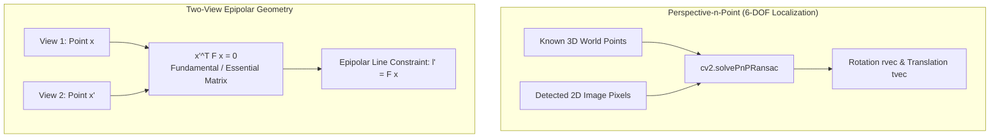
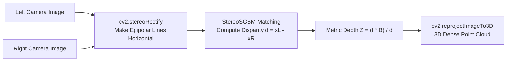
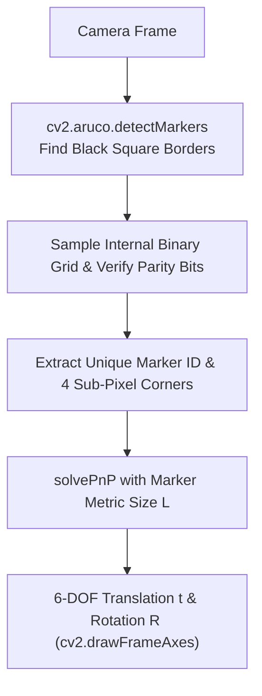
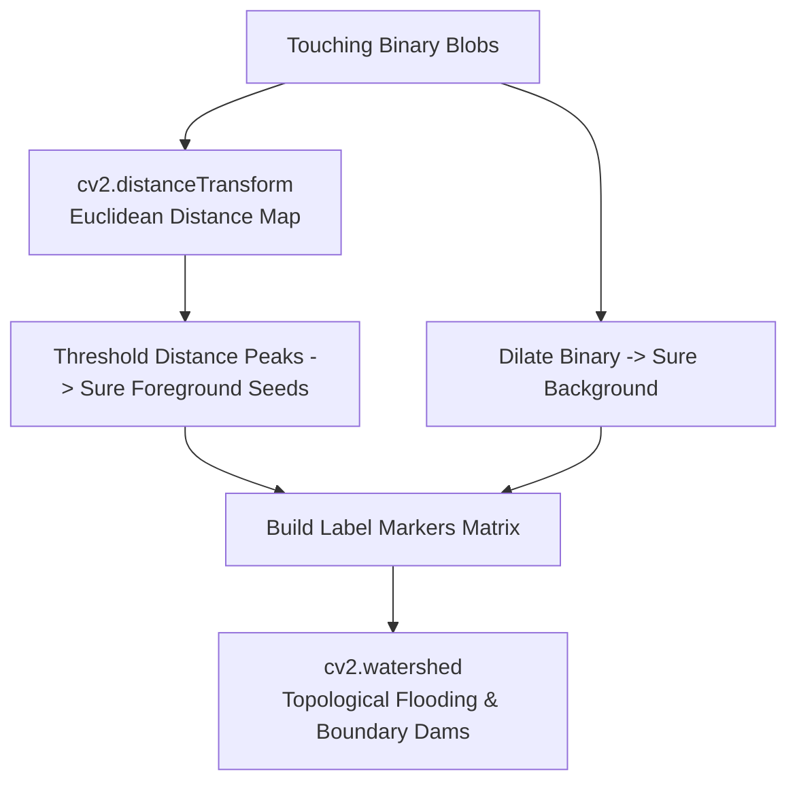

# Part 4: Camera Calibration, 3D Geometry & Stereo


## 20. Camera Calibration

### Definition & Intuitive Analogy
**Camera Calibration** is the mathematical process of discovering a physical camera's internal optical properties (focal lengths, optical center, and lens distortion) and estimating its position and orientation in 3D space.

> **Intuitive Analogy:** Imagine wearing prescription eyeglasses that have a slight warp around the edges. Before you can measure the true size and distance of objects you see through those glasses, you need an optometrist to measure the exact curvature and distortion of your lenses. Camera calibration is the digital optometrist measuring your camera's optical prescription.


### 💡 The Big Picture in Plain English (Beginner Friendly)

- **What is it in 1 simple sentence?** Camera calibration is discovering your physical camera's optical focal length, optical center, and lens curvature distortion so you can measure true real-world metric distances in meters.
- **Why do we need this? (The Problem):** Camera lenses are curved pieces of glass. Wide-angle lenses bend straight lines into curved arcs (barrel distortion). If a self-driving car doesn't calibrate its camera, it will miscalculate the distance to an obstacle by several meters!
- **How to picture it in your head (Mental Model):**
  - Imagine you are wearing someone else's warped eyeglasses. Everything looks distorted. Calibration is the optometrist measuring the exact curvature prescription of the glass so you can digitally "un-warp" the image back to perfect geometry.
  - **The Pinhole Model:** Light rays travel from 3D objects through a tiny pinhole and project upside-down onto the sensor plane.
  - **Intrinsic Matrix $\mathbf{K}$:** Contains the focal length ($f_x, f_y$ - zoom level) and the principal point ($c_x, c_y$ - optical center where the lens axis pierces the silicon sensor).
- **Step-by-Step Walkthrough with Easy Numbers:**
  - 3D point in front of camera: $X = 0.4	ext{ m}$, $Y = 0.2	ext{ m}$, depth $Z = 2.0	ext{ m}$.
  - Camera focal length $f_x = f_y = 1000	ext{ px}$, center $c_x = 640, c_y = 360$.
  - 2D pixel coordinates:
    - $u = f_x \cdot rac{X}{Z} + c_x = 1000 \cdot rac{0.4}{2.0} + 640 = 200 + 640 = \mathbf{840	ext{ px}}$.
    - $v = f_y \cdot rac{Y}{Z} + c_y = 1000 \cdot rac{0.2}{2.0} + 360 = 100 + 360 = \mathbf{460	ext{ px}}$.
- **Beginner Trap & Rule of Thumb:** Never print a calibration checkerboard on flimsy paper that bends or warps during photography! It must be mounted on a completely flat, rigid surface (like glass or acrylic).

### Why It Is Important
Standard glass lenses are curved and introduce optical distortions (like barrel distortion in wide-angle lenses or fisheye lenses). Uncalibrated camera images will have curved lines that should be straight, distorting 3D distance and angle measurements needed for robot grasping, self-driving car localization, and augmented reality.

### Core Concept & Mathematical Intuition

#### 1. The Pinhole Camera Model
The pinhole camera model maps a 3D world point $\mathbf{P}_w = [X_w, Y_w, Z_w, 1]^T$ to a 2D pixel coordinate $\mathbf{p} = [u, v, 1]^T$:

$$\mathbf{p} = \mathbf{K} \cdot [\mathbf{R} \mid \mathbf{t}] \cdot \mathbf{P}_w$$

Where:
- **Intrinsic Matrix $\mathbf{K}_{3 \times 3}$ (Internal Camera Geometry):**
  $$\mathbf{K} = \begin{bmatrix} f_x & 0 & c_x \\ 0 & f_y & c_y \\ 0 & 0 & 1 \end{bmatrix}$$
  - $f_x, f_y$: Focal lengths in pixel units ($f_x = F \cdot m_x$ where $F$ is focal length in mm and $m_x$ is pixels/mm).
  - $(c_x, c_y)$: **Principal Point** (the physical pixel where the camera's optical optical axis pierces the sensor, typically near the image center).
- **Extrinsic Matrix $[\mathbf{R} \mid \mathbf{t}]_{3 \times 4}$ (Camera Pose in World):**
  - $\mathbf{R}$: $3 \times 3$ Rotation matrix (orientation).
  - $\mathbf{t}$: $3 \times 1$ Translation vector (position).

#### 2. Lens Distortion Models (Brown-Conrady Model)
Real glass lenses deviate from ideal pinhole geometry:
1. **Radial Distortion (Barrel & Pincushion):** Light rays bend more near the edges of a curved lens:
   $$x_{\text{corrected}} = x (1 + k_1 r^2 + k_2 r^4 + k_3 r^6)$$
   $$y_{\text{corrected}} = y (1 + k_1 r^2 + k_2 r^4 + k_3 r^6)$$
   Where $r^2 = x^2 + y^2$.
2. **Tangential Distortion (Decentering):** Occurs when the physical glass lens elements are not mounted perfectly parallel to the silicon sensor chip:
   $$x_{\text{corrected}} = x + \left[ 2 p_1 x y + p_2 (r^2 + 2 x^2) \right]$$
   $$y_{\text{corrected}} = y + \left[ p_1 (r^2 + 2 y^2) + 2 p_2 x y \right]$$

Distortion coefficient vector: $\mathbf{D} = [k_1, k_2, p_1, p_2, k_3]$.

#### 3. Zhang's Calibration Method (OpenCV Implementation)
Zhengyou Zhang (1999) proved that photographing a flat planar checkerboard target from multiple angles ($15-20$ different viewpoints) allows closed-form analytic recovery of both $\mathbf{K}$ and $\mathbf{D}$ via homography decomposition followed by non-linear Levenberg-Marquardt optimization.

### Important OpenCV Functions & Syntax
```python
# Detect checkerboard internal corners
found, corners = cv2.findChessboardCorners(
    gray_img, patternSize=(cols, rows),
    flags=cv2.CALIB_CB_ADAPTIVE_THRESH + cv2.CALIB_CB_FAST_CHECK
)

# Sub-pixel corner refinement
corners_subpix = cv2.cornerSubPix(
    gray_img, corners, winSize=(11, 11), zeroZone=(-1, -1), criteria=crit
)

# Solve for Camera Intrinsics and Distortion Coefficients
ret_rms, K, dist, rvecs, tvecs = cv2.calibrateCamera(
    objpoints, imgpoints, imageSize=(width, height),
    cameraMatrix=None, distCoeffs=None
)

# Undistort an image
undistorted_img = cv2.undistort(distorted_img, K, dist, None, new_K)
```

### Camera Calibration & Distortion Flowchart
```mermaid
flowchart LR
    WORLD["3D World Point Pw"] -->|Extrinsics [R | t]| CAM["3D Camera Frame Coordinates"]
    CAM -->|Intrinsics K| PIXEL["Ideal 2D Image Pixel (u, v)"]
    PIXEL -->|Distortion Model (k1, k2, p1, p2)| DIST["Distorted Observed Pixel (ud, vd)"]
    DIST -->|cv2.undistort| RECT["Metric Undistorted Pixel (u, v)"]
```

### Visual Demonstration & Calibration Target


### Executable Python Example
```python
import cv2
import numpy as np
import matplotlib.pyplot as plt

# 1. Define synthetic camera intrinsic matrix K and distortion coefficients D
K_true = np.array([
    [450.0,   0.0, 160.0],
    [  0.0, 450.0, 120.0],
    [  0.0,   0.0,   1.0]
], dtype=np.float64)

# Introduce strong barrel distortion (negative k1)
dist_true = np.array([-0.35, 0.12, 0.0, 0.0, 0.0], dtype=np.float64)

# 2. Generate a clean synthetic orthogonal grid
grid = np.full((240, 320, 3), 240, dtype=np.uint8)
for x in range(20, 320, 25):
    cv2.line(grid, (x, 0), (x, 240), (100, 100, 100), 1)
for y in range(20, 240, 25):
    cv2.line(grid, (0, y), (320, y), (100, 100, 100), 1)
cv2.rectangle(grid, (45, 45), (275, 195), (0, 0, 220), 2)

# 3. Simulate lens distortion by backward mapping
h, w = grid.shape[:2]
distorted_sim = cv2.undistort(grid, K_true, -dist_true) # Inverse distortion simulation

# 4. Rectify and undistort back to true geometry using K and dist
undistorted = cv2.undistort(distorted_sim, K_true, dist_true)

# 5. Visual Comparison
fig, axs = plt.subplots(1, 3, figsize=(12, 4))
axs[0].imshow(cv2.cvtColor(grid, cv2.COLOR_BGR2RGB)); axs[0].set_title("1. Ideal Physical Grid")
axs[1].imshow(cv2.cvtColor(distorted_sim, cv2.COLOR_BGR2RGB)); axs[1].set_title("2. Lens Distortion (Barrel)")
axs[2].imshow(cv2.cvtColor(undistorted, cv2.COLOR_BGR2RGB)); axs[2].set_title("3. Undistorted & Calibrated")
for ax in axs: ax.axis("off")
plt.tight_layout()
plt.show()

print("Camera Intrinsics Matrix K:
", K_true)
print("Distortion Coefficients D:
", dist_true)
```

### Line-by-Line Explanation
1. `K_true` specifies focal lengths $f_x=450, f_y=450$ and principal point at $(c_x=160, c_y=120)$ on a $320 	imes 240$ sensor.
2. `dist_true = np.array([-0.35, 0.12, ...])` creates radial barrel distortion where straight lines bend outwards.
3. `cv2.undistort(distorted_sim, K_true, dist_true)` reverses the polynomial distortion equation, straightening all curved lines back to metric ground truth.

### Common Mistakes & Important Tips
- **Pattern Size is Internal Corners:** In `cv2.findChessboardCorners`, `patternSize=(cols, rows)` counts the **interior line intersections**, NOT the number of black/white square blocks. For an $8 	imes 6$ square board, `patternSize = (7, 5)`.
- **Calibration Diversity:** When capturing checkerboard frames for calibration, you must tilt the board in various orientations (yaw, pitch, roll) and cover all 4 corners of the image frame to accurately compute distortion parameters $k_1, k_2$.

### Real-World & Robotics Perception Relevance
- **Visual SLAM and 3D Voxel Mapping:** Calibrated intrinsics $\mathbf{K}$ are required to back-project 2D pixel coordinates $(u, v)$ with depth $Z$ into metric 3D point clouds in robot coordinates:
  $$X = rac{(u - c_x) Z}{f_x}, \quad Y = rac{(v - c_y) Z}{f_y}$$

### Interview Questions & Detailed Answers
1. **Q: What do the individual parameters in the $3 	imes 3$ Camera Intrinsic Matrix $\mathbf{K}$ represent?**
   - *Answer:* $f_x$ and $f_y$ are the camera focal lengths expressed in pixel units along the sensor horizontal and vertical axes (accounting for non-square pixel aspect ratios if $f_x 
eq f_y$). $c_x$ and $c_y$ are the 2D pixel coordinates of the Principal Point (where the central optical ray intersects the sensor array). The bottom row $[0, 0, 1]$ normalizes homogeneous projection.
2. **Q: What is Reprojection Error and what constitutes a good calibration result?**
   - *Answer:* Reprojection error is the Euclidean distance in pixels between the detected 2D corners in the calibration image and the 3D world target points projected back into the image plane using the estimated $\mathbf{K}, \mathbf{R}, \mathbf{t}, \mathbf{D}$:
     $$	ext{RMS Error} = \sqrt{rac{1}{N} \sum_{i=1}^{N} \| \mathbf{p}_i - \hat{\mathbf{p}}_i \|^2}$$
     In production robotics and vision pipelines, an RMS reprojection error $< 0.5$ pixels is considered high quality.

### Mini Exercise with Solution
**Task:** Write a function that takes a pixel coordinate $(u, v)$ and known depth $Z$ (in meters), and projects it into 3D camera coordinates $(X, Y, Z)$ using intrinsic matrix $\mathbf{K}$.

```python
import numpy as np

def pixel_to_3d_point(u: float, v: float, Z: float, K: np.ndarray) -> np.ndarray:
    fx = K[0, 0]
    fy = K[1, 1]
    cx = K[0, 2]
    cy = K[1, 2]
    
    # Back-projection equations
    X = (u - cx) * Z / fx
    Y = (v - cy) * Z / fy
    return np.array([X, Y, Z], dtype=np.float64)

# Example: Pixel (200, 150) at 2.5 meters depth
K_test = np.array([[500, 0, 320], [0, 500, 240], [0, 0, 1]], dtype=np.float64)
pt_3d = pixel_to_3d_point(200, 150, Z=2.5, K=K_test)
print(f"3D Point in camera frame: X={pt_3d[0]:.3f}m, Y={pt_3d[1]:.3f}m, Z={pt_3d[2]:.3f}m")
```

---

## 21. Camera Pose & 3D Geometry

### Definition & Intuitive Analogy
**Camera Pose Estimation** is the mathematical task of finding the exact 3D position $(t_x, t_y, t_z)$ and orientation angles (roll, pitch, yaw) of a camera relative to a known 3D object or world coordinate frame.

> **Intuitive Analogy:** Imagine holding a GPS receiver inside a room where satellites don't work. If you know the exact 3D positions of 4 light bulbs on the ceiling, and you photograph them with your camera, **Perspective-n-Point (PnP)** math calculates exactly where your camera is standing in the room down to the millimeter.


### 💡 The Big Picture in Plain English (Beginner Friendly)

- **What is it in 1 simple sentence?** Perspective-n-Point (PnP) is calculating the exact 3D position $(X, Y, Z)$ and 3D orientation (tilt angles) of an object relative to your camera using known landmark points.
- **Why do we need this? (The Problem):** Detecting a 2D bounding box around an engine component or an airplane fuel port isn't enough for a robot arm. The robot needs to know: *"Is the object exactly 42 centimeters forward, tilted 15 degrees up, and facing 5 degrees to the left?"*.
- **How to picture it in your head (Mental Model):**
  - Imagine you are a detective looking at a photograph of the Eiffel Tower. Because you know the physical 3D dimensions of the Eiffel Tower's 4 corner pillars, you can calculate the exact GPS coordinates and altitude where the photographer stood when taking the photo!
  - `cv2.solvePnP` takes 3D landmark points on the object and their matching 2D pixel locations in the image, outputting rotation vector $\mathbf{r}$ and translation vector $\mathbf{t}$.
- **Step-by-Step Walkthrough with Easy Numbers:**
  - Translation vector output: $\mathbf{t} = [0.10, -0.05, 1.50]^T$.
  - Meaning in metric real-world space: The object is located $10	ext{ cm}$ to the right ($+X$), $5	ext{ cm}$ above the camera ($-Y$ in camera coordinates), and exactly $1.50	ext{ meters}$ directly in front of the lens ($+Z$)!
- **Beginner Trap & Rule of Thumb:** `solvePnP` returns a 3-element **rotation vector** (axis-angle representation), NOT Euler angles or a $3 	imes 3$ matrix! Always use `cv2.Rodrigues(rvec)[0]` to convert it into a standard $3 	imes 3$ rotation matrix.

### Why It Is Important
Camera pose is the core computation in:
1. **Autonomous Robot Docking & Navigation:** Estimating robot pose relative to charging docks.
2. **Augmented Reality (AR):** Aligning virtual 3D characters onto a table surface.
3. **Epipolar Geometry in Stereo Vision:** Calculating 3D depth from multiple camera views.

### Core Concept & Mathematical Intuition

#### 1. The Perspective-n-Point (PnP) Problem
Given a set of $n$ known 3D world points $\mathbf{P}_i = (X_i, Y_i, Z_i)$ and their corresponding 2D image pixel coordinates $\mathbf{p}_i = (u_i, v_i)$, find the 6-DOF camera pose $[\mathbf{R} \mid \mathbf{t}]$ such that:

$$s \begin{bmatrix} u_i \\ v_i \\ 1 \end{bmatrix} = \mathbf{K} \left( \mathbf{R} \begin{bmatrix} X_i \\ Y_i \\ Z_i \end{bmatrix} + \mathbf{t} \right)$$

- **Minimum Points:** $n = 3$ points (**P3P**) yields up to 4 ambiguous solutions. $n \ge 4$ points (**EPnP / PnP**) provides a unique, closed-form linear solution.
- **RANSAC Integration (`solvePnPRansac`):** Essential in real perception to discard false 2D-to-3D feature matches.

#### 2. Rodrigues Rotation Formula (`cv2.Rodrigues`)
A $3 \times 3$ orthogonal rotation matrix $\mathbf{R}$ has 9 numbers but only 3 degrees of freedom. A **Rodrigues vector** $\mathbf{r} = [r_x, r_y, r_z]^T$ represents rotation as a compact 3D vector:
- **Direction of $\mathbf{r}$:** The unit axis of rotation $\mathbf{n} = \mathbf{r} / \|\mathbf{r}\|$.
- **Magnitude $\|\mathbf{r}\| = \theta$:** The angle of rotation in radians around that axis.

$$\mathbf{R} = \cos(\theta) \mathbf{I} + (1 - \cos\theta) \mathbf{n} \mathbf{n}^T + \sin(\theta) [\mathbf{n}]_{\times}$$

#### 3. Two-View Epipolar Geometry
When two cameras observe the same 3D scene point $\mathbf{X}$:
- **Epipolar Plane:** The plane formed by the 3D point $\mathbf{X}$ and the two camera optical centers $\mathbf{C}_1, \mathbf{C}_2$.
- **Epipolar Lines:** The intersection of the epipolar plane with the image sensors. A point $x$ in Image 1 is constrained to lie along the epipolar line $l' = \mathbf{F} x$ in Image 2!
- **Fundamental Matrix $\mathbf{F}_{3 \times 3}$ (Uncalibrated):**
  $$x'^T \mathbf{F} x = 0$$
- **Essential Matrix $\mathbf{E}_{3 \times 3}$ (Calibrated with $\mathbf{K}$):**
  $$x_{\text{norm}}'^T \mathbf{E} x_{\text{norm}} = 0, \quad \mathbf{E} = [\mathbf{t}]_{\times} \mathbf{R} = \mathbf{K}'^T \mathbf{F} \mathbf{K}$$

### Important OpenCV Functions & Syntax
```python
# Solve PnP pose (Returns rotation vector rvec and translation vector tvec)
success, rvec, tvec = cv2.solvePnP(
    objectPoints=pts_3d_Nx3, imagePoints=pts_2d_Nx2,
    cameraMatrix=K, distCoeffs=dist, flags=cv2.SOLVEPNP_ITERATIVE
)

# Robust PnP with RANSAC
success, rvec, tvec, inliers = cv2.solvePnPRansac(
    objectPoints=pts_3d_Nx3, imagePoints=pts_2d_Nx2,
    cameraMatrix=K, distCoeffs=dist, reprojectionError=2.0
)

# Convert 3x1 Rodrigues vector <-> 3x3 Rotation matrix
R_mat, jacobian = cv2.Rodrigues(rvec)

# Two-View Essential Matrix & Pose Recovery
E, mask = cv2.findEssentialMat(pts1, pts2, K, method=cv2.RANSAC, prob=0.999, threshold=1.0)
num_inliers, R, t, mask_pose = cv2.recoverPose(E, pts1, pts2, K)
```

### Camera Pose & Epipolar Geometry Architecture


### Visual Demonstration & Epipolar Geometry


### Executable Python Example
```python
import cv2
import numpy as np

# 1. Known 3D world coordinates of a planar object (e.g. 10cm x 10cm square on table)
# Z = 0 for all points on the planar surface
obj_pts_3d = np.array([
    [-0.05, -0.05, 0.0],
    [ 0.05, -0.05, 0.0],
    [ 0.05,  0.05, 0.0],
    [-0.05,  0.05, 0.0]
], dtype=np.float64)

# 2. Synthetic Camera Intrinsics
K = np.array([
    [600.0,   0.0, 320.0],
    [  0.0, 600.0, 240.0],
    [  0.0,   0.0,   1.0]
], dtype=np.float64)
dist = np.zeros(5, dtype=np.float64)

# 3. Ground truth camera pose: Camera located at (0, 0, 1.0m) looking at object
rvec_true = np.array([0.2, 0.1, 0.0], dtype=np.float64) # Slight tilt
tvec_true = np.array([0.0, 0.0, 1.0], dtype=np.float64) # 1.0 meter away

# Project 3D points to 2D image coordinates using Ground Truth pose
img_pts_2d, _ = cv2.projectPoints(obj_pts_3d, rvec_true, tvec_true, K, dist)
img_pts_2d = img_pts_2d.reshape(-1, 2)

# 4. Recover Camera Pose using solvePnP
success, rvec_est, tvec_est = cv2.solvePnP(obj_pts_3d, img_pts_2d, K, dist)

# 5. Convert Rodrigues vector to 3x3 Rotation Matrix
R_est, _ = cv2.Rodrigues(rvec_est)

print("PnP Pose Recovery Success:", success)
print("Estimated Translation Vector t (meters):
", np.round(tvec_est.ravel(), 4))
print("Ground Truth Translation Vector t:
", tvec_true)
print("Estimated 3x3 Rotation Matrix R:
", np.round(R_est, 3))
```

### Line-by-Line Explanation
1. `obj_pts_3d`: Metric physical measurements of target corners in meters.
2. `cv2.projectPoints(...)`: Forward-projects 3D world vertices through the pinhole camera geometry to generate synthetic 2D pixel coordinates.
3. `cv2.solvePnP(...)`: Inverts the perspective equations to compute the 6-DOF camera pose `rvec_est` and `tvec_est`.
4. `cv2.Rodrigues(rvec_est)`: Converts the compact 3-element rotation vector into a standard $3 	imes 3$ orthonormal rotation matrix $\mathbf{R}$.

### Common Mistakes & Important Tips
- **Coordinate System Units:** World coordinates and translation vectors share the exact same physical units. If `obj_pts_3d` is specified in millimeters, `tvec` will be returned in millimeters. If specified in meters, `tvec` will be in meters. Always maintain consistent metric units.
- **Ambiguity in Planar P3P:** Estimating pose from only 3 planar points has multiple geometric reflections. Always use at least 4 coplanar points (`SOLVEPNP_IPPE` or `SOLVEPNP_ITERATIVE`).

### Real-World & Robotics Perception Relevance
- **Robot Arm Visual Servoing:** Hand-eye cameras on robotic arms use PnP to track object handles and align the gripper for precision grasping.
- **Autonomous Drone Landing:** Drones detect ground helipad fiducial patterns, run `solvePnP` to measure distance and orientation, and execute precision autonomous landings.

### Interview Questions & Detailed Answers
1. **Q: Explain the fundamental difference between the Essential Matrix $\mathbf{E}$ and the Fundamental Matrix $\mathbf{F}$.**
   - *Answer:* The Fundamental Matrix $\mathbf{F}$ operates on raw uncalibrated pixel coordinates ($x'^T \mathbf{F} x = 0$) and encapsulates both the camera intrinsics ($\mathbf{K}, \mathbf{K}'$) and extrinsic relative pose ($[\mathbf{R} \mid \mathbf{t}]$). The Essential Matrix $\mathbf{E} = \mathbf{K}'^T \mathbf{F} \mathbf{K}$ operates on normalized metric camera coordinates ($x_{	ext{norm}}'^T \mathbf{E} x_{	ext{norm}} = 0$) and isolates purely the geometric 3D rotation $\mathbf{R}$ and translation direction $\mathbf{t}$ between the two camera viewpoints.
2. **Q: Why does Essential Matrix decomposition (`cv2.recoverPose`) produce translation $\mathbf{t}$ only up to an unknown scale factor in monocular vision?**
   - *Answer:* In a single monocular camera, a small object moving close to the lens produces identical pixel motion to a huge object moving far away at high speed (scale ambiguity). The epipolar constraint $x'^T [\mathbf{t}]_{	imes} \mathbf{R} x = 0$ is homogeneous: multiplying $\mathbf{t}$ by any scalar $s > 0$ yields the identical matrix $\mathbf{E}$. Metric scale can only be recovered using a calibrated stereo baseline, IMU sensor fusion, or known fiducial marker dimensions.

### Mini Exercise with Solution
**Task:** Write a function that takes a recovered rotation matrix $\mathbf{R}$ and extracts the physical Euler angles (Roll, Pitch, Yaw) in degrees.

```python
import numpy as np

def rotation_matrix_to_euler_angles(R: np.ndarray) -> tuple[float, float, float]:
    # Extract Euler angles (XYZ sequence)
    sy = np.sqrt(R[0, 0] * R[0, 0] + R[1, 0] * R[1, 0])
    singular = sy < 1e-6
    
    if not singular:
        roll = np.arctan2(R[2, 1], R[2, 2])
        pitch = np.arctan2(-R[2, 0], sy)
        yaw = np.arctan2(R[1, 0], R[0, 0])
    else:
        roll = np.arctan2(-R[1, 2], R[1, 1])
        pitch = np.arctan2(-R[2, 0], sy)
        yaw = 0.0
        
    return np.rad2deg(roll), np.rad2deg(pitch), np.rad2deg(yaw)
```

---

## 22. Stereo Vision & Depth

### Definition & Intuitive Analogy
**Stereo Vision** is the process of estimating 3D depth from two horizontally separated cameras by finding corresponding pixels and measuring their horizontal pixel shift (**Disparity**).

> **Intuitive Analogy:** Hold your finger in front of your face. Close your left eye, then close your right eye and open the left. Your finger appears to jump horizontally against the background. Hold your finger farther away, and it jumps much less. Your brain calculates depth by measuring this jump. Stereo vision uses the exact same geometry.


### 💡 The Big Picture in Plain English (Beginner Friendly)

- **What is it in 1 simple sentence?** Stereo vision calculates 3D depth by looking at a scene through two horizontally separated cameras (like human eyes) and measuring how much objects jump sideways.
- **Why do we need this? (The Problem):** A single camera cannot tell the difference between a tiny toy car 1 foot away and a real car 100 feet away (scale ambiguity). Stereo vision triangulation solves this by measuring horizontal shift (disparity) to calculate true metric depth in meters.
- **How to picture it in your head (Mental Model):**
  - Hold your thumb 6 inches in front of your nose. Close your left eye, then close your right eye and open the left. Your thumb jumps dramatically against the background (Large Disparity = Close Object).
  - Now look at a distant building and repeat. The building barely shifts at all (Zero Disparity = Infinite Distance).
- **Step-by-Step Walkthrough with Easy Numbers:**
  - Two cameras with focal length $f = 800	ext{ pixels}$ are spaced apart by baseline $B = 0.1	ext{ meters}$ ($10	ext{ cm}$).
  - An object appears at pixel $x_L = 450$ in the left camera and $x_R = 410$ in the right camera.
  - Disparity: $d = x_L - x_R = 450 - 410 = \mathbf{40	ext{ pixels}}$.
  - Depth formula: $Z = rac{f \cdot B}{d} = rac{800 	imes 0.1}{40} = rac{80}{40} = \mathbf{2.0	ext{ meters}}$!
- **Beginner Trap & Rule of Thumb:** Stereo matching requires that matching pixels lie on the exact same horizontal row (epipolar line). Always calibrate and run stereo rectification (`cv2.stereoRectify`) first; otherwise, block matching will fail completely.

### Why It Is Important
Stereo vision provides dense, direct 3D depth maps without emitting active laser or infrared signals (passive sensing). It is used extensively in autonomous vehicles (Subaru EyeSight), space exploration rovers (NASA Mars Perseverance Rover), and agricultural robotics.

### Core Concept & Mathematical Intuition

#### 1. Stereo Triangulation & The Disparity-to-Depth Formula
For two perfectly rectified cameras separated by horizontal **Baseline distance $B$** with focal length $f$:

$$Z = \frac{f \cdot B}{d} = \frac{f \cdot B}{x_L - x_R}$$

Where:
- $Z$: Perpendicular 3D metric depth to the point (in meters).
- $f$: Camera focal length in pixel units ($f_x$).
- $B$: Physical baseline distance between the two optical centers (in meters).
- $d = x_L - x_R$: **Disparity** (the horizontal pixel coordinate difference).
- **Inverse Relationship:** As an object gets closer ($Z 	o 0$), disparity explodes ($d 	o \infty$). As an object moves to infinity ($Z 	o \infty$), disparity approaches zero ($d 	o 0$).

#### 2. Stereo Rectification
Before matching, raw stereo images have vertical misalignments and lens distortions. **Stereo Rectification (`cv2.stereoRectify`)** projects both camera images onto a common coplanar plane such that **epipolar lines become perfectly horizontal scanlines**. Corresponding pixels in the left and right images share the exact same row index $y$ ($y_L = y_R$). Searching for correspondences is reduced from a 2D search to a fast 1D horizontal scanline search!

#### 3. Semi-Global Block Matching (StereoSGBM)
Heiko Hirschmüller's **StereoSGBM** algorithm optimizes an energy function $E(D)$ across 8 directional 1D paths:
$$E(D) = \sum_p \left( C(p, D_p) + \sum_{q \in N_p} P_1 \cdot \mathbb{I}(|D_p - D_q| = 1) + \sum_{q \in N_p} P_2 \cdot \mathbb{I}(|D_p - D_q| > 1) \right)$$
- $C(p, D_p)$: Matching cost (Birchfield-Tomasi sampling).
- $P_1$: Penalty for small disparity step changes (smooth slanted surfaces).
- $P_2$: Penalty for large disparity discontinuities (object boundaries).

### Important OpenCV Functions & Syntax
```python
# Compute Stereo Rectification Transforms
R1, R2, P1, P2, Q, roi1, roi2 = cv2.stereoRectify(
    K1, dist1, K2, dist2, imageSize, R, T, flags=cv2.CALIB_ZERO_DISPARITY
)

# Initialize StereoSGBM Matcher
stereo = cv2.StereoSGBM_create(
    minDisparity=0,
    numDisparities=64, # Must be a positive integer divisible by 16!
    blockSize=5,
    P1=8 * 3 * (5**2),
    P2=32 * 3 * (5**2),
    disp12MaxDiff=1,
    uniquenessRatio=10,
    speckleWindowSize=100,
    speckleRange=32
)

# Compute Disparity Map (Output is 16-bit signed int scaled by 16)
disparity_16s = stereo.compute(rectified_left, rectified_right)
disparity_float = disparity_16s.astype(np.float32) / 16.0

# Reproject Disparity Map to 3D Point Cloud [X, Y, Z]
points_3d = cv2.reprojectImageTo3D(disparity_float, Q)
```

### Stereo Vision & Disparity Triangulation Pipeline


### Visual Demonstration & Stereo Epipolar Rectification


### Executable Python Example
```python
import cv2
import numpy as np
import matplotlib.pyplot as plt

# 1. Simulate a rectified stereo image pair observing a square obstacle
# Synthetic baseline B = 0.2m, focal length f = 300px
h, w = 150, 200
left_img = np.full((h, w), 80, dtype=np.uint8)
right_img = np.full((h, w), 80, dtype=np.uint8)

# Add textured background to facilitate stereo block matching
noise = np.random.randint(0, 40, (h, w), dtype=np.uint8)
left_img = cv2.add(left_img, noise)
right_img = cv2.add(right_img, noise)

# Render an obstacle: In left image at x=60, in right image shifted left to x=40 (Disparity = 20px)
obstacle_tex = np.random.randint(180, 240, (50, 50), dtype=np.uint8)
left_img[50:100, 60:110] = obstacle_tex
right_img[50:100, 40:90] = obstacle_tex # Horizontal shift of 20px

# 2. Compute Disparity via StereoSGBM
stereo = cv2.StereoSGBM_create(
    minDisparity=0,
    numDisparities=32, # Must be divisible by 16
    blockSize=5,
    P1=8 * 1 * 25,
    P2=32 * 1 * 25,
    uniquenessRatio=5
)
disp_16s = stereo.compute(left_img, right_img)
disp_map = disp_16s.astype(np.float32) / 16.0

# 3. Calculate Metric Depth Map Z = (f * B) / d
B_metric = 0.2  # 20 cm baseline
f_metric = 300.0 # 300 px focal length
depth_map = np.zeros_like(disp_map)
valid_mask = disp_map > 0
depth_map[valid_mask] = (f_metric * B_metric) / disp_map[valid_mask]

# 4. Display results
fig, axs = plt.subplots(1, 3, figsize=(12, 4))
axs[0].imshow(left_img, cmap="gray"); axs[0].set_title("1. Left Camera View")
axs[1].imshow(disp_map, cmap="jet"); axs[1].set_title("2. Disparity Map (d = xL - xR)")
axs[2].imshow(depth_map, cmap="plasma_r", vmin=0.5, vmax=5.0); axs[2].set_title("3. Metric Depth Z (Meters)")
for ax in axs: ax.axis("off")
plt.tight_layout()
plt.show()

measured_d = np.median(disp_map[55:95, 65:105])
measured_z = np.median(depth_map[55:95, 65:105])
print(f"Obstacle Disparity: {measured_d:.1f} pixels -> Calculated Metric Depth: {measured_z:.2f} meters")
```

### Line-by-Line Explanation
1. `right_img[50:100, 40:90] = obstacle_tex` places the object 20 pixels to the left in the right camera view, modeling disparity.
2. `stereo.compute(left_img, right_img)` evaluates matching costs along horizontal scanlines.
3. `disp_16s.astype(np.float32) / 16.0`: StereoSGBM outputs disparity in $1/16$-th sub-pixel units stored in a 16-bit integer; dividing by 16 converts it back to true pixel disparity.
4. `depth_map[valid_mask] = (f_metric * B_metric) / disp_map[valid_mask]` converts pixel disparity into metric meters.

### Common Mistakes & Important Tips
- **The `numDisparities` Divisibility Requirement:** `numDisparities` in StereoSGBM **must be a positive integer divisible by 16** (e.g., $16, 32, 64, 128$). Any other number causes a C++ assertion failure.
- **Textureless Surfaces Fail in Passive Stereo:** White walls or untextured tables have no distinct pixel intensity patterns. Matching cost curves become flat, causing passive stereo to fail. In robotics, active stereo cameras (like RealSense D435) project an invisible infrared dot pattern onto walls to create artificial texture.

### Real-World & Robotics Perception Relevance
- **NASA Mars Perseverance Rover Navigation:** The rover uses stereo vision hazard cameras (HazCams) and navigation cameras (NavCams) to build 3D digital elevation terrain maps and drive autonomously over Martian rocks.

### Interview Questions & Detailed Answers
1. **Q: Derive the stereo depth formula $Z = rac{f \cdot B}{d}$ from similar triangles.**
   - *Answer:* Let two pinhole cameras with focal length $f$ be separated by baseline $B$ along the $X$-axis. A 3D point $\mathbf{P} = (X, Y, Z)$ projects to left image coordinate $x_L = f rac{X}{Z}$ and right image coordinate $x_R = f rac{X - B}{Z}$. Subtracting the two equations gives disparity $d = x_L - x_R = f rac{X}{Z} - f rac{X - B}{Z} = rac{f \cdot B}{Z}$. Rearranging terms yields $Z = rac{f \cdot B}{d}$.
2. **Q: Why is disparity resolution non-linear with respect to depth?**
   - *Answer:* Taking the derivative $rac{dZ}{dd} = -rac{f \cdot B}{d^2} = -rac{Z^2}{f \cdot B}$ shows that depth error $\Delta Z$ grows **quadratically with distance $Z^2$**. A 1-pixel disparity error at 1 meter causes a depth error of only a few millimeters, but at 50 meters, a 1-pixel disparity error causes a depth uncertainty of several meters.

### Mini Exercise with Solution
**Task:** Calculate the minimum detectable depth difference $\Delta Z$ for an object at $Z = 5.0$ meters given a stereo camera with focal length $f = 600$ pixels, baseline $B = 0.2$ meters, and sub-pixel disparity resolution $\Delta d = 0.0625$ pixels ($1/16$ pixel).

```python
def calculate_depth_resolution(Z: float, f: float, B: float, delta_d: float = 1/16.0) -> float:
    # Derivative: |dZ| = (Z^2 / (f * B)) * delta_d
    delta_Z = (Z ** 2) / (f * B) * delta_d
    return delta_Z

delta_z = calculate_depth_resolution(Z=5.0, f=600.0, B=0.2, delta_d=0.0625)
print(f"At 5.0m distance, depth resolution is: {delta_z * 1000:.1f} mm")
```

---

## 23. ArUco & Fiducial Markers

### Definition & Intuitive Analogy
**ArUco markers** are synthetic square 2D planar fiducial markers composed of an outer black border and an inner binary matrix that encodes a unique numerical identifier.

> **Intuitive Analogy:** Think of an ArUco marker like a high-tech QR code designed specifically for 3D robotics. Its sharp square corners allow a robot to calculate the marker's exact 3D distance, tilt, and orientation in space in under 1 millisecond.


### 💡 The Big Picture in Plain English (Beginner Friendly)

- **What is it in 1 simple sentence?** ArUco markers are synthetic square black-and-white barcodes with wide black borders that cameras can detect instantly to measure 3D position and orientation with millimeter precision.
- **Why do we need this? (The Problem):** Natural feature tracking fails in plain rooms with blank white walls and no texture. Placing ArUco markers on warehouse shelves, charging pads, or drone landing targets gives robots infallible visual beacons.
- **How to picture it in your head (Mental Model):**
  - Think of an ArUco marker like an aircraft carrier runway crosshair.
  - The wide black outer border allows OpenCV to detect the 4 corners in under 1 millisecond.
  - The internal black-and-white grid encodes a binary number using Hamming error correction, so the robot knows whether it's looking at Tag #4 or Tag #42, even if part of the tag is dirty.
- **Step-by-Step Walkthrough with Easy Numbers:**
  - Camera detects tag corners at $(100, 100), (200, 100), (200, 200), (100, 200)$ ($100	ext{ px}$ wide on screen).
  - Given physical marker size $L = 0.05	ext{ m}$ ($5	ext{ cm}$) and focal length $f = 1000	ext{ px}$:
  - Approximate distance: $Z pprox rac{f \cdot L}{	ext{pixel size}} = rac{1000 	imes 0.05}{100} = \mathbf{0.50	ext{ meters}}$.
- **Beginner Trap & Rule of Thumb:** ArUco dictionary mismatch! If your printed tag is from `DICT_6X6_250`, but your code initializes `DICT_4X4_50`, OpenCV will detect 0 markers. Make sure the dictionary type matches the printed tag!

### Why It Is Important
Natural feature detection can be slow and unstable in dim or textureless environments. ArUco markers provide instantaneous, 100% reliable 6-DOF ground-truth localization for robotic arm calibration, drone landing targets, and augmented reality anchors.

### Core Concept & Mathematical Intuition

#### 1. Binary Matrix Structure & Error Correction
An ArUco marker consists of:
1. A solid **Black Outer Border** that makes contour detection trivial under any background.
2. An **Inner $N 	imes N$ Grid** of black/white bits (e.g., $4 	imes 4, 5 	imes 5, 6 	imes 6$).
3. **Modified Hamming Code:** The bit pattern encodes a unique ID and parity bits. Even if several bits are corrupted by dirt or glare, error-correcting codes detect and recover the true ID while rejecting false positives.

#### 2. 6-DOF Pose Estimation via PnP
Once the 4 outer corner vertices $[p_1, p_2, p_3, p_4]$ are detected in the image:
- The marker's physical size in meters $L$ defines its 3D local coordinate frame:
  $$\mathbf{P}_1 = [-L/2, L/2, 0], \quad \mathbf{P}_2 = [L/2, L/2, 0], \quad \mathbf{P}_3 = [L/2, -L/2, 0], \quad \mathbf{P}_4 = [-L/2, -L/2, 0]$$
- Running closed-form PnP (`cv2.solvePnP` or `estimatePoseSingleMarkers`) calculates the 6-DOF rotation vector $\mathbf{r}$ and translation vector $\mathbf{t} = [x, y, z]$ of the marker relative to the camera.

### Important OpenCV Functions & Syntax
```python
# Select Predefined ArUco Dictionary
aruco_dict = cv2.aruco.getPredefinedDictionary(cv2.aruco.DICT_6X6_250)
aruco_params = cv2.aruco.DetectorParameters()

# OpenCV 4.7+ Detector API
detector = cv2.aruco.ArucoDetector(aruco_dict, aruco_params)
corners, ids, rejected = detector.detectMarkers(gray_img)

# Draw 2D Marker Outlines
cv2.aruco.drawDetectedMarkers(vis_img, corners, ids)

# Draw 3D Coordinate Axes (X=Red, Y=Green, Z=Blue)
cv2.drawFrameAxes(vis_img, K, dist, rvec, tvec, length=0.05)
```

### ArUco Detection & 6-DOF Localization Flowchart


### Visual Demonstration & 6-DOF Pose Axes


### Executable Python Example
```python
import cv2
import numpy as np
import matplotlib.pyplot as plt

# 1. Generate a synthetic 6x6 ArUco Marker (ID = 42, Size = 150x150 px)
aruco_dict = cv2.aruco.getPredefinedDictionary(cv2.aruco.DICT_6X6_250)
marker_img = cv2.aruco.generateImageMarker(aruco_dict, id=42, sidePixels=150)

# 2. Place the marker onto a synthetic canvas with rotation and perspective
canvas = np.full((250, 250), 200, dtype=np.uint8)
canvas[50:200, 50:200] = marker_img

# 3. Detect ArUco Marker
detector_params = cv2.aruco.DetectorParameters()
detector = cv2.aruco.ArucoDetector(aruco_dict, detector_params)
corners, ids, rejected = detector.detectMarkers(canvas)

# 4. Render Detected Marker and Corner Coordinates
vis = cv2.cvtColor(canvas, cv2.COLOR_GRAY2BGR)
if ids is not None:
    cv2.aruco.drawDetectedMarkers(vis, corners, ids)
    c = corners[0][0] # 4 corner vertices
    for i, pt in enumerate(c):
        cv2.circle(vis, (int(pt[0]), int(pt[1])), 4, (0, 0, 255), -1)
        cv2.putText(vis, f"C{i}", (int(pt[0])+5, int(pt[1])-5), cv2.FONT_HERSHEY_SIMPLEX, 0.4, (255, 0, 0), 1)

plt.figure(figsize=(5, 5))
plt.imshow(cv2.cvtColor(vis, cv2.COLOR_BGR2RGB))
plt.title(f"ArUco Detection: Successfully Decoded ID = {ids[0][0] if ids is not None else 'None'}")
plt.axis("off")
plt.show()

print(f"Detected ArUco Marker ID: {ids.ravel() if ids is not None else None}")
```

### Line-by-Line Explanation
1. `cv2.aruco.generateImageMarker(aruco_dict, id=42, sidePixels=150)`: Draws the ground-truth binary grid for ID 42 including border and parity bits.
2. `detector.detectMarkers(canvas)`: Detects candidate quadrangles, samples the internal grid, checks parity bits, and returns verified corner coordinates.
3. `cv2.aruco.drawDetectedMarkers(...)`: Draws the green perimeter line and displays the decoded ID in the center.

### Common Mistakes & Important Tips
- **Dictionary Mismatch:** If an image contains markers from `DICT_4X4_50` but you initialize the detector with `DICT_6X6_250`, detection will fail completely. Always ensure the detector dictionary matches the printed marker dictionary.
- **Metric Size in Pose Estimation:** When calling `estimatePoseSingleMarkers`, `markerLength` must be specified in the **exact same units** (e.g., meters) as your calibration translation vector.

### Real-World & Robotics Perception Relevance
- **Automated Guided Vehicle (AGV) Precision Docking:** AGVs navigate warehouse aisles using wheel odometry, and use floor/shelf ArUco markers to align within $\pm 1$ mm for automatic battery charging.

### Interview Questions & Detailed Answers
1. **Q: Why are ArUco markers preferred over standard QR codes for 6-DOF robotics pose estimation?**
   - *Answer:* QR codes contain dense data matrices with high bit density, requiring high-resolution imagery and significant processing time to decode. ArUco markers use minimal $4 	imes 4$ or $6 	imes 6$ grids specifically optimized for fast corner localization, high-speed detection ($>100$ FPS), and robust tracking even when viewed at extreme angles or from far distances.
2. **Q: How does the ArUco detector handle marker rotation ambiguity ($0^\circ, 90^\circ, 180^\circ, 270^\circ$)?**
   - *Answer:* The internal binary code is asymmetric across $90^\circ$ rotations. When the detector extracts the bits from a detected square, it compares all 4 possible cyclic rotations against the dictionary. Only one unique rotation produces a valid dictionary ID and matching parity bits, allowing the algorithm to assign Corner 0 unambiguously to the top-left marker vertex.

### Mini Exercise with Solution
**Task:** Write a function that generates and saves a printable grid sheet containing 4 distinct ArUco markers (IDs: 10, 11, 12, 13) for a robot calibration target.

```python
import cv2
import numpy as np

def generate_aruco_sheet() -> np.ndarray:
    dict_aruco = cv2.aruco.getPredefinedDictionary(cv2.aruco.DICT_4X4_50)
    sheet = np.full((400, 400), 255, dtype=np.uint8)
    
    positions = [(50, 50), (230, 50), (50, 230), (230, 230)]
    ids = [10, 11, 12, 13]
    
    for (x, y), marker_id in zip(positions, ids):
        marker = cv2.aruco.generateImageMarker(dict_aruco, marker_id, sidePixels=120)
        sheet[y:y+120, x:x+120] = marker
        
    return sheet
```

---

## 24. Image Segmentation

### Definition & Intuitive Analogy
**Image Segmentation** is the process of partitioning a digital image into multiple meaningful, non-overlapping visual regions or segments sharing similar color, texture, or semantic meaning.

> **Intuitive Analogy:** Imagine an aerial landscape map with mountains, rivers, and forests. Thresholding only colors pixels black or white. Segmentation is like tracing borders around every individual mountain, lake, and forest, assigning a distinct label to every pixel in the terrain.


### 💡 The Big Picture in Plain English (Beginner Friendly)

- **What is it in 1 simple sentence?** Image segmentation is carving an image into separate meaningful regions—giving every single pixel a label (like "Road", "Sidewalk", "Coin #1", "Coin #2").
- **Why do we need this? (The Problem):** If two round coins or biological cells are physically touching each other, standard thresholding merges them into a single big peanut-shaped blob. You can't count them or measure their individual shapes.
- **How to picture it in your head (Mental Model):**
  - **Distance Transform:** For every pixel inside a blob, measure how far it is from the edge. The center of each coin has the highest distance score (the mountain peak). Thresholding the peaks gives you isolated seed points for each coin!
  - **Watershed Algorithm:** Think of the image gradient as a 3D landscape of mountains (object edges) and valleys (object centers). You punch a hole in the bottom of each valley and pump colored water up. Where the red water from coin 1 meets the blue water from coin 2, you build a dam—that dam is the exact boundary separating the two touching objects!
- **Step-by-Step Walkthrough with Easy Numbers:**
  - Two touching coins of radius $30	ext{ px}$.
  - At the touching junction, distance to background is small (e.g. $5	ext{ px}$).
  - At the coin centers, distance to background is $30	ext{ px}$.
  - Thresholding distance map at $> 0.5 	imes 30 = 15	ext{ px}$ leaves two separate, detached seed circles ready for watershed expansion!
- **Beginner Trap & Rule of Thumb:** Running the Watershed algorithm without seed markers causes catastrophic over-segmentation (breaking the image into thousands of tiny puzzle pieces). Always generate confident foreground and background markers first.

### Why It Is Important
Autonomous driving (drivable road surface vs sidewalks), medical imaging (tumor boundary delineation in MRI), and robotic manipulation (separating overlapping parts) require pixel-level segmentation boundaries.

### Core Concept & Mathematical Intuition

#### 1. Watershed Segmentation Algorithm (Topological Flooding)
The Watershed algorithm treats an image as a 3D topographic relief map where pixel intensity corresponds to height/altitude:
1. **Gradient Magnitude Map:** High gradient ridges correspond to mountain peaks (object boundaries).
2. **Topological Flooding:** Virtual water is pumped into local minima (valleys).
3. **Watershed Divide Lines:** Where water from distinct valleys meets, a dam (boundary barrier) is constructed.
4. **Marker-Controlled Watershed:** Standard watershed suffers from extreme **over-segmentation** (thousands of tiny regions due to noise). OpenCV uses **user-defined or algorithm-derived markers** to initiate flooding strictly from known foreground objects and known background.

#### 2. Distance Transform (`cv2.distanceTransform`)
For every foreground pixel in a binary mask, the distance transform computes the Euclidean distance to the **nearest background (zero) pixel**:
$$D(x, y) = \min_{(x_0, y_0) \in \text{Background}} \sqrt{(x - x_0)^2 + (y - y_0)^2}$$
- The center of an object has the highest distance value. Thresholding the distance transform ($D > 0.5 \cdot \max(D)$) reliably isolates **sure foreground markers** for overlapping objects (like touching coins or biological cells).

#### 3. GrabCut Interactive Segmentation (Graph Cuts)
GrabCut (Rother et al.) formulates segmentation as an energy minimization problem over a Markov Random Field:
$$E(\alpha, k, \theta, z) = U(\alpha, k, \theta, z) + V(\alpha, z)$$
- **Data Term $U$:** Evaluates how well a pixel fits Gaussian Mixture Models (GMMs) for foreground vs background.
- **Smoothness Term $V$:** Penalizes boundary discontinuities, encouraging smooth physical object contours.
- Minimized iteratively using the **Max-Flow / Min-Cut theorem**.

### Important OpenCV Functions & Syntax
```python
# Compute Exact Euclidean Distance Transform
dist_transform = cv2.distanceTransform(binary_mask, distanceType=cv2.DIST_L2, maskSize=5)

# Marker-Based Watershed (markers must be 32-bit signed integer!)
cv2.watershed(color_img, markers=markers_32s)

# GrabCut Segmentation
mask = np.zeros(img.shape[:2], np.uint8)
bgdModel = np.zeros((1, 65), np.float64)
fgdModel = np.zeros((1, 65), np.float64)
cv2.grabCut(img, mask, rect=(x, y, w, h), bgdModel=bgdModel, fgdModel=fgdModel, iterCount=5, mode=cv2.GC_INIT_WITH_RECT)
```

### Marker-Controlled Watershed Segmentation Flowchart


### Visual Demonstration & Watershed Pipeline


### Executable Python Example
```python
import cv2
import numpy as np
import matplotlib.pyplot as plt

# 1. Create a synthetic image of two overlapping circular objects
canvas = np.zeros((150, 150), dtype=np.uint8)
cv2.circle(canvas, (60, 75), 30, 255, -1)
cv2.circle(canvas, (90, 75), 30, 255, -1) # Overlaps with circle 1

# 2. Compute Distance Transform to find object cores
dist = cv2.distanceTransform(canvas, cv2.DIST_L2, 5)

# 3. Threshold Distance Transform to isolate sure foreground seeds
_, sure_fg = cv2.threshold(dist, 0.6 * dist.max(), 255, 0)
sure_fg = np.uint8(sure_fg)

# 4. Identify sure background by dilating mask
sure_bg = cv2.dilate(canvas, np.ones((3, 3), np.uint8), iterations=3)

# 5. Unknown boundary region
unknown = cv2.subtract(sure_bg, sure_fg)

# 6. Create Watershed Markers
_, markers = cv2.connectedComponents(sure_fg)
markers = markers + 1 # Background becomes 1
markers[unknown == 255] = 0 # Unknown region becomes 0

# 7. Apply Watershed
color_canvas = cv2.cvtColor(canvas, cv2.COLOR_GRAY2BGR)
cv2.watershed(color_canvas, markers)

# 8. Display Visual Progression
fig, axs = plt.subplots(1, 4, figsize=(14, 3.5))
axs[0].imshow(canvas, cmap="gray"); axs[0].set_title("1. Touching Blobs")
axs[1].imshow(dist, cmap="jet"); axs[1].set_title("2. Distance Transform")
axs[2].imshow(sure_fg, cmap="gray"); axs[2].set_title("3. Sure Foreground Seeds")
axs[3].imshow(markers, cmap="tab10"); axs[3].set_title("4. Watershed Segments")
for ax in axs: ax.axis("off")
plt.tight_layout()
plt.show()

print(f"Watershed successfully separated overlapping objects into distinct labels: {np.unique(markers)}")
```

### Line-by-Line Explanation
1. `cv2.distanceTransform(canvas, cv2.DIST_L2, 5)` calculates the Euclidean distance of every white pixel to the nearest black pixel.
2. `_, sure_fg = cv2.threshold(dist, 0.6 * dist.max(), 255, 0)` keeps only the peaks of the distance map, cleanly separating the two overlapping circles into two disconnected seed blobs.
3. `markers = markers + 1; markers[unknown == 255] = 0` formats the marker array as required by OpenCV: background is 1, known objects are $2, 3, \dots$, and unknown boundaries are $0$.
4. `cv2.watershed(...)` floods from the seeds, placing boundary divide lines (marked as $-1$) exactly where the objects touch.

### Common Mistakes & Important Tips
- **Marker Data Type:** The `markers` array passed to `cv2.watershed` **must be `int32` (`np.int32`)**. Passing `uint8` or `float32` causes an immediate assertion crash.
- **Over-Segmentation in Raw Watershed:** Never run watershed on a raw gradient image without markers. Every micro-texture ripple will act as a separate basin, creating thousands of fragmented micro-regions.

### Real-World & Robotics Perception Relevance
- **Automated Pathology & Cell Counting:** Biomedical vision systems use distance-transform watershed to separate and count hundreds of overlapping blood cells or cancer nuclei in microscope slides.
- **Agricultural Produce Sorting:** Overhead robot vision systems segment overlapping apples or oranges on a conveyor belt to guide robotic pick-and-place grippers.

### Interview Questions & Detailed Answers
1. **Q: Why does the standard Watershed algorithm produce extreme over-segmentation on natural images, and how do markers solve this?**
   - *Answer:* Natural images contain high-frequency texture noise, surface grain, and minor illumination variations. Each local intensity minimum acts as an independent catchment basin, causing the algorithm to construct thousands of tiny spurious watershed dams. Marker-controlled watershed eliminates all natural local minima and replaces them with a small set of predefined seed markers (one for each true object plus background), forcing water to flood strictly from verified object cores.
2. **Q: How does the GrabCut algorithm combine color models and spatial coherence?**
   - *Answer:* GrabCut models foreground and background color distributions using two separate Full-Covariance Gaussian Mixture Models (GMMs with $K=5$ components each). To enforce spatial smoothness and prevent noisy, fragmented pixel classifications, it constructs an $s-t$ graph where edge weights between adjacent pixels are inversely proportional to their color contrast ($eta e^{-\gamma \|z_i - z_j\|^2}$). Running Min-Cut/Max-Flow optimization globally minimizes both color mismatch and boundary roughness simultaneously.

### Mini Exercise with Solution
**Task:** Write a GrabCut extraction pipeline that takes an image and a bounding box rectangle `(x, y, w, h)`, executes 5 iterations of GrabCut, and returns the segmented foreground object composited over a pure white background.

```python
import cv2
import numpy as np

def grabcut_extract_object(bgr_img: np.ndarray, bbox: tuple[int, int, int, int]) -> np.ndarray:
    mask = np.zeros(bgr_img.shape[:2], dtype=np.uint8)
    bgd_model = np.zeros((1, 65), dtype=np.float64)
    fgd_model = np.zeros((1, 65), dtype=np.float64)
    
    # Run GrabCut with bounding box initialization
    cv2.grabCut(bgr_img, mask, bbox, bgd_model, fgd_model, iterCount=5, mode=cv2.GC_INIT_WITH_RECT)
    
    # Probable and definite foreground pixels have values 1 and 3 in the output mask
    fg_mask = np.where((mask == cv2.GC_FGD) | (mask == cv2.GC_PR_FGD), 255, 0).astype(np.uint8)
    
    # Composite over white background
    white_bg = np.full_like(bgr_img, 255)
    result = np.where(fg_mask[:, :, None] == 255, bgr_img, white_bg)
    return result
```

---

## 25. Connected Components & Blob Analysis

### Definition & Intuitive Analogy
**Connected Component Labeling (CCL)** is an algorithmic technique that scans a binary image and groups connected foreground pixels into uniquely labeled, indexed visual objects.

> **Intuitive Analogy:** Imagine a sheet of paper with dozens of scattered ink splatters. Connected component analysis is like picking up a marker and numbering each splatter ($1, 2, 3, \dots$), while measuring each splatter's exact area, center of mass, and bounding box.


### 💡 The Big Picture in Plain English (Beginner Friendly)

- **What is it in 1 simple sentence?** Connected component labeling scans a black-and-white image and assigns a unique number ($1, 2, 3, \dots$) to every separate island of white pixels, measuring its area, centroid, and bounding box.
- **Why do we need this? (The Problem):** On a factory assembly line, you need to count how many pills are in a blister pack and check if any pill is broken or missing. Connected components counts them and measures their sizes at blinding speed.
- **How to picture it in your head (Mental Model):**
  - Imagine looking at a map of islands in the ocean. Connected component labeling numbers each island: Island 1 (Area: 500 sq miles), Island 2 (Area: 12 sq miles - tiny rock), Island 3 (Area: 480 sq miles). You immediately filter out tiny Island 2 as random sensor noise and focus only on the real islands.
- **Step-by-Step Walkthrough with Easy Numbers:**
  - A thresholded image has 3 white blobs.
  - `cv2.connectedComponentsWithStats` returns areas: Blob 1 = $450	ext{ px}$, Blob 2 = $3	ext{ px}$ (noise dot), Blob 3 = $460	ext{ px}$.
  - Filter rule `area > 100`: Blob 2 is discarded; exactly 2 pills are counted!
- **Beginner Trap & Rule of Thumb:** Label index `0` is ALWAYS assigned to the black background! Real objects start at label index `1` up to `num_labels - 1`.

### Why It Is Important
CCL is the fastest method for defect detection, part counting, optical character isolation, and blob tracking. It is computationally lighter than contour finding when you only need bounding boxes, centroids, and pixel statistics.

### Core Concept & Mathematical Intuition

#### 1. Pixel Connectivity: 4-Connected vs 8-Connected
- **4-Connected Neighborhood ($N_4$):** Pixels share a common vertical or horizontal edge.
- **8-Connected Neighborhood ($N_8$):** Pixels share an edge or a diagonal corner.
  - *Recommendation:* Always use **8-connectivity** for foreground objects to prevent diagonally touching lines from fragmenting into multiple disconnected objects.

#### 2. Block-Based Two-Pass Algorithm (Wu et al. / SAUF)
OpenCV implements optimized two-pass union-find algorithms:
1. **Pass 1 (Provisional Labeling):** Scans the image row-by-row. When adjacent foreground pixels have conflicting provisional labels, it records their equivalence in a **Disjoint-Set Union (Union-Find)** data structure.
2. **Pass 2 (Equivalence Resolution):** Resolves all equivalence classes and re-assigns each connected region its unique canonical label integer $\in [0, N-1]$.

#### 3. Spatial Statistics Table
`cv2.connectedComponentsWithStats` returns an integer matrix of statistics of shape `(N, 5)`:
- `CC_STAT_LEFT` ($x_0$): Leftmost coordinate of the bounding box.
- `CC_STAT_TOP` ($y_0$): Topmost coordinate of the bounding box.
- `CC_STAT_WIDTH` ($w$): Width of the bounding box.
- `CC_STAT_HEIGHT` ($h$): Height of the bounding box.
- `CC_STAT_AREA` ($A$): Total number of foreground pixels in the component.

### Important OpenCV Functions & Syntax
```python
# Connected Components with Statistics
num_labels, labels, stats, centroids = cv2.connectedComponentsWithStats(
    binary_mask, connectivity=8, ltype=cv2.CV_32S
)

# SimpleBlobDetector API
params = cv2.SimpleBlobDetector_Params()
params.filterByArea = True
params.minArea = 50
params.filterByCircularity = True
params.minCircularity = 0.8
detector = cv2.SimpleBlobDetector_create(params)
keypoints = detector.detect(gray_img)
```

### Connected Component Labeling Architecture


### Visual Demonstration & Connected Components Statistics


### Executable Python Example
```python
import cv2
import numpy as np
import matplotlib.pyplot as plt

# 1. Create a binary image with multiple scattered objects
canvas = np.zeros((150, 200), dtype=np.uint8)
cv2.circle(canvas, (40, 40), 15, 255, -1)   # Object 1
cv2.rectangle(canvas, (100, 30), (160, 60), 255, -1) # Object 2
cv2.circle(canvas, (120, 110), 25, 255, -1) # Object 3 (Largest)
canvas[130, 20] = 255 # Tiny 1-pixel noise speckle

# 2. Extract Connected Components with Statistics
num_labels, labels, stats, centroids = cv2.connectedComponentsWithStats(canvas, connectivity=8)

# 3. Filter out noise components (Area < 20 pixels) and background (Label 0)
vis = cv2.cvtColor(canvas, cv2.COLOR_GRAY2BGR)
valid_objects = 0

for i in range(1, num_labels): # Skip label 0 (background)
    area = stats[i, cv2.CC_STAT_AREA]
    if area >= 20:
        valid_objects += 1
        x = stats[i, cv2.CC_STAT_LEFT]
        y = stats[i, cv2.CC_STAT_TOP]
        w = stats[i, cv2.CC_STAT_WIDTH]
        h = stats[i, cv2.CC_STAT_HEIGHT]
        cx, cy = centroids[i]
        
        # Draw bounding box and centroid
        cv2.rectangle(vis, (x, y), (x + w, y + h), (0, 255, 0), 1)
        cv2.circle(vis, (int(cx), int(cy)), 3, (0, 0, 255), -1)
        cv2.putText(vis, f"ID:{i} A:{area}", (x, y - 4), cv2.FONT_HERSHEY_SIMPLEX, 0.4, (255, 100, 0), 1)

# 4. Display Output
fig, axs = plt.subplots(1, 2, figsize=(10, 4))
axs[0].imshow(labels, cmap="nipy_spectral"); axs[0].set_title(f"Label Map ({num_labels} Total Labels)")
axs[1].imshow(cv2.cvtColor(vis, cv2.COLOR_BGR2RGB)); axs[1].set_title(f"Filtered Detections ({valid_objects} Valid Objects)")
for ax in axs: ax.axis("off")
plt.tight_layout()
plt.show()

print(f"Identified {valid_objects} significant objects. Filtered out 1-pixel noise artifact.")
```

### Line-by-Line Explanation
1. `num_labels, labels, stats, centroids = cv2.connectedComponentsWithStats(...)`: Runs the two-pass labeling algorithm and computes spatial statistics in a single pass.
2. `for i in range(1, num_labels)`: Loops through all detected components. Label 0 is always reserved for the black background.
3. `if area >= 20`: Discards tiny noise speckles without running separate morphological filtering.

### Common Mistakes & Important Tips
- **Forgetting Background Label 0:** The total `num_labels` includes the background. If an image contains 3 white blobs, `num_labels = 4`. The background is always index `0`. If you iterate over `range(num_labels)`, component 0 will span the entire image canvas!
- **Data Type of `labels`:** The output `labels` matrix uses `int32` values. If you try to display it directly with `cv2.imshow()`, it will look completely black because `cv2.imshow` expects integers scaled to $[0, 255]$. Normalize or map to colormaps before displaying.

### Real-World & Robotics Perception Relevance
- **Surface Scratch & Defect Inspection:** Industrial vision cameras detect micro-scratches on manufactured smartphone screens by running thresholding followed by `connectedComponentsWithStats` to flag any component whose area or aspect ratio ($w/h$) exceeds safety limits.

### Interview Questions & Detailed Answers
1. **Q: What is the computational advantage of `cv2.connectedComponentsWithStats` over `cv2.findContours`?**
   - *Answer:* `cv2.findContours` performs topological border-following and constructs complex geometric point lists and hierarchical parent-child trees. `cv2.connectedComponentsWithStats` executes a highly parallelizable two-pass linear raster scan using disjoint-set union-find data structures, computing bounding boxes, areas, and centroids directly into cache-aligned C++ arrays. It is significantly faster when only object metrics and bounding boxes are required.
2. **Q: Explain the difference between 4-way and 8-way connectivity in connected component labeling.**
   - *Answer:* In 4-connectivity, two foreground pixels are considered part of the same object only if they share a horizontal or vertical edge. In 8-connectivity, diagonal corner neighbors are also merged into the same object. A diagonal 1-pixel line will be split into individual 1-pixel components under 4-connectivity, but will be correctly unified into a single connected component under 8-connectivity.

### Mini Exercise with Solution
**Task:** Write a function that uses connected components to automatically count pills on a medical inspection tray, rejecting broken pill fragments (area $< 50\%$ of median pill area).

```python
import cv2
import numpy as np

def count_intact_pills(tray_binary: np.ndarray) -> tuple[int, int]:
    num_labels, labels, stats, _ = cv2.connectedComponentsWithStats(tray_binary, connectivity=8)
    if num_labels <= 1:
        return 0, 0
    
    # Extract areas of all components excluding background (index 0)
    areas = stats[1:, cv2.CC_STAT_AREA]
    median_area = np.median(areas)
    
    # Filter intact pills vs broken fragments
    intact_count = int(np.sum(areas >= 0.75 * median_area))
    fragment_count = int(np.sum(areas < 0.75 * median_area))
    
    return intact_count, fragment_count
```
